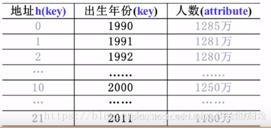
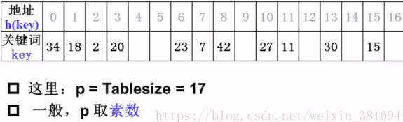
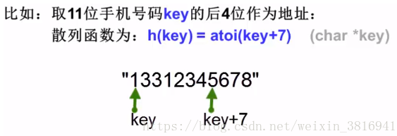
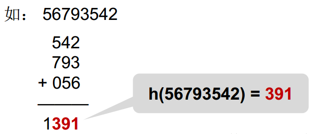
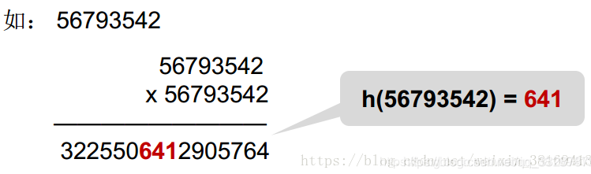
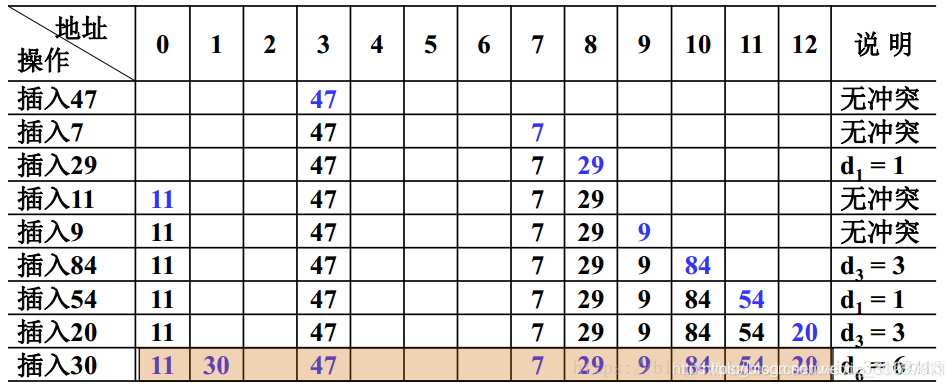
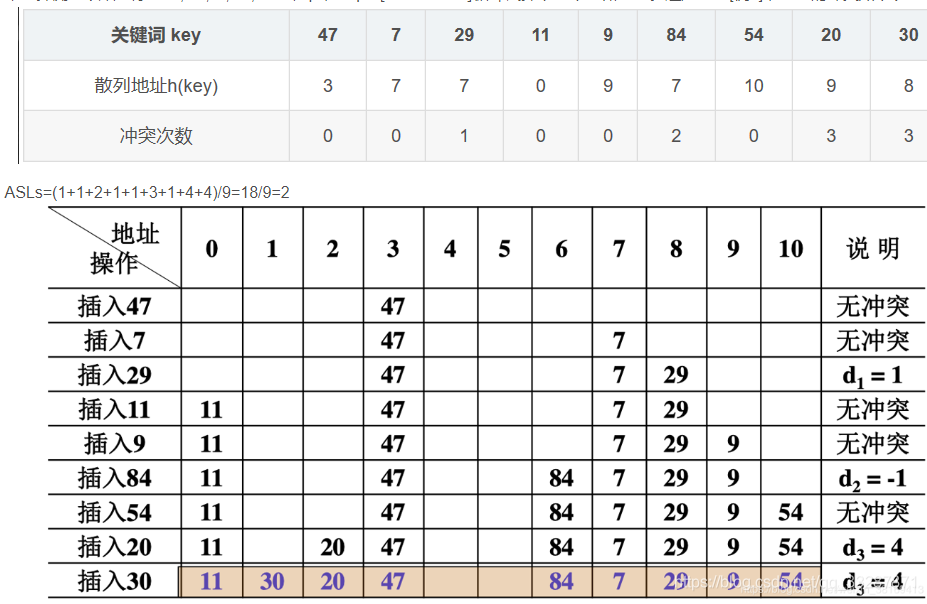
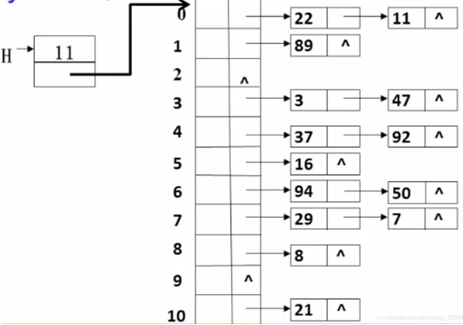

# C++哈希表的原理和使用

## 目录

- 1、概念
- 2、散列表的构造方法
    > 2.1、直接定址法
    > 2.2、除留取余法
    > 2.3、数字分析法
    > 2.4、折叠法
    > 2.5、平方取中法
- 3、冲突解决办法
    > 3.1、开放地址法
    > 3.1.1、线性探测法
    > 3.1.2、平方探测法
    >3.2、链地址法

## 1、概念

散列技术是在记录的存储位置和它的关键字之间建立一个确定的对应关系f,每个关键字key对应一个存储位置f(key)，查找时，根据这个对应的关系找到给定值key的映射f(key)，若查找集合中存在这个记录，则必定在f(key)的位置上。我们把这种对应关系f称为散列函数，又称为哈希(Hash)函数。采用散列技术将记录存储在一块存储空间中，这块连续空间称为散列表或哈希表(Hash-Table)。



## 2、散列表的构造方法

### 2.1、直接定址法

直接定址法使用下面的公式
`f(key)=a×key+b,b为常数`
比如统计出生年份，那么就可以使用f(key)=key-1990来计算散列地址。
在这里插入图片描述


### 2.2、除留取余法

这种方法是最常用的散列函数构造方法，对于表长为m的散列公式为：
`f(key)=key mod p (p<=m)`
在这里插入图片描述



### 2.3、数字分析法

分析数字关键字在各位上的变化情况，取比较随机的位作为散列地址这里使用一个手机号码作为例子，手机号码是一个字符串，一般的说，后面4位是真正的用户号。
在这里插入图片描述



### 2.4、折叠法

把关键词分割成位数相同的几个部分，然后叠加：
在这里插入图片描述



### 2.5、平方取中法

在这里插入图片描述



## 3、冲突解决办法

常用处理冲突的思路：

1. 换个位置：开放地址法
2. 同一个位置的冲突对象组织在一起：链地址法

### 3.1、开放地址法

一旦产生了冲突(该地址已有其他元素)，就按某种规则去寻找另一空地址，若发生了第i次冲突，试探的下一个地址将增加di,基本公式是：
`hi(key)-(h(key)+di) mod TableSize (1<=i<TableSize)`
这里面di决定了不同的解决冲突方案：线性探测、平方探测、双散列。下面依次介绍各种方法：

#### 3.1.1、线性探测法

线性探测法以增量序列1,2,…,(TableSize-1)循环试探下一个存储地址。
【例1】设关键词序列为47，7，29，11，9，84，54，20，30，散列表表长TableSize=11(装填因子α=9/13≈0.69)，散列函数为：h(key)=key mod 11.用线性探测法处理冲突，列出依次插入后的散列表，并估算查找性能。
【解】初步的散列地址如下表所示：

|关键词(key)   |47| 7| 29 |11|9 |84| 54| 20| 30|
|:----------   |:-|:-|:--|:--|:-|:-|:--|:--|:--|
|散列地址h(key)|3 |7  |7  |0 |9 |7  |10 |9 |8  |

可以看出有多个关键词的散列地址发生了冲突，具体见下表

|关键词(key)   |47| 7| 29 |11|9 |84| 54| 20| 30|
|:----------   |:-|:-|:--|:--|:-|:-|:--|:--|:--|
|散列地址h(key)|3 |7  |7  |0 |9 |7  |10 |9 |8  |
|冲突次数      |0 |0  |1  |0 |0 |3 |1  |3  |6  |


具体的哈希表构建过程可以用下面的图表来表示
在这里插入图片描述


这里引出一下散列表的的查找性能分析，散列表的查找性能，一般有两种方法
1.成功平均查找长度(ASLs)
2.不成功平均查找长度 (ASLu)
对于上面一题的散列地址冲突次数为

|散列地址h(key)| 0 | 1 |  2 | 3 | 4 | 5 | 6 | 7 | 8| 9 |10 | 11 |12|
|:-------------|:--|:--|:--|:--|:--|:--|:--|:--|:--|:--|:--|:--|:--|
|关键词(key)   | 11|30 |   |47 |   |   |   | 7| 29| 9| 84| 54| 20|
|冲突次数      | 0 | 6 |   | 0 |   |   |   |0  |1  |0 | 3|  1|  3|
|ASLs（其冲突次数加1)| 1 | 7 |   | 1 |   |   |   |1  |12 |1 | 4|  2|  4|
ASLs： 查找表中关键词的平均查找比较次数（其冲突次数加1）
`ASLs=(1+7+1+1+2+1+4+2+4)/9=23/9≈2.56`
ASLu：不在散列表中的关键词的平均查找次数（不成功）
一般方法：将不在散列表中的关键词分若干类。
如：根据H(key)值分类
`ASLu=(3+2+1+2+1+1+1+9+8+7+6)/11=41/11≈3.73`
参考代码

```c++
#include<iostream>
#include <stdlib.h>
using namespace std;

#define SUCCESS 1
#define UNSUCCESS 0
#define HASHSIZE 12
#define NULLKEY -32768
typedef bool Status ;
typedef struct 
{
	int *elem;
	int count;
}HashTable;

int m = 0;   //the length of HashTable

//Initialize  of HashTable
Status InitHashTable(HashTable* H)
{
	int i;
	m = HASHSIZE;
	H->count = m;
	H->elem = (int*)malloc(m*sizeof(int));
	for(i = 0;i < m; i++)
	{
		H->elem[i] = NULLKEY;
	}
	return true;
}

//hash function
int Hash(int key)
{
	return key % m; 
}

//Insert the elem to the Hahtable
void InsertHash(HashTable* H,int key)
{
	int addr = Hash(key);  //get the address of hash
	while(H->elem[addr] != NULLKEY)     //Conflict
		addr = (addr+1) % m;
	H->elem[addr] = key;
}

//search the key
Status searchHash(HashTable H,int key,int *addr)
{
	*addr = Hash(key);
	while(H.elem[*addr] != key)
	{
		*addr = (*addr+1) % m;
		if(H.elem[*addr] == NULLKEY || *addr == Hash(key))
			//return the origin
			return UNSUCCESS;
	}
	return SUCCESS;
}

int main()
{
	return 0;
}
```

#### 3.1.2、平方探测法

平方探测法以增量序列1`<sup>2,-1<sup>2,2<sup>2,-2<sup>2,……，q<sup>2`，且`q<=⌊TableSize/2⌋`循环试探下一个存储地址。还是使用[例1]，得到的冲突如下表
在这里插入图片描述

`ASLs=(1+1+2+1+1+3+1+4+4)/9=18/9=2`

在这里插入图片描述


参考代码：

```c++
/*******************************************************************************
功    能：哈希表——平方探测法(+/- 1^2,2^2,3^2...)
创建时间： 2018-07-24
作    者：Elvan
修改时间：
作    者：
********************************************************************************/
#include <iostream>
#include <string>
#include <vector>
#include <cmath>
#include <malloc.h>
using namespace std;

#define MAXTABLESIZE 10000 //允许开辟的最大散列表长度
typedef int ElementType;
typedef enum
{
    Legitimate,
    Empty,
    Deleted
} EntryType; //散列单元的状态类型

struct HashEntry
{
    ElementType data; //存放的元素
    EntryType state;  //单元状态
};

typedef struct HashEntry Cell;

struct TblNode
{
    int tablesize; //表的最大长度
    Cell *cells;   //存放散列单元数据的数组
};
typedef struct TblNode *HashTable;

/*返回大于n且不超过MAXTABLESIZE的最小素数*/
int NextPrime(int n)
{
    int p = (n % 2) ? n + 2 : n + 1; //从大于n的下一个奇数开始
    int i;
    while (p <= MAXTABLESIZE)
    {
        for (i = (int)sqrt(p); i > 2; i--)
        {
            if ((p % i) == 0)
                break;
        }
        if (i == 2)
            break; //说明是素数，结束
        else
            p += 2;
    }
    return p;
}

/*创建新的哈希表*/
HashTable CreateTable(int table_size)
{
    HashTable h = (HashTable)malloc(sizeof(TblNode));
    h->tablesize = NextPrime(table_size);
    h->cells = (Cell *)malloc(h->tablesize * sizeof(Cell));
    //初始化哈希表状态为空单元
    for (int i = 0; i < h->tablesize; i++)
    {
        h->cells[i].state = Empty;
    }
    return h;
}

/*查找数据的初始位置*/
int Hash(ElementType key, int n)
{
    return key % 11; //假设为11
}

/*查找元素位置*/
int Find(HashTable h, ElementType key)
{
    int current_pos, new_pos;
    int collision_num = 0; //记录冲突次数

    new_pos = current_pos = Hash(key, h->tablesize); //初始散列位置

    //当该位置元素为非空并且不是要找的元素的时候，发生冲突
    while (h->cells[new_pos].state != Empty && h->cells[new_pos].data != key)
    {
        collision_num++;
        if (collision_num % 2) //处理奇数冲突
        {
            new_pos = current_pos + (collision_num + 1) * (collision_num + 1) / 4;
            if (new_pos >= h->tablesize)
                new_pos = new_pos % h->tablesize;
        }
        else //处理偶数冲突
        {
            new_pos = current_pos - (collision_num) * (collision_num) / 4;
            while (new_pos < 0)
                new_pos += h->tablesize; //调整到合适大小
        }
    }
    return new_pos;
}

/*插入新的元素*/
bool Insert(HashTable h,ElementType key)
{
    int pos = Find(h,key);  //先查找key是否存在
    if(h->cells[pos].state != Legitimate)
    {
        h->cells[pos].state = Legitimate;
        h->cells[pos].data = key;
        return true;
    }
    else
    {
        cout << "键值已存在！"<<endl;
        return false;
    }
}

int main(int argc, char const *argv[])
{
    int a[] = {47,7,29,11,9,84,54,20,30};
    int n = 9;
    HashTable h = CreateTable(n);
    for(int i = 0;i < n;i++)
    {
        Insert(h,a[i]);  //插入元素
    }
    for(int i = 0;i < h->tablesize;i++)
    {
        cout << h->cells[i].data << " ";  //打印哈希表元素
    }
    cout << endl;
    return 0;
}
```

### 3.2、链地址法

链地址法就是将相应位置上冲突的所有关键词存储在同一个单链表中
【例2】 设关键字序列为 47,7,29,11,16,92,22,8,3,50,37,89,94,21，散列函数取为h(key)=keymod11，用分离链接法处理冲突。
在这里插入图片描述



【解】表中有9个结点只需1次查找，5个结点需要2次查找，所以查找成功的平均查找次数为
`ASLs=(9+5∗2)/14≈1.36`
参考代码

```c++
/*******************************************************************************
功    能：哈希表——链表法(+/- 1^2,2^2,3^2...)
创建时间： 2018-07-24
作    者：Elvan
修改时间：
作    者：
********************************************************************************/
#include <iostream>
#include <string>
#include <vector>
#include <cmath>
#include <malloc.h>
using namespace std;

#define MAXTABLESIZE 10000 //允许开辟的最大散列表长度
#define KEYLENGTH 100      //关键字的最大长度

typedef int ElementType;
struct LNode
{
    ElementType data;
    LNode *next;
};
typedef LNode *PtrToNode;
typedef PtrToNode LinkList;
struct TblNode
{
    int tablesize;  //表的最大长度
    LinkList heads; //存放散列单元数据的数组
};
typedef struct TblNode *HashTable;

/*返回大于n且不超过MAXTABLESIZE的最小素数*/
int NextPrime(int n)
{
    int p = (n % 2) ? n + 2 : n + 1; //从大于n的下一个奇数开始
    int i;
    while (p <= MAXTABLESIZE)
    {
        for (i = (int)sqrt(p); i > 2; i--)
        {
            if ((p % i) == 0)
                break;
        }
        if (i == 2)
            break; //说明是素数，结束
        else
            p += 2;
    }
    return p;
}

/*创建新的哈希表*/
HashTable CreateTable(int table_size)
{
    HashTable h = (HashTable)malloc(sizeof(TblNode));
    h->tablesize = NextPrime(table_size);
    h->heads = (LinkList)malloc(h->tablesize * sizeof(LNode));
    //初始化表头结点
    for (int i = 0; i < h->tablesize; i++)
    {
        h->heads[i].next = NULL;
    }
    return h;
}

/*查找数据的初始位置*/
int Hash(ElementType key, int n)
{
    //这里只针对大小写
    return key % 11;
}

/*查找元素位置*/
LinkList Find(HashTable h, ElementType key)
{
    int pos;

    pos = Hash(key, h->tablesize); //初始散列位置

    LinkList p = h->heads[pos].next; //从链表的第一个节点开始
    while (p && key != p->data)
    {
        p = p->next;
    }

    return p;
}

/*插入新的元素*/
bool Insert(HashTable h, ElementType key)
{
    LinkList p = Find(h, key); //先查找key是否存在
    if (!p)
    {
        //关键词未找到，可以插入
        LinkList new_cell = (LinkList)malloc(sizeof(LNode));
        new_cell->data = key;
        int pos = Hash(key, h->tablesize);
        new_cell->next = h->heads[pos].next;
        h->heads[pos].next = new_cell;
        return true;
    }
    else
    {
        cout << "键值已存在！" << endl;
        return false;
    }
}

/*销毁链表*/
void DestroyTable(HashTable h)
{
    int i;
    LinkList p, tmp;
    //释放每个节点
    for (i = 0; i < h->tablesize; i++)
    {
        p = h->heads[i].next;
        while (p)
        {
            tmp = p->next;
            free(p);
            p = tmp;
        }
    }
    free(h->heads);
    free(h);
}

int main(int argc, char const *argv[])
{
    int a[] = {47, 7, 29,29, 11, 16, 92, 22, 8, 3, 50, 37, 89, 94, 21};
    int n = 15;
    HashTable h = CreateTable(n);
    for (int i = 0; i < n; i++)
    {
        Insert(h, a[i]); //插入元素
    }
    for (int i = 0; i < h->tablesize; i++)
    {
        LinkList p = h->heads[i].next;
        while (p)
        {
            cout << p->data << " "; //打印哈希表元素
            p = p->next;
        }
        cout << endl;
    }
    return 0;
}
```