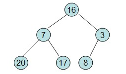
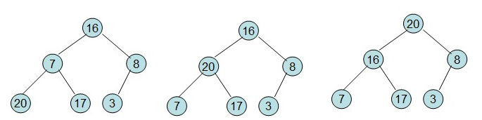
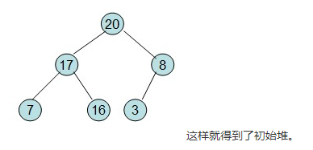
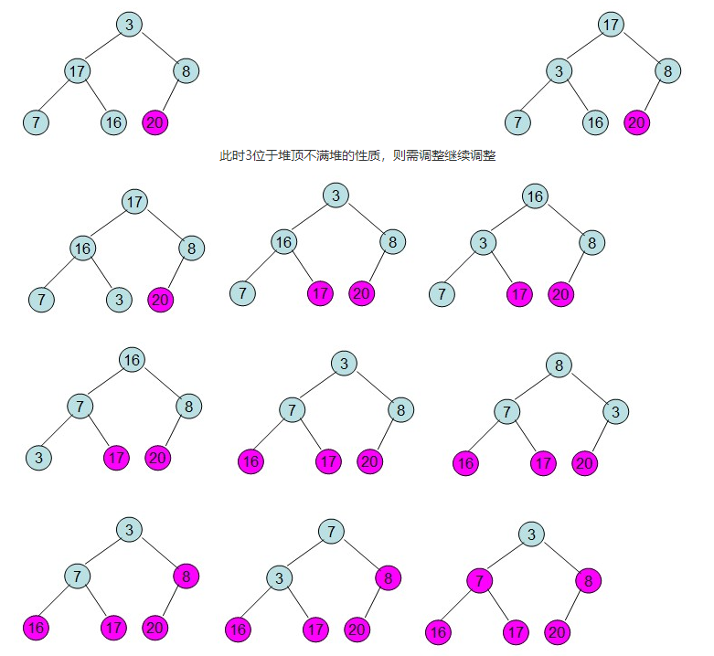

# 堆排序算法原理

 堆排序是利用堆的性质进行的一种选择排序。下面先讨论一下堆。

## 1、堆

堆实际上是一棵完全二叉树，其任何一非叶节点满足性质：

`Key[i]<=key[2i+1]&&Key[i]<=key[2i+2]或者Key[i]>=Key[2i+1]&&key>=key[2i+2]`

即任何一非叶节点的关键字不大于或者不小于其左右孩子节点的关键字。

**堆分为大顶堆和小顶堆**，满足`Key[i]>=Key[2i+1]&&key>=key[2i+2]`称为大顶堆，满足 `Key[i]<=key[2i+1]&&Key[i]<=key[2i+2]`称为小顶堆。由上述性质可知大顶堆的堆顶的关键字肯定是所有关键字中最大的，小顶堆的堆顶的关键字是所有关键字中最小的。

## 2、堆排序的思想

利用大顶堆(小顶堆)堆顶记录的是最大关键字(最小关键字)这一特性，使得每次从无序中选择最大记录(最小记录)变得简单。

### 2.1 基本思想为(大顶堆)：

1)将初始待排序关键字序列(R1,R2....Rn)构建成大顶堆，此堆为初始的无序区；

2)将堆顶元素R[1]与最后一个元素R[n]交换，此时得到新的无序区(R1,R2,......Rn-1)和新的有序区(Rn),且满足R[1,2...n-1]<=R[n]; 

3)由于交换后新的堆顶R[1]可能违反堆的性质，因此需要对当前无序区(R1,R2,......Rn-1)调整为新堆，然后再次将R[1]与无序区最后一个元素交换，得到新的无序区(R1,R2....Rn-2)和新的有序区(Rn-1,Rn)。不断重复此过程直到有序区的元素个数为n-1，则整个排序过程完成。

操作过程如下：

1)初始化堆：将R[1..n]构造为堆；
2)将当前无序区的堆顶元素R[1]同该区间的最后一个记录交换，然后将新的无序区调整为新的堆。

因此对于堆排序，最重要的两个操作就是构造初始堆和调整堆，其实构造初始堆事实上也是调整堆的过程，只不过构造初始堆是对所有的非叶节点都进行调整。

下面举例说明：
给定一个整形数组a[]={16,7,3,20,17,8}，对其进行堆排序。
首先根据该数组元素构建一个完全二叉树，得到



然后需要构造初始堆，则从最后一个非叶节点开始调整，调整过程如下：



20和16交换后导致16不满足堆的性质，因此需重新调整



这样就得到了初始堆。

即每次调整都是从父节点、左孩子节点、右孩子节点三者中选择最大者跟父节点进行交换(交换之后可能造成被交换的孩子节点不满足堆的性质，因此每次交换之后要重新对被交换的孩子节点进行调整)。有了初始堆之后就可以进行排序了。
此时3位于堆顶不满堆的性质，则需调整继续调整



这样整个区间便已经有序了。
从上述过程可知，堆排序其实也是一种选择排序，是一种树形选择排序。只不过直接选择排序中，为了从R[1...n]中选择最大记录，需比较n-1次，然后从R[1...n-2]中选择最大记录需比较n-2次。事实上这n-2次比较中有很多已经在前面的n-1次比较中已经做过，而树形选择排序恰好利用树形的特点保存了部分前面的比较结果，因此可以减少比较次数。对于n个关键字序列，最坏情况下每个节点需比较log2(n)次，因此其最坏情况下时间复杂度为nlogn。堆排序为不稳定排序，不适合记录较少的排序。

```c++
#include <iostream>
#include <algorithm>
#include <stdio.h>
using namespace std;

int n,a[100];      //大顶堆

int Heap_Adjust(int *a,int i,int n){ //调整堆，i待调整节点，n 总结点
    int i_left=2*i;
    int i_right=2*i+1;
    int temp=i;   //临时变量
    if(i<=n/2)     //i为叶子节点 无需调整
    {
        if(i_left<=n && a[i_left]>a[temp])
            temp=i_left;
        if(i_right<=n && a[i_right]>a[temp])
            temp=i_right;
        if(temp!=i)
        {
            swap(a[i],a[temp]);
            Heap_Adjust(a,temp,n);     //避免调整之后以temp为父节点的子树不是堆
        }
    }
}
void BuildHeap(int *a,int size)    //建立堆
{
    int i;
    for(i=size/2;i>=1;i--) //非叶节点最大序号值size/2
    {
        Heap_Adjust(a,i,size);
    }
}
void Heap_Sort(int *a,int size)
{
    int i;
    BuildHeap(a,size);
    for(i=size;i>=1;i--)
    {
        cout<<a[1]<<endl;
        swap(a[1],a[i]);
        Heap_Adjust(a,1,i-1);

    }

}

int main(int argc, char *argv[])
{
     //int a[]={0,16,20,3,11,17,8};
    int a[100];
    int size;
    while(scanf("%d",&size)==1&&size>0)
    {
        int i;
        for(i=1;i<=size;i++)
            cin>>a[i];
        Heap_Sort(a,size);

    }
    return 0;
}
```