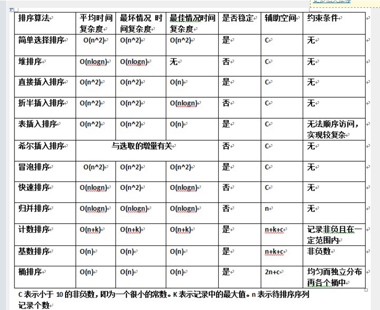
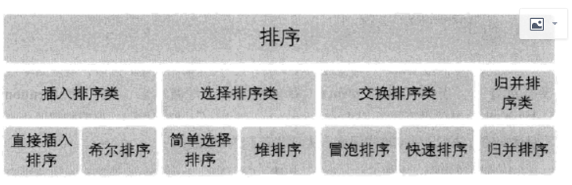
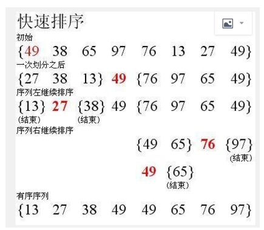
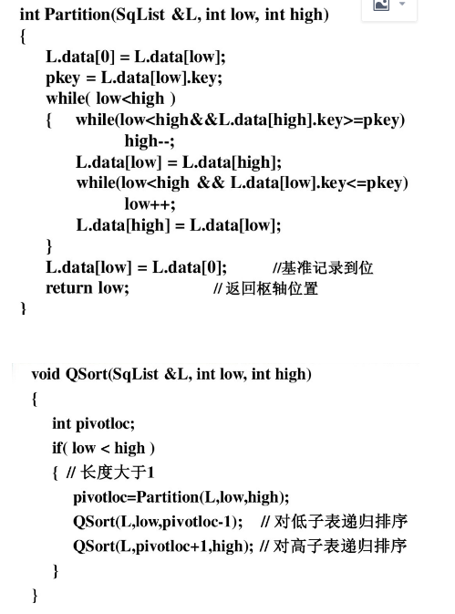
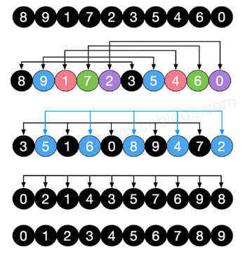
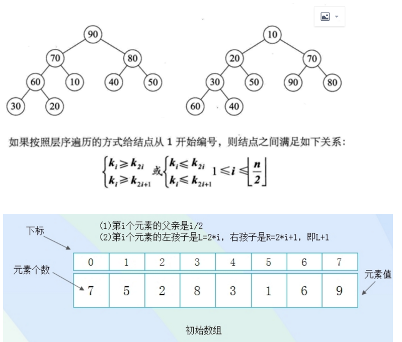
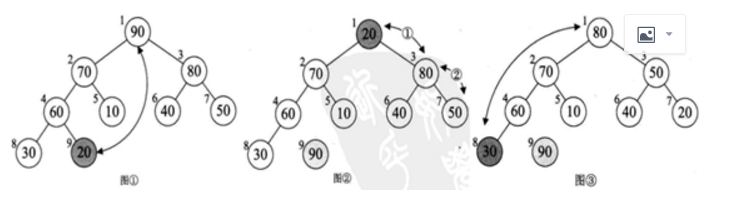
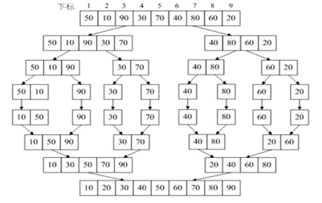

# 排序算法

## 1、排序算法的时间复杂度





## 2、冒泡排序(Bubble Sort)--交换排序：每次选出最大值

平均时间复杂度O(n^2)
基本思想：两两比较相邻记录的关键字，如果反序则交换，直到没有反序的记录为止。

```c++
思路：
1. 两两比较，较大放到后面
void BubbleSort(int *p, int length)
{
    for (int i = 0; i < length; i++)  // 每次最大元素就像气泡一样"浮"到数组的最后
    {
        for (int j = 0; j < length - i - 1 ; j++)/* 依次比较相邻的两个元素,使较大的那个向后移*/
        {
            if ( p[j] > p[j+1])  
            {                
                 int temp;
                 temp = p[j+1];
                 p[j+1] = p[j];
                 p[j] = temp ;
            }
        }
    }
}
int main()
{
    int A[] = { 6, 5, 3, 1, 8, 7, 2, 4 };    // 从小到大冒泡排序
    int n = sizeof(A) / sizeof(int);
    BubbleSort(A, n);
    printf("冒泡排序结果：");
    for (int i = 0; i < n; i++)
    {
        printf("%d ", A[i]);
    }
    printf("\n");
    return 0;
}
```

## 3、快速排序（Quick Sort）--交换排序

平均时间复杂度O(nlogn)
快速排序的基本思想是：通过一趟排序将待排记录分割成独立的两部分，其中一部分记录的关键字均比另外一部分记录的关键字小，则可分别对这两部分记录继续进行排序，以达到整个序列有序的目的。



方法一：

- 思路

1. base基数（第一次为一个数）先从右边查找，找到一个小于base的值rValue；
2. base基础再从左边查找，找到一个大于base的值lValue；
3. rValue与lValue进行交换
4. 找到一个小于base的值rValue或找到一个大于base的值lValue与base进行交换。

```c++
void QuickSort(int *p, int l, int r)
{
    if (l< r)
    {
        int i = l, j = r, x = p[l];
        while (i < j)
        { 
           /*若从右向左找第一个数大于x的数 ，则输出p[j--]的值*/ 
            while (i < j && p[j] >= x)  
                j--;
            if (i < j)
                p[i] = p[j];
            /*若从左向右找第一个数小于等于x的数 ，则输出p[i++]的值*/
            while (i < j && p[i]< x) 
                i++;
            if (i < j)
                p[j] = p[i];
        }
        p[i] = x;
        QuickSort(p, l, i - 1); // 递归调用 
        QuickSort(p, i + 1, r);  
    }
}
```

方法二：



## 4、直接插入排序--插入排序

平均时间复杂度O(n^2)
把一个记录直接插入到已经排好序的有序表中，从而得到一个新的，记录数增1的有序表。

思路：
当 i =1，已排好序；
当 i =2, A[1]与A[0]比较，若 A[1] 小于A[0]，则交换位置，反正；
当 i =3, A[2]与A[1]、A[0]比较，若 A[2] 小于A[1]，则交换位置，反正；
...
当 i =n+1, A[n]与A[n-1]、...、A[1]、A[0]比较，若 A[n] 小于A[n-1]，则交换位置，反正；

```c++
//直接插入排序
void StrInserSort(int *p, int length)
{
    int i, j;
    for (i =1; i <length; i++)
    {
        if ( p[i]<p[i-1])
        {
          int tmp;
          tmp = p[i]; 
          for (j = i - 1; p[j] > tmp; j--)//p[i]与p[i-1]、p[i-2]...p[0]比较
             p[j+1] = p[j];
          //前面减一
          p[j+1] = tmp;
        }
    }
}
```

### 4.1 插入排序是一种简单直观的排序算法。它的工作原理非常类似于我们抓扑克牌
　　　　　　

 
　　对于未排序数据(右手抓到的牌)，在已排序序列(左手已经排好序的手牌)中从后向前扫描，找到相应位置并插入。
　　插入排序在实现上，通常采用in-place排序（即只需用到O(1)的额外空间的排序），因而在从后向前扫描过程中，需要反复把已排序元素逐步向后挪位，为最新元素提供插入空间。
　　具体算法描述如下：
从第一个元素开始，该元素可以认为已经被排序
取出下一个元素，在已经排序的元素序列中从后向前扫描
如果该元素（已排序）大于新元素，将该元素移到下一位置
重复步骤3，直到找到已排序的元素小于或者等于新元素的位置
将新元素插入到该位置后
重复步骤2~5
　　插入排序的代码如下：

```c++
#include <stdio.h>

// 分类 ------------- 内部比较排序
// 数据结构 ---------- 数组
// 最差时间复杂度 ---- 最坏情况为输入序列是降序排列的,此时时间复杂度O(n^2)
// 最优时间复杂度 ---- 最好情况为输入序列是升序排列的,此时时间复杂度O(n)
// 平均时间复杂度 ---- O(n^2)
// 所需辅助空间 ------ O(1)
// 稳定性 ------------ 稳定

void InsertionSort(int A[], int n)
{
    for (int i = 1; i < n; i++)         // 类似抓扑克牌排序
    {
        int get = A[i];                 // 右手抓到一张扑克牌
        int j = i - 1;                  // 拿在左手上的牌总是排序好的
        while (j >= 0 && A[j] > get)    // 将抓到的牌与手牌从右向左进行比较
        {
            A[j + 1] = A[j];            // 如果该手牌比抓到的牌大，就将其右移
            j--;
        }
        A[j + 1] = get; // 直到该手牌比抓到的牌小(或二者相等)，将抓到的牌插入到该手牌右边(相等元素的相对次序未变，所以插入排序是稳定的)
    }
}

int main()
{
    int A[] = { 6, 5, 3, 1, 8, 7, 2, 4 };// 从小到大插入排序
    int n = sizeof(A) / sizeof(int);
    InsertionSort(A, n);
    printf("插入排序结果：");
    for (int i = 0; i < n; i++)
    {
        printf("%d ", A[i]);
    }
    printf("\n");
    return 0;
}
```

### 4.2、插入排序的改进：二分插入排序
 
　　对于插入排序，如果比较操作的代价比交换操作大的话，可以采用二分查找法来减少比较操作的次数，我们称为二分插入排序，代码如下：

```c++
#include <stdio.h>

// 分类 -------------- 内部比较排序
// 数据结构 ---------- 数组
// 最差时间复杂度 ---- O(n^2)
// 最优时间复杂度 ---- O(nlogn)
// 平均时间复杂度 ---- O(n^2)
// 所需辅助空间 ------ O(1)
// 稳定性 ------------ 稳定

void InsertionSortDichotomy(int A[], int n)
{
    for (int i = 1; i < n; i++)
    {
        int get = A[i];                    // 右手抓到一张扑克牌
        int left = 0;                    // 拿在左手上的牌总是排序好的，所以可以用二分法
        int right = i - 1;                // 手牌左右边界进行初始化
        while (left <= right)            // 采用二分法定位新牌的位置
        {
            int mid = (left + right) / 2;
            if (A[mid] > get)
                right = mid - 1;
            else
                left = mid + 1;
        }
        for (int j = i - 1; j >= left; j--)   // 将欲插入新牌位置右边的牌整体向右移动一个单位
        {
            A[j + 1] = A[j];
        }
        A[left] = get;                    // 将抓到的牌插入手牌
    }
}


int main()
{
    int A[] = { 5, 2, 9, 4, 7, 6, 1, 3, 8 };// 从小到大二分插入排序
    int n = sizeof(A) / sizeof(int);
    InsertionSortDichotomy(A, n);
    printf("二分插入排序结果：");
    for (int i = 0; i < n; i++)
    {
        printf("%d ", A[i]);
    }
    printf("\n");
    return 0;
}
```

　　当n较大时，二分插入排序的比较次数比直接插入排序的最差情况好得多，但比直接插入排序的最好情况要差，所当以元素初始序列已经接近升序时，直接插入排序比二分插入排序比较次数少。二分插入排序元素移动次数与直接插入排序相同，依赖于元素初始序列。

## 5、希尔排序(Shell Sort)--插入排序

平均时间复杂度是选取的增量有关
    希尔排序是把记录按下标的一定增量分组，对每组使用直接插入排序算法排序；随着增量逐渐减少，每组包含的关键词越来越多，当增量减至1时，整个文件恰被分成一组，算法便终止。



```c++
void ShellSort(int *p, int length)
{
    int i, j;
    int increment = length;
    do {
         increment = increment / 3 +1;
         for (i = increment ; i <= length - 1; i++)
        {
              if (p[i] < p[i - increment])
              {
                int tmp;
                tmp = p[i];
                for (j = i - increment; j >= 0 && tmp < p[j]; j -= increment)
                  p[j + increment] = p[j];
                p[j + increment] = tmp;
              }
            }
    } while (increment > 1);
}
```

## 6、简单选择排序（Simple Selection Sort）--选择排序：每一轮选出最小值

平均时间复杂度O(n^2)
通过n-1次关键字间的比较，从n-i+1个记录中选择最小的记录，并和第i次(1≤i≤n)记录交换。

第一轮：查找第一个最小值
第二轮：查找第二个最小值
第N-1轮：查找第n-1最小值

```c++
//简单选择排序
void Swap(int A[], int i, int j)
{
    int temp = A[i];
    A[i] = A[j];
    A[j] = temp;
}
void SimSelSort(int *p, int length)
{
    int i, j;
    for (i = 0; i < length - 1; i++)
    {
        for (j=i+1;j< length ;j++)
        {
            if (p[i] > p[j])
                 Swap(A,i,j);    // 每一轮查找最小值:从小到大
        }
      稳定的排序算法
    }
}
int main()
{
    int A[] = { 8, 5, 2, 6, 9, 3, 1, 4, 0, 7 }; // 从小到大选择排序
    int n = sizeof(A) / sizeof(int);
    SelectionSort(A, n);
    printf("选择排序结果：");
    for (int i = 0; i < n; i++)
    {
        printf("%d ", A[i]);
    }
    printf("\n");
    return 0;
}
```

## 7、堆排序(Heap Sort)--选择排序

平均时间复杂度O(nlogn)

### 7.1、堆的定义

   堆是具有下列性质的完全二叉树：每个结点的值都大于或等于其左右孩子结点的值，称为大顶堆；或者每个结点的值都小于或等于其左右孩子结点的值，称为小顶堆。




根节点：5；子节点：左子节点2，右子节点8；子子节点：子子左节点3，

### 7.2、堆排序

堆排序的基本思想（利用堆，如大顶堆进行排序）：
1）将待排序的序列构造成一个大顶堆，此时整个序列的最大值就是堆顶的根结点；
2）将它移走，即就是将它与堆数组的末尾元素交换，此时末尾元素就是最大值，将末尾元素移走；
3）然后将剩余n-1个序列重新构造成一个堆，这样就会得到n个元素的次小值。如此反复执行，便能得到一个有序序列。

// 分类 -------------- 内部比较排序
// 数据结构 ---------- 数组
// 最差时间复杂度 ---- O(nlogn)
// 最优时间复杂度 ---- O(nlogn)
// 平均时间复杂度 ---- O(nlogn)
// 所需辅助空间 ------ O(1)
// 稳定性 ------------ 不稳定



主要问题：
1.如何由一个无序序列构建成一个堆？
2.如何在输出堆顶元素后，调整剩余元素成为一个新的堆？

```c++
//构造最大堆
void MaxHeapFixDown(int *p, int i, int length) {
    int j = 2*i + 1; //左子节点下标
    int temp = p[i]; //根节点
    while (j<length) {
        if (j + 1 < length && p[j] < p[j+1]) //左子节点小于右子节点
            ++j; //右子节点
        if (temp>p[j]) //根节点大于较大的子节点
            break;
        else {     //根节点小于或等于较大的子节点
            p[i] = p[j];  //较大的子节点 赋值于 根节点
            i = j;  //较大的子节点下标 赋值于 根节点下标
            j = 2*i + 1; //左子节点下标
        }
    }
    p[i] = temp; //根节点
}
void Swap(int p[i]，int p[j])
{
    int temp = p[i];
    p[i] = p[j];
    p[j] = temp;
}
//堆排序
void HeapSort(int *p, int length) {
    //从每一个非叶结点开始向下进行堆调整
    // length/2表示根节点，length/2 - 1表示根节点下标
    for (int i = length/2 - 1; i >= 0; i--)
    {.
        MaxHeapFixDown(p, i, length); //构造堆
    }
    //最大堆
    for (int i = length - 1; i >= 1; i--)
    {
        Swap(p[i], p[0]);
        MaxHeapFixDown(p, 0, i);
        cout << "i的值：" << i << " 排序：";
        ergodic(p, 9);
    }
}
```


### 7.3、堆排序(Heap Sort)
　　
　　堆排序是指利用堆这种数据结构所设计的一种选择排序算法。堆是一种近似完全二叉树的结构（通常堆是通过一维数组来实现的），并满足性质：以最大堆（也叫大根堆、大顶堆）为例，其中父结点的值总是大于它的孩子节点。
　　我们可以很容易的定义堆排序的过程：
由输入的无序数组构造一个最大堆，作为初始的无序区
把堆顶元素（最大值）和堆尾元素互换
把堆（无序区）的尺寸缩小1，并调用heapify(A, 0)从新的堆顶元素开始进行堆调整
重复步骤2，直到堆的尺寸为1
　　堆排序的代码如下：

```c++
#include <stdio.h>

void Swap(int A[], int i, int j)
{
    int temp = A[i];
    A[i] = A[j];
    A[j] = temp;
}

void Heapify(int A[], int i, int size)  // 从A[i]向下进行堆调整
{
    int left_child = 2 * i + 1;         // 左孩子索引
    int right_child = 2 * i + 2;        // 右孩子索引
    int max = i;  // 选出当前结点与其左右孩子三者之中的最大值
    if (left_child < size && A[left_child] > A[max])
        max = left_child;
    if (right_child < size && A[right_child] > A[max])
        max = right_child;
    if (max != i)
    {
        Swap(A, i, max);   // 把当前结点和它的最大(直接)子节点进行交换
        Heapify(A, max, size);// 递归调用，继续从当前结点向下进行堆调整
    }
}

int BuildHeap(int A[], int n)           // 建堆，时间复杂度O(n)
{
    int heap_size = n;
    // 从每一个非叶结点开始向下进行堆调整
    for (int i = heap_size/2 - 1; i >= 0; i--) 
        Heapify(A, i, heap_size);
    return heap_size;
}
//堆排序
void HeapSort(int A[], int n)
{
    int heap_size = BuildHeap(A, n);    // 建立一个堆
    while (heap_size > 1)  //堆（无序区）元素个数大于1，未完成排序
    {
        // 将堆顶元素与堆的最后一个元素互换，并从堆中去掉最后一个元素
        // 此处交换操作很有可能把后面元素的稳定性打乱，所以堆排序是不稳定的排序算法
        Swap(A, 0, --heap_size);
        Heapify(A, 0, heap_size);     // 从新的堆顶元素开始向下进行堆调整，时间复杂度O(logn)
    }
}

int main()
{
    int A[] = { 5, 2, 9, 4, 7, 6, 1, 3, 8 };// 从小到大堆排序
    int n = sizeof(A) / sizeof(int);
    HeapSort(A, n);
    printf("堆排序结果：");
    for (int i = 0; i < n; i++)
    {
        printf("%d ", A[i]);
    }
    printf("\n");
    return 0;
}
```

## 8、归并排序（Merging Sort）--归并排序

平均时间复杂度O(nlogn)
     归并排序就是利用归并思想实现的排序方法。原理：假设初始序列含有n个记录，则可以看成是n个有序的子序列，每个子序列长度为1，然后再两两归并，得到[n/2]个长度为2或1的有序子序列；再两两归并….，如此重复，直到的一个长度为n的有序序列为止，称为2路归并排序。

// 分类 -------------- 内部比较排序
// 数据结构 ---------- 数组
// 最差时间复杂度 ---- O(nlogn)
// 最优时间复杂度 ---- O(nlogn)
// 平均时间复杂度 ---- O(nlogn)
// 所需辅助空间 ------ O(n)
// 稳定性 ------------ 稳定



```c++
#include <stdio.h>
#include <limits.h>

// 合并两个已排好序的数组A[left...mid]和A[mid+1...right]
void Merge(int A[], int left, int mid, int right)
{
    int len = right - left + 1;
    int *temp = new int[len];       // 辅助空间O(n)
    int index = 0;
    int i = left;                   // 前一数组的起始元素
    int j = mid + 1;                // 后一数组的起始元素
    while (i <= mid && j <= right)
    {
        temp[index++] = A[i] <= A[j] ? A[i++] : A[j++];  // 带等号保证归并排序的稳定性
    }
    while (i <= mid)
    {
        temp[index++] = A[i++];
    }
    while (j <= right)
    {
        temp[index++] = A[j++];
    }
    for (int k = 0; k < len; k++)
    {
        A[left++] = temp[k];
    }
}

void MergeSortRecursion(int A[], int left, int right)    // 递归实现的归并排序(自顶向下)
{
    /**********************************
    if (left == right)    // 当待排序的序列长度为1时，递归开始回溯，进行merge操作
        return;
    int mid = (left + right) / 2;
    MergeSortRecursion(A, left, mid);
    MergeSortRecursion(A, mid + 1, right);
    Merge(A, left, mid, right);
    ***********************************/
    if ( left < right)
    {
       int mid = (left + right) / 2;
       MergeSortRecursion(A, left, mid);
       MergeSortRecursion(A, mid + 1, right);
       Merge(A, left, mid, right);
    }
}

void MergeSortIteration(int A[], int len)    // 非递归(迭代)实现的归并排序(自底向上)
{
    int left, mid, right;// 子数组索引,前一个为A[left...mid]，后一个子数组为A[mid+1...right]
    for (int i = 1; i < len; i *= 2)        // 子数组的大小i初始为1，每轮翻倍
    {
        left = 0;
        while (left + i < len)              // 后一个子数组存在(需要归并)
        {
            mid = left + i - 1;
            right = mid + i < len ? mid + i : len - 1;// 后一个子数组大小可能不够
            Merge(A, left, mid, right);
            left = right + 1;               // 前一个子数组索引向后移动
        }
    }
}

int main()
{
    int A1[] = { 6, 5, 3, 1, 8, 7, 2, 4 };      // 从小到大归并排序
    int A2[] = { 6, 5, 3, 1, 8, 7, 2, 4 };
    int n1 = sizeof(A1) / sizeof(int);
    int n2 = sizeof(A2) / sizeof(int);
    MergeSortRecursion(A1, 0, n1 - 1);          // 递归实现
    MergeSortIteration(A2, n2);                 // 非递归实现
    printf("递归实现的归并排序结果：");
    for (int i = 0; i < n1; i++)
    {
        printf("%d ", A1[i]);
    }
    printf("\n");
    printf("非递归实现的归并排序结果：");
    for (int i = 0; i < n2; i++)
    {
        printf("%d ", A2[i]);
    }
    printf("\n");
    return 0;
}
```