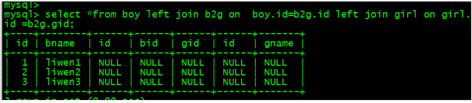
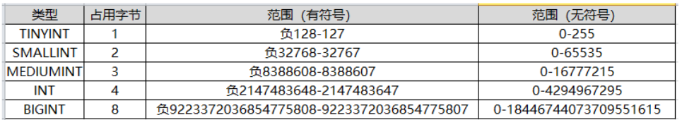
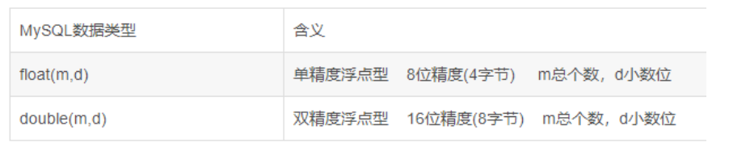
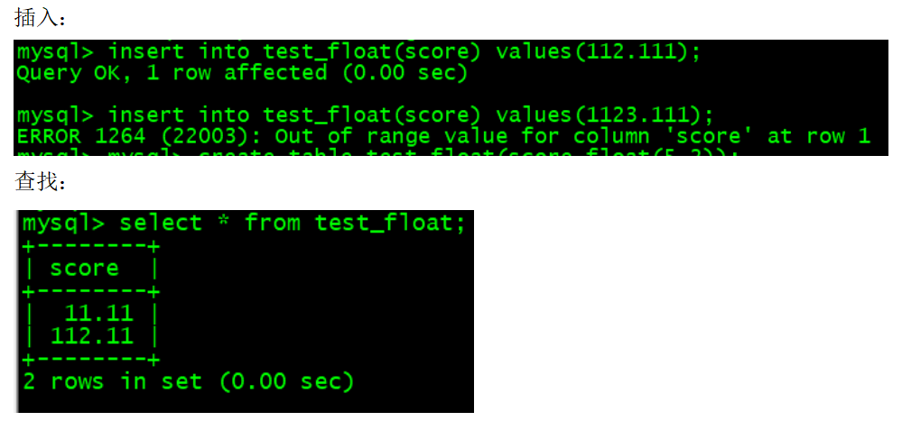
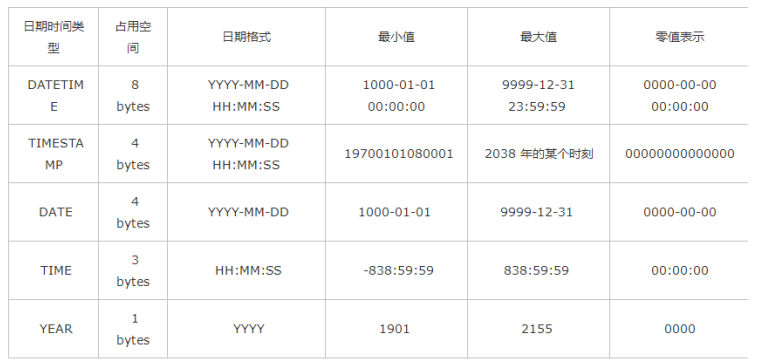
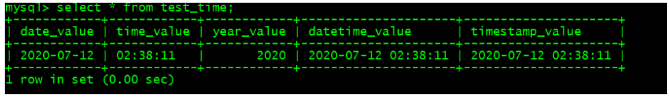
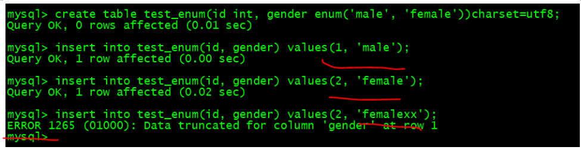
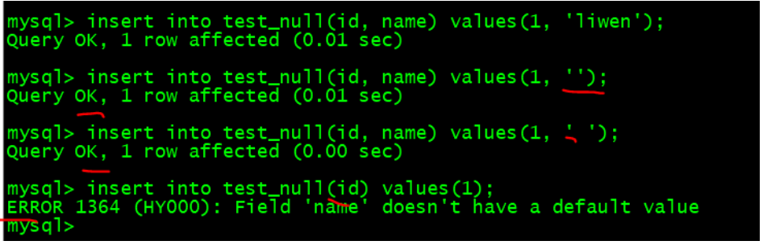

# Linux_mysql数据库管理

## 1、MySQL结构化查询语言SQL

### 1.1、数据定义语言DDL-data defiition language

```mysql
Show databases;
Show tables; 或show table mysql;
Use mysql （数据库）;
Create database test_db; 
Create database test_db default character set utf8;
Drop database test_db;
Create table test_tb(id int(10), name varchar(20));

Insert into test_tb(id, name) values(001, ‘liwen1’);
Select * from test_tb;
Desc test_tb;  #查看表字段类型
Alter table test_tb add age int(3); #添加字段, 最后可以添加first, after id
Alter table test_tb drop id; #删除字段
Alter table test_tb modify age varchar(2)； #修改字段类型
Alter table test_tb change age plage int(3); #修改表字段名称和类型
Alter table test_tb rename test_tb1; #修改表名
Truncate table test_tb; #清空表结构的数据
Drop table test_tb; 
Rename table test_tb_old to test_tb_new; #修改表名
Create table tbNmae2 like tbName1; #新表tbNmae, 旧表tbNmae1
```

### 1.2、数据操作语言DML

Insert/delete/update/where
格式：where colName 关系运算符 value [or | and 条件2]
关系运算符：  >,>=,<,<= ,= , !=或 <>
null值操作：比较null时，不能使用=或！=,而是使用is或is not,在select的关系运算符
1）插入insert
方法一：
 `insert into test_tb1 values(001, 'liwen', null, 'shanghai');`
方法二：

```mysql
 insert into test_tb1(id, name, address) values(001, 'liwen',  'shanghai');
insert into test_tb1(id, name, address) values(002, 'liwen2',  'shanghai2'),(003, 'liwen3',  'shanghai3'),(004, 'liwen4',  'shanghai4');
```

2）删除delete 

`Delete from test_tb1 where id=001;`

3）修改字段值update

```mysql
Update test_tb1 set address=’china’;
Update test_tb1 set address=’shenzhou’, name=’liwen’ where id = 2;
```

### 1.3、事务控制语言（TCL）--transation control language

事务:一个或一组sql语句组成一个执行单元，这个执行单元要么全部执行，要么全部不执行。
事务是一种可以保证“多条语句一次性执行完成”或“一条都不执行”的机制。

（1）原子性：完整性，事务要么成功，要么识别，不可分割。例如，转账要么成功，要么失败。
（2）一致性：保证数据一致性，例如a行转账，a行减少，b行增加。例如，李明向张三转账10元，李明账户少了10元，张三账户多了10元。
（3）隔离性：当一个用户处理事务，其他用户处于等待状态。例如，李明向李强转了20元，且李明向李三转了20元。
（4）持久性：保证数据永久性。例如，转账的钱永久保存。

只有DML操作出发一个事务，存储引擎（ENGINE）为Innodb，才支持事务：
演示事务的使用步骤：
第一步：开启事务

```mysql
SET autocommit =0;  
START TRANSACTION;  #或begin
```

第二步：编写一组事务的语句（select，insert update，delete）

```mysql
UPDATE account SET balance = 500 WHERE username='张无忌';
UPDATE account SET balance = 1500 WHERE username='赵敏';
```

第三步：结束事务

```mysql
COMMIT；提交
ROLLBACK；回滚：刚刚提交的事务没有了，二选一
savepoint：节点名，设置rollback 的返回点
例如
Savepoint 123;
Rollback 123;
```

### 1.4、数据查询语言DSL

Select/for 基本查询语句 
Select 子句from 子句 select colNmae[,colName...] from tablename;
列起别名
Select 列名1 as ‘别名1’ [, 列名2 as ‘别名2’] from tabName;
where子句
（1）多条件： in | not in ,其中in相当于or，not in 相当于and
（2）All | any 与集合连用，集合元素不是固定的
（3）范围查询：colName between  val1 and val2;
（4）模糊查询： like
（4.1）通配符：%表示0或0个以上字符；_ 表示匹配一个字符
（4.2）格式：colName like value;

案例：
普通查询：

```mysql
Select id, name from test_tb1;
Select * from test_tb1;
```

And |or 使用：
`Select name,age from test_tb1 where id =10 or id 20;`
All | any 与集合连用:

```mysql
Select *from test_tb1 where score > all( select score from name in (‘liwen1’, ‘liwen2’,’liwen3’));
Betweeen ...and..使用：
Select * from test_tb1 where score between 90 and 100;
```

Like 使用：

`select * from test_tb1 where name like '%wen5%'；`

### 1.5、数据高级查询语言

1)排序查询order by子句
`Select ... from tableName [where 子句] [order by 子句]；`
格式：`Order by colName [ASC | DESC];`

2)distinct去重查询
`Select distinct name from test_tb1;`

3)分组查询group by
总工资、平均工资、总人数等情况
`Select ... from name [where 条件] [group by 子句] [order by 子句]；`

用法： group by filed1[, filed2]
例如：` select id, avg(score) as sc from test_tb1 group by id;`

聚合函数：
（1）count(filed): 统计指定字段的记录数
（2）Sum(filed)
（3）Avg(filed)
（4）Max(filed)
（5）Min(filed)

聚合函数忽略空值，因此ifnull(filed, null)：若filed不是空值，就使用filed值；反之。

4）分组查询添加条件Having
例如： `select id, avg(score) as sc from test_tb1 group by id having avg(score) > 90;`

5）基本查询总结
`Select ...from..[where ...][group by ...][having ...] [order by...]`
执行顺序：from -> where-> group by->having->select->order by

6）高级关联查询
嵌套查询：嵌套表或where条件；
逻辑可以根据基本查询总结来理解。

### 1.6、数据控制语言DCL

在root用户下操作
1）创建用户(mysql 8.0)
`Create user wen1@’192.168.211.158’  identified by ‘Wen.123com’;`
2）显示用户的权限(mysql 8.0)
`Show grants for wen1@'192.168.211.158’;`
3）授权权限与查找权限（mysql 5.7）
`Grant all/select/drop/insert on test_db1.*  to  wen1@’192.168.211.158’;`
DML权限：`insert,delete,update`
DQL权限：`select`
DDL权限：`create,alter,drop...`
所有权限： `all`
查询mysql用户权限：`select user,host from mysql,user;`

4）删除用户
`Drop user wen1@’192.168.211.158’;`

登入mysql数据库：

`[root@localhost ~]# mysql -h192.168.211.158 -uwen1 -p'Wen.123com'`

### 1.7、mysql实例操作

1）创建表语法
`Create table 表名（字段 类型[可选参数]，字段 类型[可选参数]，...） charset=utf8; 后面加分号`
2）列约束
Auto_increment:自增1
Primary key：主键索引，加速查询，列值不能重复
NOT NULL:字段不为空
DEFAULT：字段默认值
3）例子

```mysql
create table test_tb2(
num int auto_increment primary key, 
name char(20),
job varchar(20), 
age int, 
salary int,
descrip char(128) not null default ' '
)charset=utf8; 
```

4）复制表结构，无法复制表内容
`Create table test_tb2_cp like test_tb2;`
5）删除表的内容，保留表的结构
`Truncate test_tb;`
区别：
Delete: 一行一行的删除
Truncate:删除表的全部内容

### 1.8、多表查询

1）一对多
Constraint 外键名 foreign key (被约束的字段) references 约束的表（约束的字段）
例子：

```mysql
mysql> create table dep(id int auto_increment primary key, name varchar(32) not null default ' ')charset=utf8;
mysql>insert into dep(name) values('yanfabu'),('kuaijibu'),('jisuanjibu'),('caiwubu');

mysql>create table useinfo(id int auto_increment primary key,  name varchar(32) not null default '', depart_id int not null default 1, constraint fk_user_depart  foreign key (depart_id)  references dep(id))charset=utf8;

mysql> insert into useinfo(name, depart_id) values('liwen a', 1);
```


原因：由于dep的id由1 ~ 4，useinfo表的depart_id通过外键限制为1 ~ 4。

2）多对多

- 相等连接inner join：

`Select * from tbName1 inner join tbName2 on tbName.id = tbName2.id;`
其中主表tbName1 ,主表tbName12
`SELECT article.aid,article.title,user.username,type.typename FROM article INNER JOIN user
ON article.uid=user.uid INNER JOIN type ON article.tid=type.tid`

- 左连接left join：

`Select * from tbName1 Left join tbName2 on tbName.id = tbName2.id;`
其中主表tbName1 ,从表tbName12
`SELECT article.aid,article.title,user.username,type.typename FROM article LEFT JOIN user
ON article.uid=user.uid LEFT JOIN type ON article.tid=type.tid`

- 右连接right join：

Select * from tbName1 rignt join tbName2 on tbName.id = tbName2.id;
其中从表tbName1 ,主表tbName12
`SELECT article.aid,article.title,user.username,type.typename FROM articleRIGHT JOIN user
ON article.uid=user.uid RIGHT JOIN type ON article.tid=type.tid`

例子

```mysql
 mysql> create table boy(id int auto_increment primary key, bname varchar(32) not null default '')charset=utf8;
mysql> insert into boy(bname) values('liwen1'),('liwen2'),('liwen3');
mysql> create table girl(id int auto_increment primary key, gname varchar(32)
not null default '')charset=utf8;
mysql> insert into girl(gname) values('gilr'),('girl2'),('gril3');
mysql> create table b2g(id int auto_increment primary key, bid int not null default 1, gid int not null default 0, constraint fk_b2g_boy foreign key (bid) references boy(id), constraint fk_b2g_girl foreign key(gid) references girl(id))charset=utf8; 

mysql> select *from boy left join b2g on  boy.id=b2g.id left join girl on girl.id =b2g.gid;
```



### 1.9、数据的导出导入

1）导出
Mysqldump只使用少量数据
`$mysqldup -h ip -u 用户名 -p 密码 -d 数据库名> 导出的文科`

数据导出方式

```mysql
[root@localhost ~]# mysqldump -uroot -p'123456' --all-databases >/data/mysql1.log
其中--all-databases表示所有数据库
[root@localhost ~]# mysqldump -uroot -p'123456' --databases test_db1 >/data/mysql2.log
其中 --databases 一个数据库test_db1 
```

2）导入：恢复
方法一:恢复数据库
`Mysql>drop test_db2;`
`Mysql> source /data/mysql2.log;`
方法二：
`Mysql>drop test_db2;`
`#mysql -uroot -p’123456’ </data/mysql2.log`

### 1.10、分页

 //第一页的前面10条数据查找出来
`Select * from user limit 0, 10;` //第一个参数为下标，第二个参数数据个数
 //第二页的前面10条数据查找出来
`Select * from user limit 10, 10;` //第一个参数为下标，第二个参数数据个数
页的划算公式： (n-1)*pagesize ；
若查找第二页的数据，则(n-1)*pagesize=(2-1)*10=10

分页公式：`select * from user limit offset, pagesize;`
`(pageNumber -1 ) * 10 =offset`

## 2、MySQL数据类型与表约束

### 2.1、mysql数据类型

整数类型：bit, bool, smallint, mediumint, int,tinyint,  bigint
浮点数类型：float(m,d), double(m,d), decimal(m,d)
字符串类型： char, varchar, tinytext, text, mediumtext, longtext, 
二进制类型：tinyblob,blob,mediumblob, longblob
日期类型： date, datetime, timestamp, time, year
其他类型：binary, varbinary, enum, set, geometry, point, multipoint, linestring, multilinestring, polygon, geometrycollection

### 2.2、整数类型

整数类型的取值范围

整数类型宽度
int(n), n为宽度，小于n补0。
mysql> create table test_int_width(a int(4), b int(5) unsigned, c int(5) unsigned zerofill, d int(5) unsigned zerofill) engine=innodb charset=utf8;


### 2.3、浮点型类型

浮点类型的取值范围

Decimal(m,d)
设一个字段定义为float(6,3)，如果插入一个数123.45678,实际数据库里存的是123.457，但总个数还以实际为准，即6位。整数部分最大是3位，如果插入数12.123456，存储的是12.1234，如果插入12.12，存储的是12.1200.
例如：
mysql> create table test_float(score float(5,2));



总结：float(m,d)的m表示整数+小数d总长度，不包括点号，d表示显示小数的长度。

Float、double与decimal的区别：
float，double等非标准类型，在DB中保存的是近似值，而Decimal则以字符串的形式保存数值。

### 2.4、字符串类型


char和varchar：
1.char(n) 若存入字符数小于n，则以空格补于其后，查询之时再将空格去掉。所以char类型存储的字符串末尾不能有空格，varchar不限于此。 
2.char(n) 固定长度，char(4)不管是存入几个字符，都将占用4个字节，varchar是存入的实际字符数+1个字节（n<=255）或2个字节(n>255)，
所以varchar(4),存入3个字符将占用4个字节。 
3.char类型的字符串检索速度要比varchar类型的快。

varchar和text： 
1.varchar可指定n，text不能指定，内部存储varchar是存入的实际字符数+1个字节（n<=255）或2个字节(n>255)，text是实际字符数+2个字节。 

2.text类型不能有默认值。 

3.varchar可直接创建索引，text创建索引要指定前多少个字符。varchar查询速度快于text,在都创建索引的情况下，text的索引似乎不起作用。

例如：

```mysql
mysql> create table test_char(name char(5), address varchar(5))engine=innodb charset=utf8;
mysql> insert into test_char values('a','b'),(' a',' b'),('a ', 'b '),(' a ',' b ');
```


总结：char类型在字符串前面补空格进行计算，后面不空格无效；varchar在字符串前后补空格都进行计算。

若Charset=utf8 ,则 varchar(21844) ，21844是最大字符集
若charset=gbk,则 varchar(32761) ，32761是最大字符集
若charset=utf8 mb4,则 varchar(16383) ，16383是最大字符集
mysql一行的定义不能超过64k=65535, 实际上字节数为65535字节数为（65535-3）=65532。
gbk一个汉字占2个字节，最大n=65532/2=32766;utf8一个汉字占3个字节，最大n=65532/3=21844;utf8mb4一个汉字占4个字节(通用型)，最大n=65532/4=16383; 

### 2.5 二进制数据（Blob）

BLOB 是一个二进制的对象，用来存储可变数量的数据。


### 2.6、日期时间类型



例如，

```mysql
mysql> create table test_time(date_value date, time_value time, year_value year, datetime_value datetime, timestamp_value timestamp ) engine=innodb charset=utf8;
mysql> insert into test_time values(now(), now(), now(),now(),now());
```



Datetime 与timestamp的区别：
（1）Datetime占8个字节，timestamp占4个字节。
（2）取值范围不同：Datetime是1000-01-01 00:00:00 --9999-12-31 23:59:59，timestamp是19700010108001--2038011911407
（3）Datetime默认为空，插入空值，则为空；timestamp默认不为空，若插入空值，则取当地时间。
（4）Datetime存储时间与时区无关，timestamp存储时间与时区有关。

### 2.7、枚举类型

枚举类型适用于固定类型



### 2.8、选择数据类型的基本原则

引擎与数据类型：
MYISAM数据存储引擎和数据列： char。
MEMORY数据存储引擎和数据列： char。
InnoDB 数据存储引擎和数据列： varchar。

### 2.9、 数据类型约束

表的约束很多，这里主要介绍如下几个： null/not null,default, comment, zerofill，primary key，auto_increment，unsigned, character set name, unique key 。
（1）非空not null
`mysql>  create table test_null(id int, name varchar(20) not null)charset=utf8;`



（2）唯一约束 unique [key| index]
字段唯一性，不能重复

添加唯一约束：`alter table tableName add[constraint[symbol]]  unique [index|key]  [indexname] [index_type] (index_col_name)`

删除唯一约束：`alter table tableName drop [key| index] index_name`
例如：
mysql> `alter table test_null add unique(id);`


（3）主键约束primary key
a)唯一性，不为空not null;
b)每张表只有一个主键not null+unique key
c)Unique + not null == primary key主键
d)若表没有主键，则非空且为一列为主键

添加主键约束： `alter table tableName add[constraint[symbol]]  primary key  [index_type] (index_col_name);`
删除主键约束：`alter table tableName drop primary key;`

创建表添加主键：
`mysql> create table test_primary_key(id int primary key, name varchar(20), number int)charset=utf8;`

（4）自增长 auto_increment
 auto_increment: 从1开始增长，每次增加1

标准必须含有主键，否则添加失败。
添加自增长：
`mysql> alter table test_primary_key change id id int not null auto_increment;`

删除自增长：`mysql> alter table test_primary_key change id id int not null;`


（5）默认约束
添加、删除默认约束：
`alter table tableName alter [coloum] col_name {set default literal | drop default};`
例如
`mysql> alter table boy alter num set default 0;`
`mysql> insert into table(bname) values('liwei');`


（6） 外键约束
外键约束要求使用数据表存储引擎，且只能为InnoDB.
显示引擎：mysql> show engines;
修改配置文件：/etc/my.cnf
在[mysqld]:

`[root@localhost ~]# systemctl restart mysqld`

例如

```mysql
mysql> create table teacher(id int primary key auto_increment, name varchar(20) not null)charset=utf8;
mysql> create table stduent(id int primary key auto_increment, name varchar(20) not null, teacher_id int, foreign key(techer_id) references teacher(id)) charset=utf8;
mysql> insert into teacher(id, name) values(1,'liwen');
mysql> insert into student(id, name, teacher_id) values(1,'liwen',1);
```

student的id=1，teacher的teacher_id 为2无法获取student的id=1。


### 2.10、 索引

索引的用途是提高检索数据的效率。
（1）普通索引index: 索引值可以重复，用于过滤数据，例如检索手机，可以检索到苹果、华为等手机。
（2）唯一索引unique：必须唯一，可以为空null，用于不重复特性，例如身份证。
（3）主键索引primary key：唯一且不为空null,用于检索特性数据。
（4）全文索引full text:给每个字段建立索引，效率低下，常用于文本中内容的检索。

（1）普通索引index
1）创建表指定索引：
`mysql> create table student1  (id int not null, name varchar(50) not null, birthday date, sex char(1) not null, index sindex(name(50)));`

mysql> show index from student1; #显示索引
mysql> show index from student1\G; #显示详细索引结构
2）基于表时指定索引：
`mysql> create index tindex on student1(id);`
3）添加索引：
`mysql> alter table student1 add index xindex(name(50));`

（2）唯一索引unique index

1）创建表唯一索引：

`create table student_unique (id int not null, name varchar(50) not null, birthday date, sex char(1) not null, unique unique _id(id));`

`mysql> show index from student_unique\G;` #显示详细索引
把student_base表复制到student_unique1
`Mysql> create table student_unique1 like student_base;`
2)基于表结构创建索引
`Mysql> create unique index index_id on stdudent_unique1(id);`

3）添加索引：
`mysql> alter table student1 add unique xindex(name(50));`


- 唯一约束与唯一索引的区别：

1、唯一约束和唯一索引，都可以实现列数据的唯一，列值可以有null。
2、创建唯一约束，会自动创建一个同名的唯一索引，该索引不能单独删除，删除约束会自动删除索引。唯一约束是通过唯一索引来实现数据的唯一。
3、创建一个唯一索引，这个索引就是独立，可以单独删除。
4、如果一个列上想有约束和索引，且两者可以单独的删除。可以先建唯一索引，再建同名的唯一约束。
5、如果表的一个字段，要作为另外一个表的外键，这个字段必须有唯一约束（或是主键），如果只是有唯一索引，就会报错。

总结：唯一约束无法单独删除，与索引紧密联系；而唯一索引可以单独删除。

（3）主键索引 primary key
1）创建表主键索引：

`create table student_primaryKey (id int not null, name varchar(50) not null, birthday date, sex char(1) not null,primary key(id));` 

`mysql> show index from student_primaryKey\G;`  #显示详细索引结构
把student_base表复制到student_primaryKey1
`Mysql> create table student_primaryKey1 like student_base;`
2）
基于表结构创建索引
`Mysql> create primary key  primary_key_id on stdudent_primaryKey1(id);`

3）添加索引：
`mysql> alter table stdudent_primaryKey2 add primary key index_primaryKeyID(id);`

`Mysql>explain select * from stdudent_primaryKey2 where id=1;`


（4）显示索引和删除索引
显示索引：
`mysql> show index from student_primaryKey\G;`  #显示详细索引

删除索引：
直接删除
`mysql> drop index  index_primaryKey  on  stdudent_primaryKey;`
修改表结构删除
`mysql> alter table  stdudent_primaryKey  drop primary key index_primaryKey;`

## 3、MySQL权限控制及日志管理

### 3.1、权限表

（1） mysql.user
用户字段：host、user、password
（2） mysql.db
用户字段：host、user、password
（3）mysql.table_priv、mysql.columns_priv、procs_priv
表、列、存储过程的授权表
user权限表：记录允许连接到服务器的用户帐号信息，里面的权限是全局级的。
db权限表：记录各个帐号在各个数据库上的操作权限。
table_priv权限表：记录数据表级的操作权限。
columns_priv权限表：记录数据列级的操作权限。
host权限表：配合db权限表对给定主机上数据库级操作权限作更细致的控制。这个权限表不受GRANT和REVOKE语句的影响。

### 3.2、用户管理

（1）创建用户
方法一：
`Mysql> create user  ‘wen1’@’localhost’ identified by ‘Wen.123com’;`
查询用户
`Mysql> select user,host from mysql.user;`
方法二：创建用户
`Mysql> grant all on  *.*  to  wen2@'192.168.211.%'  identified by 'Wen.123com';`
（2）删除用户 
`Mysql> drop user ‘wen1’@’localhost’;`
`Mysql> delete from mysql.user where user=’用户名’ and host=’ip地址’;`
（3）修改用户
`Mysql> rename user ‘wen_old’@’192.168.211.%’ to ‘wen_new’@’192.168.211.%’`
刷新权限
`Mysql>flush priviledges;`

### 3.3、用户登入

（1）root 修改其他用户密码
Root用户修改密码
方法一：`mysqladmin -uroot -p’123456’ password ‘Wen.123com’;`
方法二： `alter user ‘root@’@’localhost’ identified by ‘Wen.123com’;`
方法三:  `set password=password('123456');`
普通用户修改密码
方法二： `Alter user  ‘wen’@’192.168.211.%’ identified by ‘Wen.123com’;`
登入
`mysql -h 192.168.211.158  -uwen  -p’Wen.123com’`

（2）找回root密码
第一步： 在/etc/my.cnf的[mysqld] 添加 skip-grant-tables
第二步： 重启myql: systemctl restart mysqld
第三步：登入: mysql 
第四步： mysql> update mysql.user set authentication_string=password(‘密码’) where user=’root’;
第五步：删除在/etc/my.cnf的[mysqld] 添加 skip-grant-tables
第六步： 重启在登入：systemctl restart mysql , mysql -uroot -p

（3）密码策略
配置文案/etc/my.cnf
重启mysqld ： systemctl restart mysqld
查看密码策略：
Mysql->Show variables like ‘validate%’;

Mysql> set global validate_password_length=1;
Mysql> set global validate_password_policy=0;
刷新授权表
Mysql> flush privileges;  
Mysql>Show variables like ‘validate%’;

Mysql> grant all on *.* to ‘wen’@’192.168.211.%’ identified by ‘123456’;

### 3.4、权限管理

（1）回收权限
Revoke 权限 on 数据库.表 from ‘用户’@’ip地址’
mysql> Revoke all on *.* from ‘wen’@’192.168.211.%’; 
显示权限
mysql>  show grants for wen@'%';   
（2）查看权限
Show grants for ‘用户’@’IP地址’；
mysql>  show grants for wen@'%';   
（3）授予权限 
授权：
Grant 权限1[权限2，...] on 数据库.数据表 to ‘用户’@’IP地址’；
授权且创建用户：
Grant 权限1[权限2，...] on 数据库.数据表 to ‘用户’@’IP地址’  identified by ‘密码’；

### 3.5、日志管理

（1）错误日志
查看数据库故障和问题。
$Vim /etc/my.cnf 
Log-error=/data/mysql_error/mysql_error.log #路径随便定义

查看错误日志的路径
Mysql> select @@log_error;


添加错误日志：
$vim /etc/my.cnf
Log-error=/data/mysql_error/mysql.log #路径随便定义
$mkdir -p /data/mysql_error
$chown -R mysql.mysql /data/mysql_error
$systemctl restart mysqld
Mysql> select @@log_error;


（2）二进制日志
数据备份和同步。
修改配置文件：vim /etc/my.cnf
Server_id=6
Log-bin=/data/mysql_bin/mysqlBin
其中，Server_id是mysql5.7之后必须添加的参数

添加日志：
$ vim /etc/my.cnf
[mysqld]
server-id=2
log-bin=/var/log/mysql/bin-log //二进制日志存放位置
$ mkdir -p /var/log/mysql
$ chown -R mysql:mysql /var/log/mysql
$ systemctl restart mysqld

二进制日志除了查询语句，其他语句都能查询。
Mysql> select @@binlog_format;
查看日志格式：
Mysql>show vairables like ‘%binlog%’;

Mysql>show binary logs;
Mysql>show master status;
Mysql>show binlog events in ‘mysql-bin.00001’;

日志截取：--start-position为创建数据点，--stop-position为删除数据点
mysqlbinlog --start-position=xxx --stop-position=xxx /data/mysql_bin/mysql_bin.00001 > /data/bin.sql

方法一：二进制日志恢复数据库：
第一步：创建数据库和删除数据库
Create database test_db2;
Use test_db2;
Create table test_tb2(id int)engine=Innodb charset=utf8;
Inset into test_db2(id) values(1),(2),(3);
Commit;
Update test_tb2 set id =10 where id >10;
Drop database test_db2;
第二步：查看master日志
Show master status;


第三步：查看--start-position为创建数据点，--stop-position为删除数据点
show binlog events in ‘mysql-bin.000002’; 

第四步：全备份数据库
mysqlbinlog --start-position=xxx --stop-position=xxx /data/mysql_bin/mysql_bin.00001 > /data/binlog.sql
第五步：关闭日志记录
Set sql_log_bin=0; #关闭日志记录
第六步：恢复数据库
Source /data/binlog.sql；#恢复数据库
第七步：开启日志记录
Set sql_log_bin=1; #开启日志记录
第八步：查看数据库
Show databases;

方法二：基于gtid的二进制日志管理
第一步：查看gtid是否开启
Show variables like ‘%gtid%’;

第二步：配置gtid
vim /etc/my.cnf
gtid_mode=on #开启gtid
enforce_gtid_consitency=ture
Log_slave_updates=1 #主库与从库一致
Show master status; #最后一个字段为server_uuid
Show binary logs;
第三步：恢复数据库：
Create database db_gtid;
Use db_gtid;
Create table tb_gtid(id int) engine=innodb charset=utf8;
Insert into tb_gtid(id) values(1),(2),(3);
Drop databse tb_gtid;
第四步：查看master日志
Show master status;
第五步：查看位置
Show binlog events in ‘mysql-bin.00003’;
第六步：截取日志，1 到（n-1）
mysqlbinlog --skip-gtids --include=’***: 2-5’ /data/mysql_bin/mysql-bin.00001 > /data/gtid.sql
第七步：关闭日志
Set sql_log_bin=0;
第八步：还原备份
Source /data/gtid.sql; 
第九步：启动二进制日志
Set sql_log_bin=1;
第十步：查看数据库
Show databases;

（3）慢日志
记录mysql性能的记录，性能调优
查看慢日志:
Show variables like ‘%slow_query%’;
查看阈值：
Select @@long_query_time;
临时开启：
Set global slow_query_log=1; $默认没有开启
设置阈值：
Set global long_query_time=3;
第一步：配置
$vim /etc/my.cnf
slow_query_log=1
slow_query_log_file=/data/mysql_slow/slow.log
long_query_time=0.1 $默认值为10秒
long_queries_not_using_indexes=1

$mkdir -p /var/log/mysql/mysql_slow
$ chown -R mysql:mysql /var/log/mysql/mysql_slow
第二步：重启数据库
$systemctl restart mysqld

## 4、MySQL备份

### 4.1、备份介绍

（1）mysqldump：逻辑备份，数据容量小（10G以内）
（2）XtraBackup：物理备份，数据容量大（10G以外）
（3）Mysqlbackup:物理备份，官方企业版，数据容量大（10G以外）

### 4.2、备份策略

全备份：每次完整备份S,恢复数据S。
增备份：全备份S，每天增长的数据Sn，恢复数据：S+S1+S2+...+Sn。（最省空间）
差异备份：全备份S开始，最近增加备份Sn为止，恢复全备份与差异备份:S+Sn。（适合企业）。
注意：若mysql每周备份一次，二进制文件2周+1天,有利于恢复数据

### 4.3、 mysqldump

#### 4.3.1、 mysqldump备份与还原

$mysqldump [选项] 数据库 [表名] > 脚本名
或
$mysqldump [选项] --数据库 [选项 表名] > 脚本名
或
$mysqldump [选项] --all-database  [表名] > 脚本名

例如
（1）全备份数据库：
$mysqldump -uroot -p'123456' -A >  /data/mysqldump/20200714all.sql
$mysqldump -uroot -p123456 --all-databases --opt  --single-transaction > /data/mysqldump/20200714all.sql
删除数据库：不能直接删除/var/lib/mysql所有数据库
Mysql> drop database test_db;
还原数据库：
$mysql -uroot -p’123456’ < /data/mysqldump/20200714all.sql

（2）备份单个数据库:
$mysqldump -uroot -p123456  test_db > /data/mysqldump/test_db_bak.sql
删除数据库：不能直接删除/var/lib/mysql所有数据库
Mysql> drop database test_db;
Mysql> create database test_db;
Mysql> use test_db;
Mysql> show tables;
方法一：内部还原数据
Mysql> source /data/mysqldump/test_db_bak.sql;
方法二：外部还原单个数据库：
mysql -uroot -p’123456’ < /data/mysqldump/test_db_bak.sql

（3）备份单个数据库的表:
$mysqldump -uroot -p123456  test_db  test_tb > /data/mysqldump/test_tb_bak.sql
Mysql> drop table test_tb;
内部还原数据表
Mysql> source /data/mysqldump/test_tb_bak.sql;

#### 4.3.2、 mysqldump全备份

添加日志：
$ vim /etc/my.cnf
[mysqld]
server-id=2
log-bin=/var/log/mysql/bin-log #二进制日志存放位置
$mkdir -p /var/log/mysql
$chown -R mysql:mysql /var/log/mysql
$systemctl restart mysqld
创建备份目录
$mkdir -p /data/mysqldump
$chown -R mysql:mysql /data/mysqldump
全备份数据库：
$mysqldump -h'localhost' -uroot -p'123456' -P3306 --all-databases --triggers --routines --events --single-transaction --master-data=1 --flush-logs --set-gtid-purged=OFF > /data/mysqldump/$(date +%Y%m%d)-mysql-all.sql

#### 4.3.3、 mysqldump全备份还原

第一步：删除数据库文件
$systemctl stop mysqld
$rm -fr /var/lib/mysql/*
第二步：修改用户和密码：
$systemctl restart mysqld
$mysql -uroot -p’123456’ -hlocalhost # 无法登入，密码错误
$grep 'temporary password' /var/log/mysqld.log
$mysql -uroot -p’初始密码’
Mysql>alter user root@localhost identified by 'Wen.123com';
Mysql>show databases;

第三步：不记录二进制日志文件的命令，即关闭二进制日志
$sed -i '23a set sql_log_bin=0;' /data/mysqldump/20200714-mysql-all.sql 
或Mysql> set sql_log_bin=0;

第四步：全还原数据库：
方法一：外部还原：
$mysql -uroot -p’Wen.123com’ < /data/mysqldump/20200714-mysql-all.sql 
方法二：内部还原：
mysql > source /data/mysqldump/20200714-mysql-all.sql ;
第五步：开启二进制记录
Mysql> set sql_log_bin=1;
第六步：权限刷新
Mysql>flush privileges;

错误问题1：

解决1：修改/etc/my.cnf的内容，把添加的命令删除


#### 4.3.4、mysqldump增量备份

第一步：全备份
$mysqldump -h'localhost' -uroot -p'123456' -P3306 test_db --triggers --routines --events --single-transaction --master-data=1 --flush-logs --set-gtid-purged=OFF > /data/mysqldump/$(date +%Y%m%d)-mysql-all.sql
第二步：在test_db数据库添加表和数据
mysql> create table test_db_add(id int)charset=utf8;
mysql> insert into test_db_add(id) values(1),(2),(3);
mysql> select *from test_db_add;
第三步：删除数据库
mysql> drop database test_db;

#### 4.3.5、mysqldump增量还原

第一步： 不记录二进制日志文件的命令，即关闭二进制日志
$sed -i '23a set sql_log_bin=0;' /data/mysqldump/20200715-mysql-all.sql 

第二步：创建原数据库名
Mysql> create database test_db;
Mysql> use test_db;
Mysql> show tables;
第三步：全备份还原
方法一：内部全还原数据
Mysql> source /data/mysqldump/test_db_bak.sql;
方法二：外全还原全备份数据test_db：
$mysql -uroot -p'123456' test_db  < /data/mysqldump/20200715-mysql-all.sql   

第四步：查看日志记录
[root@bogon ~]# sed -n '22p' /data/mysqldump/20200715-mysql-all.sql  #查看22行
CHANGE MASTER TO MASTER_LOG_FILE='mysql-bin.000004', MASTER_LOG_POS=154;

[root@bogon ~]# ls /var/log/mysql
bin-log.000001  bin-log.000003  bin-log.000005  bin-log.index
bin-log.000002  bin-log.000004  bin-log.000006
第四步：增量还原
[root@bogon ~]# mysqlbinlog --start-position=154  /var/log/mysql/bin-log.000004 /var/log/mysql/bin-log.000005 /var/log/mysql/bin-log.000006

查看数据表的数据
mysql> select * from test_tb;

### 4.4、xtrabackup2.4与  mysql5.7

查看mysql是否正常启动：systemctl  status mysqld.service
#### 4.4.1、数据库全备份（xtrabackup 5.7）：

（1.1）所有数据库
$innobackupex --user=root --password=123456  /tmp/mysql_bak/  
（1.2）产生其中2>>/tmp/mysql_bak/backup.log表示备份日志
$innobackupex --user=root --password=123456  /tmp/mysql_bak/ 2>>/tmp/mysql_bak/backup.log
（1.3）不产生时间戳的全备份
$innobackupex --user=root --password=123456 --no-timestamp /tmp/mysql_bak/no_timestamp_bak/  2>>/tmp/mysql_bak/backup_no_timestamp.log
（1.4）查看全备份：cat xtrabackup_checkpoints

$innobackupex --user=root --password=123456 --databases=test_db  /tmp/mysql_bak/

#### 4.4.2、 全备份还原

注意：innobackupex --copy-back不会覆盖已存在的文件，且还原时必须先关闭服务，如果服务启动，那么不会还原到datadir目录的路径（/etc/my.cnf）。
第一步：在/etc/my.cnf配置
datadir=/var/lib/mysql
第二步：关闭服务
$systemctl stop mysqld  或systemctl stop mysqld.service   ； 
其中mysqld是mysqld.service 软链接
第三步：删除数据库
$rm -rf /var/lib/mysql/*  (只是用测试环境)
第四步：全备份还原
$innobackupex  --copy-back  /tmp/mysql_bak/还原目录
即#innobackupex --copy-back /tmp/mysql_bak/2020-07-10_10-32-20/
第五步：数据库授予权限
$ls /var/lib/mysql
$ll /var/lib/mysql
$chown -R mysql.mysql /var/lib/mysql （必须给权限）
第六步：启动服务
$ll /var/lib/mysql
$systemctl start mysqld

#### 4.4.3、 增量备份

增量备份是依赖于innodb的LSN（log sequence number）。
第一步：全备份
$innobackupex --user=root  --password=123456  /tmp/mysql_bak/ 
第二步：增加数据库和数据表
第三步：增量备份
$innobackupex --user=root --password=123456 --incremental  /tmp/mysql_bak/   --incremental-basedir=/tmp/mysql_bak/2020-07-10_21-55-32/
其中，--incremental表示增量备份目录，--incremental-basedir表示全备份目录
第四步：检测增量备份。 
$cat /tmp/mysql_bak/ 2020-07-10_22-06-25/xtrabackup_checkpoints 

#### 4.4.4、增量还原

第一步：全备份数据准备（同步数据）
$innobackupex  --apply-log --redo-only /tmp/mysql_bak/2020-07-10_21-55-32/
其中，	--apply-log --redo-only 保证数据的一致性问题
第二步：增量备份数据拷贝全备份
$innobackupex --apply-log --redo-only /tmp/mysql_bak/2020-07-10_21-55-32/ --incremental-dir=/tmp/mysql_bak/2020-07-10_22-06-25/
其中，增量备份数据使用--incremental-dir合并到全量备份数据
第三步：查看全量备份类型为log-applied
$cat /tmp/mysql_bak/ 2020-07-10_21-55-32/xtrabackup_checkpoints 

第四步：关闭服务
$systemctl stop mysqld  或systemctl stop mysqld.service   ； 其中mysqld是mysqld.service 
软链接

第五步：删除数据库
$rm -rf /var/lib/mysql/*  (只是用测试环境)

第六步：全备份和增量备份还原
$innobackupex  --copy-back  /tmp/mysql_bak/还原目录
即#innobackupex --copy-back /tmp/mysql_bak/2020-07-10_21-55-32/
$ls /var/lib/mysql
$ll /var/lib/mysql

第七步：给予权限
$chown -R mysql.mysql /var/lib/mysql （必须给权限）
或chown -R mysql:mysql /var/lib/mysql    （其中第一个mysql为所有者，第二个mysql为所有组）
$ll /var/lib/mysql

第八步：启动mysqld服务
$systemctl start mysqld

## 5、MySQL主从复制及读写分离

主从复制：主用于写，从用于读

### 5.1、 应用场景

（1）读写分离：提高查询访问效率，减少主数据库的访问压力
（2）实时灾备：主数据库出现故障，切换从数据库
（3）数据汇总：多个数据库汇总到一个数据库，方便分析

### 5.2、异步和半同步复制

（1）异步： 主节点执行和提交，然后将它们（异步）发送从节点，最后确认。延时数据库同步
（2）半同步：主节点在提交时需要等待从节点确认它已经收到事务，主节点才继续操作。

### 5.3、 主从复制部署

第一步：克隆主虚拟，生成从虚拟机
第二步：部署从虚拟机
若主虚拟机和从虚拟机的IP地址一致，则修改从虚拟机IP地址。
从虚拟机：#vim /etc/sysconfig/network-scripts/ifcfg-eth0 或/ifcfg-enss3
IPADDR=192.168.211.160 #IP地址(静态设置)
NETMASK=255.255.255.0 #子网掩码
GATEWAY=192.168.211.2 #网关
DNS1=192.168.211.2 # dns1地址解析

第三步：重启网络服务
$systemctl restart network

第四步：永久修改主从虚拟机名
主虚拟机：192.168.211.158
$hostnamectl --static set-hostname mysql-master
$exit  #注销logout
从虚拟机：192.168.211.159 或160
$hostnamectl --static set-hostname mysql-slave
$exit  #注销logout

查看主从虚拟机的数据库状态:运行状态
$systemctl stauts mysqld


第五步：master主虚拟机和slave从虚拟机配置文件/etc/my.cnf
主虚拟机：
$vim /etc/my.cnf
Default-storage-engine=INNODB
Symbolic-links=0
Server_id=6
Log_bin=/var/log/mysql/mysql-bin

给予权限
$mkdir -p /var/log/mysql
$chown -R  mysql.mysql /var/log/mysql
$ll -d /var/log/mysql
drwxr-xr-x. 2 mysql mysql 159 Jul 14 05:11 /var/log/mysql
$systemctl restart mysqld


从虚拟机：
$vim /etc/my.cnf
Default-storage-engine=INNODB
Symbolic-links=0
Server_id=8
Log_bin=/var/log/mysql/mysql-bin  #mysql-bin 为文件名
Relay_log=/var/log/mysql/mysql-relay #mysql-relay为文件名

$mkdir -p /var/log/mysql
$chown -R mysql:mysql /var/log/mysql
$systemctl restart mysqld

第六步：主数据库创建账户
Mysql>  create user 'slave'@'192.168.%.%' identified by 'Wen.123com';
Mysql>select user,host from mysql.user;
第七步：主虚拟机授予slave用户远程登入权限
Mysql> grant replication slave on *.* to 'slave'@'192.168.%.%';
Mysql> flush privileges;
Mysql> show grants for 'slave'@'192.168.%.%';

第八步：从虚拟机登入主虚拟机的 mysqlsalve，主虚拟机IP地址：192.168.211.158，是否可以登入：
$mysql -h 192.168.211.158 -uslave  -p'Wen.123com'

第九步： 主库的日志信息并生成主库函数镜像
Mysql>show master status; #主库信息

### 5.4、备份主库函数与从库恢复

第一步：主虚拟机的主库备份：
$mysqldump -uroot -p123456 --master-data --all-databases > wen.com-master.sql 
第二步：本地虚拟机（主虚拟机）的备份数据库复制远程虚拟机（从虚拟机）：
$scp  wen.com-master.sql  192.168.211.159:/root    $密码：123
第三步：查看master日志：file 和 position
mysql> show master status;

第四步：从虚拟机,恢复备份数据库
$mysql -uroot  -p'123456' < wen.com-master.sql #使用从虚拟机的用户和密码
或mysql> source wen.com-master.sql ;
第五步：从虚拟机添加配置：'mysql-bin.000001'、2896
mysql> change master to master_host='192.168.211.158', master_port=3306, master_user='slave', master_password='Wen.123com', master_log_file='mysql-bin.000001', master_log_pos=2896;
第六步：启动slave，即启动I/O线程和SQL线程
Mysql> start slave;
不带任何参数，表示同时启动I/O 线程和SQL线程。
I/O线程从主库读取bin log，并存储到relay log中继日志文件中。
SQL线程读取中继日志，解析后，在从库重放。
第七步：查看slave状态及修改
Mysql> show slave status\G;

若不一致，则修改uuid, 应为克隆，主从虚拟机的uuid一致，修改从虚拟机的uuid。
从虚拟机/var/lib/mysql/auto.cnf修改uuid的值
$vim /var/lib/mysql/auto.cnf 

$systemctl restart mysqld
Mysql> show slave status\G;
Slave_IO_Running:YES
Slave_SQL_Running:YES


第八步：主从数据库同步
主虚拟机的数据库：
MySQL> create database test_db_slave;
Mysql> show databases;

从虚拟机的数据库：
Mysql> show databases;

若从虚拟机的数据库显示test_db_slave，则主从数据库同步。

问题1：Slave failed to initialize relay log info structure from the repository
解决方案：
mysql> start slave;
ERROR 1872 (HY000): Slave failed to initialize relay log info structure from the repository
mysql>  reset slave;
Query OK, 0 rows affected (0.04 sec)
mysql> start slave IO_THREAD;
Query OK, 0 rows affected (0.07 sec)
mysql> stop slave IO_THREAD;
Query OK, 0 rows affected (0.01 sec)
mysql> reset slave;
Query OK, 0 rows affected (0.10 sec)
mysql> start slave;
Query OK, 0 rows affected (0.20 sec)
mysql> show slave status\G


