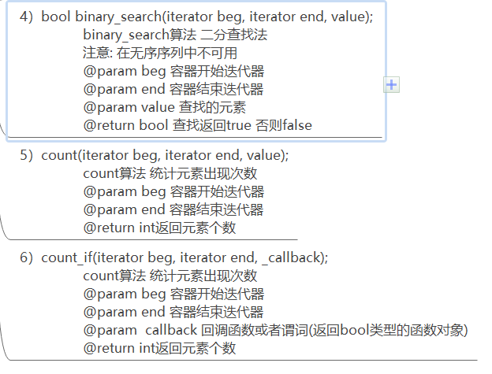
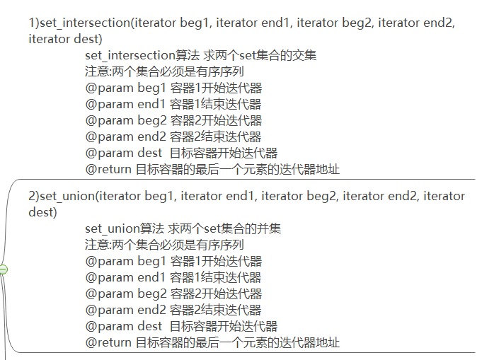

# STL标准模板库思维导图 

## 容器目录

## 1、string字符串容器

int a;
int str1;
其他类型转string：
str1 = to_string(a);

## 2、verctor动态数组

底层结构：单端数组，以堆存储

## 3、deque双向队列容器

底层结构：双端数组

## 4、stack 栈容器

地层结构:栈，先进后出

## 5、queue队列容器

地层结构:队列，先进先出

## 6、list双向链表容器

地层结构:双向链表

## 7、set/multiset集合

地层结构:红黑树

## 8、map/mutimap键值对集合容器

地层结构:红黑树

## 9、算法

### 9.1、常用遍历算法

for_each/transform

### 9.2、常用查找算法

find/find_if/adjacent_find/binary_search/count/count_if

### 9.3、常用排序算法

merge/sort/random_shuffle/reverse

### 9.4、常用拷贝和替换算法

copy/replace/replace_if/swap

### 9.5、常用算数生成算法

accumulate/fill

### 9.6、常用集合算法

set_intersection/set_union/set_difference

