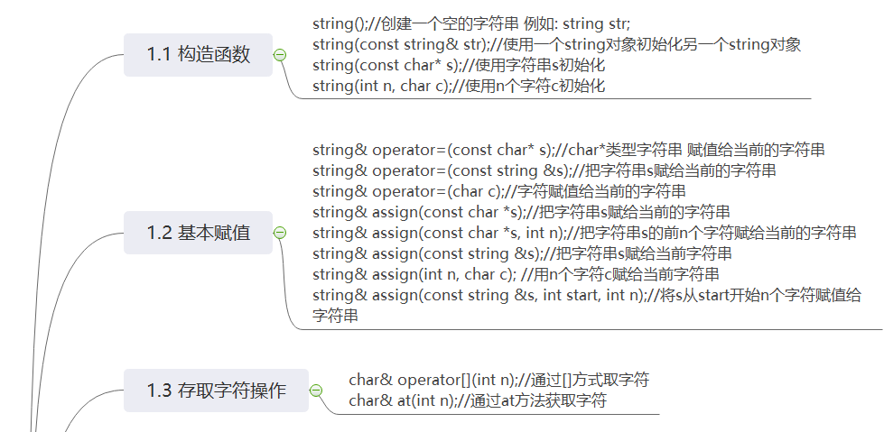
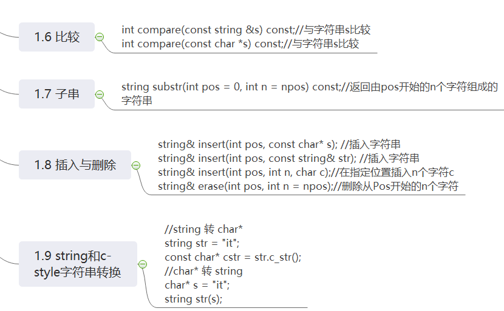
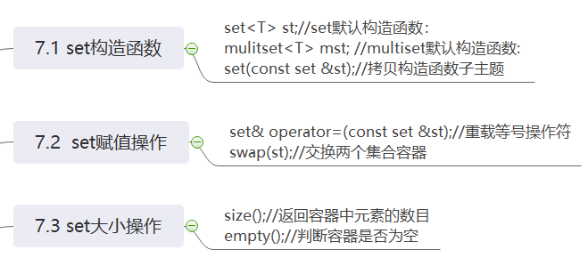
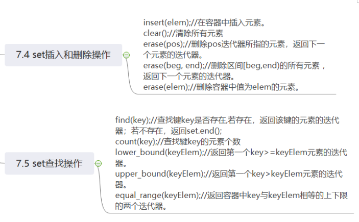
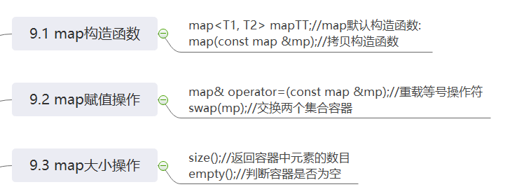
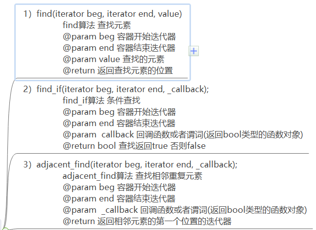
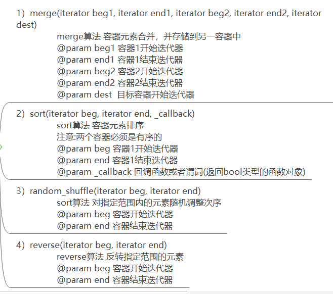
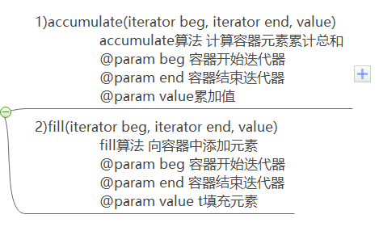
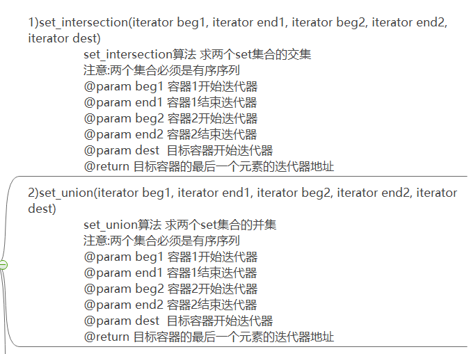

# STL标准模板库思维导图 

## 容器目录


## 1、string字符串容器





int a;
int str1;
其他类型转string：
str1 = to_string(a);

## 2、verctor动态数组

底层结构：单端数组，以堆存储


## 3、deque双向队列容器

底层结构：双端数组


## 4、stack 栈容器

地层结构:栈，先进后出


## 5、queue队列容器

地层结构:队列，先进先出


## 6、list双向链表容器

地层结构:双向链表


## 7、set/multiset集合

地层结构:红黑树





## 8、map/mutimap键值对集合容器

地层结构:红黑树




## 9、算法

### 9.1、常用遍历算法


#### 9.1.1 for_each函数

例1，for_each函数,不传参

```c++
#include<iostream>
#include<vector>
#include<algorithm>
#include<typeinfo>
using namespace std;

struct Play
{
    Play()
    {
        cout<<"new a Play"<<endl;
    }
    Play(const Play&)
    {
        cout<<"new a copy Play"<<endl;
    }
    void operator () (int i)
    {
        cout<<i<<endl;
    }
    ~Play()
    {
        cout<<"dispose a Play"<<endl;
    }
};

int main()
{
    int a[] = { 1, 3, 4, 5};
    vector<int> vc(a, a+sizeof(a)/sizeof(int));
    for_each(vc.begin(), vc.end(), Play());
    cout<<"See something"<<endl;
}

结果如下：
new a Play 
1 
3 
4 
5 
new a copy Play 
dispose a Play 
dispose a Play 
See something
```

可以看到这个过程有两个Play对象生成，但是，用于输出元素的却是第一个对象（重载（） 操作符），为什么？ 
这时候回去看for_each的源码，就会发现，它的返回值是function，以我的猜测，应该是这样的。

Play() 生成一个临时的匿名的Play对象，传入for_each 函数里，然后执行完for_each 函数后，return一个function时，Play用复制构造函数生成一个Play对象，然后两个Play对象的生命周期都结束，于是依次销毁。

例2， for_each函数，传参数

```c++
#include<iostream>
#include<vector>
#include<algorithm>
#include<typeinfo>
using namespace std;

struct Play
{
    const char* str;
    Play(const char* s):str(s) {}
    void operator () (int i)
    {
        cout<<str<<i<<endl;
    }
};

int main()
{
    int a[] = { 1, 3, 4, 5};
    vector<int> vc(a, a+sizeof(a)/sizeof(int));
    for_each(vc.begin(), vc.end(), Play("Element:"));  //其实 还是关键看  Play函数如何实现的！
}
结果：
Element:1                        
Element:3                         
Element:4                              Element:5
```

#### 9.1.2 transform函数

transform函数的作用是：将某操作应用于指定范围的每个元素。transform函数有两个重载版本：

1. `transform(first,last,result,op);`//first是容器的首迭代器，last为容器的末迭代器，result为存放结果的容器，op为要进行操作的一元函数对象或sturct、class。

2. `transform(first1,last1,first2,result,binary_op);`//first1是第一个容器的首迭代 器，last1为第一个容器的末迭代器，first2为第二个容器的首迭代器，result为存放结果的容器，binary_op为要进行操作的二元函数 对象或sturct、class。

注意：第二个重载版本必须要保证两个容器的元素个数相等才行，否则会抛出异常。

看一个例子：利用transform函数将一个给定的字符串中的小写字母改写成大写字母，并将结果保存在一个叫second的数组里，原字符串内容不变。
我们只需要使用transform的第一个重载函数，当然我们也可以使用for_each函数来完成再copy几次就行了，现在来看一下代码：

例1，transform函数

```c++
#include <iostream>
#include <algorithm>
using namespace std;
char op(char ch)
{

   if(ch>='A'&&ch<='Z')
        return ch+32;
    else
        return ch;
}
int main()
{
    string first,second;
    cin>>first;
    second.resize(first.size());
    transform(first.begin(),first.end(),second.begin(),op);
    cout<<second<<endl;
    return 0;
}
```

例2，transform函数

再看一个例子：给你两个vector向量（元素个数相等），请你利用transform函数将两个vector的每个元素相乘，并输出相乘的结果。

```c++
#include <iostream>
#include <algorithm>
#include <vector>
using namespace std;
void print(int &elem){cout<<elem<<" ";}
int op(int a,int b){return a*b;}
int main()
{
    vector <int> A,B,SUM;
    int n;
    cin>>n;
    for(int i=0;i<n;i++)
    {
        int t;
        cin>>t;
        A.push_back(t);
    }
    for(int i=0;i<n;i++)
    {
        int t;
        cin>>t;
        B.push_back(t);
    }
    SUM.resize(n);
    transform(A.begin(),A.end(),B.begin(),SUM.begin(),op);
    for_each(SUM.begin(),SUM.end(),print);
    return 0;
}
```

### 9.2、常用查找算法




#### 9.2.1 find函数

find() 函数本质上是一个模板函数，用于在指定范围内查找和目标元素值相等的第一个元素。

如下为 find() 函数的语法格式：
InputIterator find (InputIterator first, InputIterator last, const T& val);

其中，first 和 last 为输入迭代器，[first, last) 用于指定该函数的查找范围；val 为要查找的目标元素。
正因为 first 和 last 的类型为输入迭代器，因此该函数适用于所有的序列式容器。

另外，该函数会返回一个输入迭代器，当 find() 函数查找成功时，其指向的是在 [first, last) 区域内查找到的第一个目标元素；如果查找失败，则该迭代器的指向和 last 相同。

值得一提的是，find() 函数的底层实现，其实就是用==运算符将 val 和 [first, last) 区域内的元素逐个进行比对。这也就意味着，[first, last) 区域内的元素必须支持==运算符。

举个例子：

```c++
#include <iostream>     // std::cout
#include <algorithm>    // std::find
#include <vector>       // std::vector
using namespace std;
int main() {
    //find() 函数作用于普通数组
    char stl[] ="http://c.biancheng.net/stl/";
    //调用 find() 查找第一个字符 'c'
    char * p = find(stl, stl + strlen(stl), 'c');
    //判断是否查找成功
    if (p != stl + strlen(stl)) {
        cout << p << endl;
    }
    //find() 函数作用于容器
    std::vector<int> myvector{ 10,20,30,40,50 };
    std::vector<int>::iterator it;

    it = find(myvector.begin(), myvector.end(), 30);
    if (it != myvector.end())
        cout << "查找成功：" << *it;
    else
        cout << "查找失败";
    return 0;
}
```

程序执行结果为：
c.biancheng.net/stl/
查找成功：30

#### 9.2.2 find_if函数

有人说，如果我有自己定义的“相等”呢？例如，有一个list<CPerson*>，这个list中的每一个元素都是一个对象的指针，我们要在这个list中查找具有指定age的元素，找到的话就得到对象的指针。
    这时候，你不再能像上面的例子那样做，我们需要用到find_if函数，并自己指定predicate function（即find_if函数的第三个参数，请查阅STL手册）。先看看find_if函数的定义：

```c++
template<class InputIterator, class Predicate>
InputIterator find_if(InputIterator _First, InputIterator _Last, Predicate _Pred);

Parameters
_First
An input iterator addressing the position of the first element in the range to be searched.
_Last
    An input iterator addressing the position one past the final element in the range to be searched.
_Pred
    User-defined predicate function object that defines the condition to be satisfied by the element being searched for. A predicate takes single argument and returns true or false.
```

我们在CPerson类外部定义这样一个结构体：

```c++
typedef struct finder_t
{
    finder_t(int n) : age(n) { } 
    bool operator()(CPerson *p) 
    { 
        return (age == p->age); 
    } 
    int age;
}finder_t;
```

然后就可以利用find_if函数来查找了：

```c++
list<CPerson*> lst;
// 向lst中添加元素，此处省略

list<CPerson*>::iterator it = find_if(lst.begin(), lst.end(), finder_t(50)); // 查找年龄为50的人
if (it != lst.end()) // 找到了
{
    cout << "Found person with age : " << (*it)->age;
}
else // 没找到
{
    // do something
}
```

例子1

```c++
map<int, char*> mapItems;
auto it = find_if(mapItems.begin(), mapItems.end(), [&](const pair<int, char*> &item) {
    return item->first == 0/*期望值*/;
});
```

#### 9.2.2 adjacent_find函数

`adjacent_find()`函数的作用是用于查找出首个相邻的一对元素的值或者所在位置。它需要使用algorithm头文件。
这种算法方式只有一种，原型如下：

```c++
// TEMPLATE FUNCTION adjacent_find
template inline
_FwdIt adjacent_find(_FwdIt _First, _FwdIt _Last)
{ // find first matching successor
return (_STD adjacent_find(_First, _Last, equal_to<>()));
}
```

代码如下：

```c++
//adjacent_difference的使用
#include <algorithm>
//vector容器的使用
#include<vector>
#include<iostream>
using namespace std;

void main() {
//定义一个容器，添加一些数据
	vector<int> data{ 2,3,1,5,5,8,4,2 };
//新增个容器获取相邻元素
vector<int>::iterator ting
//获取相同的首个元素
	ting  = adjacent_find(data.begin(), data.end());
//输出相邻元素位置
	cout << "输出首个相邻元素位置：" << sizeof(*ting) << "个" << endl;
cout << endl;
//输出相同的首个元素
	cout << "输出首个相邻元素：" << *ting << endl;
}
```

输出结果：
输出首个相邻元素位置：4
输出首个相邻元素：5

#### 9.2.4 count函数

count和count_if函数是计数函数，先来看一下count函数：
count函数的功能是：统计容器中等于value元素的个数。

先看一下函数的参数：
`count(first,last,value); `first是容器的首迭代器，last是容器的末迭代器，value是询问的元素。

可能我说的不太详细，来看一个例题：
给你n个数字（n<=1000），再给你一个数字m，问你：数字m在n个数字中出现的次数。

看到这道题，我们会想到使用sort+equal_range函数的配合（n的范围大约在1万---10万左右），不过n<=1000 数据量不大，所以我们可以直接使用count函数，这里我们要注意一点：count函数的复杂度是线性的，最坏情况是O(n)。这题很简单，所以我们很快就可以写出代码：

```c++
#include <iostream>
#include <cstdio>
#include <algorithm>
#include <vector>
using namespace std;
int main()
{
    int n;
    vector <int> V;
    cin>>n;
    for(int i=0;i<n;i++)
    {
        int temp;
        cin>>temp;
        V.push_back(temp);
    }
    int ask;
    while(cin>>ask)
    {
        int num=count(V.begin(),V.end(),ask);
        cout<<num<<endl;
    }
    return 0;
}
```

#### 9.2.5 count_if函数

`count_if(first,last,comp);` first为首迭代器，last为末迭代器，comp为比较函数。
发现了函数的奥秘了吗？我们来看一下count_if函数STL的源代码：

```c++
template <class InputIterator, class Predicate>
 ptrdiff_t count_if ( InputIterator first, InputIterator last, Predicate pred ) 
{
 ptrdiff_t ret=0; 
 while (first != last) 
 if (pred(*first++)) ++ret;
 return ret;
}
```


其实comp比较函数才是整个count_if函数的核心，comp比较函数是编程的人写的，返回值是一个布尔型，我相信看完我的例题后，就可以理解这个函数的应用。例题：统计1-10奇数的个数（我的代码）：

```c++
#include <iostream>
#include <cstdio>
#include <cstring>
#include <vector>
#include <algorithm>
using namespace std;
struct student
{
    string name;
    int score;
};
bool compare(student a)
{
    return 90<a.score;
}
int main()
{
    int n;
    cin>>n;
    vector<student> V;
    for(int i=0;i<n;i++)
    {
        student temp;
        cin>>temp.name>>temp.score;
        V.push_back(temp);
    }
    cout<<count_if(V.begin(),V.end(),compare)<<endl;
    return 0;
}
```

### 9.3、常用排序算法



#### 9.3.1 merge函数

merge：将两个有序序列合并成一个新的序列，并对新的序列排序

所在库：<algorithm>

注意：排序规则必须和原序列规则相同。存储时下标从0开始。

函数参数：`merge(first1,last1,first2,last2,result,compare);`

firs1t为第一个容器的首迭代器，last1为第一个容器的末迭代器，first2为第二个容器的首迭代器，last2为容器的末迭代器，result为存放结果的容器，comapre为比较函数（可略写，默认为合并为一个升序序列）。

迭代器的操作和sort类似。

```c++
#include<bits/stdc++.h>
using namespace std;
int a[100];
int b[100];
int c[200];
bool cmp(int a,int b)
{
    return a>b;
}//从大到小排序
int main()
{
    for(int i=1;i<=3;i++)
    {
        cin>>a[i];
    }
    for(int i=1;i<=3;i++)
    {
        cin>>b[i];
    }
    merge(a+1,a+4,b+1,b+4,c,cmp);//排序过程
    for(int i=0;i<=5;i++)
    {
        cout<<c[i]<<" "; 
    }
    return 0;
}
```

#### 9.3.2 sort函数

1.sort函数包含在头文件为`#include<algorithm>`的c++标准库中，调用标准库里的排序方法可以实现对数据的排序，但是sort函数是如何实现的，我们不用考虑！

2.sort函数的模板有三个参数：

`void sort (RandomAccessIterator first, RandomAccessIterator last, Compare comp);`
（1）第一个参数first：是要排序的数组的起始地址。

（2）第二个参数last：是结束的地址（最后一个数据的后一个数据的地址）

（3）第三个参数comp是排序的方法：可以是从升序也可是降序。如果第三个参数不写，则默认的排序方法是从小到大排序。

例1，sort函数

```c++
#include<iostream>
#include<algorithm>
using namespace std;
main()
{
　　//sort函数第三个参数采用默认从小到大
　　int a[]={45,12,34,77,90,11,2,4,5,55};
　　sort(a,a+10);
　　for(int i=0;i<10;i++) {
        cout<<a[i]<<" ";
    }
　　
}
```

输出结果：
2 4 5 11 12 34 25 55 77 90

#### 9.3.3 random_shuffle函数

randdom_shuffle函数的功能是：随机打乱一个序列。函数参数：`random_shuffle(first,last);`//first为容器的首迭代器，last为容器的末迭代器。该函数没有任何返回值。

这个函数很简单，直接看个例子：输入n个数字，输出打乱后的序列。
代码:

```c++
#include <iostream>
#include <algorithm>
#include <vector>
using namespace std;
int main()
{
   srand((unsigned)time(0));
    int n;
    vector <int> V;
   cin>>n;
    for(int i=0;i<n;i++)
    {
       int t;
      cin>>t;
      V.push_back(t);
    }
   random_shuffle(V.begin(),V.end());
    for(vector <int> ::iterator iter=V.begin();iter!=V.end();iter++)
      cout<<*iter<<" ";cout<<endl;
    return 0;
}
```

输入：1 2 3 4 5
一个可能的输出：5 3 2 4 1

#### 9.3.4 reverse函数

reverse函数功能是逆序（或反转），多用于字符串、数组、容器。头文件是`#include <algorithm>`

reverse函数用于反转在[first,last)范围内的顺序（包括first指向的元素，不包括last指向的元素），reverse函数无返回值

```c++
string str="hello world , hi";
reverse(str.begin(),str.end());//str结果为 ih , dlrow olleh
vector<int> v = {5,4,3,2,1};
reverse(v.begin(),v.end());//容器v的值变为1,2,3,4,5
```

### 9.4、常用拷贝和替换算法


#### 9.4.1 copy函数

在两个容器之间复制元素：
例 
```c++
int myints[] = {10, 20, 30, 40, 50, 60, 70};
vector myvector;
vector::iterator it;
myvector.resize(7); // 为容器myvector分配空间
//copy用法一：
//将数组myints中的七个元素复制到myvector容器中
copy ( myints, myints+7, myvector.begin() );
//copy用法二:
//将数组myints中的元素向左移动一位
copy(myints + 1, myints + 7, myints);
```

上例中代码特别要注意一点就是myvector.resize(7);这行代码，在这里一定要先为vector分配空间，否则程序会崩，这是初学者经常犯的一个错误。
// 从标准输入设备读入整数
// 直到输入的是非整型数据为止 请输入整数序列，按任意非数字键并回车结束输入

```c++
cout << “Please input element：” << endl;
copy(IstreamItr(cin), IstreamItr(), BackInsItr(myvector));

//输出容器里的所有元素，元素之间用空格隔开
cout << "Output : " << endl;
copy(myvector.begin(), myvector.end(), OstreamItr(cout, " "));
```

```c++
#include <algorithm>
#include <vector>
#include <iterator>
#include <string>
#include<iostream>
using namespace std；
int main () 

{
	 typedef vector<int> IntVector;
	 typedef istream_iterator<int> IstreamItr;
	 typedef ostream_iterator<int> OstreamItr;
	 typedef back_insert_iterator< IntVector > BackInsItr;
	 IntVector myvector;
	 // 从标准输入设备读入整数
	 // 直到输入的是非整型数据为止 请输入整数序列，按任意非数字键并回车结束输入
	 cout << "Please input element：" << endl;
	 copy(IstreamItr(cin), IstreamItr(), BackInsItr(myvector));
	 //输出容器里的所有元素，元素之间用空格隔开
	 cout << "Output : " << endl;
	 copy(myvector.begin(), myvector.end(), OstreamItr(cout, " ")); 
	 cout << endl；
	return 0;

}
```

#### 9.4.2 replace函数

 replace函数包含于头文件`#include<string>`中。

泛型算法replace把队列中与给定值相等的所有值替换为另一个值，整个队列都被扫描，即此算法的各个版本都在

线性时间内执行———其复杂度为O(n)。

即replace的执行要遍历由区间[frist，last)限定的整个队列，以把old_value替换成new_value。

下面说下replace()的九种用法：(编译软件dev5.4.0)

用法一：用str替换指定字符串从起始位置pos开始长度为len的字符 
`string& replace (size_t pos, size_t len, const string& str);` 
代码如下：

```c++
#include<iostream>
#include<string>
using namespace std;
int main()
{
	string str = "he is@ a@ good boy";
	str=str.replace(str.find("a"),2,"#");  //从第一个a位置开始的两个字符替换成#
	cout<<str<<endl; 
	return 0;
}
```

结果如下:
he is@ # good boy

#### 9.4.3 replace_if函数

replace_if()函数是算法标头的库函数，用于根据给定的一元函数替换给定范围内的值，该函数应接受范围内的元素作为参数并返回应可转换为bool的值(如0或1)，它返回值指示给定的元素是否可以替换？
replace_if()函数的语法

```c++
std::replace_if(
    iterator start, 
    iterator end, 
    unary_function, 
    const T& new_value);
```

```c++
在此程序中，我们有一个向量，并将所有偶数替换为-1。
//C++ STL program to demonstrate use of
//std::replace_if() function
#include <iostream>
#include <algorithm>
#include <vector>
using namespace std;
 
//function to check EVEN value
bool isEVEN(int x)
{
    if (x % 2 == 0)
        return 1;
    else
        return 0;
}
 
int main()
{
    //vector
    vector<int> v{ 10, 20, 33, 23, 11, 40, 50 };
 
    //printing vector elements
    cout << "before replacing, v: ";
    for (int x : v)
        cout << x << " ";
    cout << endl;
 
    //replacing all EVEN elements with -1
    replace_if(v.begin(), v.end(), isEVEN, -1);
 
    //printing vector elements
    cout << "after replacing, v: ";
    for (int x : v)
        cout << x << " ";
    cout << endl;
 
    return 0;
}

Output

输出量

before replacing, v: 10 20 33 23 11 40 50
after replacing, v: -1 -1 33 23 11 -1 -1
```

#### 9.4.4 swap函数

先来看第一段程序：

```c++
void swap(int x, int y) {
    int temp = y;
    y = x;
    x = temp;
}
```

通过main函数的调用，我们发现x,y并未实现交换：

```c++
int main()
{
    int x = 1;
    int y = 37;

    swap(x, y);

    cout << x << ":" << y << endl;
    return 0;
}
```

### 9.5、常用算数生成算法



### 9.6、常用集合算法




