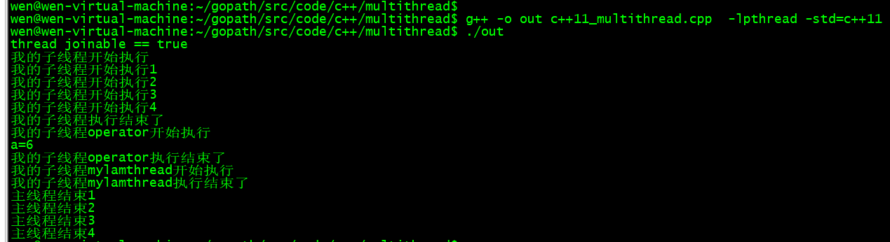
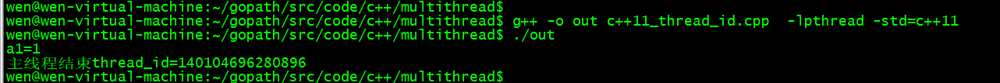
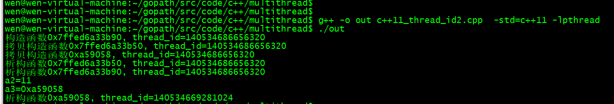

# C++11 多线程

## 1、并发与多线程概念

### 1.1、并发概念

2个或者多个任务同时发送（进行），即一个程序同时执行多个独立的任务。
以往计算机，单个cpu（中央处理器）：某一个时刻只能进行一个任务，由于操作系统调度，每秒钟进行多次所谓的“任务切换”。并发的假象不是正真的并发，这种切换为上下文切换。

硬件发展，出现了多核cpu计算机。
1）可执行程序
Windows下的.exe。Linux下：ls -la,rwxrxwrxw(x执行权限)
2）进程：就是可执行程序运行起来就叫一个进程。
3）线程：每个进程（执行起来的可执行程序），都有一个主线程，主线程是唯一的，即一个进程中只有一个主线程。Ctrl + f5运行这个程序。
线程是执行代码。
多线程（并发）

线程并不是越多越好，每个线程都需要一个独立的堆栈空间（1M，windows），线程之间的切换需要保存状态。

总结线程：
1）线程是执行代码
2）线程理解为一条代码的执行通路，一个新线程代表一条新的通路。
3）一个进行包含一个主线程，主线程启动并发多线程，不建议超过200-300线程，若过多线程，会造成过多切换存储。
4）多线程同时干多个事情，效率更高。

## 1.2、并发的实现

两个或多个任务（独立活动）同时发生（进行）叫并发。
实现并发手段 ：
1）通过多个进程实现并发。
2）在单独的进程中创建多个线程实现并发，除了主线程的其它线程

#### 1.2.1、多进程并发

Word 启动就是进程，浏览器启动就是进程，账号服务器启动就是进程。
进程之间的通信（同一个电脑：管道、文件、消息队列、共享内存），进程之间的通信（不同电脑：socket通信）

#### 1.2.2、多线程并发

多线程并发：多个进程创建多个线程。

多线程之间的传递可以全局变量、指针、引用，开销远远小于多进程。因此优先考虑多线程而不是多进程。

线程总结：
C++11新标准：
以前的Windows： CreateThread(), _beginthread(), _beginthredexe()创建线程
以前的linux: pthread_create():创建线程
以前的线程代码不能跨平台，即windows与linux不能互通使用。
C++11新标准，c++语言本身增加多线程的支持，意味着可移植行，即windows与linux可以互通使用，实现跨平台操作。

## 2、c++11线程启动、结束、创建线程

### 2.1、线程开始与结束

//优先子线程先运行完，再主线程结束。
//thread 是标准库的类

#### 2.1.1、thread

Thread: 创建了线程，线程的入口为myprint,开始执行线程了

```c++
thread myobj(myprint);
if (myobj.joinable()) {

    cout << "thread joinable == true" << endl;
    myobj.join();
}
else {
    cout << "thread joinable == false" << endl;
}
```

#### 2.1.2、join()

Join():阻塞主线运行，优先执行子线程运行
   `// myobj.join();`

##### 2.1.3、detach()

detach()：分离，即主线程与子线程不再汇合，互不干扰执行，主线程不需要等待子线程完成再执行
//为什么引用detach()： 由于创建多个子线程，让主线程等待子线程结束，所以引入deatch()。建议不使用这种编程方法。
//myobj.detach(); //若使用detach()，则不能使用join。尽量不使用

#### 2.1.4、joinable()

joinable():判断是否成功使用join()或detach()，返回ture或false

### 2.2、其他创建线程的手法

#### 2.2.1、使用类对象

```c++
int b = 6;
TA ta(b);
thread myobj2(ta); //创建调用对象
myobj2.join(); //等待子线程结束
//myobj2.detach(); //主线程与子线程分离的问题?
```

#### 2.2.2、用lambda表达式

```c++
auto mylamthread = [] {
    cout << "我的子线程mylamthread开始执行" << endl;
    cout << "我的子线程mylamthread执行结束了" << endl;
};  //分号结束";"
thread myobj3(mylamthread);
myobj3.join();
```

### 2.3、多线程的代码

// test1.cpp : 此文件包含 "main" 函数。程序执行将在此处开始并结束。

```c++
#include <iostream>
#include <thread>
#include <string>
using namespace std;
void myprint() {
    cout << "我的子线程开始执行" << endl; //引用：后果难以预料。原因：主线程完成，而子线程没有运行完成而结束
    cout << "我的子线程开始执行1" << endl;
    cout << "我的子线程开始执行2" << endl;
    cout << "我的子线程开始执行3"<< endl;
    cout << "我的子线程开始执行4" << endl;
    cout << "我的子线程执行结束了" << endl;
}

class TA {
public:
    int& a;
    TA(int& b) : a(b) {

    }
    void operator() () //不带参数
    {
        cout << "我的子线程operator开始执行" << endl;
        cout << "a=" << a << endl;
        cout << "我的子线程operator执行结束了" << endl;
    }
};

int main()
{
    //优先子线程先运行完，再主线程结束。
    //1、thread 是标准库的类
     //（1）thread：创建了线程，线程的入口为myprint,开始执行线程了
    thread myobj(myprint);
    if (myobj.joinable()) {

        cout << "thread joinable == true" << endl;
        myobj.join();
    }
    else {
        cout << "thread joinable == false" << endl;
    }
    //(2)join阻塞主线运行，优先执行子线程运行
   // myobj.join(); 
    //（3）detach()：分离，即主线程与子线程不再汇合，互不干扰执行，主线程不需要等待子线程完成再执行
    //为什么引用detach()： 由于创建多个子线程，让主线程等待子线程结束，所以引入deatch()。建议不使用这种编程方法。
    //myobj.detach(); //若使用detach()，则不能使用join。尽量不使用
    //（4）joinable():判断是否成功使用join()或detach()，返回ture或false

    //2、其他创建线程的方法
    //2.1 使用类对象
    int b = 6;
    TA ta(b);
    thread myobj2(ta); //创建调用对象
    myobj2.join(); //等待子线程结束
    //myobj2.detach(); //主线程与子线程分离的问题?

    //2.2使用lambda表达式
    auto mylamthread = [] {
        cout << "我的子线程mylamthread开始执行" << endl;
        cout << "我的子线程mylamthread执行结束了" << endl;
    };  //分号结束";"
    thread myobj3(mylamthread);
    myobj3.join();

    cout << "主线程结束1" << endl;
    cout << "主线程结束2" << endl;
    cout << "主线程结束3" << endl;
    cout << "主线程结束4" << endl;
}
```

输出结果：

1. 阻塞线程2  

```c++
myobj2.join(); //等待子线程结束
//myobj2.detach(); //主线程与子线程分离的问题?
```

wen@wen-virtual-machine:~/gopath/src/code/c++/multithread$ `g++ -o out c++11_multithread.cpp  -lpthread -std=c++11` 
wen@wen-virtual-machine:~/gopath/src/code/c++/multithread$ `./out `



2. 线程2与主线程断开

```c++
//myobj2.join(); //等待子线程结束
myobj2.detach(); //主线程与子线程分离的问题?
```


## 3、线程传参详解，detach()大坑，成员函数做线程

### 3.1、传递临时对象作为线程参数

例如1：

```c++
void MyPrint(const int b1, const string& arrBuf) {}
char arrBuf[] = "this is a test!";	
thread threadObj1(MyPrint, b1, string(arrBuf)); //1、detach(): char * 转化string,生成一个string临时对象
```

例如2：

```c++
void MyPrint2(const int a2, const A& a3) {}
int a3 = 22;
thread threadObj2(MyPrint2, a2, A(a3)); //2、detach()可以使用临时对象，可以在主线程完成之前把子线程的临时对象构造出来
//threadObj2.join();
threadObj2.detach();
```

detach()的总结：
（1）若传递int这种简单类型参数，建议使用值传递，而不要使用引用，防止出现问题。
（2）若传递类对象或字符串，避免使用隐式类型转换。实参使用时进行类型转换，作为临时对象，形参使用引用类型。
建议：不使用detach()，只是用join()，这样不存在这些问题。

### 3.2、线程id概念

1）Id是一个数字，每个线程（主线程或子线程）都对应一个数字。
线程id可以使用标准库里的函数获取。`Std::this_thread::get_id()`获取
2）临时对象构造函数抓捕

### 3.3、案例

1. 传递临时参数作为线程参数

```c++
#include <iostream>
#include <thread>
#include <string>

using namespace std;

class A {
public:
	int m;
	A(int a) :m(a) {
		cout << "构造函数" << this << ", thread_id=" << std::this_thread::get_id() << endl;
	}
	A(const A& a) :m(a.m) {
		cout << "拷贝构造函数" << this << ", thread_id=" << this_thread::get_id()<<endl;
	}
	~A() {
		cout << "析构函数" << this << ", thread_id=" << this_thread::get_id()<< endl;
	}

};

//detach(): b1实际上是一个值的传递，而不是引用传递，因为地址不一样
//detach(): 不能使用指针，会引发问题
//detach(): 实参为字符串，形参为引用，这样没有问题
//void MyPrint(const int & b1, char * arrBuf) {
//void MyPrint(const int b1, char* arrBuf) {  // char* arrBuf 修改为const string &arrBuf， 
//void MyPrint(const int b1, const string &arrBuf) { //错误
void MyPrint(const int b1, const string& arrBuf) {
	cout << "b1=" << b1 << endl;
	//cout << "arrBuf=" << arrBuf.c_str() << endl;
	cout << "arrBuf=" << arrBuf<< ", thread_id=" << this_thread::get_id()<< endl;
	return;
}

int main()
{
	//1 传递临时参数作为线程参数
	int a1 = 1;
	int& b1 = a1;
	// b1 = 22;
	cout << "a1=" << a1 << endl;

	char arrBuf[] = "this is a test!";
	thread threadObj1(MyPrint, b1, string(arrBuf)); //detach(): char * 转化string,生成一个string临时对象
	//threadObj1.join();
	threadObj1.detach();

	cout << "主线程结束" << "thread_id=" << this_thread::get_id() << endl;
	return 0;
}
```

编译：
1. 传递临时参数作为线程参数
1）运行阻塞线程threadObj1.join();


2)运行线程分离threadObj1.detach();


2. get_id()获取线程的id

```c++
void MyPrint2(const int a2, const A& a3) {
	cout << "a2=" << a2  <<  endl;
	cout << "a3=" << &a3  <<  endl;
	return;
}

int main()
{
	//2 this_thread::get_id()获取线程的id
	int a2 = 11;
	int a3 = 22;
	thread threadObj2(MyPrint2, a2, A(a3)); //2、detach()可以使用临时对象，可以在主线程完成之前把子线程的临时对象构造出来
	threadObj2.join();
	//threadObj2.detach();
}
```
编译：


3. std::ref函数表示引用类型，而不是值类型传递

```c++
void MyPrint3(A &a5) {
	a5.m = 5; //修改成员变量不会改变主函数的成员变量
	cout << "a5.m=" << a5.m  <<  endl;
	return;
}


int main()
{
	//3 std::ref函数表示引用类型，而不是值类型传递
	A aObj(10);
	thread threadObj3(MyPrint3, std::ref(aObj));
	cout << "aObj.m=" << aObj.m  <<  endl;
	threadObj3.join();
	//threadObj3.detach();
    return 0;
}
```
编译：


4. 智能指针

```c++

void MyPrint4(unique_ptr<int> pan) {
    cout << "pan is unique_ptr"  << endl;
	return;
}

int main()
{ 
    //4 智能指针
    unique_ptr<int> uPtr(new int(100));
    thread threadObj4(MyPrint4, move(uPtr));
    threadObj4.join(); //
    //threadObj3.detach(); //不能使用，错误
    return 0;
}
```
编译：


5. 成员函数做参数

```c++
#include <iostream>
#include <thread>
#include <string>

using namespace std;

class A {
public:
	int m;
	A(int a) :m(a) {
		cout << "构造函数" << this << ", thread_id=" << std::this_thread::get_id() << endl;
	}
	A(const A& a) :m(a.m) {
		cout << "拷贝构造函数" << this << ", thread_id=" << this_thread::get_id()<<endl;
	}
	~A() {
		cout << "析构函数" << this << ", thread_id=" << this_thread::get_id()<< endl;
	}
    void thread_work(int n) {
        cout << "thread_work n = " << n  << endl;
    }
};

int main()
{ 
	//5 成员函数做参数
	A aObj2(12);
	thread threadObj5(&A::thread_work, aObj2, 14); //拷贝构造函数
	threadObj5.join();
	//threadObj3.detach(); //不能使用，错误
	cout << "主线程结束" << "thread_id=" << this_thread::get_id() << endl;
    return 0;
}
```

编译：


## 4、创建多个线程、数据共享问题分析、案例代码

### 4.1、创建和等待多个线程

```c++
#include <iostream>
#include <thread>
#include <string>
#include <vector>
using namespace std;

void print(int num) {
    cout << "子线程print num=" << num << endl;
}

int main()
{
    //一： 创建和等待多线程
    vector<thread> mythreads;
    //1.1 多个线程执行顺序是乱的，与操作系统内部对线程的运行调度机制有关
    //1.2主线程等待所有子线程完成，最后主线程进行结束。
    //1.3 thread放到容器，有利于大量线程管理
    for (int i = 0; i < 10; i++) {
        mythreads.push_back(thread(print, i )); //创建10个线程，同时开始执行
    }

    for (auto it = mythreads.begin(); it < mythreads.end(); it++) {
        it->join();//等待10个线程都返回
    }
    std::cout << "主线程完成!\n";
}
```

编译：


### 4.2、数据共享问题分析

1、 只读数据是安全稳定的，不需要特别处理，直接读取数据
2、有读有写： 2个线程写，8个线程读若没有特殊处理，程序崩溃；
处理：读的时候不能写，写的时候不能读，即2个线程不能同时写，8个线程不能同时读
写操作分10步，由于任务切换，导致各种诡异事件发生（可能程序崩溃）
3、其他案例
数据共享： 北京--深圳， 火车 T123,10个售票窗口（卖票）， 1和2窗口 同时要订99座位

### 4.3、共享数据的保护案例代码

`multiThread.cpp` : 此文件包含 "main" 函数。程序执行将在此处开始并结束。

```c++
#include <iostream>
#include <thread>
#include <vector>
#include <list>
using namespace std;

class A {
public:
    //接收的消息（玩家命令）到一个队列的线程
    void inMsgRecvQueue() {
        for (int i = 0; i < 10; i++) {
            cout << "inMsgRecvQueue()执行，插入一个元素：" << i << endl;
            msgRecvQueue.push_back(i);
        }
      }
    //把数据从消息队列中取出的线程
    void outMsgRecvQueue() {
        for (int i = 0; i < 10; i++) {
            if (!msgRecvQueue.empty()) {
                int command = msgRecvQueue.front();//返回第一个元素，但是不检查元素是否存在
                cout << "outMsgRecvQueue:" << command<<endl;
                msgRecvQueue.pop_front(); //移除第一个元素，但不返回
            }
            else {
                cout << "消息为空" << endl;
            }
        }
    }
private:
    list<int> msgRecvQueue;

};
//2.1 只读数据
vector <int> onlyReadData = { 1,2,3 };
void print(int num) {
    // std::cout << "子线程print num=" << num << endl;
    //cout << "共享数据，id为" << this_thread::get_id()<<"的线程值为"<< onlyReadData.at(0) << onlyReadData.at(1) << onlyReadData.at(2) << endl;
    cout << "共享数据，id为" << this_thread::get_id() << "的线程值为" << onlyReadData[0] << onlyReadData[1] << onlyReadData[2] << endl;
}

int main()
{
    //1、创建和等待多线程
    vector<thread> mythreads;
    // 1.1 多个线程执行顺序是乱的，与操作系统内部对线程的运行调度机制有关
    // 1.2主线程等待所有子线程完成，最后主线程进行结束。
    // 1.3 thread放到容器，有利于大量线程管理
    for (int i = 0; i < 10; i++) {
        //创建10个线程，同时开始执行
       mythreads.push_back(thread(print, i)); 
    }

    for (auto it = mythreads.begin(); it != mythreads.end(); ++it) {
       it->join();//等待10个线程都返回
    }
    std::cout << "主线程完成!\n";

    ///2、只读数据共享分析
    //2.1 只读数据是安全稳定的，不需要特别处理，直接读取数据
    //2.2 有读有写： 2个线程写，8个线程读若没有特殊处理，程序崩溃；
    //处理：读的时候不能写，写的时候不能读，即2个线程不能同时写，8个线程不能同时读
    //写操作分10步，由于任务切换，导致各种诡异事件发生（可能程序崩溃）
    //2.3 其他案例
    //数据共享： 北京--深圳， 火车 T123,10个售票窗口（卖票）， 1和2窗口 同时要订99座位

    //3、共享数据的保护案例代码
    //网络游戏服务器。创建2个线程，一个线程收集玩家命令，并把命令数据写入到一个队列；另一个线程从队列中取出玩家发送的命令，解析，然后执行玩家命令
    //vector: 随机插入和删除效率比较高，list: 按顺序插入和删除效率高
    //解决共享保护数据问题：解决方法就是“互斥量”--互斥锁
    A objA; 
    thread myOutMsgObjThread(&A::outMsgRecvQueue, &objA); //第二个参数是引用，才能保证线程使用同一个对象
    thread myInMsgObjThread(&A::inMsgRecvQueue, &objA);
    myOutMsgObjThread.join();
    myInMsgObjThread.join();
}
```

编译：


## 5、互斥锁概念、用法、死锁演示及解决方法

//保护共享数据：操作时，某个线程把代码的共享数据锁住、操作数据、解锁，其他想操作共享数据的线程必须等待解锁，锁定住、操作、解锁。

### 5.1、互斥量（mutex）的基本概念

互斥量是一个对象，即一把锁

### 5.2、互斥量用法

#### 5.2.1、lock() 与unlock()

步骤： 先lock操作共享数据，再unlock()。 lock() 与unlock()必须成对使用
为了防止大家忘记unlock()，引入了一个std::lock_guard的类模板。你忘了unlock，我替你unlock；
智能指针（unique_ptr<>）：你忘了释放内存不要紧，我给你释放内存。

#### 5.2.2、lock_guard()

Lock_guard()等于lock()和unlock(),它们不能同时出现
//sbguard为变量名，lock_guard的构造函数执行lock(); lock_guard析构函数执行unlock；//std::lock_guard<std::mutex> sbguard(my_mutex);

### 5.3、 死锁

#### 5.3.1、必须有2把锁，金锁和银锁

//线程A与线程B对程序卡死不动，从而造成死锁: 
例如：

```c++
 std::lock_guard<std::mutex> sbguard(my_mutex);
  //my_mutex1.lock();
  //my_mutex2.lock();
...
 //my_mutex2.unlock();
//my_mutex1.unlock();
```

#### 5.3.2、死锁解决方案

只要保证锁的顺序一致，先锁my_mutex1.lock();，再锁 my_mutex2.lock();
例如：

```c++
void inMsgRecvQueue() {
    for (int i = 0; i < 10000; i++) {
        cout << "inMsgRecvQueue()执行，插入一个元素：" << i << endl;
        my_mutex1.lock();
        my_mutex2.lock();
        msgRecvQueue.push_back(i);
        my_mutex1.unlock();
        my_mutex2.unlock();
    }
}
```

### 5.3.3、std::lock()函数模板

一次锁住2个或多个以上的互斥量（1个不行），不会因为多个线程锁的顺序问题造成死锁的风险；
//std::lock(): 如果互斥量中有一个没有锁住，它就在那里等着，等所有互斥量锁住，他才往下执行；要么2个互斥量都锁住，要么两个互斥量都没有锁住。
//若一个锁住，另一个没有锁住成功，则立即把已经锁住的进行解锁。
//my_mutex1.lock(); my_mutex2.lock(); 等于 lock(my_mutex1, my_mutex2);

#### 5.3.4、lock_guard的adopt_lock参数

adopt_lock参数表示已经锁住了lock，不需要锁住了，还可以unlock();
例如：

```c++
//锁住my_mutex1和my_mutex2
lock(my_mutex1, my_mutex2);
//adopt_lock：表示没有锁住my_mutex1.lock();但是无解锁my_mutex1.unlock(),因为sbguard1包含解锁
std::lock_guard<std::mutex> sbguard1(my_mutex1, std:: adopt_lock);
//adopt_lock：表示没有锁住my_mutex2.lock(); 但是无解锁my_mutex2.unlock()
std::lock_guard<std::mutex> sbguard2(my_mutex2, std::adopt_lock);
```

//总结： lock()一次锁住多个互斥量，谨慎使用一个一个锁

### 5.4、代码

// multiThread.cpp : 此文件包含 "main" 函数。程序执行将在此处开始并结束。


保护共享数据：操作时，某个线程把代码的共享数据锁住、操作数据、解锁，其他想操作共享数据的线程必须等待解锁，锁定住、操作、解锁。

1. 互斥量（mutex）的基本概念

互斥量是一个对象，即一把锁

2. 互斥量用法

2.1 lock() 与unlock(), 步骤： 先lock操作共享数据，再unlock()。 lock() 与unlock()必须成对使用
为了防止大家忘记unlock()，引入了一个std::lock_guard的类模板。你忘了unlock，我替你unlock；
智能指针（unique_ptr<>）：你忘了释放内存不要紧，我给你释放内存。

2.2 lock_guard()等于lock()和unlock(),它们不能同时出现
   
3. 死锁

3.1 必须有2把锁，金锁和银锁：
线程A与线程B对程序卡死不动，从而造成死锁。
3.2死锁解决方案： 只要保证锁的顺序一致，先锁
my_mutex1.lock();，再锁 my_mutex2.lock();。 
3.3 std::lock()函数模板：一次锁住2个或多个以上的互斥量（1个不行），不会因为多个线程锁的顺序问题造成死锁的风险；
std::lock(): 如果互斥量中有一个没有锁住，它就在那里等着，等所有互斥量锁住，他才往下执行；要么2个互斥量都锁住，要么两个互斥量都没有锁住。
若一个锁住，另一个没有锁住成功，则立即把已经锁住的进行解锁。
my_mutex1.lock(); my_mutex2.lock(); 等于 lock(my_mutex1, my_mutex2);
3.4 2lock_guard的adopt_lock参数：表示已经锁住了lock，不需要锁住了，还可以unlock();
  
总结： lock()一次锁住多个互斥量，谨慎使用一个一个锁

```c++
#include <iostream>
#include <thread>
#include <vector>
#include <list>
#include <mutex>
using namespace std;

class A {
public:
    //接收的消息（玩家命令）到一个队列的线程
    void inMsgRecvQueue() {
        for (int i = 0; i < 10; i++) {
            cout << "inMsgRecvQueue()执行，插入一个元素：" << i << endl;
            my_mutex1.lock();
            my_mutex2.lock();
            msgRecvQueue.push_back(i);
            my_mutex1.unlock();
            my_mutex2.unlock();
        }
      }

    bool outMsgLULProc(int &command) {
        //sbguard为变量名，lock_guard的构造函数执行lock(); lock_guard析构函数执行unlock；
        //1
        std::lock_guard<std::mutex> sbguard(my_mutex);
        //2
        my_mutex1.lock();
        my_mutex2.lock();
        //3
        //lock(my_mutex1, my_mutex2); //已经锁住
        //std::lock_guard<std::mutex> sbguard1(my_mutex1, std:: adopt_lock); // adopt_lock：表示不需要锁住my_mutex1.lock();
        //std::lock_guard<std::mutex> sbguard2(my_mutex2, std::adopt_lock);// adopt_lock：表示不需要锁住my_mutex2.lock();
        if (!msgRecvQueue.empty()) {
            cout << "消息不为空" << endl;
            command = msgRecvQueue.front();//返回第一个元素，但是不检查元素是否存在
            msgRecvQueue.pop_front(); //移除第一个元素，但不返回
            //1
            //my_mutex.unlock(); //每个分支unlock
            //2
            my_mutex2.unlock();
            my_mutex1.unlock();
            return true;
        }
        //1
        //my_mutex.unlock(); //每个分支unlock
        //2
        my_mutex2.unlock();
        my_mutex1.unlock();
        return false;

    }
    //把数据从消息队列中取出的线程
    void outMsgRecvQueue() {
        int command = 0;
        for (int i = 0; i < 10; i++) {
            bool result = outMsgLULProc(command);
            if (result == true) {
                cout << "msgRecvQueue()执行，取出一个元素： " << command << endl;
            }
            else {
                cout << "消息为空" << endl;
            }
        }
    }
private:
    list<int> msgRecvQueue;
    mutex my_mutex; //创建一个互斥量
    mutex my_mutex1;
    mutex my_mutex2;
};
//2.1 只读数据
vector <int> onlyReadData = { 1,2,3 };
void print(int num) {
    // std::cout << "子线程print num=" << num << endl;
    //cout << "共享数据，id为" << this_thread::get_id()<<"的线程值为"<< onlyReadData.at(0) << onlyReadData.at(1) << onlyReadData.at(2) << endl;
    cout << "共享数据，id为" << this_thread::get_id() << "的线程值为" << onlyReadData[0] << onlyReadData[1] << onlyReadData[2] << endl;
}

int main()
{
    //一： 创建和等待多线程
    vector<thread> mythreads;
    //1.1 多个线程执行顺序是乱的，与操作系统内部对线程的运行调度机制有关
    //1.2主线程等待所有子线程完成，最后主线程进行结束。
    //1.3 thread放到容器，有利于大量线程管理
    for (int i = 0; i < 10; i++) {
       mythreads.push_back(thread(print, i )); //创建10个线程，同时开始执行   
    }

    for (auto it = mythreads.begin(); it != mythreads.end(); ++it) {
       it->join();//等待10个线程都返回
    }

    A objA;
    thread myOutMsgObjThread(&A::outMsgRecvQueue, &objA); //第二个参数是引用，才能保证线程使用同一个对象
    thread myInMsgObjThread(&A::inMsgRecvQueue, &objA);
    myOutMsgObjThread.join();
    myInMsgObjThread.join(); 
}
```

编译：


## 6、unique_lock详解

### 6.1、unique_lock取代lock_guard

unique_lock是个类模板，在工作中一般使用lock_guard(推荐使用)；lock_guard取代Mutex的lock()和unlock()；
unique_lock比lock_guard更加灵活，效率低一些，内存占用多一些
例如：
`unique_lock < mutex> sbguard1(my_mutex1);`

1. unique_lock的成员
    * lock()枷锁
    * unlock解锁
    * try_lock，若查实拿到锁，则为true；反之。这个函数不会阻塞
    * release,返回它所管理Mutex对象指针，并且释放所有权，即unique_lock和mutex不在有关系

* 锁的运行效率：
    * 锁住的代码少，这个力度较细，执行效率高
    * 锁住的代码多，力度较粗，执行效率低

因此选择合适力度的代码进行保护。

2. unique_lock所有权的传递mutex

`unique_lock <mutex> sbguard1(my_mutex1); `//sbguard1拥有my_mutex1的所有权，可以my_mutex1的所有权转移给其他unique_lock对象，但是不能复制。类使用只能指针unique_ptr

### 6.2、unique_lock的第二个参数

#### 6.2.1、std:: adopt_lock

lock_guard可以带第二个参数：`std::lock_guard<std::mutex> sbguard1(my_mutex1, std::adopt_lock);` // adopt_lock：表示不需要锁住my_mutex1.lock();
std::adopt_lock前提必须mutex的lock锁住; 表示这个互斥量已经Lock（这个互斥量已经lock了，不需要再lock了，否则报异常），即已经lock成功了，则使用adopt_lock。
unique_lock也可以使用std::adopt_lock，与lock_guard相同含义。

```c++
my_mutex1.lock();
std::unique_lock<std::mutex> sbguard1(my_mutex1, std::adopt_lock);
```

#### 6.2.2、std::try_to_lock

我们会尝试使用Mutex的lock()去锁住mutex， 但如果没有锁住成功，会立即返回，并不会阻塞在那里。
try_to_lock前提不能进行锁住lock

```c++
std::unique_lock<std::mutex> sbguard1(my_mutex1, std::try_to_lock);
if (sbguard1.owns_lock()) {
     msgRecvQueue.push_back(i);
     cout << "拿到锁了" << endl;
}
else {
    cout << "没有拿到锁" << endl;
}
```

#### 6.2.3、 std::defer_lock

前提不能自己枷锁Mutex的Lock,初始化一个没有枷锁的mutex

```c++
std::unique_lock<std::mutex> sbguard1(my_mutex1, std::defer_lock); //没有枷锁
sbguard1.lock(); //我们不需要解锁unlock
```

### 6.3、unique_lock的成员函数

#### 6.3.1、lock()

```c++
std::unique_lock<std::mutex> sbguard1(my_mutex1, std::defer_lock); //没有枷锁
共享代码
sbguard1.lock(); //我们不需要解锁unlock
```

#### 6.3.2、 unlock()

```c++
std::unique_lock<std::mutex> sbguard1(my_mutex1, std::defer_lock); //没有枷锁
共享代码
sbguard1.lock(); //我们不需要解锁unlock
msgRecvQueue.push_back(i);
一些非共享代码要处理,非共享代码
sbguard1.unlock();
```

#### 6.3.3、try_lock()

```c++
std::unique_lock<std::mutex> sbguard1(my_mutex1);
if (sbguard1.try_lock() == true) {
    cout << "拿到锁：" << i << endl;
    msgRecvQueue.push_back(i);
}
else {
    cout << "没有拿到锁"<< i << endl;
}
```

#### 6.3.4、release()

```c++
mutex* ptr = sbguard1.release();//释放unique_lock与mutex的关系，需要自己解锁
msgRecvQueue.push_back(i);
ptr->unlock();
```

### 6.4、unique_lock所有权的传递

```c++
//所有权转移：方法一
unique_lock <mutex> sbguard1(my_mutex1);
unique_lock <mutex> sbguard2(sbguard1); //error:不能复制
unique_lock <mutex> sbguard2(move(sbguard1)); //所有权进行转移，因此sbguard1指向空，sbguard2指向my_mutex1

//所有权转移：方法二
 unique_lock<mutex>  rtn_unique_lock() {
        unique_lock<mutex> tmpguard(my_mutex1);
        return tmpguard; //tmpguard返回会生成一个临时unique_lock对象，并调用移动的构造函数
    }
unique_lock < mutex> sbguard1 = rtn_unique_lock();
msgRecvQueue.push_back(i);
```

### 6.5、 代码

// unique_lock.cpp : 此文件包含 "main" 函数。程序执行将在此处开始并结束。
//
// multiThread.cpp : 此文件包含 "main" 函数。程序执行将在此处开始并结束。

```c++
#include <iostream>
#include <thread>
#include <vector>
#include <list>
#include <mutex>
using namespace std;

class A {
public:

    unique_lock<mutex>  rtn_unique_lock() {
        unique_lock<mutex> tmpguard(my_mutex8);
        return tmpguard; //tmpguard返回会生成一个临时unique_lock对象，并调用移动的构造函数
    }
    //接收的消息（玩家命令）到一个队列的线程
    void inMsgRecvQueue() {
        for (int i = 0; i < 5; i++) {
            cout << "inMsgRecvQueue()执行，插入一个元素：" << i << endl;
           //1 unique_lock
            std::unique_lock<std::mutex> sbguard1(my_mutex1);
            //2 unique_lock的第二个参数
            //2.1 adopt_lock
            my_mutex2.lock();
            std::unique_lock<std::mutex> sbguard2(my_mutex2, std::adopt_lock);

            //2.2 try_to_lock
            std::unique_lock<std::mutex> sbguard3(my_mutex3, std::try_to_lock);
            if (sbguard3.owns_lock()) {
               msgRecvQueue.push_back(i);
               cout << "拿到锁了" << endl;
            }
            else {
               cout << "没有拿到锁" << endl;
            }

            //3 unique_lock 的成员
            std::unique_lock<std::mutex> sbguard4(my_mutex1, std::defer_lock); //没有枷锁的my_mutex1
            //3.1 lock()共享代码
            sbguard4.lock(); //我们不需要解锁unlock
           //3.2 unlock()一些非共享代码要处理,非共享代码
           //sbguard4.unlock();
            //3.3 release()释放
            mutex* ptr = sbguard4.release();//释放unique_lock与mutex的关系，需要自己解锁
            msgRecvQueue.push_back(i);
            ptr->unlock();

            //3.4 try_lock()尝试枷锁
            std::unique_lock<std::mutex> sbguard5(my_mutex5, std::defer_lock);
            if (sbguard5.try_lock() == true) {
                cout << "拿到锁：" << i << endl;
                msgRecvQueue.push_back(i);
            }
            else {
                cout << "没有拿到锁"<< i << endl;
            }
            my_mutex5.unlock();

            //4 所有权转移：方法一
            unique_lock <mutex> sbguard6(my_mutex6);
            //unique_lock < mutex> sbguard2(sbguard1); //不能复制
            unique_lock <mutex> sbguard7(move(sbguard6)); //所有权进行转移，因此sbguard1指向空，sbguard2指向my_mutex1
            //所有权转移：方法二
            unique_lock <mutex> sbguard8 = rtn_unique_lock();
            msgRecvQueue.push_back(i);

        }

    }

    bool outMsgLULProc(int& command) {
        //1 sbguard为变量名，lock_guard的构造函数执行lock(); lock_guard析构函数执行unlock；
        std::lock_guard<std::mutex> sbguard9(my_mutex9);
        //2
        //my_mutex10.lock();
        //my_mutex11.lock();
        //3 lock_guard的adopt_lock
        lock(my_mutex10, my_mutex11);
        std::lock_guard<std::mutex> sbguard10(my_mutex10, std::adopt_lock); // adopt_lock：表示不需要锁住my_mutex1.lock();
        std::lock_guard<std::mutex> sbguard11(my_mutex11, std::adopt_lock);// adopt_lock：表示不需要锁住my_mutex2.lock();
        //4 unique_lock的adopt_lock
        my_mutex12.lock(); //枷锁
        unique_lock<mutex> sbUnique12(my_mutex12, std::adopt_lock); //adopt_lock：已经枷锁，进行解锁
        chrono::milliseconds dura(2000); //2000毫秒=2秒
        this_thread::sleep_for(dura);// 休息20秒

        if (!msgRecvQueue.empty()) {
            cout << "消息不为空" << endl;
            command = msgRecvQueue.front();//返回第一个元素，但是不检查元素是否存在
            msgRecvQueue.pop_front(); //移除第一个元素，但不返回
            //my_mutex.unlock(); //每个分支unlock
            //my_mutex2.unlock();
            //my_mutex1.unlock();
            return true;
        }
        // my_mutex.unlock(); //每个分支unlock
         //my_mutex2.unlock();
         //my_mutex1.unlock();
        return false;
    }
    //把数据从消息队列中取出的线程
    void outMsgRecvQueue() {
        int command = 0;
        for (int i = 0; i < 5; i++) {
            bool result = outMsgLULProc(command);
            if (result == true) {
                cout << "msgRecvQueue()执行，取出一个元素： " << command << endl;
            }
            else {
                cout << "消息为空" << endl;
            }
        }
    }
private:
    list<int> msgRecvQueue;
    mutex my_mutex1;
    mutex my_mutex2;
    mutex my_mutex3;
    mutex my_mutex4;
    mutex my_mutex5;
    mutex my_mutex6;
    mutex my_mutex7;
    mutex my_mutex8;
    mutex my_mutex9; //创建一个互斥量
    mutex my_mutex10;
    mutex my_mutex11;
    mutex my_mutex12; //创建一个互斥量
};
//2.1 只读数据
vector <int> onlyReadData = { 1,2,3 };
void print(int num) 
{
    //cout << "共享数据，id为" << this_thread::get_id()<<"的线程值为"<< onlyReadData.at(0) << onlyReadData.at(1) << onlyReadData.at(2) << endl;
    cout << "共享数据，id为" << this_thread::get_id() << "的线程值为" << onlyReadData[0] << onlyReadData[1] << onlyReadData[2] << endl;
}

int main()
{
    A objA;
    thread myOutMsgObjThread(&A::outMsgRecvQueue, &objA); //第二个参数是引用，才能保证线程使用同一个对象
    thread myInMsgObjThread(&A::inMsgRecvQueue, &objA);
    myOutMsgObjThread.join();
    myInMsgObjThread.join();
}
```

## 7、单例设计模式共享数据分析、解决、call_once

### 7.1、设计模式概述

设计模式是在特定环境下为解决某一通用软件设计问题提供的一套定制的解决方案，该方案描述了对象和类之间的相互作用。设计模式是一套被反复使用的、多数人知晓的、代码设计经验的总结，使用设计模式是为了可重用代码、让代码更容易被他人理解并且提高代码的可靠性。

//4 std:: call_once() 该函数的第二个参数是一个函数名a()
//功能：只能保证函数a()只调用一次。具备互斥能力，而且效率比互斥量消耗更少。只需要一个标记once_flag结合使用，其实once_flag是一个结构；通过标记决定函数a()执行

### 7.2、单例设计模式

 //整个项目中有某个或者某些特殊的类，属于该类的对象，只能创建一个，不能创建多个
//MyCAS a1; //构造函数为私有成员，无法使用此方法生成对象
//MyCAS a2; //不能生成第二个类
`MyCAS* p_a = MyCAS::GetInstance();` //构造函数为私有成员，创建一个对象，返回该类的对象指针
//MyCAS* p_b = MyCAS::GetInstance();
p_a->print(); //方法一
MyCAS::GetInstance()->print(); //方法二

例如：

```c++
#include <iostream>
#include <thread>
#include <vector>
#include <list>
#include <mutex>

class MyCAS {
public:
    static MyCAS *GetInstance() 
    {        
         方法一：
        //提高效率：只有初始化枷锁，其他情况不用加锁
        //1) 若m_instance ！= NULL成立，则m_instance已经New过对象；
        //2） 若m_instance == NULL成立，则m_instance没有New过对象；
        if (m_instance == nullptr) { //双层检测
            unique_lock<std::mutex>  uniqueLock(myMutex); //自动加锁
            if (m_instance == nullptr) {
                m_instance = new MyCAS(); //共享数据
                static ReleaseNew RN; //释放内存
            }
        }
        return m_instance;
    }

    //类中嵌套，释放对象
    class ReleaseNew 
    { 
    public:
        ~ReleaseNew()//析构函数
        {
            if (MyCAS :: m_instance)
            {
                delete MyCAS :: m_instance;
                MyCAS::m_instance = nullptr;
            }
        }

    };

    void print() {
        cout << "测试" << endl;
    }


private:
    MyCAS() {} //私有化构造函数
    static  MyCAS* m_instance;//静态成员函数
};

//静态成员变量初始化
MyCAS* MyCAS::m_instance = nullptr;

int main()
{
    //2、单例设计模式
    //整个项目中有某个或者某些特殊的类，属于该类的对象，只能创建一个，不能创建多个
    //MyCAS a1; //构造函数为私有成员，无法使用此方法生成对象
    //MyCAS a2; //不能生成第二个类
    MyCAS* p_a = MyCAS::GetInstance(); //构造函数为私有成员，创建一个对象，返回该类的对象指针
    //MyCAS* p_b = MyCAS::GetInstance();
    p_a->print();
    MyCAS::GetInstance()->print();
    return 0;
}
```

### 7.3、单例设计模式共享数据问题分析、解决

//问题：当我们多个线程（最少2个）创建MyCAS单利类的对象，则可能面临GetInstance（）成员函数互斥问题
//2个线程是同一个入口函数，同时执行一个函数

```c++
thread myobj1(mythread);
thread myobj2(mythread);
myobj1.join();
myobj2.join();
```

例如：

```c++
#include <iostream>
#include <thread>
#include <vector>
#include <list>
#include <mutex>
mutex myMutex;
class MyCAS {

public:
    static MyCAS *GetInstance() 
    {
         //方法一：
        //提高效率：只有初始化枷锁，其他情况不用加锁
        //1) 若m_instance ！= NULL成立，则m_instance已经New过对象；
        //2） 若m_instance == NULL成立，则m_instance没有New过对象；
        if (m_instance == nullptr) { //双层检测
            unique_lock<std::mutex>  uniqueLock(myMutex); //自动加锁
            if (m_instance == nullptr) {
                m_instance = new MyCAS(); //共享数据
                static ReleaseNew RN; //释放内存
            }
        }
    }
 
    //类中嵌套，释放对象
    class ReleaseNew 
    { 
    public:
        ~ReleaseNew()//析构函数
        {
            if (MyCAS :: m_instance)
            {
                delete MyCAS :: m_instance;
                MyCAS::m_instance = nullptr;
            }
        }
    };
    void print() {
        cout << "测试" << endl;
    }

private:
    MyCAS() {} //私有化构造函数
    static  MyCAS* m_instance;//静态成员函数
};
//静态成员变量初始化
MyCAS* MyCAS::m_instance = nullptr;

//线程入口函数
void mythread() {
    cout << "线程开始" << endl;
    MyCAS* p_a = MyCAS::GetInstance(); //容易出现问题
    p_a->print();
    cout << "线程结束" << endl;

}

int main()
{
    //3、单例设计模式共享数据和问题分析、解决
    //问题：当我们多个线程（最少2个）创建MyCAS单利类的对象，则可能面临GetInstance（）成员函数互斥问题
    //2个线程是同一个入口函数，同时执行一个函数
    thread myobj1(mythread);
    thread myobj2(mythread);
    myobj1.join();
    myobj2.join();
    return 0;
}
```

### 7.4、 std::call_once()
   
//4 std:: call_once() 该函数的第二个参数是一个函数名a()
//功能：只能保证函数a()只调用一次。具备互斥能力，而且效率比互斥量消耗更少。只需要一个标记once_flag结合使用，其实once_flag是一个结构；通过标记决定函数a()执行

例如：

```c++
mutex myMutex;
once_flag onceFlag; //系统定义标记
class MyCAS {

public:
   
    static void CreateInstance() { //只调用一次
        chrono::microseconds dura(20000);
        this_thread::sleep_for(dura);
        cout << "CreateInstance执行完毕" << endl;
        m_instance = new MyCAS();
        static ReleaseNew RN;

    }

    static MyCAS *GetInstance() 
    {
         /*
         方法一：
        //提高效率：只有初始化枷锁，其他情况不用加锁
        //1) 若m_instance ！= NULL成立，则m_instance已经New过对象；
        //2） 若m_instance == NULL成立，则m_instance没有New过对象；
        if (m_instance == nullptr) { //双层检测
            unique_lock<std::mutex>  uniqueLock(myMutex); //自动加锁
            if (m_instance == nullptr) {
                m_instance = new MyCAS(); //共享数据
                static ReleaseNew RN; //释放内存
            }
        }
        */
        //方法二：
        call_once(onceFlag, CreateInstance); //2个线程同时执行此函数，若其中第1个函数执行，第2个需要等待 第1个线程完成，
        cout << "call_once执行完毕" << endl;
        return m_instance;
    }

    
    //类中嵌套，释放对象
    class ReleaseNew 
    { 
    public:
        ~ReleaseNew()//析构函数
        {
            if (MyCAS :: m_instance)
            {
                delete MyCAS :: m_instance;
                MyCAS::m_instance = nullptr;
            }
        }

    };
    void print() {
        cout << "测试" << endl;
    }
private:
    MyCAS() {} //私有化构造函数
    static  MyCAS* m_instance;//静态成员函数
};

//静态成员变量初始化
MyCAS* MyCAS::m_instance = nullptr;
//线程入口函数
void mythread() {
    cout << "线程开始" << endl;
    MyCAS* p_a = MyCAS::GetInstance(); //容易出现问题
    p_a->print();
    cout << "线程结束" << endl;
}

int main()
{
    //4 std:: call_once() 该函数的第二个参数是一个函数名a()
//功能：只能保证函数a()只调用一次。具备互斥能力，而且效率比互斥量消耗更少。只需要一个标记once_flag结合使用，其实once_flag是一个结构；通过标记决定函数a()执行
    thread myobj1(mythread);
    thread myobj2(mythread);
    myobj1.join();
    myobj2.join();

    std::cout << "Hello World!\n";
    return 0;
}
```

### 7.5、 代码


// design_mode.cpp : 此文件包含 "main" 函数。程序执行将在此处开始并结束。

```c++
#include <iostream>
#include <thread>
#include <mutex>
using namespace std;

mutex myMutex;
once_flag onceFlag; //系统定义标记
class MyCAS {

public:
    static void CreateInstance() { //只调用一次
        chrono::microseconds dura(20000);
        this_thread::sleep_for(dura);
        cout << "CreateInstance执行完毕" << endl;
        m_instance = new MyCAS();
        static ReleaseNew RN;
    }

    static MyCAS *GetInstance() 
    {
         /*
         方法一：
        //提高效率：只有初始化枷锁，其他情况不用加锁
        //1) 若m_instance ！= NULL成立，则m_instance已经New过对象；
        //2） 若m_instance == NULL成立，则m_instance没有New过对象；
        if (m_instance == nullptr) { //双层检测
            unique_lock<std::mutex>  uniqueLock(myMutex); //自动加锁
            if (m_instance == nullptr) {
                m_instance = new MyCAS(); //共享数据
                static ReleaseNew RN; //释放内存
            }
        }
        */
        //方法二：
        call_once(onceFlag, CreateInstance); //2个线程同时执行此函数，若其中第1个函数执行，第2个需要等待 第1个线程完成，
        cout << "call_once执行完毕" << endl;
        return m_instance;
    }

    
    //类中嵌套，释放对象
    class ReleaseNew 
    { 
    public:
        ~ReleaseNew()//析构函数
        {
            if (MyCAS :: m_instance)
            {
                delete MyCAS :: m_instance;
                MyCAS::m_instance = nullptr;
            }
        }

    };

    void print() {
        cout << "测试" << endl;
    }

private:
    MyCAS() {} //私有化构造函数
    static  MyCAS* m_instance;//静态成员函数
};

//静态成员变量初始化
MyCAS* MyCAS::m_instance = nullptr;


//线程入口函数
void mythread() {
    cout << "线程开始" << endl;
    MyCAS* p_a = MyCAS::GetInstance(); //容易出现问题
    p_a->print();
    cout << "线程结束" << endl;

}

int main()
{
    //1 、 设计模式概述
    //设计模式是在特定环境下为解决某一通用软件设计问题提供的一套定制的解决方案，该方案描述了对象和类之间的相互作用。设计模式是一套被反复使用的、多数人知晓的、代码设计经验的总结，使用设计模式是为了可重用代码、让代码更容易被他人理解并且提高代码的可靠性。
    //2、单例设计模式
    /*
    //整个项目中有某个或者某些特殊的类，属于该类的对象，只能创建一个，不能创建多个
    //MyCAS a1; //构造函数为私有成员，无法使用此方法生成对象
    //MyCAS a2; //不能生成第二个类
    MyCAS* p_a = MyCAS::GetInstance(); //构造函数为私有成员，创建一个对象，返回该类的对象指针
    //MyCAS* p_b = MyCAS::GetInstance();

    p_a->print();
    MyCAS::GetInstance()->print();
    */

    //3、单例设计模式共享数据和问题分析、解决
    //问题：当我们多个线程（最少2个）创建MyCAS单利类的对象，则可能面临GetInstance（）成员函数互斥问题
    //2个线程是同一个入口函数，同时执行一个函数
    thread myobj1(mythread);
    thread myobj2(mythread);
    myobj1.join();
    myobj2.join();

    //4 std:: call_once() 该函数的第二个参数是一个函数名a()
    //功能：只能保证函数a()只调用一次。具备互斥能力，而且效率比互斥量消耗更少。只需要一个标记once_flag结合使用，其实once_flag是一个结构；通过标记决定函数a()执行
    std::cout << "Hello World!\n";
    return 0;
}
```

