# 树

## 1、红黑树

红黑树

蒙德里安的梦想 2020-02-22 15:05:47  1629  收藏 2
分类专栏： C++
版权

### 1.1、目录：

红黑树概念
红黑树性质
红黑树的定义
红黑树的插入(重点）
情况1（违反原因、解决方法、整体图解）
情况2（情况的产生、解决方法、整体图解、方法判断）
情况3（方法判断、解决方法、整体图解）
三种情况的总结
红黑树的代码实现
讲前小结：红黑树的插入部分理解的时候要多画图，搞清楚不同情况下的插入逻辑。其实画图花多了，理解起来就不是那么的费劲。
本节大部分是图解。红黑树中的红色节点用红色代替，黑色节点用黑色代替

### 1.2、红黑树的概念

红黑树，其实就是一种二叉搜索树的优化。每一个节点都会有一个颜色进行标记（红色，或者黑色）。它的五条性质决定它是一种近似平衡的二叉树。

### 1.3、红黑树的性质

1. 每各节点不是黑色就是红色
2. 根节点是黑色
3. 如果一个节点是红色的，则它的两个孩子节点是黑色的
4. 对于每个节点，从节点到其所有后代叶节点的路径上，包含相同数目的黑色节点
5. 每个叶子节点都是黑色的（叶子节点是指空节点）

我们根据上面五条性质，可以知道红黑树中最主要的性质是：

红黑树中不会出现连续的红节点（第3条性质）
每一条路径上的黑色节点的数量相同（第4条性质）
还能由这五条性质可以推出：
红黑树中最长路径中节点个数不会超过最短路径节点个数的两倍
假设每一条路径上有X个黑色节点，红黑树中红色节点，不能连续出现，所以可以穿插在黑色节点，肯定不会破坏性质4. 那么最长的路径就是2x-1. 2x - 1 < 2*x 。所以最长路径中节点的个数不会超过最短路径中节点个数的两倍。


### 1.4、红黑树节点的定义

红黑树是三叉链型的结构。所以每一个节点中都要有三个指针，指向左右子节点和父亲节点

```c++
enum Colour //标记红黑树的节点的颜色
{
	BLACK,
	RED,
};

// 红黑的节点
template <class T>
struct RBTreeNode
{
	RBTreeNode<T>* _left; 
	RBTreeNode<T>* _right;
	RBTreeNode<T>* _parent;

	T _data;   // 节点的值
	Colour _col; // 节点的颜色

	RBTreeNode(const T& data)  //节点的构造函数
		:_left(nullptr)
		, _right(nullptr)
		, _parent(nullptr) 
		, _data(data)
		, _col(RED)
	{}
};
```

红黑树中最重要的步骤就是红黑树的插入

### 1.5、红黑树的插入

红黑树是对二叉搜索数的优化，所以插入节点的要求还是按照二叉搜索树的，小于节点的，插入到左子树，大于节点的，插入到右子树
红黑树中由于有五条性质限制，所以我们要考虑插入节点是否破坏了当前的红黑树，而且对于破坏结构的红黑树，还要用 调整红黑树中节点的颜色 和旋转的方法适当调整红黑树，使红黑树满足五条性质。

- 我们在插入的时候插入节点选择红色还是黑色?

我们插入的新节点也应该尽量的不破坏红黑树的五条性质。所以我们插入的新节点默认颜色是红色。如果我们插入的节点是黑色，则一定会破坏性质4，使得每一条路径上黑色节点的数目不一样多。 如果我们插入的节点是红色，我们有可能破坏性质3，如果父节点也是红色的，那么我们就对红黑树进行调节。所以插入的时候，默认新节点的颜色是红色

但是插入之后，就有可能违反红黑树的五条性质，破坏红黑树的结构。所以我们要分情况来讨论。

总的特殊情况分为三类
约定cur为当前节点，p为父节点(parent)，g为祖父节点(grandparent)，u为叔叔节点(uncle)

- 情况一： cur为红色，parent为红色，grandparent为黑色，uncle存在且为红色

违反原因：
插入的cur为红色节点，parent节点也是红色，两个红色节点连在一起，违反了第三条性质，破坏了原本的红黑树结构。

解决方法：
将parent节点和uncle节点改成黑色，grandfather节点改为红色。然后把grandfather当成cur,继续向上调整
如下图（cur插入在parent的左右 或者 parent和uncle互换左右都是一样的）

整体图解：

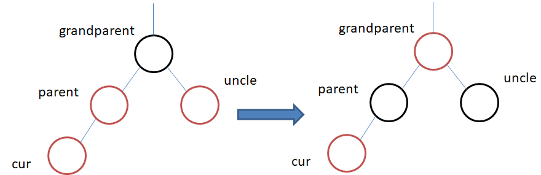

在这里插入图片描述

注意 ：grandparent节点不是根节点，但是当grandparent的上一个节点还是红节点的话，还得继续向上调整。

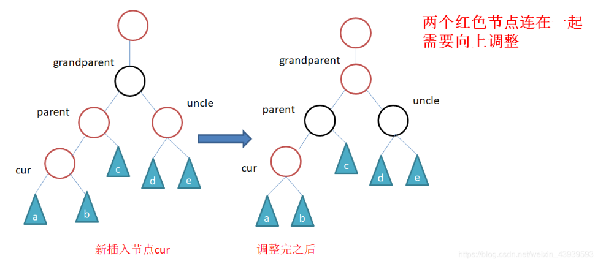
在这里插入图片描述

- 情况二：cur为红色，parent为红色，grandparent为黑色，uncle不存在/uncle为黑色

情况二的产生
根据uncle节点的有无，cur节点的又有两种不同的解释（解决的方案都一样，而且弄懂逻辑就很简单了）

当uncle节点不存在时，则cur一定是新插入的节点，因为每一条路径上的黑色节点个数要相同。

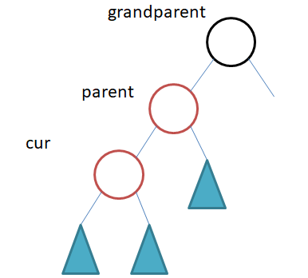

在这里插入图片描述

当uncle节点存在且黑为色是，cur节点的原来的颜色一定是为黑色的。红色的原因是cur的子树在调整的过程正将cur节点的颜色由黑色改为红色。

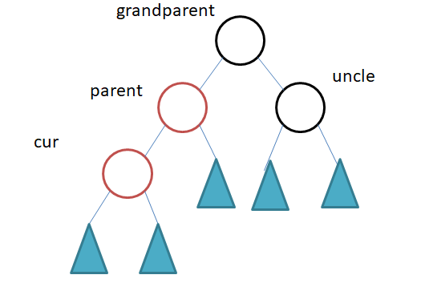

在这里插入图片描述
解决方法：
parent为grandparen的左孩子，cur为p的左孩子，则进行右单旋
parent为grandparent的右孩子，cur为p的右孩子，则进行左单旋
parent变成黑色
grandparent变为红色。

整体图解：

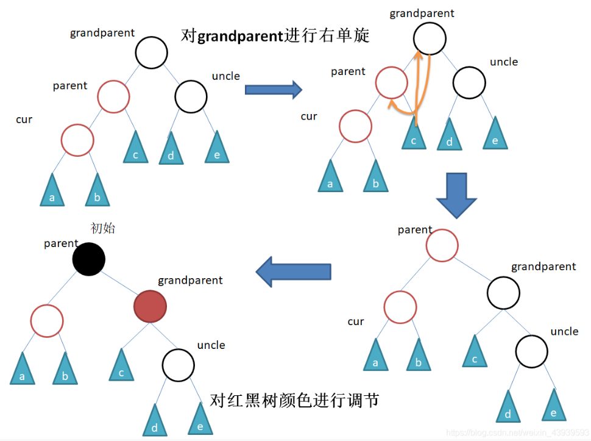
在这里插入图片描述

情况二判断旋转的方法：
在情况二中，我们可以看到

cur、parent、grandparent都是在一条线上的。
左边高，将左边压下来，所以进行右单旋。
右边高，将右边压下来，所以进行左单旋
例如：

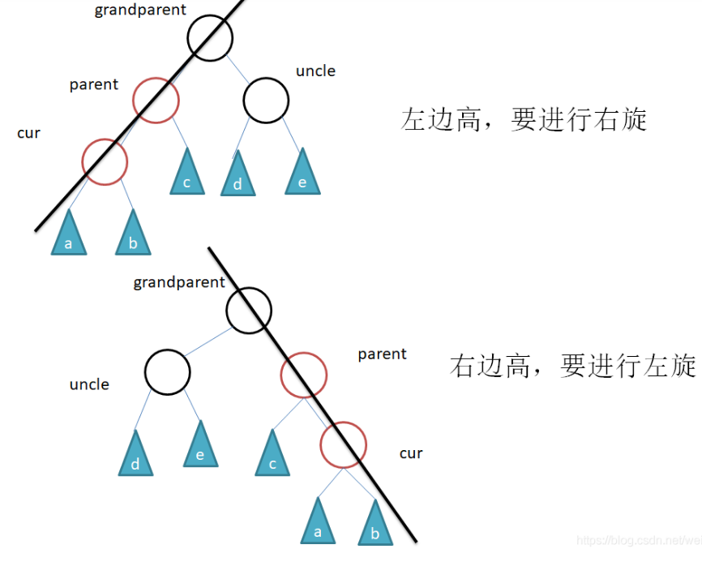

在这里插入图片描述

- 情况三：cur为红色，parent为红色，grandparent为黑色，uncle不存在/uncle为黑色
方法判断
情况三就是情况二的特例，只不过是cur、parent、grandparent三者不在同一条线上
我么就是通过将情况三转换到情况二做。

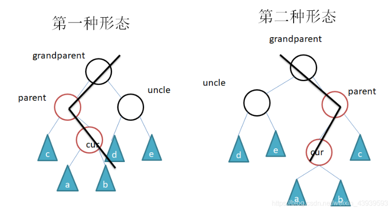

在这里插入图片描述

解决方法：

当parent为grandparent的左孩子时，cur为parent的右孩子，则对parent进行左单旋 (上图第一种形态）。
当parent为grandparent的右孩子时，cur为parent的左孩子，则对parent做右单旋（上图第二种形态）。
就转换到了情况二。 针对情况二的解法进行旋转，调节点颜色。
但是情况2还要进行一次旋转，所以就是下面总结的，直接调整完毕。 不是左右双旋 就是 右左双旋

其实就可以总结为： 情况三，直接进行两次旋转：

【左右双旋】当parent为grandparent的左孩子时，cur为parent的右孩子，对parent进行左单旋，得到情况二，再对grandfather进行右单旋
【右左双旋】当parent为grandparent的右孩子时，cur为parent的左孩子，则对parent做右单旋，得到情况二，再对grandfather进行左单旋

### 1.6、三种插入情况的总结

情况一：插入之后，将祖父节点改为红色之后，祖父节点不一定是根节点，有可能还得影响祖父的父亲节点，所以要循环处理
情况二：插入节点，调节颜色后，祖父节点是黑色，不会影响上面节点。而且每一条路径上黑色节点的数目是相同的，不需要向上循环处理
情况三：插入节点，进行左右双旋或者右左双旋之后，祖父节点是黑色，不会影响上面的节点，而且每一条路径上黑色节点相同，不需要向上循环处理

### 1.7、代码实现部分

有关右旋、左旋、和双旋的理解 在VAL树的旋转有讲解

```c++
#pragma once
#include <iostream>
using namespace std;

enum Colour
{
	BLACK,
	RED,
};

template <class T>
struct RBTreeNode
{
	RBTreeNode<T>* _left;
	RBTreeNode<T>* _right;
	RBTreeNode<T>* _parent;

	T _data;
	Colour _col;

	RBTreeNode(const T& data)
		:_left(nullptr)
		, _right(nullptr)
		, _parent(nullptr)
		, _data(data)
		, _col(RED)
	{}
};


template <class K, class V>
class RBTree
{
	typedef RBTreeNode<pair<K, V>> Node;
public:
	RBTree()
		:_root(nullptr)
	{}
	pair<Node*, bool> Insert(const pair<K, V>& kv)
	{
		if (_root == nullptr)
		{
			_root = new Node(kv);
			_root->_col = BLACK;
			return make_pair(_root, true);
		}

		Node* parent = nullptr;
		Node* cur = _root;
		while (cur)
		{
			if (cur->_data.first < kv.first)
			{
				parent = cur;
				cur = cur->_right;
			}
			else if (cur->_data.first > kv.first)
			{
				parent = cur;
				cur = cur->_left;
			}
			else
			{
				return make_pair(cur, false);
			}
		}

		Node* newnode = new Node(kv);
		cur = newnode;
		cur->_col = RED;

		
		if (parent->_data.first < kv.first)
		{
			parent->_right = cur;
			cur->_parent = parent;
		}
		else
		{
			parent->_left = cur;
			cur->_parent = parent;
		}

		//调整红黑树节点颜色
		while (parent && parent->_col == RED) //父亲节点存在 且父亲节点为红 开始调整节点颜色
		{
			//关键看叔叔
			Node* grandfather = parent->_parent;
			if (parent == grandfather->_left)         //如果插入节点cur的父亲节点是祖父的左节点， 那么叔叔节点肯定是祖父的右节点
			{
				Node* uncle = grandfather->_right;
				//情况一
				if (uncle && uncle->_col == RED)
				{
					parent->_col = uncle->_col = BLACK;
					grandfather->_col = RED;


					//向上调整
					cur = grandfather;
					parent = cur->_parent;
				}

				

				else //情况二 + 情况三  uncle不存在或者存在且为黑
				{
				//情况二
					//    g
					//  p
					//c
					if (cur == parent->_left) //grandfather 节点肯定为黑，因为parent节点一直为红
					{
					//右旋
						RotateR(grandfather);
						grandfather->_col = RED;
						parent->_col = BLACK;

					}
				// 情况三 左右双旋
					//    g
					//  p
					//    c
					else  //cur == parent->_right  双旋
					{
						RotateLR(grandfather);
						cur->_col = BLACK;
						grandfather->_col = RED;
					}
					//跳出循环
					break;

				}
			}
			else//如果插入节点cur在父节点的右边的
			{
				Node* uncle = grandfather->_left;  //叔叔节点是父节点的右边
				//情况一  uncle存在且为红
				if (uncle && uncle->_col == RED)
				{
					uncle->_col = parent->_col = BLACK;
					grandfather->_col = RED;

					cur = grandfather;
					parent = cur->_parent;
				}
				else 
				{	//旋转 + 变色   
					//uncle不存在 或 存在且为黑
					//情况二
					// g
					//    p
					//       cur
					if (cur == parent->_right) //单旋 左低右高 左单旋
					{
						RotateL(grandfather);
						parent->_col = BLACK;
						grandfather->_col = RED;
					}
					//情况三
					else  //cur插入在 parent->_left
					{
						// g
						//   p
						// c
						//右左双旋
						RotateRL(grandfather);
						cur->_col = BLACK;
						grandfather->_col = RED;
					}

					break;
				}
				
			}
		}
		_root->_col = BLACK;

		return make_pair(cur, true);
	}
	//左旋
	void RotateL(Node* parent)
	{
		Node* subR = parent->_right;
		Node* subRL = subR->_left;

		parent->_right = subRL;
		if (subRL)
			subRL->_parent = parent;

		Node* Pparent = parent->_parent;
		parent->_parent = subR;
		subR->_left = parent;
		

		if (_root == parent)
		{
			_root = subR;
			subR->_parent = NULL;
		}
		else
		{
			if (Pparent)
			{
				if (Pparent->_left == parent)
				{
					Pparent->_left = subR;
				}
				else
				{
					Pparent->_right = suR;
				}
			}
			subR->_parent = Pparent;
		}
		
		
	}

	void RotateR(Node* parent)
	{
		Node* subL = parent->_left;
		Node* subLR = subL->_right;

		parent->_left = subLR;
		if (subLR)
		{
			subLR->_parent = parent;
		}

		Node* Pparent = parent->_parent;
		subL->_right = parent;
		parent->_parent = subL;
	

		if (parent == _root) //根节点的情况
		{
			_root = subL;
			subL->_parent = nullptr;
		}
		else //非根节点的情况
		{
			if (Pparent->_left == parent)
			{
				Pparent->_left = subL;
			}
			else
			{
				Pparent->_right = subL;
			}
			subL->_parent = Pparent;
		}
		
	}
	void RotateRL(Node* parent) //右左双旋 
	{
		RotateR(parent->_right);
		RotateL(parent);
	}
	void RotateLR(Node* parent)
	{
		RotateL(parent->_left);
		RotateR(parent);
	}
private:
	Node* _root;
};
```

## 2、平衡二叉树

### 2.1、概念

平衡二叉树是基于二分法的策略提高数据的查找速度的二叉树的数据结构；

- 特点：

平衡二叉树是采用二分法思维把数据按规则组装成一个树形结构的数据，用这个树形结构的数据减少无关数据的检索，大大的提升了数据检索的速度；平衡二叉树的数据结构组装过程有以下规则：

（1）非叶子节点只能允许最多两个子节点存在。

（2）每一个非叶子节点数据分布规则为左边的子节点小当前节点的值，右边的子节点大于当前节点的值(这里值是基于自己的算法规则而定的，比如hash值)；

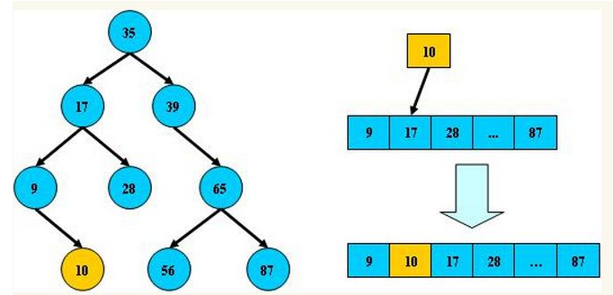


平衡二叉树又称为AVL树，是一种特殊的二叉排序树。其左右子树都是平衡二叉树，且左右子树高度之差的绝对值不超过1。
AVL树中所有结点为根的树的左右子树高度之差的绝对值不超过1。

将二叉树上结点的左子树深度减去右子树深度的值称为平衡因子BF，那么平衡二叉树上的所有结点的平衡因子只可能是-1、0和1。只要二叉树上有一个结点的平衡因子的绝对值大于1，则该二叉树就是不平衡的。


平衡树的层级结构：因为平衡二叉树查询性能和树的层级（h高度）成反比，h值越小查询越快、为了保证树的结构左右两端数据大致平衡降低二叉树的查询难度一般会采用一种算法机制实现节点数据结构的平衡，实现了这种算法的有比如Treap、红黑树，使用平衡二叉树能保证数据的左右两边的节点层级相差不会大于1.，通过这样避免树形结构由于删除增加变成线性链表影响查询效率，保证数据平衡的情况下查找数据的速度近于二分法查找；

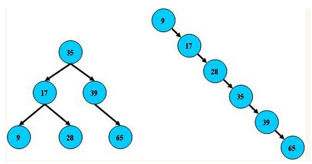

- 总结平衡二叉树特点：

（1）非叶子节点最多拥有两个子节点；
（2）非叶子节值大于左边子节点、小于右边子节点；
（3）树的左右两边的层级数相差不会大于1;
（4）没有值相等重复的节点;

## 3、B树(B-tree)

注意:之前有看到有很多文章把B树和B-tree理解成了两种不同类别的树，其实这两个是同一种树;

## 3.1、概念：

B树和平衡二叉树稍有不同的是B树属于多叉树又名平衡多路查找树（查找路径不只两个），数据库索引技术里大量使用者B树和B+树的数据结构，让我们来看看他有什么特点;

### 3.2、规则：

（1）排序方式：所有节点关键字是按递增次序排列，并遵循左小右大原则；
（2）子节点数：非叶节点的子节点数>1，且<=M ，且M>=2，空树除外（注：M阶代表一个树节点最多有多少个查找路径，M=M路,当M=2则是2叉树,M=3则是3叉）；
（3）关键字数：枝节点的关键字数量大于等于ceil(m/2)-1个且小于等于M-1个（注：ceil()是个朝正无穷方向取整的函数 如ceil(1.1)结果为2);
（4）所有叶子节点均在同一层、叶子节点除了包含了关键字和关键字记录的指针外也有指向其子节点的指针只不过其指针地址都为null对应下图最后一层节点的空格子;

最后我们用一个图和一个实际的例子来理解B树（这里为了理解方便我就直接用实际字母的大小来排列C>B>A）

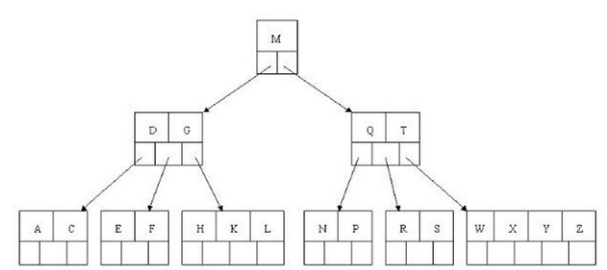

### 3.3、B树的查询流程


如上图我要从上图中找到E字母，查找流程如下

（1）获取根节点的关键字进行比较，当前根节点关键字为M，E<M（26个字母顺序），所以往找到指向左边的子节点（二分法规则，左小右大，左边放小于当前节点值的子节点、右边放大于当前节点值的子节点）；
（2）拿到关键字D和G，D<E<G 所以直接找到D和G中间的节点；
（3）拿到E和F，因为E=E 所以直接返回关键字和指针信息（如果树结构里面没有包含所要查找的节点则返回null）；

### 3.4、B树的插入节点流程

定义一个5阶树（平衡5路查找树;），现在我们要把3、8、31、11、23、29、50、28 这些数字构建出一个5阶树出来;

- 遵循规则：

（1）节点拆分规则：当前是要组成一个5路查找树，那么此时m=5,关键字数必须<=5-1（这里关键字数>4就要进行节点拆分）；
（2）排序规则：满足节点本身比左边节点大，比右边节点小的排序规则;

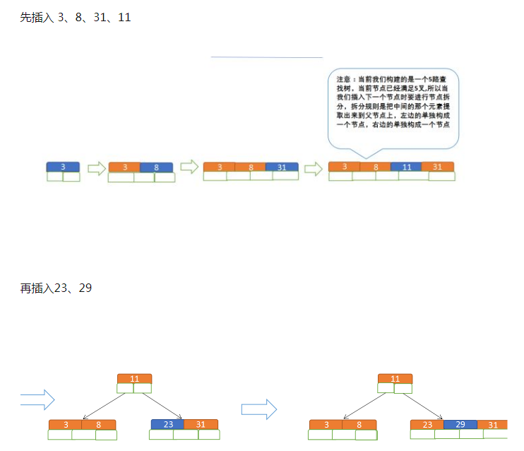
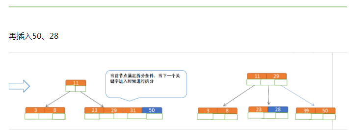


### 3.5、B树节点的删除

- 规则：

（1）节点合并规则：当前是要组成一个5路查找树，那么此时m=5,关键字数必须大于等于ceil（5/2）（这里关键字数<2就要进行节点合并）；
（2）满足节点本身比左边节点大，比右边节点小的排序规则;
（3）关键字数小于二时先从子节点取，子节点没有符合条件时就向向父节点取，取中间值往父节点放；

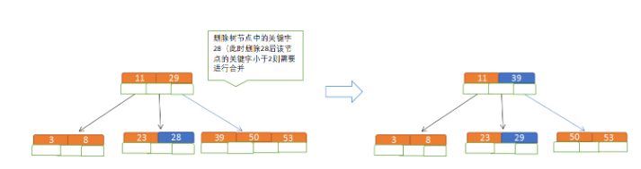

- 特点：

B树相对于平衡二叉树的不同是，每个节点包含的关键字增多了，特别是在B树应用到数据库中的时候，数据库充分利用了磁盘块的原理（磁盘数据存储是采用块的形式存储的，每个块的大小为4K，每次IO进行数据读取时，同一个磁盘块的数据可以一次性读取出来）把节点大小限制和充分使用在磁盘快大小范围；把树的节点关键字增多后树的层级比原来的二叉树少了，减少数据查找的次数和复杂度;

## 4、B+树

### 4.1、概念

B+树是B树的一个升级版，相对于B树来说B+树更充分的利用了节点的空间，让查询速度更加稳定，其速度完全接近于二分法查找。为什么说B+树查找的效率要比B树更高、更稳定；我们先看看两者的区别

- 规则

（1）B+跟B树不同B+树的非叶子节点不保存关键字记录的指针，只进行数据索引，这样使得B+树每个非叶子节点所能保存的关键字大大增加；
（2）B+树叶子节点保存了父节点的所有关键字记录的指针，所有数据地址必须要到叶子节点才能获取到。所以每次数据查询的次数都一样；
（3）B+树叶子节点的关键字从小到大有序排列，左边结尾数据都会保存右边节点开始数据的指针。
（4）非叶子节点的子节点数=关键字数（来源百度百科）（根据各种资料 这里有两种算法的实现方式，另一种为非叶节点的关键字数=子节点数-1（来源维基百科)，虽然他们数据排列结构不一样，但其原理还是一样的Mysql 的B+树是用第一种方式实现）;

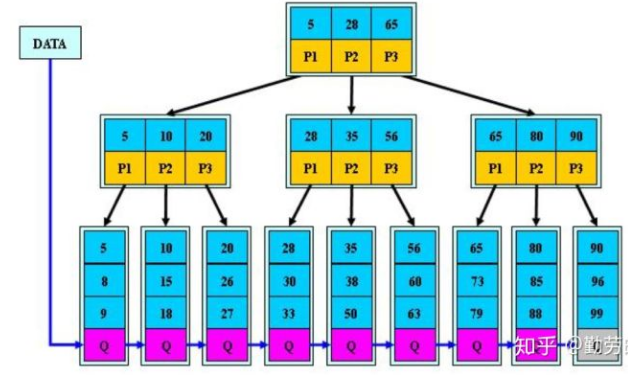
（百度百科算法结构示意图）

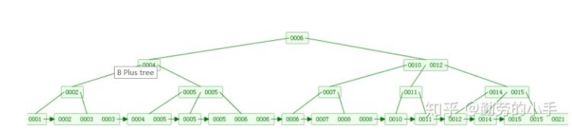
（维基百科算法结构示意图）

- 特点

1）B+树的层级更少：相较于B树B+每个非叶子节点存储的关键字数更多，树的层级更少所以查询数据更快；
2）B+树查询速度更稳定：B+所有关键字数据地址都存在叶子节点上，所以每次查找的次数都相同所以查询速度要比B树更稳定;
3）B+树天然具备排序功能：B+树所有的叶子节点数据构成了一个有序链表，在查询大小区间的数据时候更方便，数据紧密性很高，缓存的命中率也会比B树高。
4）B+树全节点遍历更快：B+树遍历整棵树只需要遍历所有的叶子节点即可，而不需要像B树一样需要对每一层进行遍历，这有利于数据库做全表扫描。

B树相对于B+树的优点是，如果经常访问的数据离根节点很近，而B树的非叶子节点本身存有关键字其数据的地址，所以这种数据检索的时候会要比B+树快。

## 5、B*树

- 规则

B*树是B+树的变种，相对于B+树他们的不同之处如下：

（1）首先是关键字个数限制问题，B+树初始化的关键字初始化个数是cei(m/2)，b*树的初始化个数为（cei(2/3*m)）

（2）B+树节点满时就会分裂，而B*树节点满时会检查兄弟节点是否满（因为每个节点都有指向兄弟的指针），如果兄弟节点未满则向兄弟节点转移关键字，如果兄弟节点已满，则从当前节点和兄弟节点各拿出1/3的数据创建一个新的节点出来；

- 特点

在B+树的基础上因其初始化的容量变大，使得节点空间使用率更高，而又存有兄弟节点的指针，可以向兄弟节点转移关键字的特性使得B*树额分解次数变得更少；

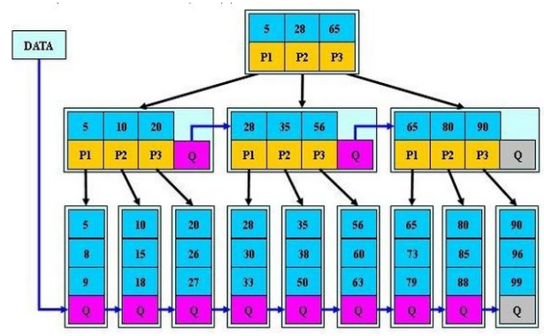

## 6、总结

1、相同思想和策略

从平衡二叉树、B树、B+树、B*树总体来看它们的贯彻的思想是相同的，都是采用**二分法和数据平衡**策略来提升查找数据的速度；

2、不同的方式的磁盘空间利用

不同点是他们一个一个在演变的过程中通过IO从磁盘读取数据的原理进行一步步的演变，每一次演变都是为了让节点的空间更合理的运用起来，从而使树的层级减少达到快速查找数据的目的；

