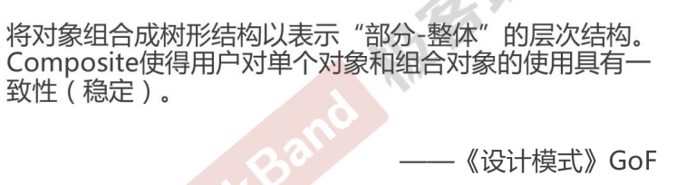
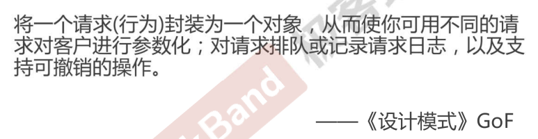

# c++设计模式

## 1、介绍

**课程目标**

* 理解松耦合设计思想

* 掌握面向对象设计原则

* 掌握重构技法改善设计

* 掌握GOF 核心设计模式


1. 什么是设计模式 

“每一个模式描述了一个在我们周围不断重复发生的问题，以及该问题的解决方案的核心。这样，你就能一次又一次

地使用该方案而不必做重复劳动”。——Christopher Alexander

2.  GOF 设计模式

• 历史性著作《设计模式：可复用面向对象软件的基础》一书中描述了23种经典面向对象设计模式，创立了模式在软件设计中的地位。

• 由于《设计模式》一书确定了设计模式的地位，通常所说的设计模式隐含地表示“面向对象设计模式”。但这并不意味“设计模式”就等于“面向对象设计模式”。

3. 从面向对象谈起

* 底层思维：向下，如何把握机器底层
   从微观理解对象构造
   • 语言构造
   • 编译转换
   • 内存模型
   • 运行时机制

* 抽象思维：向上，如何将我们的周围
   世界抽象为程序代码
   • 面向对象
   • 组件封装
   • 设计模式
   • 架构模式

4. 深入理解面向对象

* 向下：深入理解三大面向对象机制
• 封装，隐藏内部实现
• 继承，复用现有代码
• 多态，改写对象行为
* 向上：深刻把握面向对象机制所带来的抽象意义，理解如何用这些机制来表达现实世界，掌握什么是“好的面向对象设计”

5. 软件设计固有的复杂性
建筑商从来不会去想给一栋已建好的100层高的楼房底下再新修一个小地下室——这样做花费极大而且注定要失败。然而令人惊奇的是，软件系统的用户在要求作出类似改变时却不会仔细考虑，而且他们认为这只是需要简单编程的事。
——Object-Oriented Analysis and Design with Applications

6. 软件设计复杂的根本原因
变化
• 客户需求的变化
• 技术平台的变化
• 开发团队的变化
• 市场环境的变化
……

7. 如何解决复杂性？
    * 分解
        • 人们面对复杂性有一个常见的做法：即分而治之，将大问题分
        解为多个小问题，将复杂问题分解为多个简单问题。
    * 抽象
        • 更高层次来讲，人们处理复杂性有一个通用的技术，即抽象。
        由于不能掌握全部的复杂对象，我们选择忽视它的非本质细节，
        而去处理泛化和理想化了的对象模型。

8. 软件设计的目标

什么是好的软件设计？软件设计的金科玉律：
**复用！**

## 2、面向对象设计原则

1. 面向对象设计，为什么？
变化是复用的天敌！
面向对象设计最大的优势在于：
**抵御变化！**

2. 重新认识面向对象

* 理解隔离变化
• 从宏观层面来看，面向对象的构建方式更能适应软件的变化，能将变化所带来的影响减为最小
* 各司其职
• 从微观层面来看，面向对象的方式更强调各个类的“责任”
• 由于需求变化导致的新增类型不应该影响原来类型的实现——
是所谓各负其责
* 对象是什么？
• 从语言实现层面来看，对象封装了代码和数据。
• 从规格层面讲，对象是一系列可被使用的公共接口。
• 从概念层面讲，对象是某种拥有责任的抽象。

### 2.1 面向对象设计原则

1. 依赖倒置原则（Dependence Inversion Principle, DIP）--不稳定依赖稳定
• 高层模块(稳定)不应该依赖于低层模块(变化)，二者都应该依赖于抽象(稳定) 。 
• 抽象(稳定)不应该依赖于实现细节(变化) ，实现细节应该依赖于抽象(稳定)。

2. 开放封闭原则（Open Close Principle, OCP） 
• 对扩展开放，对更改封闭。
• 类模块应该是可扩展的，但是不可修改。

3. 单一职责原则（Single Resposibility Principle,SRP）批了， 
• 一个类应该仅有一个引起它变化的原因。 
• 变化的方向隐含着类的责任。

4. 里氏替换原则（Liskov  Sustitution Principle，LSP） 
• 子类必须能够替换它们的基类(IS-A)。
• 继承表达类型抽象

5. 接口隔离原则（Interface Isolation Principle,ISP） 
• 不应该强迫客户程序依赖它们不用的方法。
• 接口应该小而完备。

6. 优先使用对象组合，而不是类继承
• 类继承通常为“白箱复用”，对象组合(指针对象)通常为“黑箱复用”。 • 继承在某种程度上破坏了封装性，子类父类耦合度高。
• 而对象组合则只要求被组合的对象具有良好定义的接口，耦合度低。

7. 封装变化点
• 使用封装来创建对象之间的分界层，让设计者可以在分界层的一侧进行修改，而不会对另一侧产生不良的影响，从而实现层次间的松耦合。

8. 针对接口编程，而不是针对实现编程
• 不将变量类型声明为某个特定的具体类，而是声明为某个接口。 
• 客户程序无需获知对象的具体类型，只需要知道对象所具有的接口。 
• 减少系统中各部分的依赖关系，从而实现“高内聚、松耦合”的类型设计方案。

### 2.2 面向接口设计

产业强盛的标志
接口标准化!

1. 以史为鉴（1）
秦为什么能够统一六国？
据史书记载和考古发现,秦的兵器不论东西南北,出土地点都有统一的标准,包括剑, 戈,弩, 甚至弩机,弩体,箭头都是一样的. 而
其他六国则不是.

2. 以史为鉴（2）
毕升的活字印刷为什么成为四大发明，推动了人类文明的前进？
毕升之前的雕版印刷将字刻死在木板或石板上，每次印刷不同文章，要刻不同的版。而毕升发明的活字印刷首先在板上刻好字格,然后再刻单独的字模。印刷时，将活的字模“按需索取”放在字格中，不同的排列方法产生不同的文章，而不必重新刻版。

3. 将设计原则提升为设计经验
1） 设计习语 Design Idioms
• Design Idioms 描述与特定编程语言相关的低层模式，技巧，
惯用法。
2）设计模式 Design Patterns
• Design Patterns主要描述的是“类与相互通信的对象之间的组织关系，包括它们的角色、职责、协作方式等方面。
3）架构模式 Architectural Patterns
• Architectural Patterns描述系统中与基本结构组织关系密切的高层模式，包括子系统划分，职责，以及如何组织它们之间关系的规则。

## 3 GOF-23 模式分类

### 3.1 模式分类
* 从目的来看：
    • 创建型（Creational）模式：将对象的部分创建工作延迟到子类或者其他对象，从而应对需求变化为对象创建时具体类型实
    现引来的冲击。 
    • 结构型（Structural）模式：通过类继承或者对象组合获得更灵活的结构，从而应对需求变化为对象的结构带来的冲击。 • 行为型（Behavioral）模式：通过类继承或者对象组合来划分类与对象间的职责，从而应对需求变化为多个交互的对象带来
    的冲击。 
* 从范围来看：
    • 类模式处理类与子类的静态关系。
    • 对象模式处理对象间的动态关系。
* 从封装变化角度对模式分类
    * 组件协作：
        • Template Method
        • Observer / Event
        • Strategy
    * 单一职责：
        • Decorator
        • Bridge
    * 对象创建: 
        • Factory Method
        • Abstract Factory
        • Prototype
        • Builder
    * 对象性能：
        • Singleton
        • Flyweight
    * 接口隔离: 
        • Façade 
        • Proxy
        • Mediator
        • Adapter
    * 状态变化：
        • Memento
        • State
    * 数据结构：
        • Composite
        • Iterator
        • Chain of Resposibility
    * 行为变化：
        • Command
        • Visitor
    * 领域问题：
        • Interpreter

### 3.2 重构获得模式 Refactoring to Patterns

* 面向对象设计模式是“好的面向对象设计”，所谓“好的面向对
象设计”指是那些可以满足 **“应对变化，提高复用”**的设计 。 
* 现代软件设计的特征是“需求的频繁变化”。设计模式的要点是
“寻找变化点，然后在变化点处应用设计模式，从而来更好地应对
需求的变化”.“什么时候、什么地点应用设计模式”比“理解设
计模式结构本身”更为重要。
* 设计模式的应用不宜先入为主，一上来就使用设计模式是对设计模式的最大误用。没有一步到位的设计模式。敏捷软件开发实践提倡的“Refactoring to Patterns”是目前普遍公认的最好的使用设计模式的方法。

1. 重构关键技法
* 静态 --》 动态
* 早绑定 --》 晚绑定
* 继承 --》 组合
* 编译时依赖 --》 运行时依赖
* 紧耦合 --》 松耦合

2. “组件协作”模式: 
* 现代软件专业分工之后的第一个结果是“框架与应用程序的划
分”，“组件协作”模式通过晚期绑定，来实现框架与应用程序之
间的松耦合，是二者之间协作时常用的模式。
* 典型模式
• Template Method
• Observer / Event
• Strategy

### 4 Template Method 模式

### 4.1 设计流程

1. 结构化软件设计流程


2. 面向对象软件设计流程


3. 早绑定与晚绑定


**稳定：非虚函数**
**不稳定：虚函数**

### 4.2 模式定义
定义一个操作中的算法的骨架 (稳定)，而将一些步骤延迟
(变化)到子类中。Template Method使得子类可以不改变
(复用)一个算法的结构即可重定义(override 重写)该算法的
某些特定步骤。
——《设计模式》GoF

### 4.3 结构（Structure）


### 4.4 要点总结
* Template Method模式是一种非常基础性的设计模式，在面向对象系统中有着大量的应用。**它用最简洁的机制（虚函数的多态性）为很多应用程序框架提供了灵活的扩展点，是代码复用方面的基本实现结构。**
* 除了可以灵活应对子步骤的变化外，“不要调用我，让我来调用你”的反向控制结构是Template Method的典型应用。

### 4.5 代码

#### 4.5.1 底层思维

* template1_lib.cpp

```c++
class Library{
public:
	void Step1(){  
		//...
	}
    void Step3(){
		//...
    }
    void Step5(){
		//...
    }
};
```

* template1_app.cpp

```c++
class Application{
public:
	bool Step2(){  
		//...
    }
    void Step4(){
		//...
    }
};

int main()
{
	Library lib();
	Application app();

	lib.Step1();

	if (app.Step2()){
		lib.Step3();
	}

	for (int i = 0; i < 4; i++){
		app.Step4();
	}

	lib.Step5();

}
```

#### 4.5.2 template method

* template2_lib.cpp
```c++

class Library{
public:
    void Run(){        
        Step1();
        if (Step2()) { //变化 --》虚函数多态
            Step3(); 
        }
        for (int i = 0; i < 4; i++){
            Step4(); //变化 --》虚函数多态
        }
        Step5();
    }
	virtual ~Library(){ }

protected:	
	void Step1() {   //稳定
        //.....
    }
	void Step3() {  //稳定
        //.....
    }
	void Step5() {   //稳定
		//.....
	}

	virtual bool Step2() = 0;  //变化
    virtual void Step4() =0;  //变化
};
```

* template2_app.cpp
```c++
class Application : public Library {
protected:
	virtual bool Step2(){  //变化
		//... 
    }

    virtual void Step4() { //变化
		//... 
    }
};
int main()
	{
	    Library* pLib=new Application();
	    lib->Run();

		delete pLib;
	}
}
```

## 5、Strategy 策略模式

### 5.1 “组件协作”模式: 

现代软件专业分工之后的第一个结果是“框架与应用程序的划
分”，“组件协作”模式通过晚期绑定，来实现框架与应用程序之
间的松耦合，是二者之间协作时常用的模式。

* 典型模式
• Template Method
• Strategy
• Observer / Event

### 5.2 动机（Motivation）

* 在软件构建过程中，某些对象使用的**算法可能多种多样，经常改变，** 如果将这些算法都编码到对象中，将会使对象变得异常杂；而且有时候支持不使用的算法也是一个性能负担。

* 如何在运行时根据需要透明地更改对象的算法？将算法与对象本身解耦，从而避免上述问题？

### 5.3 模式定义
**定义一系列算法，把它们一个个封装起来，并且使它们可互相替换（变化）。** 该模式使得算法可独立于使用它的客户程序(稳定)而变化（扩展，子类化）。——《设计模式》GoF

### 5.4 结构（Structure）


### 5.5 要点总结

* Strategy及其子类为组件提供了一系列可重用的算法，从而可以使得类型在运行时方便地根据需要在各个算法之间进行切换。
* Strategy模式提供了用条件判断语句以外的另一种选择，消除条件判断语句，就是在解耦合。**含有许多条件判断语句的代码通常都需要Strategy模式。**
* 如果Strategy对象没有实例变量，那么各个上下文可以共享同一个Strategy对象，从而节省对象开销。

### 5.6 代码

#### 5.6.1 底层思维

* strategy1.cpp

```c++
enum TaxBase {
	CN_Tax,
	US_Tax,
	DE_Tax,
	FR_Tax       //新增加
};

class SalesOrder{
    TaxBase tax;
public:
    double CalculateTax(){
        //...
        
        if (tax == CN_Tax){
            //CN***********
        }
        else if (tax == US_Tax){
            //US***********
        }
        else if (tax == DE_Tax){
            //DE***********
        }
		else if (tax == FR_Tax){  //新增加
			//...
		}

        //....
     }
    
};
```

#### 5.6.2 strategy mode

* strategy2.cpp

```c++
class TaxStrategy{
public:
    virtual double Calculate(const Context& context)=0;
    virtual ~TaxStrategy(){}
};

//虚函数实现多态1
class CNTax : public TaxStrategy{
public:
    virtual double Calculate(const Context& context){
        //***********
    }
};

//虚函数实现多态2
class USTax : public TaxStrategy{
public:
    virtual double Calculate(const Context& context){
        //***********
    }
};
//虚函数实现多态3
class DETax : public TaxStrategy{
public:
    virtual double Calculate(const Context& context){
        //***********
    }
};

////虚函数实现多态4 --》新增加
class FRTax : public TaxStrategy{
public:
	virtual double Calculate(const Context& context){
		//.........
	}
};

class SalesOrder{
private:
    TaxStrategy* strategy;
public:
    SalesOrder(StrategyFactory* strategyFactory){
        this->strategy = strategyFactory->NewStrategy();
    }
    ~SalesOrder(){
        delete this->strategy;
    }

    public double CalculateTax(){
        //...
        Context context();
        
        double val = 
            strategy->Calculate(context); //新增加
        //...
    }
    
};
```

## 6、Observer 观察者模式

### 6.1 “组件协作”模式
 
* 现代软件专业分工之后的第一个结果是“框架与应用程序的划
分”，“组件协作”模式通过晚期绑定，来实现框架与应用程序之
间的松耦合，是二者之间协作时常用的模式。
* 典型模式
• Template Method
• Strategy
• Observer / Event

### 6.2 动机（Motivation） 

* 在软件构建过程中，我们需要为某些对象建立**一种“通知依赖关系”** ——一个对象（目标对象）的状态发生改变，所有的依赖对象（观察者对象）都将得到通知。如果这样的依赖关系过于紧密，将使软件不能很好地抵御变化。
* 使用面向对象技术，可以将这种依赖关系弱化，并形成一种稳定的依赖关系。从而实现软件体系结构的松耦合。

紧耦合 --》松耦合

### 6.3 模式定义

**定义对象间的一种一对多（变化）的依赖关系，** 以便当一个对象(Subject)的状态发生改变时，所有依赖于它的对象都
得到通知并自动更新。
——《设计模式》GoF

### 6.4 结构（Structure）


subject/observer为稳定
concreateSubject/ConcreteObserver为不稳定（变化）

### 6.5 要点总结

* 使用面向对象的抽象，Observer模式使得我们可以独立地改变目标与观察者，从而使二者之间的依赖关系达致松耦合。
* **目标发送通知时，无需指定观察者，通知（可以携带通知信息作为参数）会自动传播。**
* 观察者自己决定是否需要订阅通知，目标对象对此一无所知。
* Observer模式是基于事件的UI框架中非常常用的设计模式，也是MVC模式的一个重要组成部分。 

### 6.6 代码

#### 6.6.1 底层思维

* FileSplitter1.cpp
```c++
class FileSplitter
{
	string m_filePath;
	int m_fileNumber;
	ProgressBar* m_progressBar;

public:
	FileSplitter(const string& filePath, int fileNumber, ProgressBar* progressBar) :
		m_filePath(filePath), 
		m_fileNumber(fileNumber),
		m_progressBar(progressBar){

	}

	void split(){
		//1.读取大文件
		//2.分批次向小文件中写入
		for (int i = 0; i < m_fileNumber; i++){
			//...
			float progressValue = m_fileNumber;
			progressValue = (i + 1) / progressValue;
			m_progressBar->setValue(progressValue);
		}

	}
};
```

* MainForm1.cpp
```c++
class MainForm : public Form
{
	TextBox* txtFilePath;
	TextBox* txtFileNumber;
	ProgressBar* progressBar;

public:
	void Button1_Click(){

		string filePath = txtFilePath->getText();
		int number = atoi(txtFileNumber->getText().c_str());

		FileSplitter splitter(filePath, number, progressBar);

		splitter.split();

	}
};
```

#### 6.6.2 observer

* FileSplitter2.cpp
```c++
class IProgress{
public:
	virtual void DoProgress(float value)=0;
	virtual ~IProgress(){}
};

class FileSplitter
{
	string m_filePath;
	int m_fileNumber;
	List<IProgress*>  m_iprogressList; // 抽象通知机制，支持多个观察者
	
public:
	FileSplitter(const string& filePath, int fileNumber) :
		m_filePath(filePath), 
		m_fileNumber(fileNumber){

	}
	void split(){
		//1.读取大文件
		//2.分批次向小文件中写入
		for (int i = 0; i < m_fileNumber; i++){
			//...
			float progressValue = m_fileNumber;
			progressValue = (i + 1) / progressValue;
			onProgress(progressValue);//发送通知
		}
	}

	void addIProgress(IProgress* iprogress){
		m_iprogressList.push_back(iprogress);
	}

	void removeIProgress(IProgress* iprogress){
		m_iprogressList.remove(iprogress);
	}

protected:
	virtual void onProgress(float value){
		
		List<IProgress*>::iterator itor=m_iprogressList.begin();

		while (itor != m_iprogressList.end() )
			(*itor)->DoProgress(value); //更新进度条
			itor++;
		}
	}
};
```

* MainForm2.cpp
```c++
class MainForm : public Form, public IProgress
{
	TextBox* txtFilePath;
	TextBox* txtFileNumber;
	ProgressBar* progressBar;
public:
	void Button1_Click(){
		string filePath = txtFilePath->getText();
		int number = atoi(txtFileNumber->getText().c_str());
		ConsoleNotifier cn;
		FileSplitter splitter(filePath, number);
		splitter.addIProgress(this); //订阅通知
		splitter.addIProgress(&cn)； //订阅通知
		splitter.split();
		splitter.removeIProgress(this);
	}
	virtual void DoProgress(float value){
		progressBar->setValue(value);
	}
};

class ConsoleNotifier : public IProgress {
public:
	virtual void DoProgress(float value){
		cout << ".";
	}
};
```

## 7、Decorator 装饰模式

### 7.1 “单一职责”模式

* 在软件组件的设计中，如果责任划分的不清晰，使用继承得到的结果往往是随着需求的变化，子类急剧膨胀，同时充斥着重复代码，这时候的关键是划清责任。

* 典型模式
    • Decorator
    • Bridge

### 7.2  动机（Motivation） 

* 在某些情况下我们可能会 **“过度地使用继承来扩展对象的功能”，** 由于继承为类型引入的静态特质，使得这种扩展方式缺乏灵活性；并且随着子类的增多（扩展功能的增多），各种子类的组合（扩展功能的组合）会导致更多子类的膨胀。

* 如何使“对象功能的扩展”能够根据需要来动态地实现？同时避
免“扩展功能的增多”带来的子类膨胀问题？从而使得任何“功能
扩展变化”所导致的影响将为最低？

### 7.3 模式定义

**动态（组合）**地给一个对象增加一些额外的职责。就增加功
能而言，Decorator模式比生成子类（继承）更为灵活（消除重复代码 & 减少子类个数）。——《设计模式》GoF


### 7.4 结构（Structure）


红色：稳定
蓝色：不稳定（变化）

Component--stream
Decorator--fileStream/NetworkStream/MemoryStream
ConcreateComponent--DecoratorStream
ConcreateDecoratorA/ConcreateDecoratorB--cryptoStream/BufferedStream

### 7.5 要点总结

* **通过采用组合而非继承的手法**， Decorator模式实现了在运行时动态扩展对象功能的能力，而且可以根据需要扩展多个功能。避免了使用继承带来的“灵活性差”和“多子类衍生问题”。 
* Decorator类在接口上表现为is-a Component的继承关系，即 Decorator类继承了Component类所具有的接口。但在实现上又 表现为has-a Component的组合关系，即Decorator类又使用了 另外一个Component类。
* Decorator模式的目的并非解决“多子类衍生的多继承”问题， Decorator模式应用的要点在于解决“主体类在多个方向上的扩展功能”——是为“装饰”的含义。

### 7.6 代码
#### 7.6.1 底层思维

* decrator1.cpp

```c++
//1业务操作
class Stream{
public：
    virtual char Read(int number)=0;
    virtual void Seek(int position)=0;
    virtual void Write(char data)=0;  
    virtual ~Stream(){}
};

//2 主体类
//2.1 FileStream
class FileStream: public Stream{
public:
    virtual char Read(int number){
        //读文件流
    }
    virtual void Seek(int position){
        //定位文件流
    }
    virtual void Write(char data){
        //写文件流
    }
};

//2.2 NetworkStream
class NetworkStream :public Stream{
public:
    virtual char Read(int number){
        //读网络流
    }
    virtual void Seek(int position){
        //定位网络流
    }
    virtual void Write(char data){
        //写网络流
    }   
};
//2.3  MemoryStream
class MemoryStream :public Stream{
public:
    virtual char Read(int number){
        //读内存流
    }
    virtual void Seek(int position){
        //定位内存流
    }
    virtual void Write(char data){
        //写内存流
    }
    
};

//3 扩展操作
//3.1 CryptoFileStream
class CryptoFileStream :public FileStream{
public:
    virtual char Read(int number){
       
        //额外的加密操作...
        FileStream::Read(number);//读文件流
        
    }
    virtual void Seek(int position){
        //额外的加密操作...
        FileStream::Seek(position);//定位文件流
        //额外的加密操作...
    }
    virtual void Write(byte data){
        //额外的加密操作...
        FileStream::Write(data);//写文件流
        //额外的加密操作...
    }
};
//3.2 CryptoNetworkStream
class CryptoNetworkStream : :public NetworkStream{
public:
    virtual char Read(int number){
        
        //额外的加密操作...
        NetworkStream::Read(number);//读网络流
    }
    virtual void Seek(int position){
        //额外的加密操作...
        NetworkStream::Seek(position);//定位网络流
        //额外的加密操作...
    }
    virtual void Write(byte data){
        //额外的加密操作...
        NetworkStream::Write(data);//写网络流
        //额外的加密操作...
    }
};
//3.3 CryptoMemoryStream
class CryptoMemoryStream : public MemoryStream{
public:
    virtual char Read(int number){
        
        //额外的加密操作...
        MemoryStream::Read(number);//读内存流
    }
    virtual void Seek(int position){
        //额外的加密操作...
        MemoryStream::Seek(position);//定位内存流
        //额外的加密操作...
    }
    virtual void Write(byte data){
        //额外的加密操作...
        MemoryStream::Write(data);//写内存流
        //额外的加密操作...
    }
};
//3.4 BufferedFileStream
class BufferedFileStream : public FileStream{
    //...
};
//3.5 BufferedNetworkStream
class BufferedNetworkStream : public NetworkStream{
    //...
};
//3.6 BufferedMemoryStream
class BufferedMemoryStream : public MemoryStream{
    //...
}
//3.7 CryptoBufferedFileStream
class CryptoBufferedFileStream :public FileStream{
public:
    virtual char Read(int number){       
        //额外的加密操作...
        //额外的缓冲操作...
        FileStream::Read(number);//读文件流
    }
    virtual void Seek(int position){
        //额外的加密操作...
        //额外的缓冲操作...
        FileStream::Seek(position);//定位文件流
        //额外的加密操作...
        //额外的缓冲操作...
    }
    virtual void Write(byte data){
        //额外的加密操作...
        //额外的缓冲操作...
        FileStream::Write(data);//写文件流
        //额外的加密操作...
        //额外的缓冲操作...
    }
};

void Process(){
    //编译时装配
    CryptoFileStream *fs1 = new CryptoFileStream();

    BufferedFileStream *fs2 = new BufferedFileStream();

    CryptoBufferedFileStream *fs3 =new CryptoBufferedFileStream();

}
```

#### 7.6.2 decorator1

* decorator2.cpp

```c++
//1 业务操作
class Stream{
public：
    //1个变化
    virtual char Read(int number)=0;
    virtual void Seek(int position)=0;
    virtual void Write(char data)=0;
    virtual ~Stream(){}
};

//2 主体类
//2.1 FileStream
class FileStream: public Stream{
public:
    virtual char Read(int number){
        //读文件流
    }
    virtual void Seek(int position){
        //定位文件流
    }
    virtual void Write(char data){
        //写文件流
    }

};
//2.2 NetworkStream
class NetworkStream :public Stream{
public:
    virtual char Read(int number){
        //读网络流
    }
    virtual void Seek(int position){
        //定位网络流
    }
    virtual void Write(char data){
        //写网络流
    } 
};
//2.3 MemoryStream
class MemoryStream :public Stream{
public:
    virtual char Read(int number){
        //读内存流
    }
    virtual void Seek(int position){
        //定位内存流
    }
    virtual void Write(char data){
        //写内存流
    }
    
};

//3 扩展操作
//类继承用于实现基类的虚成员函数
//3.1 CryptoStream
class CryptoStream: public Stream {  
    Stream* stream;//初始化成员对象,实现对象组合
public:
    CryptoStream(Stream* stm):stream(stm){
    
    }
     
    virtual char Read(int number){   
        //额外的加密操作...
        stream->Read(number);//读文件流
    }
    virtual void Seek(int position){
        //额外的加密操作...
        stream::Seek(position);//定位文件流
        //额外的加密操作...
    }
    virtual void Write(byte data){
        //额外的加密操作...
        stream::Write(data);//写文件流
        //额外的加密操作...
    }
};
//3.2 BufferedStream
class BufferedStream : public Stream{   
    Stream* stream;//...
    
public:
    BufferedStream(Stream* stm):stream(stm){
        
    }
    //...
};

void Process(){
    //运行时装配
    FileStream* s1=new FileStream();
    CryptoStream* s2=new CryptoStream(s1); 
    BufferedStream* s3=new BufferedStream(s1);   
    BufferedStream* s4=new BufferedStream(s2);
}
```

#### 7.6.3 decorator2

* decorator3.cpp

```c++
//业务操作
class Stream{
public：
    virtual char Read(int number)=0;
    virtual void Seek(int position)=0;
    virtual void Write(char data)=0;  
    virtual ~Stream(){}
};

//主体类
class FileStream: public Stream{
public:
    virtual char Read(int number){
        //读文件流
    }
    virtual void Seek(int position){
        //定位文件流
    }
    virtual void Write(char data){
        //写文件流
    }

};

class NetworkStream :public Stream{
public:
    virtual char Read(int number){
        //读网络流
    }
    virtual void Seek(int position){
        //定位网络流
    }
    virtual void Write(char data){
        //写网络流
    }   
};

class MemoryStream :public Stream{
public:
    virtual char Read(int number){
        //读内存流
    }
    virtual void Seek(int position){
        //定位内存流
    }
    virtual void Write(char data){
        //写内存流
    }
    
};

//扩展操作
DecoratorStream: public Stream{
protected:
    Stream* stream;//...   
    DecoratorStream(Stream * stm):stream(stm){
    
    } 
};

class CryptoStream: public DecoratorStream {
public:
    CryptoStream(Stream* stm):DecoratorStream(stm){
    
    }    
    virtual char Read(int number){   
        //额外的加密操作...
        stream->Read(number);//读文件流
    }
    virtual void Seek(int position){
        //额外的加密操作...
        stream::Seek(position);//定位文件流
        //额外的加密操作...
    }
    virtual void Write(byte data){
        //额外的加密操作...
        stream::Write(data);//写文件流
        //额外的加密操作...
    }
};

class BufferedStream : public DecoratorStream{  
    Stream* stream;//...  
public:
    BufferedStream(Stream* stm):DecoratorStream(stm){
        
    }
    //...
};

void Process(){
    //运行时装配
    FileStream* s1=new FileStream();
    CryptoStream* s2=new CryptoStream(s1);
    BufferedStream* s3=new BufferedStream(s1);
    BufferedStream* s4=new BufferedStream(s2);
}
```

## 8、Bridge 桥模式
### 8.1 “单一职责”模式: 

* 在软件组件的设计中，如果责任划分的不清晰，使用继承得到的结果往往是随着需求的变化，子类急剧膨胀，同时充斥着重复代码，这时候的关键是划清责任。

* 典型模式
• Decorator
• Bridge

### 8.2 动机（Motivation） 

* 由于某些类型的固有的实现逻辑，使得它们具有两个变化的维度，乃至多个纬度的变化。
* 如何应对这种“多维度的变化”？如何利用面向对象技术来使得类型可以轻松地沿着两个乃至多个方向变化，而不引入额外的复杂度？

#### 8.3 模式定义

**将抽象部分(业务功能)与实现部分(平台实现)分离，使它们都可以独立地变化。**    ——《设计模式》GoF

### 8.4 结构（Structure）


红色为稳定，蓝色为不稳定（变化）。

### 8.5要点总结

* Bridge模式使用**“对象间的组合关系”**解耦了抽象和实现之间固 有的绑定关系，使得抽象和实现可以沿着各自的维度来变化。所谓抽象和实现沿着各自纬度的变化，即“子类化”它们。
* Bridge模式有时候类似于多继承方案，但是多继承方案往往违背 单一职责原则（即一个类只有一个变化的原因），复用性比较差。Bridge模式是比多继承方案更好的解决方法。
* Bridge模式的应用一般在“两个非常强的变化维度”，有时一个类也有多于两个的变化维度，这时可以使用Bridge的扩展模式。

### 8.6 代码
#### 8.6.1 底层思维

* bridge1.cpp

```c++
//1库：2个变化
class Messager{
public:
    //第一个变化
    virtual void Login(string username, string password)=0;
    virtual void SendMessage(string message)=0;
    virtual void SendPicture(Image image)=0;
    //第二个变化
    virtual void PlaySound()=0;
    virtual void DrawShape()=0;
    virtual void WriteText()=0;
    virtual void Connect()=0;
    
    virtual ~Messager(){}
};

//2实现
//2.1平台实现
class PCMessagerBase : public Messager{
public:  
    virtual void PlaySound(){
        //**********
    }
    virtual void DrawShape(){
        //**********
    }
    virtual void WriteText(){
        //**********
    }
    virtual void Connect(){
        //**********
    }
};
//2.2 手机实现
class MobileMessagerBase : public Messager{
public:
    
    virtual void PlaySound(){
        //==========
    }
    virtual void DrawShape(){
        //==========
    }
    virtual void WriteText(){
        //==========
    }
    virtual void Connect(){
        //==========
    }
};


//3业务抽象
//3.1 PC平台 PCMessagerLite
class PCMessagerLite : public PCMessagerBase {
public:
    
    virtual void Login(string username, string password){
        
        PCMessagerBase::Connect();
        //........
    }
    virtual void SendMessage(string message){
        
        PCMessagerBase::WriteText();
        //........
    }
    virtual void SendPicture(Image image){
        
        PCMessagerBase::DrawShape();
        //........
    }
};


//3.2 PC平台PCMessagerPerfect
class PCMessagerPerfect : public PCMessagerBase {
public:
    
    virtual void Login(string username, string password){
        
        PCMessagerBase::PlaySound();
        //********
        PCMessagerBase::Connect();
        //........
    }
    virtual void SendMessage(string message){
        
        PCMessagerBase::PlaySound();
        //********
        PCMessagerBase::WriteText();
        //........
    }
    virtual void SendPicture(Image image){
        
        PCMessagerBase::PlaySound();
        //********
        PCMessagerBase::DrawShape();
        //........
    }
};

//3.3 手机MobileMessagerLite
class MobileMessagerLite : public MobileMessagerBase {
public:
    
    virtual void Login(string username, string password){
        
        MobileMessagerBase::Connect();
        //........
    }
    virtual void SendMessage(string message){
        
        MobileMessagerBase::WriteText();
        //........
    }
    virtual void SendPicture(Image image){
        
        MobileMessagerBase::DrawShape();
        //........
    }
};

//3.4 手机 MobileMessagerPerfect
class MobileMessagerPerfect : public MobileMessagerBase {
public:
    
    virtual void Login(string username, string password){
        
        MobileMessagerBase::PlaySound();
        //********
        MobileMessagerBase::Connect();
        //........
    }
    virtual void SendMessage(string message){
        
        MobileMessagerBase::PlaySound();
        //********
        MobileMessagerBase::WriteText();
        //........
    }
    virtual void SendPicture(Image image){
        
        MobileMessagerBase::PlaySound();
        //********
        MobileMessagerBase::DrawShape();
        //........
    }
};


void Process(){
        //编译时装配
        Messager *m =
            new MobileMessagerPerfect();
}
```

#### 8.6.2 bridge

* bridge2.cpp

```c++
//1稳定
//1.1 抽象
class Messager{
protected:
    MessagerImp* messagerImp;// 对象组合：第一个变化类 + 第二个变化
public:
    //第一个变化
    virtual void Login(string username, string password)=0;
    virtual void SendMessage(string message)=0;
    virtual void SendPicture(Image image)=0;
    
    virtual ~Messager(){}
};

//1.2 实现
class MessagerImp{
public:
    //第二个变化
    virtual void PlaySound()=0;
    virtual void DrawShape()=0;
    virtual void WriteText()=0;
    virtual void Connect()=0;
    
    virtual MessagerImp(){}
};

//2 变化
//2.1 平台实现 n
class PCMessagerImp : public MessagerImp{
public:
    //
    virtual void PlaySound(){
        //**********
    }
    virtual void DrawShape(){
        //**********
    }
    virtual void WriteText(){
        //**********
    }
    virtual void Connect(){
        //**********
    }
};
//2.2 手机实现
class MobileMessagerImp : public MessagerImp{
public:
    
    virtual void PlaySound(){
        //==========
    }
    virtual void DrawShape(){
        //==========
    }
    virtual void WriteText(){
        //==========
    }
    virtual void Connect(){
        //==========
    }
};

//3 业务抽象 m
//类的数目：1+n+m
//3.1  MessagerLite
class MessagerLite :public Messager {  
public:
    
    virtual void Login(string username, string password){
        
        messagerImp->Connect();
        //........
    }
    virtual void SendMessage(string message){
        
        messagerImp->WriteText();
        //........
    }
    virtual void SendPicture(Image image){
        
        messagerImp->DrawShape();
        //........
    }
};

//3.2 MessagerPerfect
class MessagerPerfect  :public Messager {
public: 
    virtual void Login(string username, string password){     
        messagerImp->PlaySound();
        //********
        messagerImp->Connect();
        //........
    }
    virtual void SendMessage(string message){
        
        messagerImp->PlaySound();
        //********
        messagerImp->WriteText();
        //........
    }
    virtual void SendPicture(Image image){
        
        messagerImp->PlaySound();
        //********
        messagerImp->DrawShape();
        //........
    }
};

void Process(){
    //运行时装配
    MessagerImp* mImp=new PCMessagerImp();
    Messager *m =new Messager(mImp);
}
```

## 9、Factory Method工厂方法
### 9.1 “对象创建”模式

* 通过“对象创建” 模式绕开new，来避免对象创建（new）过程中所导致的紧耦合（依赖具体类），从而支持对象创建的稳定。它是接口抽象之后的第一步工作。
* 典型模式
    •Factory Method
    •Abstract Factory
    •Prototype
    •Builder
### 9.2 动机（Motivation）

* 在软件系统中，经常面临着创建对象的工作；**由于需求的变化，需要创建的对象的具体类型经常变化。**
* 如何应对这种变化？如何绕过常规的对象创建方法(new)，提供一种“封装机制”来避免客户程序和这种“具体对象创建工作”的紧耦合。

### 9.3 模式定义
定义一个用于创建对象的接口，让子类决定实例化哪一个类。
Factory Method使得一个类的实例化延迟（目的：解耦，
手段：虚函数）到子类。——《设计模式》Go

### 9.4 结构（Structure）


### 9.5 要点总结

* Factory Method模式用于隔离类对象的使用者和具体类型之间的 耦合关系。面对一个经常变化的具体类型，紧耦合关系(new)会导致软件的脆弱。
* Factory Method模式通过面向对象的手法，将所要创建的具体对 象工作延迟到子类，从而实现一种扩展（而非更改）的策略，较好地解决了这种紧耦合关系。
* **Factory Method模式解决“单个对象”的需求变化。缺点在于要求创建方法/参数相同。**

### 9.6 代码
#### 9.6.1 底层思维

* FileSplitter1.cpp
```c++
class ISplitter{
public:
    virtual void split()=0;
    virtual ~ISplitter(){}
};

class BinarySplitter : public ISplitter{
    
};

class TxtSplitter: public ISplitter{
    
};

class PictureSplitter: public ISplitter{
    
};

class VideoSplitter: public ISplitter{
    
};
```

* MainForm1.cpp

```c++
class MainForm : public Form
{
	TextBox* txtFilePath;
	TextBox* txtFileNumber;
	ProgressBar* progressBar;

public:
	void Button1_Click(){      
		ISplitter * splitter=
            new BinarySplitter();//依赖具体类       
        splitter->split();
	}
};
```

#### 9.6.2 factory method

* ISplitterFactory.cpp
```c++
//抽象类
class ISplitter{
public:
    virtual void split()=0;
    virtual ~ISplitter(){}
};
//工厂基类
class SplitterFactory{
public:
    virtual ISplitter* CreateSplitter()=0;
    virtual ~SplitterFactory(){}
};
```

* FileSplitter2.cpp
```c++
//具体类
class BinarySplitter : public ISplitter{
    
};
class TxtSplitter: public ISplitter{
    
};
class PictureSplitter: public ISplitter{
    
};
class VideoSplitter: public ISplitter{
    
};
//具体工厂
class BinarySplitterFactory: public SplitterFactory{
public:
    virtual ISplitter* CreateSplitter(){
        return new BinarySplitter();
    }
};

class TxtSplitterFactory: public SplitterFactory{
public:
    virtual ISplitter* CreateSplitter(){
        return new TxtSplitter();
    }
};

class PictureSplitterFactory: public SplitterFactory{
public:
    virtual ISplitter* CreateSplitter(){
        return new PictureSplitter();
    }
};

class VideoSplitterFactory: public SplitterFactory{
public:
    virtual ISplitter* CreateSplitter(){
        return new VideoSplitter();
    }
};
```

* MainForm2.cpp
```c++
class MainForm : public Form
{
    SplitterFactory*  factory;//工厂
public:
    MainForm(SplitterFactory*  factory){
        this->factory=factory;
    }
	void Button1_Click(){     
		ISplitter * splitter=
            factory->CreateSplitter(); //多态new      
        splitter->split();
	}
};
```
抽象类不依赖细节，可以依赖抽象类。

## 10、Abstract Factory 抽象工厂

可以称为家族工厂

### 10.1 “对象创建”模式

* 通过“对象创建” 模式绕开new，来避免对象创建（new）过程中所导致的紧耦合（依赖具体类），从而支持对象创建的稳定。它是接口抽象之后的第一步工作。
* 典型模式
    •Factory Method
    •Abstract Factory
    •Prototype
    •Builder

### 10.2 动机（Motivation） 

* 在软件系统中，经常面临着 **“一系列相互依赖的对象”** 的创建工作；同时，由于需求的变化，往往存在更多系列对象的创建工作。
* 如何应对这种变化？如何绕过常规的对象创建方法(new)，提供一种“封装机制”来避免客户程序和这种“多系列具体对象创建工作”的紧耦合？

### 10.3 模式定义

提供一个接口，让该接口负责创建一系列“相关或者相互依
赖的对象”，无需指定它们具体的类。——《设计模式》GoF

### 10.4 结构（Structure）


### 10.5 要点总结

* 如果没有应对“多系列对象构建”的需求变化，则没有必要使用Abstract Factory模式，这时候使用简单的工厂完全可以。
* “系列对象”指的是在某一特定系列下的对象之间有相互依赖、或作用的关系。不同系列的对象之间不能相互依赖。
* Abstract Factory模式主要在于应对“新系列”的需求变动。其缺点在于难以应对“新对象”的需求变动。

### 10.6 代码
#### 10.6.1 底层思维

* EmployeeDAO1.cpp
```c++
class EmployeeDAO{
    
public:
    vector<EmployeeDO> GetEmployees(){
        SqlConnection* connection =
            new SqlConnection();
        connection->ConnectionString = "...";

        SqlCommand* command =
            new SqlCommand();
        command->CommandText="...";
        command->SetConnection(connection);

        SqlDataReader* reader = command->ExecuteReader();
        while (reader->Read()){

        }

    }
};
```

#### 10.6.2  factory method

* EmployeeDAO1.cpp
```c++
//1数据库访问有关的基类
class IDBConnection{
    
};
class IDBConnectionFactory{
public:
    virtual IDBConnection* CreateDBConnection()=0;
};


class IDBCommand{
    
};
class IDBCommandFactory{
public:
    virtual IDBCommand* CreateDBCommand()=0;
};


class IDataReader{
    
};
class IDataReaderFactory{
public:
    virtual IDataReader* CreateDataReader()=0;
};


//2 支持SQL Server
class SqlConnection: public IDBConnection{
    
};
class SqlConnectionFactory:public IDBConnectionFactory{
    
};

class SqlCommand: public IDBCommand{
    
};
class SqlCommandFactory:public IDBCommandFactory{
    
};

class SqlDataReader: public IDataReader{
    
};
class SqlDataReaderFactory:public IDataReaderFactory{
    
};

//3 支持Oracle
class OracleConnection: public IDBConnection{
    
};

class OracleCommand: public IDBCommand{
    
};

class OracleDataReader: public IDataReader{
    
};
//4 
class EmployeeDAO{
    IDBConnectionFactory* dbConnectionFactory;
    IDBCommandFactory* dbCommandFactory;
    IDataReaderFactory* dataReaderFactory;  
public:
    vector<EmployeeDO> GetEmployees(){
        IDBConnection* connection =
            dbConnectionFactory->CreateDBConnection();
        connection->ConnectionString("...");
        IDBCommand* command =
            dbCommandFactory->CreateDBCommand();
        command->CommandText("...");
        command->SetConnection(connection); //关联性
        IDBDataReader* reader = command->ExecuteReader(); //关联性
        while (reader->Read()){
        }
    }
};
```

#### 10.6.3 absractor factory

* EmployeeDAO3.cpp
```c++
//数据库访问有关的基类
class IDBConnection{
    
};

class IDBCommand{
    
};

class IDataReader{
    
};

class IDBFactory{
public:
    virtual IDBConnection* CreateDBConnection()=0;
    virtual IDBCommand* CreateDBCommand()=0;
    virtual IDataReader* CreateDataReader()=0; 
};

//支持SQL Server
class SqlConnection: public IDBConnection{
    
};
class SqlCommand: public IDBCommand{
    
};
class SqlDataReader: public IDataReader{
    
};


class SqlDBFactory:public IDBFactory{
public:
    virtual IDBConnection* CreateDBConnection()=0;
    virtual IDBCommand* CreateDBCommand()=0;
    virtual IDataReader* CreateDataReader()=0;
 
};

//支持Oracle
class OracleConnection: public IDBConnection{
    
};

class OracleCommand: public IDBCommand{
    
};

class OracleDataReader: public IDataReader{
    
};

class EmployeeDAO{
    IDBFactory* dbFactory;
public:
    vector<EmployeeDO> GetEmployees(){
        IDBConnection* connection =
            dbFactory->CreateDBConnection();
        connection->ConnectionString("...");

        IDBCommand* command =
            dbFactory->CreateDBCommand();
        command->CommandText("...");
        command->SetConnection(connection); //关联性

        IDBDataReader* reader = command->ExecuteReader(); //关联性
        while (reader->Read()){

        }

    }
};
```


## 11、prototype 原型
### 11.1 “对象创建”模式

* 通过“对象创建” 模式绕开new，来避免对象创建（new）过程中所导致的紧耦合（依赖具体类），从而支持对象创建的稳定。它是接口抽象之后的第一步工作。
* 典型模式
    •Factory Method
    •Abstract Factory
    •Prototype
    •Builder

### 11.2 动机（Motivation）


### 11.3 模式定义


### 11.4 结构


### 11.5 总结


### 11.6 代码
#### 11.6.1 prototype

* Prototype.cpp
```c++
//抽象类
class ISplitter{
public:
    virtual void split()=0;
    virtual ISplitter* clone()=0; //通过克隆自己来创建对象
    virtual ~ISplitter(){}

};
```

* ConcretePrototype.cpp
```c++
//具体类
class BinarySplitter : public ISplitter{
public:
    virtual ISplitter* clone(){
        return new BinarySplitter(*this);
    }
};

class TxtSplitter: public ISplitter{
public:
    virtual ISplitter* clone(){
        return new TxtSplitter(*this);
    }
};

class PictureSplitter: public ISplitter{
public:
    virtual ISplitter* clone(){
        return new PictureSplitter(*this);
    }
};

class VideoSplitter: public ISplitter{
public:
    virtual ISplitter* clone(){
        return new VideoSplitter(*this);
    }
};
```


* client.cpp
```c++
class MainForm : public Form
{
    ISplitter*  prototype;//原型对象

public:
    
    MainForm(ISplitter*  prototype){
        this->prototype=prototype;
    }
    
	void Button1_Click(){

		ISplitter * splitter=
            prototype->clone(); //克隆原型
        
        splitter->split();
	}
};
```

## 12、Builder 构建器
### 12.1 “对象创建”模式

* 通过“对象创建” 模式绕开new，来避免对象创建（new）过程中所导致的紧耦合（依赖具体类），从而支持对象创建的稳定。它是接口抽象之后的第一步工作。
* 典型模式
    •Factory Method
    •Abstract Factory
    •Prototype
    •Builder

### 12.2 动机（Motivation）

* 在软件系统中，有时候面临着 **“一个复杂对象”** 的创建工作，其通常由各个部分的子对象用一定的算法构成；由于需求的变化，这个复杂对象的各个部分经常面临着剧烈的变化，但是将它们组合在一起的算法却相对稳定。
* 如何应对这种变化？如何提供一种“封装机制”来隔离出“复杂
对象的各个部分”的变化，从而保持系统中的“稳定构建算法”不
随着需求改变而改变？

### 12.3 模式定义

将一个复杂对象的构建与其表示相分离，使得同样的构建过程(稳定)可以创建不同的表示(变化)。——《设计模式》GoF

### 12.4 结构（Structure）


### 12.5 要点总结

* Builder 模式主要用于“分步骤构建一个复杂的对象”。在这其中“分步骤”是一个稳定的算法，而复杂对象的各个部分则经常变化。
* 变化点在哪里，封装哪里—— Builder模式主要在于应对“复杂对象各个部分”的频繁需求变动。其缺点在于难以应对“分步骤构建算法”的需求变动。
* 在Builder模式中，要注意不同语言中构造器内调用虚函数的差别（C++ vs. C#) 。

### 12.6 代码
#### 12.6.1 builder

* builder.cpp
```c++
//1 稳定
//1.1 director
class House{
    //....
};
//1.2 builder
class HouseBuilder {
public:
    House* GetResult(){
        return pHouse;
    }
    virtual ~HouseBuilder(){}
protected:   
    House* pHouse;
	virtual void BuildPart1()=0;
    virtual void BuildPart2()=0;
    virtual void BuildPart3()=0;
    virtual void BuildPart4()=0;
    virtual void BuildPart5()=0;	
};

//2 变化
//2.1 
class StoneHouse: public House{
    
};
//2.2 concreateBuilder
class StoneHouseBuilder: public HouseBuilder{
protected:
    
    virtual void BuildPart1(){
        //pHouse->Part1 = ...;
    }
    virtual void BuildPart2(){
        
    }
    virtual void BuildPart3(){
        
    }
    virtual void BuildPart4(){
        
    }
    virtual void BuildPart5(){
        
    }
};

class HouseDirector{
public:
    HouseBuilder* pHouseBuilder;   
    HouseDirector(HouseBuilder* pHouseBuilder){
        this->pHouseBuilder=pHouseBuilder;
    }
    
    House* Construct(){     
        pHouseBuilder->BuildPart1();     
        for (int i = 0; i < 4; i++){
            pHouseBuilder->BuildPart2();
        }       
        bool flag=pHouseBuilder->BuildPart3();     
        if(flag){
            pHouseBuilder->BuildPart4();
        }       
        pHouseBuilder->BuildPart5();    
        return pHouseBuilder->GetResult();
    }
};
```
## 13 singleton单件模式
### 13.1 “对象性能”模式


### 13.2 动机（Motivation）


### 13.3 模式定义


### 13.4 结构（Structure）


### 13.5 要点总结


### 13.6 代码

* singleton.cpp
```c++


class Singleton{
private:
    Singleton();
    Singleton(const Singleton& other);
public:
    static Singleton* getInstance();
    static Singleton* m_instance;
};

Singleton* Singleton::m_instance=nullptr;

//线程非安全版本
Singleton* Singleton::getInstance() {
    if (m_instance == nullptr) {
        m_instance = new Singleton();
    }
    return m_instance;
}

//多线程：线程安全版本，但锁的代价过高
Singleton* Singleton::getInstance() {
    Lock lock;
    if (m_instance == nullptr) {
        m_instance = new Singleton();
    }
    return m_instance;
}

//多线程：双检查锁，但由于内存读写reorder不安全(目前不使用)
/*
假定步骤：先分配内存，再构造器，最后赋值m_instance；
reorder步骤（cpu）：先分配内存，再赋值m_instance，最后构造器。
*/
Singleton* Singleton::getInstance() {
    
    if(m_instance==nullptr){
        Lock lock;
        if (m_instance == nullptr) {
            m_instance = new Singleton();
        }
    }
    return m_instance;
}

//C++ 11版本之后的跨平台实现 (volatile)
std::atomic<Singleton*> Singleton::m_instance;
std::mutex Singleton::m_mutex;

Singleton* Singleton::getInstance() {
    Singleton* tmp = m_instance.load(std::memory_order_relaxed);
    std::atomic_thread_fence(std::memory_order_acquire);//获取内存fence
    if (tmp == nullptr) {
        std::lock_guard<std::mutex> lock(m_mutex);
        tmp = m_instance.load(std::memory_order_relaxed);
        if (tmp == nullptr) {
            tmp = new Singleton;
            std::atomic_thread_fence(std::memory_order_release);//释放内存fence
            m_instance.store(tmp, std::memory_order_relaxed);
        }
    }
    return tmp;
}
```

## 14、flyweight享元模式
### 14.1 “对象性能”模式


### 14.2 动机（Motivation）


### 14.3 模式定义


### 13.4 结构（Structure）


### 14.5 要点总结


### 14.6 代码
#### 14.6.1 flyweight 共享模式

* flyweight
```c++
class Font {
private:
    //unique object key
    string key;  
    //object state
    //.... 
public:
    Font(const string& key){
        //...
    }
};

class FontFactory{
private:
    map<string,Font* > fontPool;  
public:
    Font* GetFont(const string& key){
        map<string,Font*>::iterator item=fontPool.find(key);     
        if(item!=footPool.end()){
            return fontPool[key];
        }
        else{
            Font* font = new Font(key);
            fontPool[key]= font;
            return font;
        }
    } 
    void clear(){
        //...
    }
};
```

## 15、Facade 门面模式
### 15.1  “间接隔离”模式


### 15.2 动机（Motivation）


### 15.3 模式定义


### 15.4 结构（Structure）


### 15.5 要点总结


### 15.6 代码
#### 15.6.1 flyweight 共享模式

* flyweight.cpp
```c++
class Font {
private:

    //unique object key
    string key;
    
    //object state
    //....
    
public:
    Font(const string& key){
        //...
    }
};

class FontFactory{
private:
    map<string,Font* > fontPool;
    
public:
    Font* GetFont(const string& key){

        map<string,Font*>::iterator item=fontPool.find(key);
        
        if(item!=footPool.end()){
            return fontPool[key];
        }
        else{
            Font* font = new Font(key);
            fontPool[key]= font;
            return font;
        }

    }
    
    void clear(){
        //...
    }
};
```

## 16、proxy代理模式
### 16.1  “间接隔离”模式


### 16.2 动机（Motivation）


### 16.3 模式定义


### 16.4 结构（Structure）


### 16.5 要点总结


### 16.6 代码
#### 16.6.1 底层思维

* client.cpp
```c++
class ISubject{
public:
    virtual void process();
};

class RealSubject: public ISubject{
public:
    virtual void process(){
        //....
    }
};

class ClientApp{ 
    ISubject* subject;
public:
    ClientApp(){
        subject=new RealSubject();
    } 
    void DoTask(){
        //...
        subject->process();
        
        //....
    }
};
```

#### 16.6.2 proxy代理模式

* proxy.cpp
```c++
class ISubject{
public:
    virtual void process();
};

//Proxy的设计
class SubjectProxy: public ISubject{ 
public:
    virtual void process(){
        //对RealSubject的一种间接访问
        //....
    }
};

class ClientApp{ 
    ISubject* subject; 
public:
    ClientApp(){
        subject=new SubjectProxy();
    }
    
    void DoTask(){
        //...
        subject->process();       
        //....
    }
};
```

## 17、adpater适配器

### 17.1  “间接隔离”模式


### 17.2 动机（Motivation）


### 17.3 模式定义


### 17.4 结构（Structure）


### 17.5 要点总结


### 17.6 代码

#### 17.6.1 adapter

```c++
//目标接口（新接口）
class ITarget{
public:
    virtual void process()=0;
};

//遗留接口（老接口）
class IAdaptee{
public:
    virtual void foo(int data)=0;
    virtual int bar()=0;
};

//遗留类型
class OldClass: public IAdaptee{
    //....
};

//对象适配器
class Adapter: public ITarget{ //继承
protected:
    IAdaptee* pAdaptee;//组合
public:
    Adapter(IAdaptee* pAdaptee){
        this->pAdaptee=pAdaptee;
    }
    
    virtual void process(){
        int data=pAdaptee->bar();
        pAdaptee->foo(data);      
    } 
};

//类适配器:这种不适用
class Adapter: public ITarget,
               protected OldClass{ //多继承              
}

int main(){
    IAdaptee* pAdaptee=new OldClass(); 
    ITarget* pTarget=new Adapter(pAdaptee);
    pTarget->process();  
}

class stack{
    deqeue container;   
};

class queue{
    deqeue container;  
};
```

## 18、media 中介者

### 18.1  “间接隔离”模式


### 18.2 动机（Motivation）


### 18.3 模式定义


### 18.4 结构（Structure）


### 18.5 要点总结


## 19 state 状态模式

### 19.1 状态变化


### 19.2 动机（Motivation）


### 19.3 模式定义


### 19.4 结构（Structure）


### 19.5 要点总结


### 19.6 代码

#### 19.6.1 底层思维

* state1.cpp

```c++
enum NetworkState
{
    Network_Open,
    Network_Close,
    Network_Connect,
};

class NetworkProcessor{  
    NetworkState state;
public:   
    void Operation1(){
        if (state == Network_Open){
            //**********
            state = Network_Close;
        }
        else if (state == Network_Close){
            //..........
            state = Network_Connect;
        }
        else if (state == Network_Connect){
            //$$$$$$$$$$
            state = Network_Open;
        }
    }

    public void Operation2(){
        if (state == Network_Open){           
            //**********
            state = Network_Connect;
        }
        else if (state == Network_Close){
            //.....
            state = Network_Open;
        }
        else if (state == Network_Connect){
            //$$$$$$$$$$
            state = Network_Close;
        } 
    }

    public void Operation3(){

    }
};
```

#### 19.6.2 state 状态模式

与strategy模式类似

* state2.cpp

```c++
class NetworkState{
public:
    NetworkState* pNext;
    virtual void Operation1()=0;
    virtual void Operation2()=0;
    virtual void Operation3()=0;

    virtual ~NetworkState(){}
};


class OpenState :public NetworkState{
    static NetworkState* m_instance;
public:
    static NetworkState* getInstance(){
        if (m_instance == nullptr) {
            m_instance = new OpenState();
        }
        return m_instance;
    }

    void Operation1(){       
        //**********
        pNext = CloseState::getInstance();
    }
    
    void Operation2(){      
        //..........
        pNext = ConnectState::getInstance();
    }
    
    void Operation3(){     
        //$$$$$$$$$$
        pNext = OpenState::getInstance();
    }    
};

class CloseState:public NetworkState{ }
//...

class NetworkProcessor{ 
    NetworkState* pState; 
public:   
    NetworkProcessor(NetworkState* pState) {
        this->pState = pState;
    }
    
    void Operation1(){
        //...
        pState->Operation1();
        pState = pState->pNext;
        //...
    }
    
    void Operation2(){
        //...
        pState->Operation2();
        pState = pState->pNext;
        //...
    }
    
    void Operation3(){
        //...
        pState->Operation3();
        pState = pState->pNext;
        //...
    }

};
```

## 20、memento 备忘录

### 20.1 状态变化


### 20.2 动机（Motivation）


### 20.3 模式定义


### 20.4 结构（Structure）


### 20.5 要点总结


### 20.6 代码

#### 20.6.1 memento 备忘录

* memento.cpp

```c++
class Memento
{
    string state;
    //..
public:
    Memento(const string & s) : state(s) {}
    string getState() const { return state; }
    void setState(const string & s) { state = s; }
};

class Originator
{
    string state;
    //....
public:
    Originator() {}
    Memento createMomento() {
        Memento m(state);
        return m;
    }
    void setMomento(const Memento & m) {
        state = m.getState();
    }
};

int main()
{
    Originator orginator;   
    //捕获对象状态，存储到备忘录
    Memento mem = orginator.createMomento(); 
    //... 改变orginator状态  
    //从备忘录中恢复
    orginator.setMomento(memento);  
}
```

## 21、composite 组合模式

### 21.1 “数据结构”模式


### 21.2 动机（Motivation）


### 21.3 模式定义



### 21.4 结构（Structure）


### 21.5 要点总结


### 21.6 代码

#### 21.6.1 composite 组合模式

* composite.cpp

```c++
#include <iostream>
#include <list>
#include <string>
#include <algorithm>

using namespace std;

class Component
{
public:
    virtual void process() = 0;
    virtual ~Component(){}
};

//树节点
class Composite : public Component{   
    string name;
    list<Component*> elements;
public:
    Composite(const string & s) : name(s) {}  
    void add(Component* element) {
        elements.push_back(element);
    }
    void remove(Component* element){
        elements.remove(element);
    }
    
    void process(){    
        //1. process current node    
        //2. process leaf nodes
        for (auto &e : elements)
            e->process(); //多态调用       
    }
};

//叶子节点
class Leaf : public Component{
    string name;
public:
    Leaf(string s) : name(s) {}      
    void process(){
        //process current node
    }
};


void Invoke(Component & c){
    //...
    c.process();
    //...
}

int main()
{
    Composite root("root");
    Composite treeNode1("treeNode1");
    Composite treeNode2("treeNode2");
    Composite treeNode3("treeNode3");
    Composite treeNode4("treeNode4");
    Leaf leat1("left1");
    Leaf leat2("left2");
    
    root.add(&treeNode1);
    treeNode1.add(&treeNode2);
    treeNode2.add(&leaf1);
    
    root.add(&treeNode3);
    treeNode3.add(&treeNode4);
    treeNode4.add(&leaf2);
    
    //一致性处理对象与对象容器
    process(root);
    process(leaf2);
    process(treeNode3);
  
}
```

## 22、itereator -- 过时

目前STL采用模板库，编译一次；而iterator采用面向对象，每次调用采用虚函数地址，运行2次；STL效率高于iterator，因此iterator已经过时了。

|STL|iterator|
|:--|:--|
|泛性迭代器|面向对象迭代器|
|虚函数表地址，2次||
|编译iterator|运行iterator|
|双向，向前、向后|单向，向后|

### 22.1  “数据结构”模式


### 22.2 动机（Motivation）


### 22.3 模式定义


### 22.4 结构（Structure）


### 22.5 要点总结


### 22.6 代码

#### 22.6.1 iterator

* iterator

```c++
template<typename T>
class Iterator
{
public:
    virtual void first() = 0;
    virtual void next() = 0;
    virtual bool isDone() const = 0;
    //第一次运行
    virtual T& current() = 0;
};

template<typename T>
class MyCollection{ 
public:    
    Iterator<T> GetIterator(){
        //...
    }   
};

template<typename T>
class CollectionIterator : public Iterator<T>{
    MyCollection<T> mc;
public:  
    CollectionIterator(const MyCollection<T> & c): mc(c){ }
    
    void first() override {
        
    }
    void next() override {
        
    }
    bool isDone() const override{
        
    }
    T& current() override{
        
    }
};

void MyAlgorithm()
{
    MyCollection<int> mc;   
    Iterator<int> iter= mc.GetIterator(); 
    //第二次运行 
    for (iter.first(); !iter.isDone(); iter.next()){
        cout << iter.current() << endl;
    }  
}
```

## 23、chain of resposibility 职责链 --已经过时

### 23.1  “数据结构”模式


### 23.2 动机（Motivation）


### 23.3 模式定义


### 23.4 结构（Structure）


### 23.5 要点总结


### 23.6 代码

#### 23.6.1 chain of resposibility 职责链 

```c++
#include <iostream>
#include <string>

using namespace std;

enum class RequestType
{
    REQ_HANDLER1,
    REQ_HANDLER2,
    REQ_HANDLER3
};

class Reqest
{
    string description;
    RequestType reqType;
public:
    Reqest(const string & desc, RequestType type) : description(desc), reqType(type) {}
    RequestType getReqType() const { return reqType; }
    const string& getDescription() const { return description; }
};

class ChainHandler{
    ChainHandler *nextChain;
    void sendReqestToNextHandler(const Reqest & req)
    {
        if (nextChain != nullptr)
            nextChain->handle(req);
    }
protected:
    virtual bool canHandleRequest(const Reqest & req) = 0;
    virtual void processRequest(const Reqest & req) = 0;
public:
    ChainHandler() { nextChain = nullptr; }
    void setNextChain(ChainHandler *next) { nextChain = next; }
    
   
    void handle(const Reqest & req)
    {
        if (canHandleRequest(req))
            processRequest(req);
        else
            sendReqestToNextHandler(req);
    }
};


class Handler1 : public ChainHandler{
protected:
    bool canHandleRequest(const Reqest & req) override
    {
        return req.getReqType() == RequestType::REQ_HANDLER1;
    }
    void processRequest(const Reqest & req) override
    {
        cout << "Handler1 is handle reqest: " << req.getDescription() << endl;
    }
};
        
class Handler2 : public ChainHandler{
protected:
    bool canHandleRequest(const Reqest & req) override
    {
        return req.getReqType() == RequestType::REQ_HANDLER2;
    }
    void processRequest(const Reqest & req) override
    {
        cout << "Handler2 is handle reqest: " << req.getDescription() << endl;
    }
};

class Handler3 : public ChainHandler{
protected:
    bool canHandleRequest(const Reqest & req) override
    {
        return req.getReqType() == RequestType::REQ_HANDLER3;
    }
    void processRequest(const Reqest & req) override
    {
        cout << "Handler3 is handle reqest: " << req.getDescription() << endl;
    }
};

int main(){
    Handler1 h1;
    Handler2 h2;
    Handler3 h3;
    h1.setNextChain(&h2);
    h2.setNextChain(&h3);
    
    Reqest req("process task ... ", RequestType::REQ_HANDLER3);
    h1.handle(req);
    return 0;
}
```

## 24、command 命令模式--c++已过时

### 24.1 “行为变化”模式


### 24.2 动机（Motivation）


### 24.3 模式定义



### 24.4 结构（Structure）


### 24.5 要点总结


### 24.6 代码

#### 24.6.1 command 命令模式

* command.cpp

```c++
#include <iostream>
#include <vector>
#include <string>
using namespace std;

class Command
{
public:
    virtual void execute() = 0;
};

class ConcreteCommand1 : public Command
{
    string arg;
public:
    ConcreteCommand1(const string & a) : arg(a) {}
    void execute() override
    {
        cout<< "#1 process..."<<arg<<endl;
    }
};

class ConcreteCommand2 : public Command
{
    string arg;
public:
    ConcreteCommand2(const string & a) : arg(a) {}
    void execute() override
    {
        cout<< "#2 process..."<<arg<<endl;
    }
};
        
        
class MacroCommand : public Command
{
    vector<Command*> commands;
public:
    void addCommand(Command *c) { commands.push_back(c); }
    void execute() override
    {
        for (auto &c : commands)
        {
            c->execute();
        }
    }
};
        

        
int main()
{
    //行为请求
    ConcreteCommand1 command1(receiver, "Arg ###");
    ConcreteCommand2 command2(receiver, "Arg $$$");
    //行为实现
    MacroCommand macro;
    macro.addCommand(&command1);
    macro.addCommand(&command2);
    
    macro.execute();

}
```

## 25、visitor 访问器 --很少使用

### 25.1 “行为变化”模式


### 25.2 动机（Motivation）


### 25.3 模式定义


### 25.4 结构（Structure）


红色表示稳定，蓝色表示不稳定
elememt的子类也是稳定（注意）。

### 25.5 要点总结


### 25.6 代码

#### 25.6.1 visitor 访问器

* visitor1.cpp

```c++
#include <iostream>
using namespace std;

class Visitor;

class Element
{
public:
    virtual void accept(Visitor& visitor) = 0; //第一次多态辨析
    virtual ~Element(){}
};

class ElementA : public Element
{
public:
    void accept(Visitor &visitor) override {
        visitor.visitElementA(*this);
    }
};

class ElementB : public Element
{
public:
    void accept(Visitor &visitor) override {
        visitor.visitElementB(*this); //第二次多态辨析
    }

};

class Visitor{
public:
    virtual void visitElementA(ElementA& element) = 0;
    virtual void visitElementB(ElementB& element) = 0;
    
    virtual ~Visitor(){}
};

//==================================
//扩展1
class Visitor1 : public Visitor{
public:
    void visitElementA(ElementA& element) override{
        cout << "Visitor1 is processing ElementA" << endl;
    }
        
    void visitElementB(ElementB& element) override{
        cout << "Visitor1 is processing ElementB" << endl;
    }
};
     
//扩展2
class Visitor2 : public Visitor{
public:
    void visitElementA(ElementA& element) override{
        cout << "Visitor2 is processing ElementA" << endl;
    }
    
    void visitElementB(ElementB& element) override{
        cout << "Visitor2 is processing ElementB" << endl;
    }
};
            
int main()
{
    Visitor2 visitor;
    ElementB elementB;
    elementB.accept(visitor);// double dispatch
    
    ElementA elementA;
    elementA.accept(visitor);

    return 0;
}
```

## 26、interpreter 解析器

### 26.1 “领域规则”模式


### 26.2 动机（Motivation）


### 26.3 模式定义


### 26.4 结构（Structure）


### 26.5 要点总结


### 26.6 代码

#### 26.6.1 interpreter 解析器

```c++

#include <iostream>
#include <map>
#include <stack>

using namespace std;

class Expression {
public:
    virtual int interpreter(map<char, int> var)=0;
    virtual ~Expression(){}
};

//变量表达式
class VarExpression: public Expression {  
    char key; 
public:
    VarExpression(const char& key)
    {
        this->key = key;
    }
    
    int interpreter(map<char, int> var) override {
        return var[key];
    }
    
};

//符号表达式
class SymbolExpression : public Expression {   
    // 运算符左右两个参数
protected:
    Expression* left;
    Expression* right;
public:
    SymbolExpression(Expression* left,  Expression* right):
        left(left),right(right){      
    }   
};

//加法运算
class AddExpression : public SymbolExpression {
    
public:
    AddExpression(Expression* left, Expression* right):
        SymbolExpression(left,right){
        
    }
    int interpreter(map<char, int> var) override {
        return left->interpreter(var) + right->interpreter(var);
    }
    
};

//减法运算
class SubExpression : public SymbolExpression {
    
public:
    SubExpression(Expression* left, Expression* right):
        SymbolExpression(left,right){
        
    }
    int interpreter(map<char, int> var) override {
        return left->interpreter(var) - right->interpreter(var);
    }
    
};


Expression*  analyse(string expStr) {
    
    stack<Expression*> expStack;
    Expression* left = nullptr;
    Expression* right = nullptr;
    for(int i=0; i<expStr.size(); i++)
    {
        switch(expStr[i])
        {
            case '+':
                // 加法运算
                left = expStack.top();
                right = new VarExpression(expStr[++i]);
                expStack.push(new AddExpression(left, right));
                break;
            case '-':
                // 减法运算
                left = expStack.top();
                right = new VarExpression(expStr[++i]);
                expStack.push(new SubExpression(left, right));
                break;
            default:
                // 变量表达式
                expStack.push(new VarExpression(expStr[i]));
        }
    }
   
    Expression* expression = expStack.top();

    return expression;
}

void release(Expression* expression){
    
    //释放表达式树的节点内存...
}

int main(int argc, const char * argv[]) {
    
    
    string expStr = "a+b-c+d-e";
    map<char, int> var;
    var.insert(make_pair('a',5));
    var.insert(make_pair('b',2));
    var.insert(make_pair('c',1));
    var.insert(make_pair('d',6));
    var.insert(make_pair('e',10));

    
    Expression* expression= analyse(expStr);
    int result=expression->interpreter(var);
    cout<<result<<endl;
    release(expression);
    
    return 0;
}
```

## 27、设计模式总结

1. 一个目标
管理变化，提高复用
2. 两种手段
分解&抽象
3. 八大原则

4. 从构技法

5. 从封装变化角度到模式分类

6. 对象模型

7. 关注变化点到稳定点

8. 什么时候不用模式

9. 经验之谈

10. 设计模式成长之路
