# gdb调试命令的使用及总结
 
gdb是一个在UNIX环境下的命令行调试工具。如果需要使用gdb调试程序，请在gcc时加上-g选项。下面的命令部分是简化版，比如使用l代替list等等。

## 1、GDB命令

### 1.1、基本命令

|序号|命令|命令缩写|命令说明|
|:---|:---|:-------|:-------|
|1|set args	||	设置主程序的参数。|
|2|break|b|设置断点，b 20 表示在第20行设置断点，可以设置多个断点。|
|3|run|	r|	开始运行程序, 程序运行到断点的位置会停下来，如果没有遇到断点，程序一直运行下去。|
|4|next|n|执行当前行语句，如果该语句为函数调用，不会进入函数内部执行。|
|5|step|s|执行当前行语句，如果该语句为函数调用，则进入函数执行其中的第一条语句。注意了，如果函数是库函数或第三方提供的函数，用s也是进不去的，因为没有源代码，如果是您自定义的函数，只要有源码就可以进去。|
|6|print|p|显示变量值，例如：p name表示显示变量name的值。|
|7|continue|c|继续程序的运行，直到遇到下一个断点。|
|8|set var name=value||设置变量的值|
|9|quit|q|退出gdb环境。|
|10|List 行号或函数名|l|1）l: 列出源代码，接着上次的位置往下列，每次列10行;2）l  i ,j : 列出从第i行开始到j结束的源代码。3）l 函数名：列出某个函数的源代码。|
|11|Info break||查看断点信息|
|12|Delete 断点id|d id| delete 命令删除断点和监视点，简写为 d。格式为 delete <断点编号>，表示删除编号指示的断点或监视点，编号可以用命令 info b 查看 |
|13|Clear 断点行号||1） clear <函数名> ；2）clear <行号> ;3)clear <文件名:行号> ;4)clear <文件名:函数名> |
|14|backtrace|bt|查看各级函数调用及参数,回溯追踪参数或变量，即查看函数调用的顺序（函数调用栈的信息）|
|15|start||开始执行程序，停在main函数第一行语句前面等待命令|
|16|finish||连续运行到当前函数返回为止，然后停下来等待命令|
|17|frame N|f  N|帧编号|选择栈帧，即查看当前frame（函数，栈帧）里的变量值等信息|
|18|info frame| |查看当前函数调用的栈帧信息|
|19|quit |q|退出gdb调试环境|
|20|watch||观察变量的变化|

注意，在gdb环境中，可以用上下光标键选择执行过的gdb命令。

- set args

```c++
例如：./book119 /oracle/c/book1.c /tmp/book1.c
设置参数的方法是：
gdb book119               
(gdb) set args /oracle/c/book1.c /tmp/book1.c
```

- set var name=value

```c++
假设程序有两个变量：int ii; char name[21];|
set var ii=10 把ii的值设置为10；
set var name="西施" 把name的值设置为"西施"，注意，不是strcpy。
```

1、进入GDB　　#gdb test

　　test是要调试的程序，由gcc test.c -g -o test生成。进入后提示符变为(gdb) 。

2、查看源码　　(gdb) l

　　源码会进行行号提示。

　　如果需要查看在其他文件中定义的函数，在l后加上函数名即可定位到这个函数的定义及查看附近的其他源码。或者：使用断点或单步运行，到某个函数处使用s进入这个函数。

3、设置断点　　(gdb) b 6

　　这样会在运行到源码第6行时停止，可以查看变量的值、堆栈情况等；这个行号是gdb的行号。

4、查看断点处情况　　(gdb) info b

　　可以键入"info b"来查看断点处情况，可以设置多个断点；

5、运行代码　　(gdb) r

6、显示变量值　　(gdb) p n

　　在程序暂停时，键入"p 变量名"(print)即可；

　　GDB在显示变量值时都会在对应值之前加上"$N"标记，它是当前变量值的引用标记，以后若想再次引用此变量，就可以直接写作"$N"，而无需写冗长的变量名；

7、观察变量　　(gdb) watch n

 在某一循环处，往往希望能够观察一个变量的变化情况，这时就可以键入命令"watch"来观察变量的变化情况，GDB在"n"设置了观察点；

8、单步运行　　(gdb) n

9、程序继续运行　　(gdb) c

　　使程序继续往下运行，直到再次遇到断点或程序结束；

10、退出GDB　　(gdb) q

### 1.2、断点调试

|序号|命令格式|例子|作用|
|:---|:-------|:---|:---|
|1|break + 设置断点的行号|break n　|在n行处设置断点|
|2|tbreak + 行号或函数名|　　tbreak n/func|设置临时断点，到达后被自动删除|
|3|break + filename + 行号|break main.c:10|用于在指定文件对应行设置断点|
|4|break + <0x...>|break 0x3400a|用于在内存某一位置处暂停|
|5|break + 行号 + if + 条件|break 10 if i==3|用于设置条件断点，在循环中使用非常方便|
|6|info breakpoints/watchpoints [n]|info break　|n表示断点号，查看断点/观察点的情况 |
|7|clear + 要清除的断点行号|clear 10|用于清除对应行的断点，要给出断点的行号，清除时GDB会给出提示|
|8|delete + 要清除的断点编号|delete 3|用于清除断点和自动显示的表达式的命令，要给出断点的编号，清除时GDB不会给出任何提示|
|9|disable/enable + 断点编号|disable 3|让所设断点暂时失效/使能，如果要让多个编号处的断点失效/使能，可将编号之间用空格隔开|
|10|awatch/watch + 变量|awatch/watch i|设置一个观察点，当变量被读出或写入时程序被暂停|
|11|rwatch + 变量|rwatch i|设置一个观察点，当变量被读出时，程序被暂停|
|12|catch|设置捕捉点来补捉程序运行时的一些事件。如：载入共享库（动态链接库）或是C++的异常|
|13|tcatch|只设置一次捕捉点，当程序停住以后，应点被自动删除|

### 1.3、数据命令

|序号|命令格式|例子|作用|
|:---|:-------|:---|:---|
|1|display +表达式|display a|用于显示表达式的值，每当程序运行到断点处都会显示表达式的值|
|2|info display|用于显示当前所有要显示值的表达式的情况|
|3|delete + display 编号|delete 3　|用于删除一个要显示值的表达式，被删除的表达式将不被显示|
|4|disable/enable + display 编号　|disable/enable 3|使一个要显示值的表达式暂时失效/使能|
|5|undisplay + display 编号|undisplay 3|用于结束某个表达式值的显示|
|6|whatis + 变量|whatis i|显示某个表达式的数据类型|
|7|print(p) + 变量/表达式|p n　|用于打印变量或表达式的值|
|8|set + 变量 = 变量值　|set i = 3　|改变程序中某个变量的值|

　　在使用print命令时，可以对变量按指定格式进行输出，其命令格式为print /变量名 + 格式

　　其中常用的变量格式：x：十六进制；d：十进制；u：无符号数；o：八进制；c：字符格式；f：浮点数。

### 1.4、调试运行环境相关命令

|序号|命令格式|例子|作用|
|:---|:-------|:---|:---|
|1|set args|　　set args arg1 arg2　|　设置运行参数|
|2|show args|show args|参看运行参数|
|3|set width + 数目|set width 70　|　设置GDB的行宽|
|4|cd + 工作目录　|　cd ../../../　|　切换工作目录|
|5|run　|　r/run　|　程序开始执行|
|6|step(s)　　|s　|　进入式（会进入到所调用的子函数中）单步执行，进入函数的前提是，此函数被编译有debug信息|
|7|next(n)　|　n　|　非进入式（不会进入到所调用的子函数中）单步执行|
|8|finish　|　finish　|　一直运行到函数返回并打印函数返回时的堆栈地址和返回值及参数值等信息|
|9|until + 行数　|　u 3　|　运行到函数某一行|
|10|continue(c)　|　c　　|执行到下一个断点或程序结束|
|11|return <返回值>|　　return 5　|　改变程序流程，直接结束当前函数，并将指定值返回|
|12|call + 函数　|　call func　|　在当前位置执行所要运行的函数|

### 1.5、堆栈相关命令

|序号|命令格式|例子|作用|
|:---|:-------|:---|:---|
|1|backtrace/bt　|bt　|　可以用于回溯函数调用栈。用来打印栈帧指针，也可以在该命令后加上要打印的栈帧指针的个数，查看程序执行到此时，是经过哪些函数呼叫的程序，程序“调用堆栈”是当前函数之前的所有已调用函数的列表（包括当前函数）。每个函数及其变量都被分配了一个“帧”，最近调用的函数在 0 号帧中（“底部”帧）|
|2|frame　　|frame 1　|　用于打印指定栈帧|
|3|info reg |info reg　|　查看寄存器使用情况|
|4|info stack|　　info stack|　　查看堆栈使用情况|
|5|up/down　|up/down　|　跳到上一层/下一层函数|

## 6、跳转执行

jump  指定下一条语句的运行点。可以是文件的行号，可以是file:line格式，可以是+num这种偏移量格式。表式着下一条运行语句从哪里开始。相当于改变了PC寄存器内容，堆栈内容并没有改变，跨函数跳转容易发生错误。

### 1.7、信号命令

|序号|命令格式|例子|作用|
|:---|:-------|:---|:---|
|1|signal|signal SIGXXX |　产生XXX信号，如SIGINT。一种速查Linux查询信号的方法：# kill -l|

handle 　　在GDB中定义一个信号处理。信号可以以SIG开头或不以SIG开头，可以用定义一个要处理信号的范围（如：SIGIO-SIGKILL，表示处理从SIGIO信号到SIGKILL的信号，其中包括**SIGIO，SIGIOT，SIGKILL**三个信号），也可以使用关键字all来标明要处理所有的信号。一旦被调试的程序接收到信号，运行程序马上会被GDB停住，以供调试。其可以是以下几种关键字的一个或多个：
　　nostop/stop
　　　　当被调试的程序收到信号时，GDB不会停住程序的运行，但会打出消息告诉你收到这种信号/GDB会停住你的程序  
　　print/noprint
　　　　当被调试的程序收到信号时，GDB会显示出一条信息/GDB不会告诉你收到信号的信息 
　　pass 
　　noignore 
　　　　当被调试的程序收到信号时，GDB不处理信号。这表示，GDB会把这个信号交给被调试程序会处理。
　　nopass 
　　ignore 
　　　　当被调试的程序收到信号时，GDB不会让被调试程序来处理这个信号。 
　　info signals 
　　info handle 
　　　　可以查看哪些信号被GDB处理，并且可以看到缺省的处理方式

　　single命令和shell的kill命令不同，系统的kill命令发信号给被调试程序时，是由GDB截获的，而single命令所发出一信号则是直接发给被调试程序的。

## 8、运行Shell命令
　　
如`(gdb)shell ls`来运行`ls`。
`(gdb)shell cd /usr/local/`　　

### 1.9、更多程序运行选项和调试

1、程序运行参数。 
　　set args 可指定运行时参数。（如：set args 10 20 30 40 50） 
　　show args 命令可以查看设置好的运行参数。

2、运行环境。 
　　path 可设定程序的运行路径。 
　　show paths 查看程序的运行路径。
　　set environment varname [=value] 设置环境变量。如：set env USER=hchen 。
　　show environment [varname] 查看环境变量。 

3、工作目录。
　　cd　　  相当于shell的cd命令。 
　　pwd　　显示当前的所在目录。 

4、程序的输入输出。 
　　info terminal 显示你程序用到的终端的模式。 
　　使用重定向控制程序输出。如：run > outfile 
　　tty命令可以指写输入输出的终端设备。如：tty /dev/ttyb

5、调试已运行的程序

两种方法： 
　　(1)在UNIX下用ps查看正在运行的程序的PID（进程ID），然后用gdb PID格式挂接正在运行的程序。 
　　(2)先用gdb 关联上源代码，并进行gdb，在gdb中用attach命令来挂接进程的PID。并用detach来取消挂接的进程。

6、暂停 / 恢复程序运行　　当进程被gdb停住时，你可以使用info program 来查看程序的是否在运行，进程号，被暂停的原因。 在gdb中，我们可以有以下几种暂停方式：断点（BreakPoint）、观察点（WatchPoint）、捕捉点（CatchPoint）、信号（Signals）、线程停止（Thread Stops），如果要恢复程序运行，可以使用c或是continue命令。

7、线程（Thread Stops）

如果程序是多线程，可以定义断点是否在所有的线程上，或是在某个特定的线程。 
　　break thread
　　break thread if ... 
　　linespec指定了断点设置在的源程序的行号。threadno指定了线程的ID，注意，这个ID是GDB分配的，可以通过“info threads”命令来查看正在运行程序中的线程信息。如果不指定thread 则表示断点设在所有线程上面。还可以为某线程指定断点条件。如： 
　　(gdb) break frik.c:13 thread 28 if bartab > lim 
当你的程序被GDB停住时，所有的运行线程都会被停住。这方便查看运行程序的总体情况。而在你恢复程序运行时，所有的线程也会被恢复运行。

### 1.10、调试core文件

Core Dump：Core的意思是内存，Dump的意思是扔出来，堆出来。开发和使用Unix程序时，有时程序莫名其妙的down了，却没有任何的提示(有时候会提示core dumped)，这时候可以查看一下有没有形如core.进程号的文件生成，这个文件便是操作系统把程序down掉时的内存内容扔出来生成的, 它可以做为调试程序的参考

(1)生成Core文件

　　一般默认情况下，core file的大小被设置为了0，这样系统就不dump出core file了。修改后才能生成core文件。
　　#设置core大小为无限
　　ulimit -c unlimited
　　#设置文件大小为无限
　　ulimit unlimited

　　这些需要有root权限, 在ubuntu下每次重新打开中断都需要重新输入上面的第一条命令, 来设置core大小为无限

core文件生成路径:输入可执行文件运行命令的同一路径下。若系统生成的core文件不带其他任何扩展名称，则全部命名为core。新的core文件生成将覆盖原来的core文件。

1）/proc/sys/kernel/core_uses_pid可以控制core文件的文件名中是否添加pid作为扩展。文件内容为1，表示添加pid作为扩展名，生成的core文件格式为core.xxxx；为0则表示生成的core文件同一命名为core。
可通过以下命令修改此文件：
echo "1" > /proc/sys/kernel/core_uses_pid

2）proc/sys/kernel/core_pattern可以控制core文件保存位置和文件名格式。
可通过以下命令修改此文件：
echo "/corefile/core-%e-%p-%t" > core_pattern，可以将core文件统一生成到/corefile目录下，产生的文件名为core-命令名-pid-时间戳
以下是参数列表:
    %p - insert pid into filename 添加pid
    %u - insert current uid into filename 添加当前uid
    %g - insert current gid into filename 添加当前gid
    %s - insert signal that caused the coredump into the filename 添加导致产生core的信号
    %t - insert UNIX time that the coredump occurred into filename 添加core文件生成时的unix时间
    %h - insert hostname where the coredump happened into filename 添加主机名
    %e - insert coredumping executable name into filename 添加命令名

(2)用gdb查看core文件

　　发生core dump之后, 用gdb进行查看core文件的内容, 以定位文件中引发core dump的行.
　　gdb [exec file] [core file]
　　如:
　　gdb ./test core

　　或gdb ./a.out
 　　core-file core.xxxx
　　gdb后, 用bt命令backtrace或where查看程序运行到哪里, 来定位core dump的文件->行.

　　待调试的可执行文件，在编译的时候需要加-g，core文件才能正常显示出错信息

　　1）gdb -core=core.xxxx
　　file ./a.out
　　bt
　　2）gdb -c core.xxxx
　　file ./a.out
　　bt

(3)用gdb实时观察某进程crash信息

　　启动进程
　　gdb -p PID
　　c
　　运行进程至crash
　　gdb会显示crash信息
　　bt

## 2、调试多进程服务

### 2.1、多进程命令

调试父进程： `set follow-fork-mode parent (缺省)`
调试子进程： `set follow-fork-mode child`

设置调试模式：`set detach-on-fork [on/off]`,缺省是on,表示调试当前进程的时候，其他的进程继续运行。如果off调试当前进行的时候，其他的进程被gdb挂起。

查看调试的进程： `info inferiors`
切换当前调试的进程： `inferiors 进程id`

### 2.2、多进程代码

```c++
#include <unistd.h>  
#include <stdio.h>   
#include<stdlib.h>

using namespace std;
int main ()   
{   
    pid_t fpid; //fpid表示fork函数返回的值  
    int count=0;  
    fpid = fork(); //拷贝一个新的进程  
    if (fpid < 0)   
        printf("error in fork!");   
    else if (fpid == 0) {  
        printf("i am the child process（子进程）, my process id is %d\n",getpid());   
        printf("我是爹的儿子\n");//对某些人来说中文看着更直白。  
        for(int i = 0;i < 5;i++){
           printf("子进程 i=: %d\n",i);  
            sleep(1);
        }
        count++;  
         exit(0);
    }  
    else {      
         printf("i am the parent process(父进程), my process id is %d\n",getpid());   
        printf("我是孩子他爹\n");  
         for(int i = 0;i < 5;i++){
            printf("父进程 i=: %d\n",i);  
            sleep(1);
        }
        count++;  
        exit(0);
    }  
    printf("统计结果是: %d/n",count);  
    return 0;  
}  
```

### 2.3、调试父进程：set follow-fork-mode parent (缺省)

子进程自动执行，父进程进行调试。

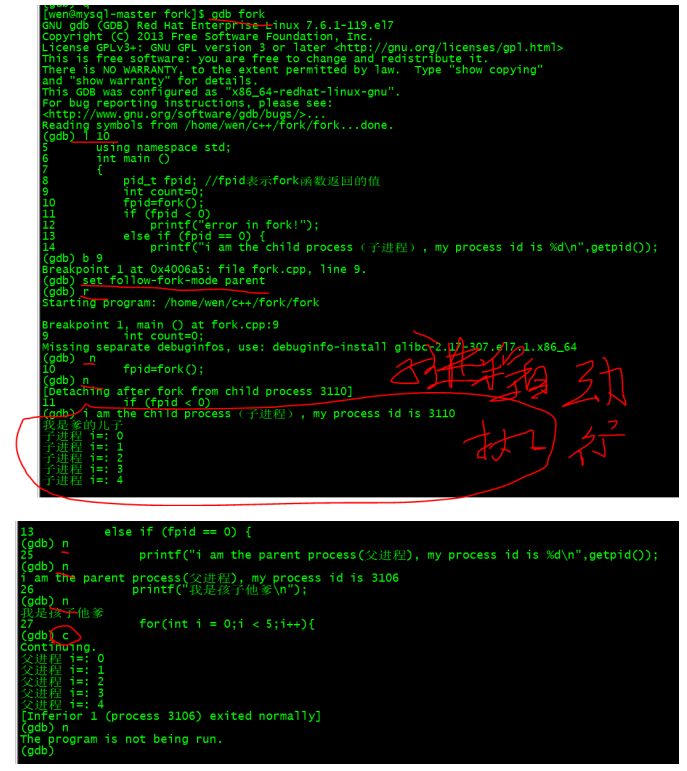

### 2.4、调试子进程：set follow-fork-mode child

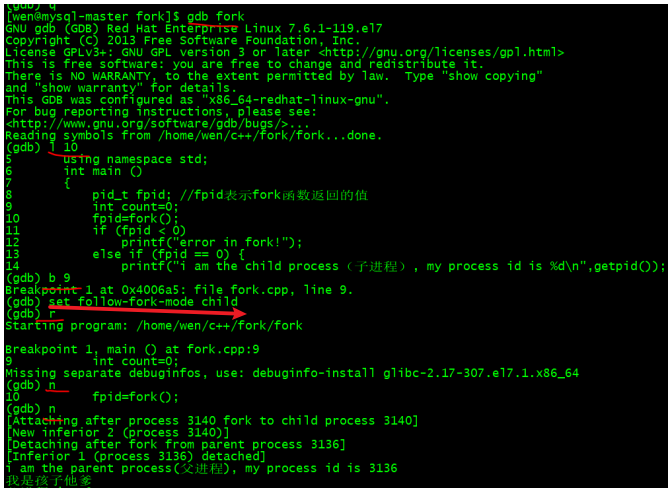
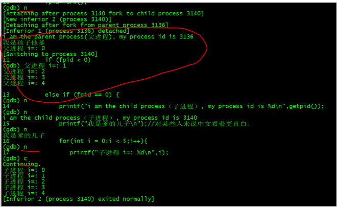

### 2.5、设置调试模式

`Set detach-on-fork off`:

设置调试模式：`set detach-on-fork [on/off]`,缺省是on,表示调试当前进程的时候，其他的进程继续运行。如果off调试当前进行的时候，其他的进程被gdb挂起。

#### 2.5.1、Set detach-on-fork off

例如，父进程自动执行，子进程进行调试。
`Set detach-on-fork off`

例如，父进程跑完，子进程没有运行。

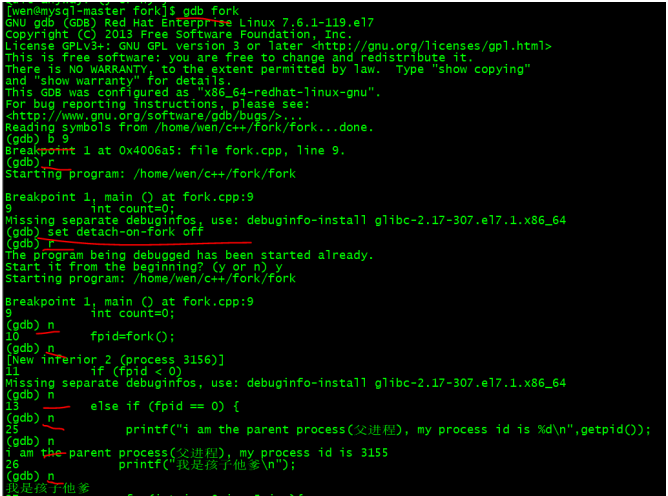
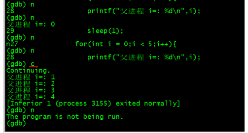

#### 2.5.2、Set detach-on-fork on

`Set follow-fork-mode child` 与 `set detach-on-fork on`: 子进程调试，父进程运行

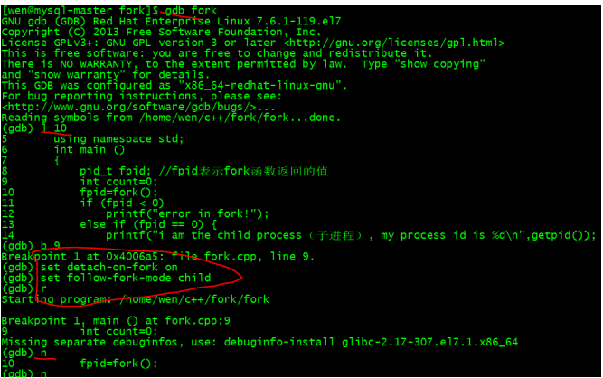
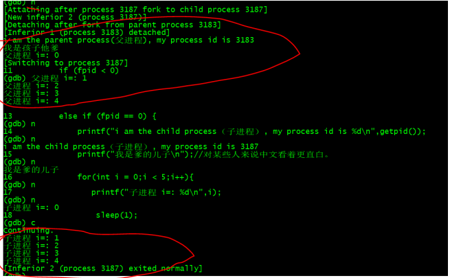

### 2.6、查看调试进程： info inferiors(下级)

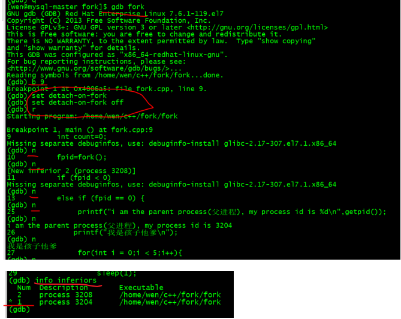

*1表示父进程，2表示子进程。

### 2.7、切换当前调试的进程：inferior 进程id

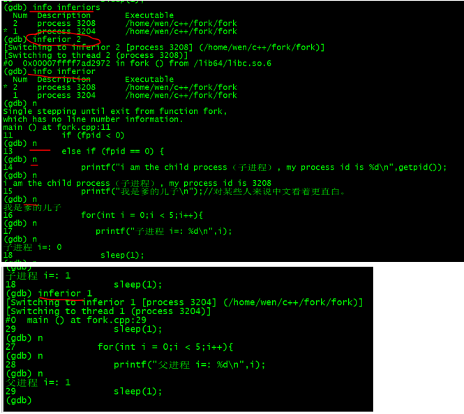

## 3、多线程

### 3.1、多线程命令

- 在shell中执行：

1. 查看当前运行的进程： ps aux | grep book
2. 查看当前运行的轻量级进行：ps -aL | grep book
3. 查看主线程和新线程的关系：pstree -p 主线程id

- 在gdb中执行：

1. 查看线程:info threads
2. 切换线程：thread 线程id
3. 运行当前线程：set scheduler-locking on
4. 运行全部线程：set scheduler-locking off
5. 指定某线程执行某gdb命令：thread apply 线程id cmd
6. 全部的线程执行某gdb命令：thread apply all cmd

### 3.2、多线程代码：

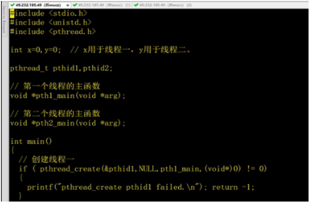
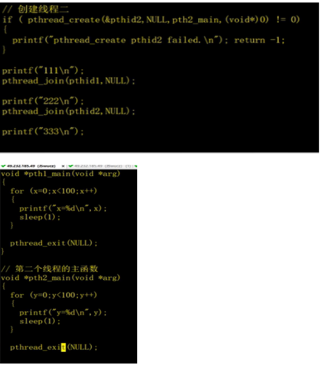
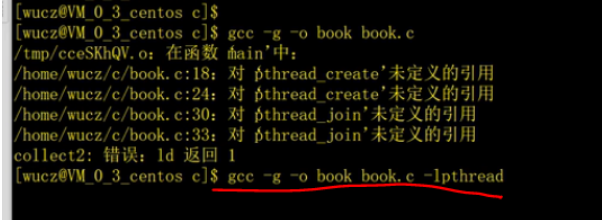

### 3.3、查看进程与线程命令

#### 3.3.1、查看当前的进程：ps aux | grep book

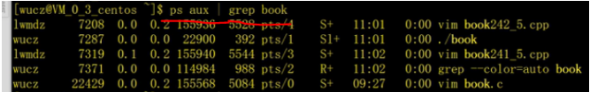

#### 3.3.2、查看当前运行的轻量级进程： ps -aL|grep book

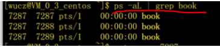

#### 3.3.3、查看主线程与子线程的关系： pstree -p 主线程id

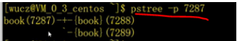

### 3.4、查看线程： info threads

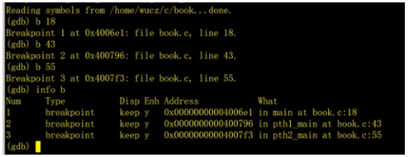
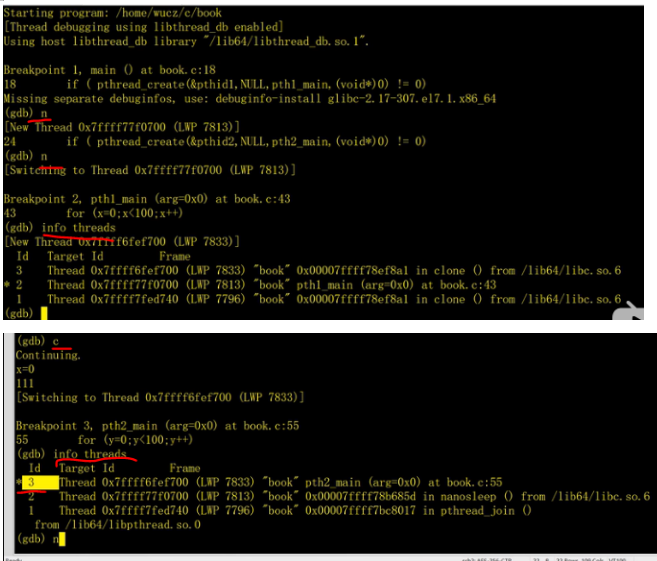

### 3.5、切换线程： thread 线程id

*号表示当前线程
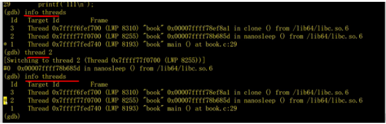

### 3.6、只运行当前线程：set scheduler-locking on 

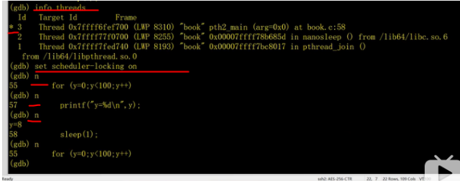

### 3.7、运行全部线程： set scheduler-locking off

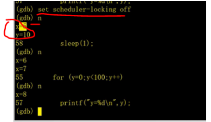

### 3.8、指定某线程执行某行gdb命令：thread apply 线程id cmd

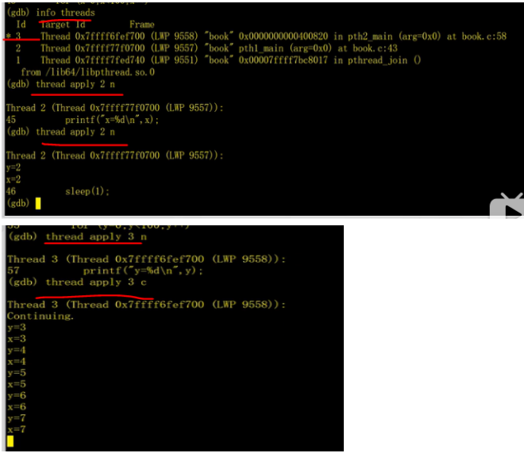

### 3.9、全部的线程执行gdb命令：thread apply all cmd


## 4、日志文件

下载日志包：https://www.freecplus.net/7c7d06c70ade40639a86bdb76359d0d7.html


### 4.1、多进程

#### 4.1.1、多进程日志的代码

```c++
#include <unistd.h>  
#include <stdio.h>   
#include<stdlib.h>

/*#include <unistd.h>  对于类 Unix 系统，unistd.h 中所定义的接口通常都是大量针对系统调用的封装（英语：wrapper functions），如 fork、pipe 以及各种 I/O 原语（read、write、close 等等）。*/

/*
#include<stdlib.h>
意思是标准bai输入输du出头文zhi件。
用到标准输入输出函数时，dao就要调用这个头文件。
stdlib.h中，包zhuan含了C语言的一些常用且方便的库函数。 
如动态内存相关的malloc, realloc,zalloc,calloc,free等。 
系统相关的system, getenv,setenv等。 
字符串转数值函数，atoi, atof,strtoul等。 
随机数相关的rand,srand等。*/

#include "_freecplus.h"
using namespace std;
int main ()   
{   
    CLogFile logFile;
    logFile.Open("/tmp/gdbfork.log","w+");
    logFile.Write("begin \n");
    pid_t fpid; //fpid表示fork函数返回的值  
    int count=0;  
    fpid=fork();   
    if (fpid < 0)   
        logFile.Write("error in fork!");   
    else if (fpid == 0) {  
        logFile.Write("i am the child process（子进程）, my process id is %d\n",getpid());   
        logFile.Write("我是爹的儿子\n");//对某些人来说中文看着更直白。  
        for(int i = 0;i < 5;i++){
           logFile.Write("子进程 i=: %d\n",i);  
            sleep(1);
        }
        count++;  
         exit(0);
    }  
    else {     
         logFile.Write("i am the parent process(父进程), my process id is %d\n",getpid());   
        logFile.Write("我是孩子他爹\n");  
         for(int i = 0;i < 5;i++){
            logFile.Write("父进程 i=: %d\n",i);  
            sleep(1);
        }
        count++;  
        exit(0);
    }  
    logFile.Write("统计结果是: %d/n",count);  
    return 0;  
}  
```

$ g++  -o  gdbfork.log  forkLog.cpp  _freecplus.cpp

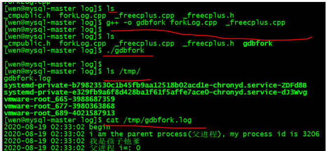

#### 4.1.2、多线程日志的代码

```c++
#include <stdio.h>
#include <unistd.h>
#include <pthread.h>
#include  "_freecplus.h"

CLogFile logFile;
int x = 0, y=0;
pthread_t pthid1,pthid2;
void *pth1_main(void * arg);
void *pth2_main(void * arg);
int main()
{
    logFile.Open("/tmp/gdbmultiThread.log","w+");
    //创建线程1
    if(pthread_create(&pthid1,NULL,pth1_main,(void *)0)!=0)
    {
       logFile.Write("pthread_create pthid1 failed. \n");
       return -1;
    }
    //创建线程2
    if(pthread_create(&pthid2,NULL,pth2_main,(void *)0)!=0)
    {
       logFile.Write("pthread_create pthid2 failed. \n");
       return -1;
    }
    logFile.Write("thrad1 \n");
    pthread_join(pthid1, NULL);
    logFile.Write("thrad2 \n");
    pthread_join(pthid2, NULL);
    logFile.Write("主线程退出.\n");
}
void *pth1_main(void * arg)
{
    for(x=0; x < 10; x++)
    {
       logFile.Write("x=%d \n",x);
       sleep(1);
    }
    pthread_exit(NULL);
}
void *pth2_main(void * arg)
{
    for(y=0; y < 10; y++)
    {
       logFile.Write("y=%d \n",y);
       sleep(1);
    }
    pthread_exit(NULL);
}
```

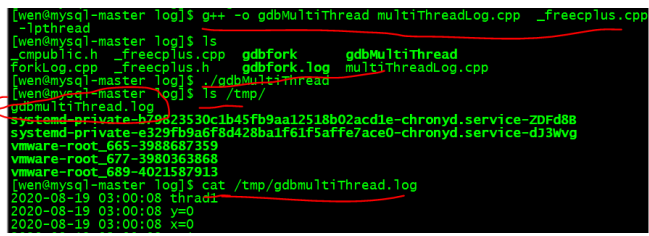
