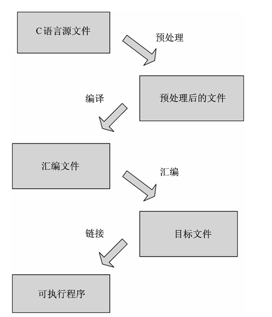

# GCC

目录
[1安装GCC](#1安装GCC)
[2gcc 工作流程](#2gcc工作流程)
[3gcc常用参数](#3gcc常用参数)
[4多文件编译](#4多文件编译)
[5gcc与g++](#5gcc与g++)

GCC 是 Linux 下的编译工具集，是 GNU Compiler Collection 的缩写，包含 gcc、g++ 等编译器。这个工具集不仅包含编译器，还包含其他工具集，例如 ar、nm 等。

GCC 工具集不仅能编译 C/C++ 语言，其他例如 Objective-C、Pascal、Fortran、Java、Ada 等语言均能进行编译。GCC 在可以根据不同的硬件平台进行编译，即能进行交叉编译，在 A 平台上编译 B 平台的程序，支持常见的 X86、ARM、PowerPC、mips 等，以及 Linux、Windows 等软件平台。

## 1安装GCC

有些纯净版的 Linux 默认没有 gcc 编译器，需要自己安装，在线安装步骤如下:

```s
# 安装软件必须要有管理员权限
# ubuntu
$ sudo apt update   		# 更新本地的软件下载列表, 得到最新的下载地址
$ sudo apt install gcc g++	# 通过下载列表中提供的地址下载安装包, 并安装

# centos
$ sudo yum update   		# 更新本地的软件下载列表, 得到最新的下载地址
$ sudo yum install gcc g++	# 通过下载列表中提供的地址下载安装包, 并安装
```

gcc 安装完毕之后，可以查看版本:

```s
# 查看 gcc 版本
$ gcc -v
$ gcc --version

# 查看 g++ 版本
$ g++ -v
$ g++ --version
```

## 2gcc 工作流程

GCC 编译器对程序的编译下图所示，分为 4 个阶段：**预处理（预编译）、编译和优化、汇编和链接。** GCC 的编译器可以将这 4 个步骤合并成一个。 先介绍一个每个步骤都分别做了写什么事儿:

* 预处理：在这个阶段主要做了三件事: 展开头文件 、宏替换 、去掉注释行。

这个阶段需要 GCC 调用预处理器来完成，最终得到的还是源文件，文本格式

* 编译：这个阶段需要 GCC 调用编译器对文件进行编译，最终得到一个汇编文件

* 汇编：这个阶段需要 GCC 调用汇编器对文件进行汇编，最终得到一个二进制文件

* 链接：这个阶段需要 GCC 调用链接器对程序需要调用的库进行链接，最终得到一个可执行的二进制文件

文件名后缀	说明	gcc 参数
.c	源文件	无
.i	预处理后的 C 文件	-E
.s	编译之后得到的汇编语言的源文件	-S
.o	汇编后得到的二进制文件	-c



在 Linux 下使用 GCC 编译器编译单个文件十分简单，直接使用 gcc 命令后面加上要编译的 C 语言的源文件，GCC 会自动生成文件名为 a.out 的可执行文件（也可以通过参数 -o 指定生成的文件名），也就是通过一个简单的命令上边提到的 4 个步骤就全部执行完毕了。但是如果想要单步执行也是没问题的， 下边基于这段示例程序给大家演示一下。
```c
// 假设程序对应的源文件名为 test.c
#include <stdio.h>
#include <stdlib.h>
#include <unistd.h>
#include <string.h>

int main()
{
    int array[5] = {1,2,3,4,5};
    for(int i=0; i<5; ++i)
    {
        printf("array[%d] = %d\n", i, array[i]);
    }
    return 0;
}
```

第一步：对源文件进行预处理，需要使用的 gcc 参数为 -E

```s
# 1. 预处理, -o 指定生成的文件名
$ gcc -E test.c -o test.i
```

第二步：编译预处理之后的文件，需要使用的 gcc 参数为 -S

```s
# 2. 编译, 得到汇编文件
$ gcc -S test.i -o test.s
```

第三步：对得到的汇编文件进行汇编，需要使用的 gcc 参数为 -c

```s
# 3. 汇编
$ gcc -c test.s -o test.o
```

第四步：将得到的二进制文件和标准库进制链接，得到可执行的二进制文件，不需要任何参数

```s
# 4. 链接
$ gcc test.o -o test
```

最后再次强调，在使用 gcc 编译程序的时候可以通过参数控制内部自动执行几个步骤:

```s
# 参数 -c 是进行文件的汇编, 汇编之前的两步会自动执行
$ gcc test.c -c -o app.o

# 该命令是直接进行链接生成可执行程序, 链接之前的三步会自动执行
$ gcc test.c -o app    
```

## 3gcc常用参数

下面的表格中列出了常用的一些 gcc 参数，这些参数在 gcc命令中没有位置要求，只需要编译程序的时候将需要的参数指定出来即可。

|gcc 编译选项|	选项的意义|
|:--|:--|
|-E	|预处理指定的源文件，不进行编译|
|-S	|编译指定的源文件，但是不进行汇编|
|-c	|编译、汇编指定的源文件，但是不进行链接|
|-o [file1] [file2] / [file2] -o [file1]|	将文件 file2 编译成文件 file1|
|-I directory (大写的 i)|	指定 include 包含文件的搜索目录|
|-g	|在编译的时候，生成调试信息，该程序可以被调试器调试|
|-D	|在程序编译的时候，指定一个宏|
|-w	|不生成任何警告信息，不建议使用，有些时候警告就是错误|
|-Wall|	生成所有警告信息|
|-On|	n 的取值范围：0~3。编译器的优化选项的 4 个级别，-O0 表示没有优化，-O1 为缺省值，-O3 优化级别最高|
|-l	|在程序编译的时候，指定使用的库|
|-L	|指定编译的时候，搜索的库的路径。|
|-fPIC/fpic	|file position independence code,生成与位置无关的代码|
|-shared|	生成共享目标文件。通常用在建立共享库时|
|-std	|指定 C 方言，如:-std=c99，gcc 默认的方言是 GNU C|

### 3.1 指定生成的文件名 (-o)

该参数用于指定原文件通过 gcc 处理之后生成的新文件的名字，有两种写法，原文件可以写在参数 -o 前边后缀写在后边。

```s
# 参数 -o的用法 , 原材料 test.c 最终生成的文件名为 app
# test.c 写在 -o 之前
$ gcc test.c -o app

# test.c 写在 -o 之后
$ gcc -o app test.c
```

### 3.2 搜索头文件 (-I)

如果在程序中包含了一些头文件，但是包含的一些头文件在程序预处理的时候因为找不到无法被展开，导致程序编译失败，这时候我们可以在 gcc 命令中添加 -I 参数重新指定要引用的头文件路径，保证编译顺利完成。

```s
# -I, 指定头文件目录
$ tree
.
├── add.c
├── div.c
├── include
│   └── head.h
├── main.c
├── mult.c
└── sub.c

# 编译当前目录中的所有源文件，得到可执行程序
$ gcc *.c -o calc
main.c:2:18: fatal error: head.h: No such file or directory
compilation terminated.
sub.c:2:18: fatal error: head.h: No such file or directory
compilation terminated.
```

通过编译得到的错误信息可以知道，源文件中包含的头文件无法被找到。通过提供的目录结构可以得知头文件 head.h 在 include 目录中，因此可以在编译的时候重新指定头文件位置，具体操作如下：

```s
# 可以在编译的时候重新指定头文件位置 -I 头文件目录
$ gcc *.c -o calc -I ./include
```

### 3.3 指定一个宏 (-D)

在程序中我们可以使用宏定义一个常量，也可以通过宏控制某段代码是否能够被执行。在下面这段程序中第 8 行判断是否定义了一个叫做 DEBUG 的宏，如果没有定义第 9 行代码就不会被执行了，通过阅读代码能够知道这个宏是没有在程序中被定义的。

```c
// test.c
#include <stdio.h>
#define NUMBER  3

int main()
{
    int a = 10;
#ifdef DEBUG
    printf("我是一个程序猿, 我不会爬树...\n");
#endif
    for(int i=0; i<NUMBER; ++i)
    {
        printf("hello, GCC!!!\n");
    }
    return 0;
}
```

如果不想在程序中定义这个宏， 但是又想让它存在，通过 gcc 的参数 -D 就可以实现了，编译器会认为参数后边指定的宏在程序中是存在的。

```s
# 在编译命令中定义这个 DEBUG 宏, 
$ gcc test.c -o app -D DEBUG

# 执行生成的程序， 可以看到程序第9行的输出
$ ./app 
我是一个程序猿, 我不会爬树...
hello, GCC!!!
hello, GCC!!!
hello, GCC!!!
```

-D 参数的应用场景:
在发布程序的时候，一般都会要求将程序中所有的 log 输出去掉，如果不去掉会影响程序的执行效率，很显然删除这些打印 log 的源代码是一件很麻烦的事情，解决方案是这样的：

将所有的打印 log 的代码都写到一个宏判定中，可以模仿上边的例子
在编译程序的时候指定 -D 就会有 log 输出
在编译程序的时候不指定 -D, log 就不会输出

## 4多文件编译

GCC 可以自动编译链接多个文件，不管是目标文件还是源文件，都可以使用同一个命令编译到一个可执行文件中。

### 4.1 准备工作

首先将程序编译之前需要的代码准备出来，例如一个项目包含 3 个文件，文件 string.h , string.c 中有一个函数 strLength 用于计算字符串的长度，而在 main.c 中调用这个函数将计算的结果显示出来。

1. 头文件 string.h

```c
#ifndef _STRING_H_
#define _STRING_H_
int strLength(char *string);
#endif // _STRING_H_
```

2. 源文件 string.c

```c
#include "string.h"

int strLength(char *string)
{
	int len = 0;
	while(*string++ != '\0') 	// 当*string 的值为'\0'时, 停止计算
    {
        len++;
    }
	return len; 	// 返回字符串长度
}
```

3. 源文件 main.c

```c
#include <stdio.h>
#include "string.h"

int main(void)
{
	char *src = "Hello, I'am Monkey·D·Luffy!!!"; 
	printf("string length is: %d\n", strLength(src)); 
	return 0;
}
```

### 4.2 编译运行

因为头文件是包含在源文件中的，因此在使用 gcc 编译程序的时候不需要指定头文件的名字（在头文件无法被找到的时候需要使用参数 -I 指定其具体路径而不是名字）。我们可以通过一个 gcc 命令将多个源文件编译并生成可执行程序，也可以分多步完成这个操作。

* 直接链接生成可执行程序

```s
# 直接生成可执行程序 test
$ gcc -o test string.c main.c

# 运行可执行程序
$ ./test
```

* 先将源文件编成目标文件，然后进行链接得到可执行程序

```s
# 汇编生成二进制目标文件, 指定了 -c 参数之后, 源文件会自动生成 string.o 和 main.o
$ gcc –c string.c main.c

# 链接目标文件, 生成可执行程序 test
$ gcc –o test string.o main.o

# 运行可执行程序
$ ./test
```

## 5gcc与g++

关于对 gcc 和 g++ 很多人的理解都是比较片面的或者是对二者的理解有一些误区，下边从三个方面介绍一下二者的区别:

在代码编译阶段（第二个阶段）:

后缀为 .c 的，gcc 把它当作是 C 程序，而 g++ 当作是 C++ 程序
后缀为.cpp 的，两者都会认为是 C++ 程序，C++ 的语法规则更加严谨一些
g++ 会调用 gcc，对于 C++ 代码，两者是等价的，也就是说 gcc 和 g++ 都可以编译 C/C++ 代码
在链接阶段（最后一个阶段）:

gcc 和 g++ 都可以自动链接到标准 C 库
g++ 可以自动链接到标准 C++ 库，gcc 如果要链接到标准 C++ 库需要加参数 -lstdc++

* 关于 __cplusplus 宏的定义

g++ 会自动定义__cplusplus 宏，但是这个不影响它去编译 C 程序

gcc 需要根据文件后缀判断是否需要定义 __cplusplus 宏 （规则参考第一条）

综上所述：

不管是 gcc 还是 g++ 都可以编译 C 程序，编译程序的规则和参数都相同
g++ 可以直接编译 C++ 程序， gcc 编译 C++ 程序需要添加额外参数 -lstdc++
不管是 gcc 还是 g++ 都可以定义 __cplusplus 宏

```s
# 编译 c 程序
$ gcc test.c -o test	# 使用gcc
$ g++ test.c -o test	# 使用g++

# 编译 c++ 程序
$ g++ test.cpp -o test              # 使用g++
$ gcc test.cpp -lstdc++ -o test     # 使用gcc
```

