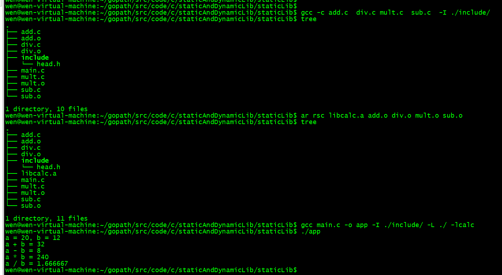
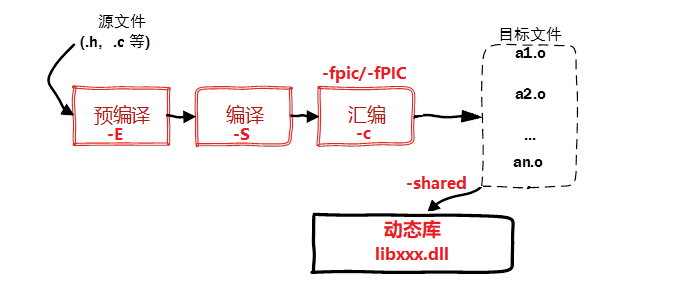
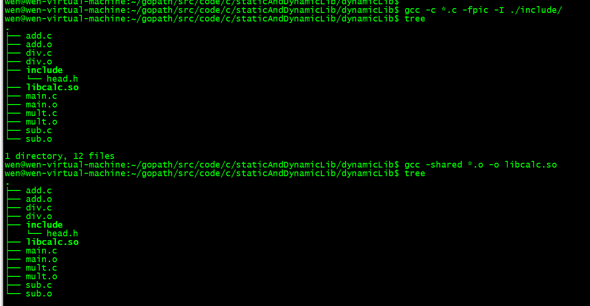
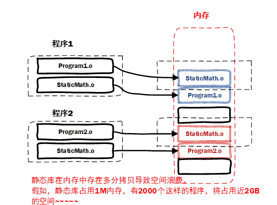

# Linux 静态库和动态库

不管是 Linux 还是 Windows 中的库文件其本质和工作模式都是相同的，只不过在不同的平台上库对应的文件格式和文件后缀不同。程序中调用的库有两种 静态库和动态库，不管是哪种库文件本质是还是源文件，只不过是二进制格式只有计算机能够识别，作为一个普通人就无能为力了。

在项目中使用库一般有两个目的，一个是为了使程序更加简洁不需要在项目中维护太多的源文件，另一方面是为了源代码保密，毕竟不是所有人都想把自己编写的程序开源出来。

当我们拿到了库文件（动态库、静态库）之后要想使用还必须有这些库中提供的 API 函数的声明，也就是头文件，把这些都添加到项目中，就可以快乐的写代码了。

## 1、静态库

在 Linux 中静态库由程序 ar 生成，现在静态库已经不像之前那么普遍了，这主要是由于程序都在使用动态库。关于静态库的命名规则如下:

在 Linux 中静态库以 lib 作为前缀，以.a 作为后缀，中间是库的名字自己指定即可，即: libxxx.a
在 Windows 中静态库一般以 lib 作为前缀，以 lib 作为后缀，中间是库的名字需要自己指定，即: libxxx.lib

### 1.1 生成静态链接库

生成静态库，需要先对源文件进行汇编操作 (使用参数 -c) 得到二进制格式的目标文件 (.o 格式), 然后在通过 ar 工具将目标文件打包就可以得到静态库文件了 (libxxx.a)。

使用 ar 工具创建静态库的时候需要三个参数:

参数c(create)：创建一个库，不管库是否存在，都将创建。
参数s(source)：创建目标文件索引，这在创建较大的库时能加快时间。
参数r(replace)：在库中插入模块 (替换)。默认新的成员添加在库的结尾处，如果模块名已经在库中存在，则替换同名的模块。

生成静态链接库的具体步骤如下:

1. 需要将源文件进行汇编，得到 .o 文件，需要使用参数 -c

```s
# 执行如下操作, 默认生成二进制的 .o 文件
# -c 参数位置没有要求
$ gcc 源文件(*.c) -c	
```

2. 将得到的 .o 进行打包，得到静态库

```s
$ ar rcs 静态库的名字(libxxx.a) 原材料(*.o)
```

3. 发布静态库

```s
# 发布静态库
	1. 提供头文件 **.h
	2. 提供制作出来的静态库 libxxx.a
```

### 1.2 静态库制作举例
#### 1.2.1 准备测试程序

在某个目录中有如下的源文件，用来实现一个简单的计算器:

```s
# 目录结构 add.c div.c mult.c sub.c -> 算法的源文件, 函数声明在头文件 head.h
# main.c中是对接口的测试程序, 制作库的时候不需要将 main.c 算进去
.
├── add.c
├── div.c
├── include
│   └── head.h
├── main.c
├── mult.c
└── sub.c
```

1. 加法计算源文件 add.c:

```c
#include <stdio.h>
#include "head.h"

int add(int a, int b)
{
    return a+b;
}
```

2. 减法计算源文件 sub.c:

```c
#include <stdio.h>
#include "head.h"

int subtract(int a, int b)
{
    return a-b;
}
```

3. 乘法计算源文件 mult.c:

```c
#include <stdio.h>
#include "head.h"

int multiply(int a, int b)
{
    return a*b;
}
```

4. 减法计算的源文件 div.c

```c
#include <stdio.h>
#include "head.h"

double divide(int a, int b)
{
    return (double)a/b;
}
```

5. 头文件 head.h

```c
#ifndef _HEAD_H
#define _HEAD_H
// 加法
int add(int a, int b);
// 减法
int subtract(int a, int b);
// 乘法
int multiply(int a, int b);
// 除法
double divide(int a, int b);
#endif
```

6. 测试文件 main.c

```c
#include <stdio.h>
#include "head.h"

int main()
{
    int a = 20;
    int b = 12;
    printf("a = %d, b = %d\n", a, b);
    printf("a + b = %d\n", add(a, b));
    printf("a - b = %d\n", subtract(a, b));
    printf("a * b = %d\n", multiply(a, b));
    printf("a / b = %f\n", divide(a, b));
    return 0;
}
```

#### 1.2.2 生成静态库

第一步：将源文件 add.c, div.c, mult.c, sub.c 进行汇编，得到二进制目标文件 add.o, div.o, mult.o, sub.o

```s
# 1. 生成.o
$ gcc add.c div.c mult.c sub.c -c
sub.c:2:18: fatal error: head.h: No such file or directory
compilation terminated.

# 提示头文件找不到, 添加参数 -I 重新头文件路径即可
$ gcc add.c div.c mult.c sub.c -c -I ./include/

# 查看目标文件是否已经生成
$ tree
.
├── add.c
├── add.o            # 目标文件
├── div.c
├── div.o            # 目标文件
├── include
│   └── head.h
├── main.c
├── mult.c
├── mult.o           # 目标文件
├── sub.c
└── sub.o            # 目标文件
```

第二步：将生成的目标文件通过 ar 工具打包生成静态库

```s
# 2. 将生成的目标文件 .o 打包成静态库
$ ar rcs libcalc.a add.o div.o mult.o sub.o   # add.o div.o mult.o sub.o在同一个目录中可以写成 *.o

# 查看目录中的文件
$ tree
.
├── add.c
├── add.o
├── div.c
├── div.o
├── include
│   └── `head.h  ===> 和静态库一并发布
├── `libcalc.a   ===> 生成的静态库
├── main.c
├── mult.c
├── mult.o
├── sub.c
└── sub.o
```

第三步：将生成的的静态库 libcalc.a 和库对应的头文件 head.h 一并发布给使用者就可以了。

```s
# 3. 发布静态库
	1. head.h    => 函数声明
	2. libcalc.a => 函数定义(二进制格式)
```

### 1.3 静态库的使用

当我们得到了一个可用的静态库之后，需要将其放到一个目录中，然后根据得到的头文件编写测试代码，对静态库中的函数进行调用。

```s
# 1. 首先拿到了发布的静态库
	`head.h` 和 `libcalc.a`
	
# 2. 将静态库, 头文件, 测试程序放到一个目录中准备进行测试
.
├── head.h          # 函数声明
├── libcalc.a       # 函数定义（二进制格式）
└── main.c          # 函数测试
```

编译测试程序，得到可执行文件。

```s
# 3. 编译测试程序 main.c
$ gcc main.c -o app
/tmp/ccR7Fk49.o: In function `main':
main.c:(.text+0x38): undefined reference to `add'
main.c:(.text+0x58): undefined reference to `subtract'
main.c:(.text+0x78): undefined reference to `multiply'
main.c:(.text+0x98): undefined reference to `divide'
collect2: error: ld returned 1 exit status
```

上述错误分析:

编译的源文件中包含了头文件 head.h, 这个头文件中声明的函数对应的定义（也就是函数体实现）在静态库中，程序在编译的时候没有找到函数实现，因此提示 undefined reference to xxxx。

解决方案：在编译的时将静态库的路径和名字都指定出来

-L: 指定库所在的目录 (相对或者绝对路径)
-l: 指定库的名字，需要掐头 (lib) 去尾 (.a) 剩下的才是需要的静态库的名字

```s
# 4. 编译的时候指定库信息
	-L: 指定库所在的目录(相对或者绝对路径)
	-l: 指定库的名字, 掐头(lib)去尾(.a) ==> calc
# -L -l, 参数和参数值之间可以有空格, 也可以没有  -L./ -lcalc
$ gcc main.c -o app -L ./ -l calc

# 查看目录信息, 发现可执行程序已经生成了
$ tree
.
├── app   		# 生成的可执行程序
├── head.h
├── libcalc.a
└── main.c
```

编译：


## 2、动态库

动态链接库是程序运行时加载的库，当动态链接库正确部署之后，运行的多个程序可以使用同一个加载到内存中的动态库，因此在 Linux 中动态链接库也可称之为共享库。

动态链接库是目标文件的集合，目标文件在动态链接库中的组织方式是按照特殊方式形成的。库中函数和变量的地址使用的是相对地址（静态库中使用的是绝对地址），其真实地址是在应用程序加载动态库时形成的。

关于动态库的命名规则如下:

在 Linux 中动态库以 lib 作为前缀，以.so 作为后缀，中间是库的名字自己指定即可，即: libxxx.so
在 Windows 中动态库一般以 lib 作为前缀，以 dll 作为后缀，中间是库的名字需要自己指定，即: libxxx.dll

### 2.1 生成动态链接库

生成动态链接库是直接使用 gcc 命令并且需要添加 -fPIC（-fpic，file position independence code） 以及 -shared 参数。

* -fPIC 或 -fpic 参数的作用是使得 gcc 生成的代码是与位置无关的，也就是使用相对位置。
* -shared参数的作用是告诉编译器生成一个动态链接库。



* 生成动态链接库的具体步骤如下:

1. 将源文件进行汇编操作，需要使用参数 -c, 还需要添加额外参数 -fpic /-fPIC

```s
# 得到若干个 .o文件
$ gcc 源文件(*.c) -c -fpic
```

2. 将得到的.o 文件打包成动态库，还是使用 gcc, 使用参数 -shared 指定生成动态库 (位置没有要求)

```s
$ gcc -shared 与位置无关的目标文件(*.o) -o 动态库(libxxx.so)
```

3. 发布动态库和头文件

```s
# 发布
 	1. 提供头文件: xxx.h
 	2. 提供动态库: libxxx.so
```

### 2.2 动态库制作举例

在此还是以上面制作静态库使用的实例代码为例来制作动态库，代码目录如下:

```s
# 举例, 示例目录如下:
# 目录结构 add.c div.c mult.c sub.c -> 算法的源文件, 函数声明在头文件 head.h
# main.c中是对接口的测试程序, 制作库的时候不需要将 main.c 算进去
.
├── add.c
├── div.c
├── include
│   └── head.h
├── main.c
├── mult.c
└── sub.c
```

第一步：使用 gcc 将源文件进行汇编 (参数-c), 生成与位置无关的目标文件，需要使用参数 -fpic或者-fPIC

```s
# 1. 将.c汇编得到.o, 需要额外的参数 -fpic/-fPIC
$ gcc add.c div.c mult.c sub.c -c -fpic -I ./include/

# 查看目录文件信息, 检查是否生成了目标文件
$ tree
.
├── add.c
├── add.o                # 生成的目标文件
├── div.c
├── div.o                # 生成的目标文件
├── include
│   └── head.h
├── main.c
├── mult.c
├── mult.o               # 生成的目标文件
├── sub.c
└── sub.o                # 生成的目标文件
```

第二步：使用 gcc 将得到的目标文件打包生成动态库，需要使用参数 -shared

```s
# 2. 将得到 .o 打包成动态库, 使用gcc , 参数 -shared
$ gcc -shared add.o div.o mult.o sub.o -o libcalc.so  

# 检查目录中是否生成了动态库
$ tree
.
├── add.c
├── add.o
├── div.c
├── div.o
├── include
│   └── `head.h   ===> 和动态库一起发布
├── `libcalc.so   ===> 生成的动态库
├── main.c
├── mult.c
├── mult.o
├── sub.c
└── sub.o
```

第三步：发布生成的动态库和相关的头文件

```
# 3. 发布库文件和头文件
	1. head.h
	2. libcalc.so
```

### 2.3 动态库的使用

当我们得到了一个可用的动态库之后，需要将其放到一个目录中，然后根据得到的头文件编写测试代码，对动态库中的函数进行调用。

```s
# 1. 拿到发布的动态库
	`head.h   libcalc.so
# 2. 基于头文件编写测试程序, 测试动态库中提供的接口是否可用
	`main.c`
# 示例目录:
.
├── head.h          ==> 函数声明
├── libcalc.so      ==> 函数定义
└── main.c          ==> 函数测试
```

编译测试程序

```s
# 3. 编译测试程序
$ gcc main.c -o app
/tmp/ccwlUpVy.o: In function `main':
main.c:(.text+0x38): undefined reference to `add'
main.c:(.text+0x58): undefined reference to `subtract'
main.c:(.text+0x78): undefined reference to `multiply'
main.c:(.text+0x98): undefined reference to `divide'
collect2: error: ld returned 1 exit status
```

错误原因:

和使用静态库一样，在编译的时候需要指定库相关的信息: 库的路径 -L 和 库的名字 -l

添加库信息相关参数，重新编译测试代码:

```s
# 在编译的时候指定动态库相关的信息: 库的路径 -L, 库的名字 -l
$ gcc main.c -o app -L./ -lcalc

# 查看是否生成了可执行程序
$ tree
.
├── app 			# 生成的可执行程序
├── head.h
├── libcalc.so
└── main.c

# 执行生成的可执行程序, 错误提示 ==> 可执行程序执行的时候找不到动态库
$ ./app 
./app: error while loading shared libraries: libcalc.so: cannot open shared object file: No such file or directory
```

关于整个操作过程的报告：

​ gcc 通过指定的动态库信息生成了可执行程序，但是可执行程序运行却提示无法加载到动态库。

### 2.4 解决动态库无法加载问题
#### 2.4.1 库的工作原理

1. 静态库如何被加载

在程序编译的最后一个阶段也就是链接阶段，提供的静态库会被打包到可执行程序中。当可执行程序被执行，静态库中的代码也会一并被加载到内存中，因此不会出现静态库找不到无法被加载的问题。

2. 动态库如何被加载

* 在程序编译的最后一个阶段也就是链接阶段：
    * 在 gcc 命令中虽然指定了库路径 (使用参数 -L ), 但是这个路径并没有记录到可执行程序中，只是检查了这个路径下的库文件是否存在。
    * 同样对应的动态库文件也没有被打包到可执行程序中，只是在可执行程序中记录了库的名字。

* 可执行程序被执行起来之后:
    * 程序执行的时候会先检测需要的动态库是否可以被加载，加载不到就会提示上边的错误信息
    * 当动态库中的函数在程序中被调用了, 这个时候动态库才加载到内存，如果不被调用就不加载
    * 动态库的检测和内存加载操作都是由动态连接器来完成的

#### 2.4.2 动态链接器

动态链接器是一个独立于应用程序的进程，属于操作系统，当用户的程序需要加载动态库的时候动态连接器就开始工作了，很显然动态连接器根本就不知道用户通过 gcc 编译程序的时候通过参数 -L 指定的路径。

* 那么动态链接器是如何搜索某一个动态库的呢，在它内部有一个默认的搜索顺序，按照优先级从高到低的顺序分别是：

1. 可执行文件内部的 DT_RPATH 段
2. 系统的环境变量 LD_LIBRARY_PATH
3. 系统动态库的缓存文件 /etc/ld.so.cache
4. 存储动态库 / 静态库的系统目录 /lib/, /usr/lib 等

按照以上四个顺序，依次搜索，找到之后结束遍历，最终还是没找到，动态连接器就会提示动态库找不到的错误信息。

#### 2.4.3 解决方案

可执行程序生成之后，根据动态链接器的搜索路径，我们可以提供三种解决方案，我们只需要将动态库的路径放到对应的环境变量或者系统配置文件中，同样也可以将动态库拷贝到系统库目录（或者是将动态库的软链接文件放到这些系统库目录中）。

编译：
```s
~/gopath/src/code/c/staticAndDynamicLib/dynamicLib$gcc add.c div.c mult.c sub.c -c -fpic -I ./include/
~/gopath/src/code/c/staticAndDynamicLib/dynamicLib$sudo ln -s ./libcalc.so  /usr/lib/libcalc.so
~/gopath/src/code/c/staticAndDynamicLib/dynamicLib$gcc add.c div.c mult.c sub.c -c -fpic -I ./include/
~/gopath/src/code/c/staticAndDynamicLib/dynamicLib$ ./app
```


* 方案 1: 将库路径添加到环境变量 LD_LIBRARY_PATH 中

找到相关的配置文件

用户级别: ~/.bashrc —> 设置对当前用户有效
系统级别: /etc/profile —> 设置对所有用户有效
使用 vim 打开配置文件，在文件最后添加这样一句话

```s
# 自己把路径写进去就行了
export LIBRARY_PATH=$LIBRARY_PATH:动态库的绝对路径
让修改的配置文件生效
```

修改了用户级别的配置文件，关闭当前终端，打开一个新的终端配置就生效了

修改了系统级别的配置文件，注销或关闭系统，再开机配置就生效了

不想执行上边的操作，可以执行一个命令让配置重新被加载

```s
# 修改的是哪一个就执行对应的那个命令
# source 可以简写为一个 . , 作用是让文件内容被重新加载
$ source ~/.bashrc          (. ~/.bashrc)
$ source /etc/profile       (. /etc/profile)
```

编译：

1.  用户级别:~/.bashrc

```s
$vi  ~/.bashrc
export LIBRARY_PATH=$LIBRARY_PATH:/home/wen/gopath/src/code/c/staticAndDynamicLib/dynamicLib/libcalc.so
$source ~/.bashrc
$gcc main.c -o app -L ./ -lcalc -I ./include/
```

2. 系统级别: /etc/profile

```s
$vi /etc/profile
export LIBRARY_PATH=$LIBRARY_PATH:/home/wen/gopath/src/code/c/staticAndDynamicLib/dynamicLib/libcalc.so
$source /etc/profile
$gcc main.c -o app -L ./ -lcalc -I ./include/
```

* 方案 2: 更新 /etc/ld.so.cache 文件

找到动态库所在的绝对路径（不包括库的名字）比如：/home/robin/Library/

使用 vim 修改 /etc/ld.so.conf 这个文件，将上边的路径添加到文件中 (独自占一行)

```s
# 1. 打开文件
$ sudo vim /etc/ld.so.conf

# 2. 添加动态库路径, 并保存退出
更新 /etc/ld.so.conf 中的数据到 /etc/ld.so.cache 中

# 必须使用管理员权限执行这个命令
$ sudo ldconfig   //一个动态链接库管理命令，其目的为了让动态链接库为系统所共享
```

编译：

1.
```s
$ sudo vim /etc/ld.so.conf
home/wen/gopath/src/code/c/staticAndDynamicLib/dynamicLib/libcalc.so
$ sudo ldconfig   
```

* 方案 3: 拷贝动态库文件到系统库目录 /lib/ 或者 /usr/lib 中 (或者将库的软链接文件放进去)

```s
# 库拷贝
sudo cp /xxx/xxx/libxxx.so /usr/lib

# 或创建软连接
sudo ln -s /xxx/xxx/libxxx.so /usr/lib/libxxx.so
```

编译：

1. 库拷贝

```s
$sudo cp ./libcalc.so /usr/lib
$gcc main.c -o app -L ./ -lcalc -I ./include/
```

2. 创建软连接

```s
$sudo ln -s ./libcalc.so /usr/lib/libcalc.so
$gcc main.c -o app -L ./ -lcalc -I ./include/
```

#### 2.4.4 验证

在启动可执行程序之前，或者在设置了动态库路径之后，我们可以通过一个命令检测程序能不能够通过动态链接器加载到对应的动态库，这个命令叫做 ldd

```s
# 语法:
$ ldd 可执行程序名

# 举例:
$ ldd app
	linux-vdso.so.1 =>  (0x00007ffe8fbd6000)
    libcalc.so => /home/robin/Linux/3Day/calc/test/libcalc.so (0x00007f5d85dd4000)
    libc.so.6 => /lib/x86_64-linux-gnu/libc.so.6 (0x00007f5d85a0a000)
    /lib64/ld-linux-x86-64.so.2 (0x00007f5d85fd6000)  ==> 动态链接器, 操作系统提供
```

## 3、 优缺点
### 3.1 静态库

* 优点：
    * 静态库被打包到应用程序中加载速度快
    * 发布程序无需提供静态库，移植方便

* 缺点：

    * 相同的库文件数据可能在内存中被加载多份，消耗系统资源，浪费内存
    * 库文件更新需要重新编译项目文件，生成新的可执行程序，浪费时间。



### 3.2 动态库

* 优点：
    * 可实现不同进程间的资源共享
    * 动态库升级简单，只需要替换库文件，无需重新编译应用程序
    * 程序猿可以控制何时加载动态库，不调用库函数动态库不会被加载
* 缺点：
    * 加载速度比静态库慢，以现在计算机的性能可以忽略
    * 发布程序需要提供依赖的动态库


## 4、 视频讲解

以上知识点对应的视频讲解可以关注 B 站 - 爱编程的大丙
视频地址: https://www.bilibili.com/video/BV13U4y1p7kB

