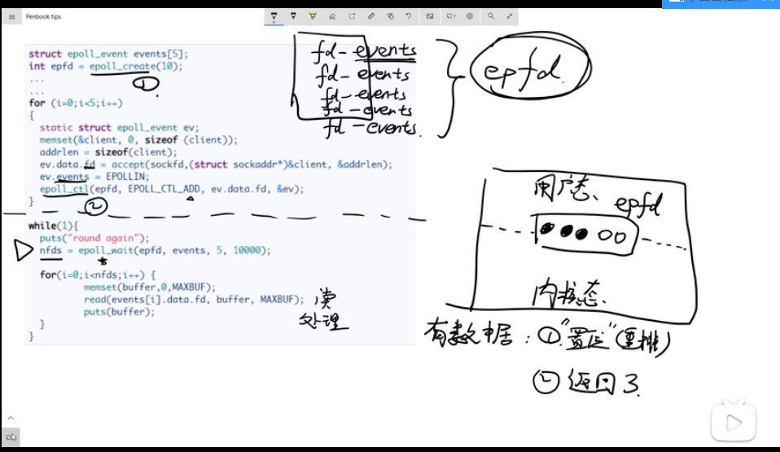

# select、poll、epoll

## 1、select


其中，select函数是阻塞函数。
FD_SET(fds[i], &rset): 若fds[] = {1,2,5,7,9}且含有0到9的10个数,则rset表示bitmap(1024位)为{01100101010}。
FD_ISSET(fds[i], &rset):在rset里判断哪个fds[i]置位。优点：由用户态切换内核态，再对触发事件进行判断，提高运行效率。

### 1.1 select的缺点

1）FD（bitmap）默认为1024位。
2）FDset不可重用，即每次都要运行下面四行代码。

```c++
FD_ZERO(&rset);
for (i = 0; i< 5; i++ ) {
    FD_SET(fds[i],&rset);
}
```

3）用户态拷贝到内核传递，需要一定开销。
4）时间复杂度为O(n),采用遍历方式，原因不知道哪个事件触发了，需要遍历来查找触发事件。

```c++
for(i=0;i<5;i++) {
    if (FD_ISSET(fds[i], &rset)){ //遍历方式查找触发事件
        memset(buffer,0,MAXBUF);
        read(fds[i], buffer, MAXBUF);
        puts(buffer);
    }
}
```

### 1.2 socket通信中select函数的使用和解释

#### 1.2.1 select函数的作用

select()在SOCKET编程中还是比较重要的，可是对于初学SOCKET的人来说都不太爱用select()写程序，他们只是习惯写诸如 conncet()、accept()、recv()或recvfrom这样的阻塞程序(所谓阻塞方式block，顾名思义，就是进程或是线程执行到这些函数时必须等待某个事件发生，如果事件没有发生，进程或线程就被阻塞，函数不能立即返回)。可是使用select()就可以完成非阻塞(所谓非阻塞方式non-block，就是进程或线程执行此函数时不必非要等待事件的发生，一旦执行肯定返回，以返回值的不同来反映函数的执行情况。如果事件发生则与阻塞方式相同，若事件没有发生则返回一个代码来告知事件未发生，而进程或线程继续执行，所以效率高)方式工作的程序，它能够监视我们需要监视的文件描述符的变化情况——读写或是异常。


#### 1.2.2 select函数格式

select()函数的格式(所说的是Unix系统下的Berkeley Socket编程，和Windows下的有区别，一会儿说明)。

1. Unix系统下解释：

- 定义

```c++
/* According to POSIX.1-2001 */
#include <sys/select.h>

/* According to earlier standards */
#include <sys/time.h>
#include <sys/types.h>
#include <unistd.h>

int select(int maxfdp, fd_set* readfds, fd_set* writefds, fd_set* errorfds, struct timeval* timeout);

void FD_CLR(int fd, fd_set *set);
int  FD_ISSET(int fd, fd_set *set);
void FD_SET(int fd, fd_set *set);
void FD_ZERO(fd_set *set);
```

- select函数

```c++
int select(int maxfdp, fd_set* readfds, fd_set* writefds, fd_set* errorfds, struct timeval* timeout);
```

- 先说明两个结构体：

1）第一结构体：struct fd_set可以理解为一个集合，这个集合中存放的是文件描述符(file descriptor)，即文件句柄。

这可以是我们所说的普通意义的文件，当然Unix下任何设备、管道、FIFO等都是文件形式，全部包括在内，所以，毫无疑问，一个socket就是一个文件，socket句柄就是一个文件描述符。

**fd_set结构体操作函数:**

```c++
#include <sys/types.h>
#include <unistd.h>
FD_ZERO(fd_set*)：清空集合;
FD_SET(int, fd_set*)：将一个给定的文件描述符加入集合之中；
FD_CLR(int,   fd_set*)：将一个给定的文件描述符从集合中删除；
FD_ISSET(int, fd_set*)：检查集合中指定的文件描述符是否可以读写。
```

2）第二结构体：struct timeval是一个大家常用的结构，用来代表时间值，有两个成员，一个是秒数，另一个毫秒数。

```c++
#include <sys/time.h>
struct timeval  
{  
__time_t tv_sec;        /* Seconds.秒 */  
__suseconds_t tv_usec;  /* Microseconds.微秒 */  
};  
```

- 具体解释select的参数：

1）int maxfdp是一个整数值，是指集合中所有文件描述符的范围，**即所有文件描述符的最大值加1，因为从0开始计算，因此为最大值+1**不能错！在Windows中这个参数值无所谓，可以设置不正确。

2）fd_set* readfds是指向fd_set结构的指针，这个集合中应该包括文件描述符，我们是要监视这些文件描述符的读变化的。即我们关心是否可以从这些文件中读取数据了，如果这个集合中有一个文件可读，select就会返回一个大于0的值，表示有文件可读。如果没有可读的文件，则根据timeout参数再判断是否超时，若超出timeout的时间，select返回0，若发生错误返回负值。可以传入NULL值，表示不关心任何文件的读变化。

3）fd_set* writefds是指向fd_set结构的指针，这个集合中应该包括文件描述符，我们是要监视这些文件描述符的写变化的。即我们关心是否可以向这些文件中写入数据了，如果这个集合中有一个文件可写，select就会返回一个大于0的值，表示有文件可写。如果没有可写的文件，则根据timeout再判断是否超时，若超出timeout的时间，select返回0，若发生错误返回负值。可以传入NULL值，表示不关心任何文件的写变化。

4）fd_set* errorfds同上面两个参数的意图，用来监视文件错误异常。

5）struct timeval* timeout是select的超时时间，这个参数至关重要，它可以使select处于三种状态。

第一：若将NULL以形参传入，即不传入时间结构，就是将select置于阻塞状态，一定等到监视文件描述符集合中某个文件描述符发生变化为止；

第二：若将时间值设为0秒0毫秒，就变成一个纯粹的非阻塞函数，不管文件描述符是否有变化，都立刻返回继续执行，文件无变化返回0，有变化返回一个正值；

第三：timeout的值大于0，这就是等待的超时时间，即select在timeout时间内阻塞，超时时间之内有事件到来就返回了，否则在超时后不管怎样一定返回，返回值同上述。

- select函数返回值：

1）负值：select错误
2）正值：某些文件可读写或出错
3）0：等待超时，没有可读写或错误的文件

2. Windows平台下解释：

- 函数原型：

```c++
int select(int nfds, fd_set* readfds, fd_set* writefds, fd_set* exceptfds, const struct timeval*    timeout);

或
int select(
    __in     int    nfds,
    __inout  fd_set *readfds,
    __inout  fd_set *writefds,
    __inout  fd_set *exceptfds,
    __int    const struct timeval *timeout
);

```
 
- 参数：

1）nfds：      本参数忽略，仅起到兼容作用，设为0即可；
2）readfds：  （可选）指针，指向一组等待可读性检查的套接口；
3）writefds： （可选）指针，指向一组等待可写性检查的套接口；
4）exceptfds：（可选）指针，指向一组等待错误检查的套接口；
5）timeout：   本函数最多等待时间，对阻塞操作则为NULL。

- 返回值：

1）select()调用返回处于就绪状态并且已经包含在fd_set结构中的描述字总数；
2）如果超时则返回0；
3）否则的话，返回SOCKET_ERROR错误，应用程序可通过WSAGetLastError()获取相应错误代码。

- 定义

```c++
/* According to POSIX.1-2001 */
#include <sys/select.h>

/* According to earlier standards */
#include <sys/time.h>
#include <sys/types.h>
#include <unistd.h>

int select(int nfds, fd_set *readfds, fd_set *writefds,
           fd_set *exceptfds, struct timeval *timeout);

void FD_CLR(int fd, fd_set *set);
int  FD_ISSET(int fd, fd_set *set);
void FD_SET(int fd, fd_set *set);
void FD_ZERO(fd_set *set);
```

#### 1.2.3 select的源码

```c++
#ifndef FD_SETSIZE
#define FD_SETSIZE       64
#endif /* FD_SETSIZE */

typedef struct fd_set {
         u_int fd_count;                /* how many are SET? */
         SOCKET   fd_array[FD_SETSIZE];    /* an array of SOCKETs */
} fd_set;

extern int PASCAL FAR __WSAFDIsSet(SOCKET, fd_set FAR *);

#define FD_CLR(fd, set) do { /
     u_int __i; /
     for (__i = 0; __i < ((fd_set FAR *)(set))->;fd_count ; __i++) { /
         if (((fd_set FAR *)(set))->;fd_array[__i] == fd) { /
             while (__i < ((fd_set FAR *)(set))->;fd_count-1) { /
                 ((fd_set FAR *)(set))->;fd_array[__i] = /
                     ((fd_set FAR *)(set))->;fd_array[__i+1]; /
                 __i++; /
             } /
             ((fd_set FAR *)(set))->;fd_count--; /
             break; /
         } /
     } /
} while(0)

#define FD_SET(fd, set) do { /
     u_int __i; /
     for (__i = 0; __i < ((fd_set FAR *)(set))->;fd_count; __i++) { /
         if (((fd_set FAR *)(set))->;fd_array[__i] == (fd)) { /
             break; /
         } /
     } /
     if (__i == ((fd_set FAR *)(set))->;fd_count) { /
         if (((fd_set FAR *)(set))->;fd_count < FD_SETSIZE) { /
             ((fd_set FAR *)(set))->;fd_array[__i] = (fd); /
             ((fd_set FAR *)(set))->;fd_count++; /
         } /
     } /
} while(0)

#define FD_ZERO(set) (((fd_set FAR *)(set))->;fd_count=0)

#define FD_ISSET(fd, set) __WSAFDIsSet((SOCKET)(fd), (fd_set FAR *)(set))
typedef int32_t __fd_mask;

#define _NFDBITS (sizeof(__fd_mask) * 8)      /* 8 bits per byte */

#define __howmany(x,y)   (((x)+((y)-1))/(y))

#ifndef _FD_SET

#   define _FD_SET
    typedef struct __fd_set {
      long fds_bits[__howmany(FD_SETSIZE, (sizeof(long) * 8))];
      } fd_set;

#   ifndef _KERNEL
#     ifdef __cplusplus
         extern "C" {
#     endif /* __cplusplus */

#ifdef _INCLUDE_HPUX_SOURCE
#     define FD_SET(n,p)   (((__fd_mask *)((p)->;fds_bits))[(n)/_NFDBITS] |= (1 <<
((n) % _NFDBITS)))
#     define FD_CLR(n,p) (((__fd_mask *)((p)->;fds_bits))[(n)/_NFDBITS] &= ~(1 <<
((n) % _NFDBITS)))

#     define FD_ISSET(n,p) (((__fd_mask *)((p)->;fds_bits))[(n)/_NFDBITS] & (1 <<
((n) % _NFDBITS)))
#     define FD_ZERO(p)      memset((void *)(p), (int) 0, sizeof(*(p)))
#else
#     define FD_SET(n,p) (__fd_set1(n, p))
#     define FD_CLR(n,p) (__fd_clr(n, p))
#     define FD_ISSET(n,p) (__fd_isset(n, p))
#     define FD_ZERO(p)      memset((void *)(p), (int) 0, sizeof(fd_set))
```

#### 1.2.4 注释

本函数用于确定一个或多个套接口的状态。对每一个套接口，调用者可查询它的可读性、可写性及错误状态信息。用fd_set结构来表示一组等待检查的套接口。在调用返回时，这个结构存有满足一定条件的套接口组的子集，并且select()返回满足条件的套接口的数目。有一组宏可用于对fd_set的操作，这些宏与Berkeley Unix软件中的兼容，但内部的表达是完全不同的。

readfds参数标识等待可读性检查的套接口。如果该套接口正处于监听listen()状态，则若有连接请求到达，该套接口便被标识为可读，这样一个accept()调用保证可以无阻塞完成。对其他套接口而言，可读性意味着有排队数据供读取。或者对于SOCK_STREAM类型套接口来说，相对于该套接口的虚套接口已关闭，于是recv()或recvfrom()操作均能无阻塞完成。如果虚电路被“优雅地”中止，则recv()不读取数据立即返回；如果虚电路被强制复位，则recv()将以WSAECONNRESET错误立即返回。如果SO_OOBINLINE选项被设置，则将检查带外数据是否存在（参见setsockopt()）。

writefds参数标识等待可写性检查的套接口。如果一个套接口正在connect()连接（非阻塞），可写性意味着连接顺利建立。如果套接口并未处于connect()调用中，可写性意味着send()和sendto()调用将无阻塞完成。〔但并未指出这个保证在多长时间内有效，特别是在多线程环境中〕。

exceptfds参数标识等待带外数据存在性或意味错误条件检查的套接口。请注意如果设置了SO_OOBINLINE选项为假FALSE，则只能用这种方法来检查带外数据的存在与否。对于SO_STREAM类型套接口，远端造成的连接中止和KEEPALIVE错误都将被作为意味出错。如果套接口正在进行连接connect()（非阻塞方式），则连接试图的失败将会表现在exceptfds参数中。

如果对readfds、writefds或exceptfds中任一个组类不感兴趣，可将它置为空NULL。

在winsock2.h头文件中共定义了四个宏来操作描述字集。FD_SETSIZE变量用于确定一个集合中最多有多少描述字（FD_SETSIZE缺省值为64，可在包含winsock.h前用#define FD_SETSIZE来改变该值）。对于内部表示，fd_set被表示成一个套接口的队列，最后一个有效元素的后续元素为INVAL_SOCKET。宏为：

```c++
FD_CLR(s,*set)：   从集合set中删除描述字s。
FD_ISSET(s,*set)： 若s为集合中一员，非零；否则为零。
FD_SET(s,*set)：   向集合添加描述字s。
FD_ZERO(*set)：    将set初始化为空集NULL。
```

timeout参数控制select()完成的时间。若timeout参数为空指针，则select()将一直阻塞到有一个描述字满足条件。否则的话，timeout指向一个timeval结构，其中指定了select()调用在返回前等待多长时间。如果timeval为{0,0}，则select()立即返回，这可用于探询所选套接口的状态。如果处于这种状态，则select()调用可认为是非阻塞的，且一切适用于非阻塞调用的假设都适用于它。

#### 1.2.5 错误代码

1. WSANOTINITIALISED：在使用此API之前应首先成功地调用WSAStartup()。
2. WSAENETDOWN：      WINDOWS套接口实现检测到网络子系统失效。
3. WSAEINVAL：        超时时间值非法。
4. WSAEINTR：         通过一个WSACancelBlockingCall()来取消一个（阻塞的）调用。
5. WSAEINPROGRESS：   一个阻塞的WINDOWS套接口调用正在运行中。
6. WSAENOTSOCK：      描述字集合中包含有非套接口的元素。

#### 1.2.6 如何处理

上面在说明FD_SETSIZE时，winsock2.h中定义FD_SETSIZE的大小为64,这样就对readfds、writefds、exceptfds的socket句柄数进行了限制。在实际应用中可以使用端口分组或者重新定义FD_SETSIZE的方式进行解决。在stdAfx.h最末行添加如下定义：

```c++
#define FD_SETSIZE 1024                  //socket句柄数
#define MAXIMUM_WAIT_OBJECTS    1024     //要等待的对象数
```

要注意的是我们还重定义了要另一个宏MAXIMUM_WAIT_OBJECTS,它表示要等待的对象数。重定义后，程序在现场运行正常。

### 1.3 案例

#### 1.3.1 例1，select基本使用

```c++
#include <stdio.h>
#include <stdlib.h>
#include <sys/time.h>
#include <sys/types.h>
#include <unistd.h>

int main(void)
{
    fd_set rfds;//定义一个能保存文件描述符集合的变量
    struct timeval tv;//定义超时时间
    int retval;//保存返回值

    /* Watch stdin (fd 0) to see when it has input. */
    /* 监测标准输入流（fd=0）看什么时候又输入*/
    FD_ZERO(&rfds);//初始化集合
    FD_SET(0, &rfds);//把文件描述符0加入到监测集合中。

    /* Wait up to five seconds. */
    /* 设置超时时间为5s */
    tv.tv_sec = 5; //秒
    tv.tv_usec = 0; //微妙

    /*调用select函数，将文件描述符集合设置成读取监测 */
    retval = select(1, &rfds, NULL, NULL, &tv);
    /* Don't rely on the value of tv now! */
    /* 这时候的tv值是不可依赖的 */

    /*根据返回值类型判断select函数 */
    if (retval == -1)
        perror("select()");
    else if (retval)
        printf("Data is available now.\n");
    /* FD_ISSET(0, &rfds) will be true. */
    /* 因为值增加了一个fd，如果返回值>0,则说明fd=0在集合中。*/
    else
        printf("No data within five seconds.\n");

    exit(EXIT_SUCCESS);
}
```

#### 1.3.2 例2， socket与select

select模型下的客户端服务器简单收发数据通信：

- 服务器

```c++
#include <stdio.h>
#include <sys/types.h>
#include <sys/socket.h>
#include <netinet/in.h>
#include <wait.h>
#include <signal.h>
#include <errno.h>
#include <sys/select.h>
#include <sys/time.h>
#include <unistd.h>
 
#define MAXBUF 256

//子进程充当客户端
void child_process(void)
{
  sleep(2);
  char msg[MAXBUF];
  struct sockaddr_in server_addr = {0};
  int n, sockfd,num=1;
  srandom(getpid());
  /* Create socket and connect to server */
  sockfd = socket(AF_INET, SOCK_STREAM, 0);
  server_addr.sin_family = AF_INET;
  server_addr.sin_port = htons(2000);
  server_addr.sin_addr.s_addr = inet_addr("127.0.0.1");
 
  connect(sockfd, (struct sockaddr*)&server_addr, sizeof(server_addr));
 
  printf("child {%d} connected \n", getpid());
  while(1){
        int sl = (random() % 10 ) +  1;
        num++;
     	sleep(sl);
  	sprintf (msg, "Test message %d from client_addr %d", num, getpid());
  	n = write(sockfd, msg, strlen(msg));	/* Send message */
  }
 
}
 
int main()
{
  char buffer[MAXBUF];
  int fds[5];
  struct sockaddr_in server_addr;
  struct sockaddr_in client_addr;
  int addrlen, n,i,max=0;;
  int sockfd, commfd;
  fd_set rset;
  pid_t fpid; //fpid表示fork函数返回的值  
  fpid = fork();
  for(i=0;i<5;i++)
  {
    if(fpid == 0) //子进程
    {
        child_process();
        exit(0);
    }
  }
 
  sockfd = socket(AF_INET, SOCK_STREAM, 0);
  memset(&server_addr, 0, sizeof (server_addr));
  server_addr.sin_family = AF_INET;
  /*
    htonl()--"Host to Network Long"
    ntohl()--"Network to Host Long"
    htons()--"Host to Network Short"
    ntohs()--"Network to Host Short" 
  */
  server_addr.sin_port = htons(2000);
  server_addr.sin_addr.s_addr = INADDR_ANY;
  bind(sockfd,(struct sockaddr*)&server_addr ,sizeof(server_addr));
  listen(sockfd, 5); 
 
  for (i=0;i<5;i++) 
  {
    memset(&client_addr, 0, sizeof (client_addr));
    addrlen = sizeof(client_addr);
    fds[i] = accept(sockfd,(struct sockaddr*)&client_addr, &addrlen);
    if(fds[i] > max){
        max = fds[i];
    }
  }
  
  while(1){
    FD_ZERO(&rset);
    for (i = 0; i< 5; i++ ) {
        FD_SET(fds[i],&rset);
    }
 
    puts("round again");
    select(max+1, &rset, NULL, NULL, NULL);
 
    for(i=0;i<5;i++) {
        //循环遍历查找触发事件
        if (FD_ISSET(fds[i], &rset)){
            memset(buffer,0,MAXBUF);
            read(fds[i], buffer, MAXBUF);
            puts(buffer);
        }
    }
  }
  return 0;
}
```

## 2、poll


poll解决了select的1）和2）缺点，但3）和4）没有改变，原因是工作原理相同

select是bitmap置位,不可重复使用，而poll是pollfd.revent置位，可以重复使用。
```c++
for(i=0;i<5;i++) {
    //pollfd.revent置位为POLLIN
    if (pollfds[i].revents & POLLIN){ 
        pollfds[i].revents = 0; //恢复为0
        memset(buffer,0,MAXBUF);
        read(pollfds[i].fd, buffer, MAXBUF);
        puts(buffer);
    }
}
```

- poll解决select的缺点

1）poll采用数组pollfd[i]解决FD为1024，远大于2014，解决select的1）；
2）poll采用数据结构体pollfd[i].revents=0进行恢复，解决不可重用，即解决select的2）。

### 2.1 poll函数详解

poll提供的功能与select类似，不过在处理流设备时，它能够提供额外的信息。

```c++
#include <poll.h>
int poll(struct pollfd fd[], nfds_t nfds, int timeout);
```

- 参数：

1）第一个参数:一个结构数组,struct pollfd结构如下：

```c++
struct pollfd{
int fd;          //文件描述符
short events;    //请求的事件
short revents;   //返回的事件
};
```

　　events和revents是通过对代表各种事件的标志进行逻辑或运算构建而成的。events包括要监视的事件，poll用已经发生的事件填充revents。poll函数通过在revents中设置标志肌肤POLLHUP、POLLERR和POLLNVAL来反映相关条件的存在。不需要在events中对于这些标志符相关的比特位进行设置。如果fd小于0， 则events字段被忽略，而revents被置为0.标准中没有说明如何处理文件结束。文件结束可以通过revents的标识符POLLHUN或返回0字节的常规读操作来传达。即使POLLIN或POLLRDNORM指出还有数据要读，POLLHUP也可能会被设置。因此，应该在错误检验之前处理正常的读操作。

- poll函数的事件标志符值

|序号|常量|	说明|
|:--|:---|:----|
|1|POLLIN(poll in)|普通或优先级带数据可读|
|2|POLLRDNORM(poll read norm标准)|普通数据可读|
|3|POLLRDBAND(poll read band)|优先级带数据可读|
|4|POLLPRI(poll priority)|高优先级数据可读|
|5|POLLOUT(pollout)	|普通数据可写|
|6|POLLWRNORM(poll write norm标准)|普通数据可写|
|7|POLLWRBAND(poll write band)|优先级带数据可写|
|8|POLLERR(poll error)|发生错误|
|9|POLLHUP(poll hang up)|发生挂起|
|10|POLLNVAL(poll no val)|描述字不是一个打开的文件|
 
注意：后三个只能作为描述字的返回结果存储在revents中，而不能作为测试条件用于events中。

2）第二个参数nfds：要监视的描述符的数目。

3）最后一个参数timeout：是一个用毫秒表示的时间，是指定poll在返回前没有接收事件时应该等待的时间。如果  它的值为-1，poll就永远都不会超时。如果整数值为32个比特，那么最大的超时周期大约是30分钟。

|timeout值|说明|
|:--------|:---|
|INFTIM(infinite time)|永远等待|
|0|	立即返回，不阻塞进程|
|＞0|等待指定数目的毫秒数|


### 2.2 例子

#### 2.2.1 例1，poll

在/root/pro/fd1和 /root/pro/fd2中分别有内容，
1234
5678
和
1122
3344

```c++
#include <stdio.h>
#include <stdlib.h>
#include <unistd.h>
#include <errno.h>
#include <sys/types.h>
#include <stropts.h>
#include <sys/poll.h>
#include <sys/stropts.h>
#include <string.h>
#include <sys/stat.h>
#include <fcntl.h>
#include <poll.h>

#define BUFSIZE 1024

int main(int argc, char *argv[])
{
    char buf[BUFSIZE];
    int bytes;
    struct pollfd *pollfd;
    int i=0;
    int nummonitor=0;
    int numready;
    int errno;
    char *str;
    if(argc != 3)
    {
        fprintf(stderr,"Usage:the argc num error\n");
        exit(1);
    }

    //为struct pollfd分配空间
    if((pollfd = (struct pollfd*)calloc(2, sizeof(struct pollfd))) == NULL) {
        exit(1);
    }
           
    for(i; i<2; i++) //初始化化struct pollfd结构
    {
        str = (char*)malloc(14*sizeof(char));        
        memcpy(str,"/root/pro/",14);
        strcat(str,argv[i+1]);//注意，需要把路劲信息放到str中，否则opne("/root/pro/argv[i]",O_RDONLY)会出错
        printf("str=%s\n",str);//原因在于，在” “之中的argv[i]是字符串，不会用变量代替argv[i].
        (pollfd+i)->fd = open(str,O_RDONLY);
        if((pollfd+i)->fd >= 0)
        fprintf(stderr, "open (pollfd+%d)->fd:%s\n", i, argv[i+1]);
        nummonitor++;
        (pollfd+i)->events = POLLIN;
    }
    printf("nummonitor=%d\n",nummonitor);
      
    while(nummonitor > 0)
    {
        numready = poll(pollfd, 2, -1);
        if ((numready == -1) && (errno == EINTR))
            continue;        //被信号中断，继续等待
        else if (numready == -1)
            break; //poll真正错误，推出
        printf("numready=%d\n",numready);
        for (i=0;nummonitor>0 && numready>0; i++)
        {
            if((pollfd+i)->revents & POLLIN)
            {
                
                 bytes = read(pollfd[i].fd, buf, BUFSIZE);
                numready--;
                printf("pollfd[%d]->fd read buf:\n%s \n", i, buf);
                nummonitor--;
            }
        }
    }
    for(i=0; i<nummonitor; i++)
        close(pollfd[i].fd);
    free(pollfd);
    return 0;
}
```

输出结果：


#### 2.2.2 例2，poll

```c++
//To change the above example to use poll:
for (i=0;i<5;i++) 
{
    memset(&client, 0, sizeof (client));
    addrlen = sizeof(client);
    pollfds[i].fd = accept(sockfd,(struct sockaddr*)&client, &addrlen);
    pollfds[i].events = POLLIN;
}
sleep(1);
while(1){
puts("round again");
poll(pollfds, 5, 50000);

for(i=0;i<5;i++) {
    if (pollfds[i].revents & POLLIN){
        pollfds[i].revents = 0;
        memset(buffer,0,MAXBUF);
        read(pollfds[i].fd, buffer, MAXBUF);
        puts(buffer);
    }
}
}
```

## 3、epoll



epoll的ev含有fd和events,但是没有revents。
epoll解决select的3）和4）

1）epoll的用户态和内核态采用共享内存，解决select的3）；
2）epoll通过位置重排，获取触发事件位置，若有3个触发事件，则返回3。事件复杂度为O(1)，解决select的4）。

epoll应该最广，目前应用于redis、ngix、javaNIO(linux)

### 3.1 epoll的基本知识

　　epoll是在2.6内核中提出的，是之前的select和poll的增强版本。相对于select和poll来说，epoll更加灵活，没有描述符限制。epoll使用一个文件描述符管理多个描述符，**将用户关系的文件描述符的事件存放到内核的一个事件表中，这样在用户空间和内核空间的copy只需一次。**

### 3.2 epoll接口

epoll操作过程需要三个接口，分别如下：

```c++
#include <sys/epoll.h>
int epoll_create(int size);
int epoll_ctl(int epfd, int op, int fd, struct epoll_event *event);
int epoll_wait(int epfd, struct epoll_event * events, int maxevents, int timeout);
```

（1） `int epoll_create(int size);`
　　创建一个epoll的句柄(白板)，size用来告诉内核这个监听的数目一共有多大。这个参数不同于select()中的第一个参数，给出最大监听的fdMax+1的值。需要注意的是，当创建好epoll句柄后，它就是会占用一个fd值，在linux下如果查看/proc/进程id/fd/，是能够看到这个fd的，所以在使用完epoll后，必须调用close()关闭，否则可能导致fd被耗尽。

（2）`int epoll_ctl(int epfd, int op, int fd, struct epoll_event *event);`
　　epoll的事件注册函数（event），它不同与select()是在监听事件时告诉内核要监听什么类型的事件epoll的事件注册函数，而是在这里先注册要监听的事件类型。
第一个参数是epoll_create()的返回值;
第二个参数表示动作，用三个宏来表示：
1）`EPOLL_CTL_ADD`：注册新的fd到epfd中；
2）`EPOLL_CTL_MOD`：修改已经注册的fd的监听事件；
3）`EPOLL_CTL_DEL`：从epfd中删除一个fd；
第三个参数是需要监听的fd（文件描述）；
第四个参数是告诉内核需要监听什么事，struct epoll_event结构如下：

```c++
struct epoll_event {
  __uint32_t events;  /* Epoll events */
  epoll_data_t data;  /* User data variable */
};
```

- events可以是以下几个宏的集合：

|序号|Epoll events|描述|
|:---|:----|:---|
|1|EPOLLIN (epoll in)|表示对应的文件描述符可以读（包括对端SOCKET正常关闭）；|
|2|EPOLLOUT(epoll out)|表示对应的文件描述符可以写；|
|3|EPOLLPRI(epoll prority)|表示对应的文件描述符有紧急的数据可读（这里应该表示有带外数据到来）；|
|4|EPOLLERR(epoll error)|表示对应的文件描述符发生错误；|
|5|EPOLLHUP(epoll hang up)|表示对应的文件描述符被挂断；|
|6|EPOLLET(epoll edge triggered)| 将EPOLL设为边缘触发(Edge Triggered)模式，这是相对于水平触发(Level Triggered)来说的。|
|7|EPOLLONESHOT(epoll one shot)|只监听一次事件，当监听完这次事件之后，如果还需要继续监听这个socket的话，需要再次把这个socket加入到EPOLL队列里|

（3） `int epoll_wait(int epfd, struct epoll_event * events, int maxevents, int timeout);`

等待事件的产生，类似于select()调用。参数events用来从内核得到事件的集合，maxevents告之内核这个events有多大，这个maxevents的值不能大于创建epoll_create()时的size，参数timeout是超时时间（毫秒，0会立即返回，-1将不确定，也有说法说是永久阻塞）。该函数返回需要处理的事件数目，如返回0表示已超时。

### 3.3 工作模式

　　epoll对文件描述符的操作有两种模式：`LT（level trigger）`和`ET（edge trigger）`。LT模式是默认模式，LT模式与ET模式的区别如下：

　　LT模式：当epoll_wait检测到描述符事件发生并将此事件通知应用程序，应用程序可以不立即处理该事件。下次调用epoll_wait时，会再次响应应用程序并通知此事件。

　　ET模式：当epoll_wait检测到描述符事件发生并将此事件通知应用程序，应用程序必须立即处理该事件。如果不处理，下次调用epoll_wait时，不会再次响应应用程序并通知此事件。

　　ET模式在很大程度上减少了epoll事件被重复触发的次数，因此效率要比LT模式高。epoll工作在ET模式的时候，必须使用非阻塞套接口，以避免由于一个文件句柄的阻塞读/阻塞写操作把处理多个文件描述符的任务饿死。

### 3.4 案例

```c++
struct epoll_event events[5];
//10用来告诉内核这个监听的数目一共有多大。
int epfd = epoll_create(10); 
...
...
for (i=0;i<5;i++) 
{
    static struct epoll_event ev;
    memset(&client, 0, sizeof (client));
    addrlen = sizeof(client);
    ev.data.fd = accept(sockfd,(struct sockaddr*)&client, &addrlen);
    ev.events = EPOLLIN;
    epoll_ctl(epfd, EPOLL_CTL_ADD, ev.data.fd, &ev); 
}

while(1){
    puts("round again");
    nfds = epoll_wait(epfd, events, 5, 10000);

    for(i=0;i<nfds;i++) {
        memset(buffer,0,MAXBUF);
        read(events[i].data.fd, buffer, MAXBUF);
        puts(buffer);//在终端显示buffer字符串
    }
}
```

### 3.5 测试程序

编写一个服务器回射程序echo，练习epoll过程。

#### 3.5.1 服务器代码如下所示

```c++
#include <stdio.h>
#include <stdlib.h>
#include <string.h>
#include <errno.h>

#include <netinet/in.h>
#include <sys/socket.h>
#include <arpa/inet.h>
#include <sys/epoll.h>
#include <unistd.h>
#include <sys/types.h>

#define IPADDRESS   "127.0.0.1"
#define PORT        8787
#define MAXSIZE     1024
#define LISTENQ     5
#define FDSIZE      1000
#define EPOLLEVENTS 100

//函数声明
//创建套接字并进行绑定
static int socket_bind(const char* ip,int port);
//IO多路复用epoll
static void do_epoll(int listenfd);
//事件处理函数
static void
handle_events(int epollfd,struct epoll_event *events,int num,int listenfd,char *buf);
//处理接收到的连接
static void handle_accpet(int epollfd,int listenfd);
//读处理
static void do_read(int epollfd,int fd,char *buf);
//写处理
static void do_write(int epollfd,int fd,char *buf);
//添加事件
static void add_event(int epollfd,int fd,int state);
//修改事件
static void modify_event(int epollfd,int fd,int state);
//删除事件
static void delete_event(int epollfd,int fd,int state);

int main(int argc,char *argv[])
{
    int  listenfd;
    listenfd = socket_bind(IPADDRESS,PORT);
    listen(listenfd,LISTENQ);//LISTENQ表示监听客户端向服务端发送链接请求的个数，只有在监控范围内才接收链接
    do_epoll(listenfd);
    return 0;
}

static int socket_bind(const char* ip,int port)
{
    int  listenfd;
    struct sockaddr_in servaddr;
    listenfd = socket(AF_INET,SOCK_STREAM,0);
    if (listenfd == -1)
    {
        perror("socket error:");
        exit(1);
    }
    /*
    void *memset(void *s,  int c, size_t n); 
    memset:作用是在一段内存块中填充某个给定的值，它对较大的结构体或数组进行清零操作的一种最快方法。
    */
    //bzero将字符串s的前n个字节置为0，一般来说n通常取sizeof(s),将整块空间清零。
    bzero(&servaddr,sizeof(servaddr));
    servaddr.sin_family = AF_INET;
    inet_pton(AF_INET,ip,&servaddr.sin_addr);
    servaddr.sin_port = htons(port);
    if (bind(listenfd,(struct sockaddr*)&servaddr,sizeof(servaddr)) == -1)
    {
        perror("bind error: ");
        exit(1);
    }
    return listenfd;
}

static void do_epoll(int listenfd)
{
    int epollfd;
    struct epoll_event events[EPOLLEVENTS];
    int ret;
    char buf[MAXSIZE];
    memset(buf,0,MAXSIZE);
    //创建一个描述符
    epollfd = epoll_create(FDSIZE);
    //添加监听描述符事件
    add_event(epollfd,listenfd,EPOLLIN);
    for ( ; ; )
    {
        //获取已经准备好的描述符事件
        ret = epoll_wait(epollfd,events,EPOLLEVENTS,-1);
        handle_events(epollfd,events,ret,listenfd,buf);
    }
    close(epollfd);
}

static void
handle_events(int epollfd,struct epoll_event *events,int num,int listenfd,char *buf)
{
    int i;
    int fd;
    //进行选好遍历
    for (i = 0;i < num;i++)
    {
        fd = events[i].data.fd;
        //根据描述符的类型和事件类型进行处理
        if ((fd == listenfd) &&(events[i].events & EPOLLIN))
            handle_accpet(epollfd,listenfd);
        else if (events[i].events & EPOLLIN)
            do_read(epollfd,fd,buf);
        else if (events[i].events & EPOLLOUT)
            do_write(epollfd,fd,buf);
    }
}
static void handle_accpet(int epollfd,int listenfd)
{
    int clifd;
    struct sockaddr_in cliaddr;
    socklen_t  cliaddrlen;
    clifd = accept(listenfd,(struct sockaddr*)&cliaddr,&cliaddrlen);
    if (clifd == -1)
        perror("accpet error:");
    else
    {
        printf("accept a new client: %s:%d\n",inet_ntoa(cliaddr.sin_addr),cliaddr.sin_port);
        //添加一个客户描述符和事件
        add_event(epollfd,clifd,EPOLLIN);
    }
}

static void do_read(int epollfd,int fd,char *buf)
{
    int nread;
    nread = read(fd,buf,MAXSIZE);
    if (nread == -1)
    {
        perror("read error:");
        close(fd);
        delete_event(epollfd,fd,EPOLLIN);
    }
    else if (nread == 0)
    {
        fprintf(stderr,"client close.\n");
        close(fd);
        delete_event(epollfd,fd,EPOLLIN);
    }
    else
    {
        printf("read message is : %s",buf);
        //修改描述符对应的事件，由读改为写
        modify_event(epollfd,fd,EPOLLOUT);
    }
}

static void do_write(int epollfd,int fd,char *buf)
{
    int nwrite;
    nwrite = write(fd,buf,strlen(buf));
    if (nwrite == -1) {
        perror("write error:");
        close(fd);
        delete_event(epollfd,fd,EPOLLOUT);
    } else {
        modify_event(epollfd,fd,EPOLLIN);
    }
        
    memset(buf,0,MAXSIZE);
}

static void add_event(int epollfd,int fd,int state)
{
    struct epoll_event ev;
    ev.events = state;
    ev.data.fd = fd;
    epoll_ctl(epollfd,EPOLL_CTL_ADD,fd,&ev);
}

static void delete_event(int epollfd,int fd,int state)
{
    struct epoll_event ev;
    ev.events = state;
    ev.data.fd = fd;
    epoll_ctl(epollfd,EPOLL_CTL_DEL,fd,&ev);
}

static void modify_event(int epollfd,int fd,int state)
{
    struct epoll_event ev;
    ev.events = state;
    ev.data.fd = fd;
    epoll_ctl(epollfd,EPOLL_CTL_MOD,fd,&ev);
}
```

### 4.2、客户端也用epoll实现，控制STDIN_FILENO、STDOUT_FILENO、和sockfd三个描述符，程序如下所示：

```c++
#include <netinet/in.h>
#include <sys/socket.h>
#include <stdio.h>
#include <string.h>
#include <stdlib.h>
#include <sys/epoll.h>
#include <time.h>
#include <unistd.h>
#include <sys/types.h>
#include <arpa/inet.h>

#define MAXSIZE     1024
#define IPADDRESS   "127.0.0.1"
#define SERV_PORT   8787
#define FDSIZE      1024
#define EPOLLEVENTS 20

//1 链接请求
static void handle_connection(int sockfd);
//2 处理事件
static void
handle_events(int epollfd,struct epoll_event *events,int num,int sockfd,char *buf);
//3 读事件
static void do_read(int epollfd,int fd,int sockfd,char *buf);
//4 写事件
static void do_write(int epollfd,int fd,int sockfd,char *buf);
//5 添加事件
static void add_event(int epollfd,int fd,int state);
//6 删除事件
static void delete_event(int epollfd,int fd,int state);
//7 修改事件
static void modify_event(int epollfd,int fd,int state);

int main(int argc,char *argv[])
{
    int                 sockfd;
    struct sockaddr_in  servaddr;
    sockfd = socket(AF_INET,SOCK_STREAM,0);
    bzero(&servaddr,sizeof(servaddr));
    servaddr.sin_family = AF_INET;
    servaddr.sin_port = htons(SERV_PORT);
    inet_pton(AF_INET,IPADDRESS,&servaddr.sin_addr);
    connect(sockfd,(struct sockaddr*)&servaddr,sizeof(servaddr));
    //处理连接
    handle_connection(sockfd);
    close(sockfd);
    return 0;
}


static void handle_connection(int sockfd)
{
    int epollfd;
    struct epoll_event events[EPOLLEVENTS];
    char buf[MAXSIZE];
    int ret;
    epollfd = epoll_create(FDSIZE);
    add_event(epollfd,STDIN_FILENO,EPOLLIN);
    for ( ; ; )
    {
        ret = epoll_wait(epollfd,events,EPOLLEVENTS,-1);
        handle_events(epollfd,events,ret,sockfd,buf);
    }
    close(epollfd);
}

static void
handle_events(int epollfd,struct epoll_event *events,int num,int sockfd,char *buf)
{
    int fd;
    int i;
    for (i = 0;i < num;i++)
    {
        fd = events[i].data.fd;
        if (events[i].events & EPOLLIN)
            do_read(epollfd,fd,sockfd,buf);
        else if (events[i].events & EPOLLOUT)
            do_write(epollfd,fd,sockfd,buf);
    }
}

static void do_read(int epollfd,int fd,int sockfd,char *buf)
{
    int nread;
    /*
    ssize_t read(int filedes, void *buf, size_t nbytes);
    返回值：读取到的字节数；0（读到 EOF）；-1（出错）
    read 函数从 filedes 指定的已打开文件中读取 nbytes 字节到 buf 中。
    */
    nread = read(fd,buf,MAXSIZE);
        if (nread == -1)
    {
        perror("read error:");
        close(fd);
    }
    else if (nread == 0)
    {
        fprintf(stderr,"server close.\n");
        close(fd);
    }
    else
    {
        if (fd == STDIN_FILENO)
            add_event(epollfd,sockfd,EPOLLOUT);
        else
        {
            delete_event(epollfd,sockfd,EPOLLIN);
            add_event(epollfd,STDOUT_FILENO,EPOLLOUT);
        }
    }
}

static void do_write(int epollfd,int fd,int sockfd,char *buf)
{
    int nwrite;
    /*
    #include <unistd.h>
    ssize_t write(int filedes, const void *buf, size_t nbytes);
    返回值：写入文件的字节数（成功）；-1（出错）
    write 函数向 filedes 中写入 nbytes 字节数据，数据来源为 buf 。
    */
    nwrite = write(fd,buf,strlen(buf));
    if (nwrite == -1)
    {
        perror("write error:");
        close(fd);
    }
    else
    {
        if (fd == STDOUT_FILENO)
            delete_event(epollfd,fd,EPOLLOUT);
        else
            modify_event(epollfd,fd,EPOLLIN);
    }
    memset(buf,0,MAXSIZE);
}

static void add_event(int epollfd,int fd,int state)
{
    struct epoll_event ev;
    ev.events = state;
    ev.data.fd = fd;
    epoll_ctl(epollfd,EPOLL_CTL_ADD,fd,&ev);
}

static void delete_event(int epollfd,int fd,int state)
{
    struct epoll_event ev;
    ev.events = state;
    ev.data.fd = fd;
    epoll_ctl(epollfd,EPOLL_CTL_DEL,fd,&ev);
}

static void modify_event(int epollfd,int fd,int state)
{
    struct epoll_event ev;
    ev.events = state;
    ev.data.fd = fd;
    epoll_ctl(epollfd,EPOLL_CTL_MOD,fd,&ev);
}
```

- 测试结果


- 问题？

1. SSD (solid state drive,固态硬盘)与机械硬盘的区别？
2. DB对SSD的优化有哪些？
3. 优化原理？

## 4、 select、poll、epoll之间的区别

### 4.1、IO多路复用之select、poll、epoll详解

目前支持I/O多路复用的系统调用有 select，pselect，poll，epoll，I/O多路复用就是通过一种机制，一个进程可以监视多个描述符，一旦某个描述符就绪（一般是读就绪或者写就绪），能够通知程序进行相应的读写操作。但select，pselect，poll，epoll本质上都是同步I/O，因为他们都需要在读写事件就绪后自己负责进行读写，也就是说这个读写过程是阻塞的，而异步I/O则无需自己负责进行读写，异步I/O的实现会负责把数据从内核拷贝到用户空间。

与多进程和多线程技术相比，I/O多路复用技术的最大优势是系统开销小，系统不必创建进程/线程，也不必维护这些进程/线程，从而大大减小了系统的开销。

### 4.2、使用场景

IO多路复用是指内核一旦发现进程指定的一个或者多个IO条件准备读取，它就通知该进程。IO多路复用适用如下场合：

1）当客户处理多个描述符时（一般是交互式输入和网络套接口），必须使用I/O复用。

2）当一个客户同时处理多个套接口时，这种情况是可能的，但很少出现。

3）如果一个TCP服务器既要处理监听套接口，又要处理已连接套接口，一般也要用到I/O复用。

4）如果一个服务器即要处理TCP，又要处理UDP，一般要使用I/O复用。

5）如果一个服务器要处理多个服务或多个协议，一般要使用I/O复用。

### 4.3、select、poll、epoll简介

epoll跟select都能提供多路I/O复用的解决方案。在现在的Linux内核里有都能够支持，其中epoll是Linux所特有，而select则应该是POSIX所规定，一般操作系统均有实现。

#### 4.3.1、select

基本原理：select 函数监视的文件描述符分3类，分别是writefds、readfds、和exceptfds。调用后select函数会阻塞，直到有描述符就绪（有数据 可读、可写、或者有except），或者超时（timeout指定等待时间，如果立即返回设为null即可），函数返回。当select函数返回后，可以通过遍历fdset，来找到就绪的描述符。

基本流程，如图所示：


　　select目前几乎在所有的平台上支持，其良好跨平台支持也是它的一个优点。select的一个缺点在于单个进程能够监视的文件描述符的数量存在最大限制，在Linux上一般为1024，可以通过修改宏定义甚至重新编译内核的方式提升这一限制，但是这样也会造成效率的降低。

select本质上是通过设置或者检查存放fd标志位的数据结构来进行下一步处理。这样所带来的缺点是：

1. select最大的缺陷就是单个进程所打开的FD是有一定限制的，它由FD_SETSIZE设置，**默认值是1024**。

　　一般来说这个数目和系统内存关系很大，具体数目可以cat /proc/sys/fs/file-max察看。32位机默认是1024个。64位机默认是2048.

2. 对socket进行扫描时是线性扫描，即采用轮询的方法，效率较低。

　　当套接字比较多的时候，每次select()都要通过遍历FD_SETSIZE个Socket来完成调度，不管哪个Socket是活跃的，都遍历一遍。这会浪费很多CPU时间。如果能给套接字注册某个回调函数，当他们活跃时，自动完成相关操作，那就避免了轮询，这正是epoll与kqueue做的。

3. 需要维护一个用来存放大量fd的数据结构，这样会使得用户空间和内核空间在传递该结构时复制开销大。


1）FD（bitmap）默认为1024位。
2）FDset不可重用（bitmap），即每次都要运行下面四行代码。

```c++
FD_ZERO(&rset);
for (i = 0; i< 5; i++ ) {
    FD_SET(fds[i],&rset); //fds[]={1,2,5,7,9}设置bitmap={1100101010}
}
```

3）用户态拷贝到内核传递，需要一定开销。
4）时间复杂度为O(n),采用遍历方式，原因不知道哪个事件触发了，需要遍历来查找触发事件。

#### 4.3.2、poll

基本原理：poll本质上和select没有区别，它将用户传入的数组拷贝到内核空间，然后查询每个fd对应的设备状态，如果设备就绪则在设备等待队列中加入一项并继续遍历，如果遍历完所有fd后没有发现就绪设备，则挂起当前进程，直到设备就绪或者主动超时，被唤醒后它又要再次遍历fd。这个过程经历了多次无谓的遍历。

它没有最大连接数的限制，原因是它是基于链表来存储的，但是同样有一个缺点：

1. 大量的fd的数组被整体复制于用户态和内核地址空间之间，而不管这样的复制是不是有意义。

2. poll还有一个特点是“水平触发”，如果报告了fd后，没有被处理，那么下次poll时会再次报告该fd。

注意：从上面看，select和poll都需要在返回后，通过遍历文件描述符来获取已经就绪的socket。事实上，同时连接的大量客户端在一时刻可能只有很少的处于就绪状态，因此随着监视的描述符数量的增长，其效率也会线性下降。

#### 4.3.3、epoll

　　epoll是在2.6内核中提出的，是之前的select和poll的增强版本。相对于select和poll来说，epoll更加灵活，没有描述符限制。epoll使用一个文件描述符管理多个描述符，将用户关系的文件描述符的事件存放到内核的一个事件表中，这样在用户空间和内核空间的copy只需一次。

基本原理：epoll支持水平触发和边缘触发，最大的特点在于边缘触发，它只告诉进程哪些fd刚刚变为就绪态，并且只会通知一次。还有一个特点是，epoll使用“事件”的就绪通知方式，通过epoll_ctl注册fd，一旦该fd就绪，内核就会采用类似callback的回调机制来激活该fd，epoll_wait便可以收到通知。

epoll的优点：

1. 没有最大并发连接的限制，能打开的FD的上限远大于1024（1G的内存上能监听约10万个端口）。

2. 效率提升，不是轮询的方式，不会随着FD数目的增加效率下降。

　　只有活跃可用的FD才会调用callback函数；即Epoll最大的优点就在于它只管你“活跃”的连接，而跟连接总数无关，因此在实际的网络环境中，Epoll的效率就会远远高于select和poll。

3. 内存拷贝，利用mmap()文件映射内存加速与内核空间的消息传递；即epoll使用mmap减少复制开销。

epoll对文件描述符的操作有两种模式：LT（level trigger）和ET（edge trigger）。LT模式是默认模式，LT模式与ET模式的区别如下：

LT模式：当epoll_wait检测到描述符事件发生并将此事件通知应用程序，应用程序可以不立即处理该事件。下次调用epoll_wait时，会再次响应应用程序并通知此事件。

ET模式：当epoll_wait检测到描述符事件发生并将此事件通知应用程序，应用程序必须立即处理该事件。如果不处理，下次调用epoll_wait时，不会再次响应应用程序并通知此事件。

1、LT模式

　　LT(level triggered)是缺省的工作方式，并且同时支持block和no-block socket。在这种做法中，内核告诉你一个文件描述符是否就绪了，然后你可以对这个就绪的fd进行IO操作。如果你不作任何操作，内核还是会继续通知你的。

2、ET模式

　　ET(edge-triggered)是高速工作方式，只支持no-block socket。在这种模式下，当描述符从未就绪变为就绪时，内核通过epoll告诉你。然后它会假设你知道文件描述符已经就绪，并且不会再为那个文件描述符发送更多的就绪通知，直到你做了某些操作导致那个文件描述符不再为就绪状态了(比如，你在发送，接收或者接收请求，或者发送接收的数据少于一定量时导致了一个EWOULDBLOCK 错误）。但是请注意，如果一直不对这个fd作IO操作(从而导致它再次变成未就绪)，内核不会发送更多的通知(only once)。

　　ET模式在很大程度上减少了epoll事件被重复触发的次数，因此效率要比LT模式高。epoll工作在ET模式的时候，必须使用非阻塞套接口，以避免由于一个文件句柄的阻塞读/阻塞写操作把处理多个文件描述符的任务饿死。

3、在select/poll中，进程只有在调用一定的方法后，内核才对所有监视的文件描述符进行扫描，而epoll事先通过epoll_ctl()来注册一个文件描述符，一旦基于某个文件描述符就绪时，内核会采用类似callback的回调机制，迅速激活这个文件描述符，当进程调用epoll_wait()时便得到通知。(此处去掉了遍历文件描述符，而是通过监听回调的的机制。这正是epoll的魅力所在。)

注意：如果没有大量的idle-connection或者dead-connection，epoll的效率并不会比select/poll高很多，但是当遇到大量的idle-connection，就会发现epoll的效率大大高于select/poll。

### 4.4、select、poll、epoll区别

1、支持一个进程所能打开的最大连接数
 

32位系统：32*32 = 1024
64位系统：64*32 = 2048

2、FD(file description,文件描述或句柄)剧增后带来的IO效率问题
 


3、消息传递方式
 


综上，在选择select，poll，epoll时要根据具体的使用场合以及这三种方式的自身特点：

1、表面上看epoll的性能最好，但是在连接数少并且连接都十分活跃的情况下，select和poll的性能可能比epoll好，毕竟epoll的通知机制需要很多函数回调。

2、select低效是因为每次它都需要轮询。但低效也是相对的，视情况而定，也可通过良好的设计改善。

## 参考

1. http://my.oschina.net/xianggao/blog/663655

2. https://devarea.com/linux-io-multiplexing-select-vs-poll-vs-epoll/#.XYD0TygzaUl
3. select/poll函数介绍：https://notes.shichao.io/unp/ch6/
4. select/poll/epoll的区别： https://www.ulduzsoft.com/2014/01/select-poll-epoll-practical-difference-for-system-architects/