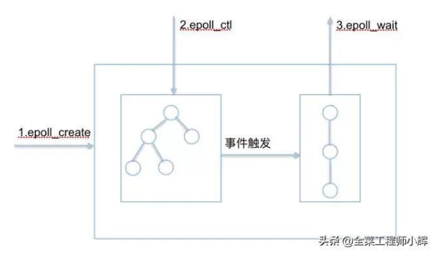

# epoll高效运行的原理

## 1、前言

这篇文章读不懂的没关系，可以先收藏一下。笔者准备介绍完epoll和NIO等知识点，然后写一篇Java网络IO模型的介绍，这样可以使Java网络IO的知识体系更加地完整和严谨。初学者也可以等看完IO模型介绍的博客之后，再回头看这些博客，会更加有收获。

如果你顺利啃下这篇博客，恭喜你，nginx、redis和NIO等核心思想已经被你掌握了，可以顺势去拓展自己的理解。否则，只是孤立的看epoll，时间一长会很快忘记的。

当然，这些核心思想，笔者也会在之后的博客慢慢做详细讲解，欢迎关注

## 2、概念初探

epoll是一种I/O事件通知机制，是linux 内核实现IO多路复用的一个实现。

IO多路复用是指，在一个操作里同时监听多个输入输出源，在其中一个或多个输入输出源可用的时候返回，然后对其的进行读写操作。

IO多路复用，以后的博客会有详细讲解。

1. I/O

输入输出(input/output)的对象可以是文件(file)， 网络(socket)，进程之间的管道(pipe)。在linux系统中，都用文件描述符(fd, file description)来表示。

2. 事件

- 可读事件，当文件描述符关联的内核读缓冲区可读，则触发可读事件。
(可读：内核缓冲区非空，有数据可以读取)

- 可写事件，当文件描述符关联的内核写缓冲区可写，则触发可写事件。
(可写：内核缓冲区不满，有空闲空间可以写入）

3. 通知机制

通知机制，就是当事件发生的时候，则主动通知。通知机制的反面，就是轮询机制。

- epoll的通俗解释

结合以上三条，**epoll的通俗解释是一种当文件描述符的内核缓冲区非空的时候，发出可读信号进行通知；当写缓冲区不满的时候，发出可写信号通知的机制。**

## 3、epoll的API详解

epoll的核心是3个API，核心数据结构是：**1个红黑树和1个链表**



1. `int epoll_create(int size)`

功能：
`int epfd =  epoll_create(size);`
内核会产生一个epoll 实例数据结构并返回一个文件描述符，这个特殊的描述符就是epoll实例的句柄，后面的两个接口都以它为中心（即epfd形参）。

size参数表示所要监视文件描述符的最大值，例如socket的个数，不过在后来的Linux版本中已经被弃用（同时，size不要传0，会报invalid argument错误）

2. `int epoll_ctl(int epfd， int op， int fd， struct epoll_event *event)`

功能：

将被监听的描述符添加到红黑树,或从红黑树中删除,或者对监听事件进行修改。

```c++
typedef union epoll_data { 
    void *ptr; /* 指向用户自定义数据 */ 
    int fd; /* 注册的文件描述符 */ 
    uint32_t u32; /* 32-bit integer */ 
    uint64_t u64; /* 64-bit integer */
    } epoll_data_t;
    
struct epoll_event { 
    uint32_t events; /* 描述epoll事件 */ 
    epoll_data_t data; /* 见上面的结构体 */
};
```

对于需要监视的文件描述符集合，epoll_ctl对红黑树进行管理，红黑树中每个成员由描述符值和所要监控的文件描述符指向的文件表项的引用等组成。

op参数说明操作类型：

- EPOLL_CTL_ADD：向interest list添加一个需要监视的描述符
- EPOLL_CTL_DEL：从interest list中删除一个描述符
- EPOLL_CTL_MOD：修改interest list中一个描述符

struct epoll_event结构描述一个文件描述符的epoll行为。在使用epoll_wait函数返回处于ready状态的描述符列表时，

- data域是唯一能给出描述符信息的字段，所以在调用epoll_ctl加入一个需要监测的描述符时，一定要在此域写入描述符相关信息。

- events域是bit mask，描述一组epoll事件，在epoll_ctl调用中解释为：描述符所期望的epoll事件，可多选。

常用的epoll事件描述如下：

- EPOLLIN：描述符处于可读状态
- EPOLLOUT：描述符处于可写状态
- EPOLLET：将epoll event通知模式设置成edge triggered
- EPOLLONESHOT：第一次进行通知，之后不再监测
- EPOLLHUP：本端描述符产生一个挂断事件，默认监测事件
- EPOLLRDHUP：对端描述符产生一个挂断事件
- EPOLLPRI：由带外数据触发
- EPOLLERR：描述符产生错误时触发，默认检测事件

3. `int epoll_wait(int epfd， struct epoll_event *events， int maxevents， int timeout);`

功能：

阻塞等待注册的事件发生，返回事件的数目，并将触发的事件写入events数组中。

- events: 用来记录被触发的events，其大小应该和maxevents一致。
- maxevents: 返回的events的最大个数。

处于ready状态的那些文件描述符会被复制进ready list中，epoll_wait用于向用户进程返回ready list。events和maxevents两个参数描述一个由用户分配的struct epoll event数组，调用返回时，内核将ready list复制到这个数组中，并将实际复制的个数作为返回值。注意，如果ready list比maxevents长，则只能复制前maxevents个成员；反之，则能够完全复制ready list。

另外，struct epoll event结构中的events域在这里的解释是：在被监测的文件描述符上实际发生的事件。

参数timeout描述在函数调用中阻塞时间上限，单位是ms：

- timeout = -1表示调用将一直阻塞，直到有文件描述符进入ready状态或者捕获到信号才返回；
- timeout = 0用于非阻塞检测是否有描述符处于ready状态，不管结果怎么样，调用都立即返回；
- timeout > 0表示调用将最多持续timeout时间，如果期间有检测对象变为ready状态或者捕获到信号则返回，否则直到超时。

## 4、epoll的两种触发方式

epoll监控多个文件描述符的I/O事件。epoll支持边缘触发(edge trigger，ET)或水平触发（level trigger，LT)，通过epoll_wait等待I/O事件，如果当前没有可用的事件，则阻塞调用线程。

select和poll只支持LT工作模式，epoll的默认的工作模式是LT模式。

1. 水平触发的时机（level trigger，LT)

- 对于读操作，只要缓冲内容不为空，LT模式返回读就绪。
- 对于写操作，只要缓冲区还不满，LT模式会返回写就绪。

当被监控的文件描述符上有可读写事件发生时，epoll_wait()会通知处理程序去读写。如果这次没有把数据一次性全部读写完(如读写缓冲区太小)，那么下次调用 epoll_wait()时，它还会通知你在上没读写完的文件描述符上继续读写，当然如果你一直不去读写，它会一直通知你。如果系统中有大量你不需要读写的就绪文件描述符，而它们每次都会返回，这样会大大降低处理程序检索自己关心的就绪文件描述符的效率。

2. 边缘触发的时机(edge trigger，ET)

- 对于读操作

1）当缓冲区由不可读变为可读的时候，即缓冲区由空变为不空的时候。
2）当有新数据到达时，即缓冲区中的待读数据变多的时候。
3）当缓冲区有数据可读，且应用进程对相应的描述符进行EPOLL_CTL_MOD 修改EPOLLIN事件时。

- 对于写操作

1）当缓冲区由不可写变为可写时。
2）当有旧数据被发送走，即缓冲区中的内容变少的时候。
3）当缓冲区有空间可写，且应用进程对相应的描述符进行EPOLL_CTL_MOD 修改EPOLLOUT事件时。

当被监控的文件描述符上有可读写事件发生时，epoll_wait()会通知处理程序去读写。如果这次没有把数据全部读写完(如读写缓冲区太小)，那么下次调用epoll_wait()时，它不会通知你，也就是它只会通知你一次，直到该文件描述符上出现第二次可读写事件才会通知你。这种模式比水平触发效率高，系统不会充斥大量你不关心的就绪文件描述符。

在ET模式下， 缓冲区从不可读变成可读，会唤醒应用进程，缓冲区数据变少的情况，则不会再唤醒应用进程。

- 举例1：

1）读缓冲区刚开始是空的
2）读缓冲区写入2KB数据
3）水平触发和边缘触发模式此时都会发出可读信号
4）收到信号通知后，读取了1KB的数据，读缓冲区还剩余1KB数据
5）水平触发会再次进行通知，而边缘触发不会再进行通知

- 举例2：（以脉冲的高低电平为例）

1）水平触发：0为无数据，1为有数据。缓冲区有数据则一直为1，则一直触发。
2）边缘触发发：0为无数据，1为有数据，只要在0变到1的上升沿才触发。

JDK并没有实现边缘触发，Netty重新实现了epoll机制，采用边缘触发方式；另外像Nginx也采用边缘触发。

JDK在Linux已经默认使用epoll方式，但是JDK的epoll采用的是水平触发，而Netty重新实现了epoll机制，采用边缘触发方式，netty epoll transport 暴露了更多的nio没有的配置参数，如 TCP_CORK, SO_REUSEADDR等等；另外像Nginx也采用边缘触发。

epoll与select、poll的对比

1. 用户态将文件描述符传入内核的方式

- select：创建3个文件描述符集并拷贝到内核中，分别监听读、写、异常动作。这里受到单个进程可以打开的fd数量限制，默认是1024。
- poll：将传入的struct pollfd结构体数组拷贝到内核中进行监听。
- epoll：执行epoll_create会在内核的高速cache区中建立一颗红黑树以及就绪链表(该链表存储已经就绪的文件描述符)。接着用户执行的epoll_ctl函数添加文件描述符会在红黑树上增加相应的结点。

2. 内核态检测文件描述符读写状态的方式

- select：采用轮询方式，遍历所有fd，最后返回一个描述符读写操作是否就绪的mask掩码，根据这个掩码给fd_set赋值。
- poll：同样采用轮询方式，查询每个fd的状态，如果就绪则在等待队列中加入一项并继续遍历。
- epoll：采用回调机制。在执行epoll_ctl的add操作时，不仅将文件描述符放到红黑树上，而且也注册了回调函数，内核在检测到某文件描述符可读/可写时会调用回调函数，该回调函数将文件描述符放在就绪链表中。

3. 找到就绪的文件描述符并传递给用户态的方式

- select：将之前传入的fd_set拷贝传出到用户态并返回就绪的文件描述符总数。用户态并不知道是哪些文件描述符处于就绪态，需要遍历来判断。
- poll：将之前传入的fd数组拷贝传出用户态并返回就绪的文件描述符总数。用户态并不知道是哪些文件描述符处于就绪态，需要遍历来判断。
- epoll：epoll_wait只用观察就绪链表中有无数据即可，最后将链表的数据返回给数组并返回就绪的数量。内核将就绪的文件描述符放在传入的数组中，所以只用遍历依次处理即可。这里返回的文件描述符是通过mmap让内核和用户空间共享同一块内存实现传递的，减少了不必要的拷贝。

4. 重复监听的处理方式

- select：将新的监听文件描述符集合拷贝传入内核中，继续以上步骤。
- poll：将新的struct pollfd结构体数组拷贝传入内核中，继续以上步骤。
- epoll：无需重新构建红黑树，直接沿用已存在的即可。

epoll更高效的原因

1）select和poll的动作基本一致，只是poll采用链表来进行文件描述符的存储，而select采用fd标注位来存放，所以select会受到最大连接数的限制，而poll不会。
2）select、poll、epoll虽然都会返回就绪的文件描述符数量。但是select和poll并不会明确指出是哪些文件描述符就绪，而epoll会。造成的区别就是，系统调用返回后，调用select和poll的程序需要遍历监听的整个文件描述符找到是谁处于就绪，而epoll则直接处理即可。
3）select、poll都需要将有关文件描述符的数据结构拷贝进内核，最后再拷贝出来。而epoll创建的有关文件描述符的数据结构本身就存于内核态中，系统调用返回时利用mmap()文件映射内存加速与内核空间的消息传递：即epoll使用mmap减少复制开销。
4）select、poll采用轮询的方式来检查文件描述符是否处于就绪态，而epoll采用回调机制。造成的结果就是，随着fd的增加，select和poll的效率会线性降低，而epoll不会受到太大影响，除非活跃的socket很多。
5）epoll的边缘触发模式效率高，系统不会充斥大量不关心的就绪文件描述符
虽然epoll的性能最好，但是在连接数少并且连接都十分活跃的情况下，select和poll的性能可能比epoll好，毕竟epoll的通知机制需要很多函数回调。