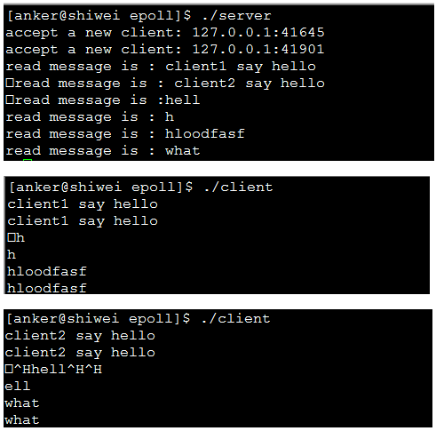

# IO多路复用之epoll总结

## 1、基本知识

　　epoll是在2.6内核中提出的，是之前的select和poll的增强版本。相对于select和poll来说，epoll更加灵活，没有描述符限制。epoll使用一个文件描述符管理多个描述符，将用户关系的文件描述符的事件存放到内核的一个事件表中，这样在用户空间和内核空间的copy只需一次。

## 2、epoll接口

　　epoll操作过程需要三个接口，分别如下：

```c++
#include <sys/epoll.h>
int epoll_create(int size);
int epoll_ctl(int epfd, int op, int fd, struct epoll_event *event);
int epoll_wait(int epfd, struct epoll_event * events, int maxevents, int timeout);
```

（1） int epoll_create(int size);
　　创建一个epoll的句柄，size用来告诉内核这个监听的数目一共有多大。这个参数不同于select()中的第一个参数，给出最大监听的fd+1的值。需要注意的是，当创建好epoll句柄后，它就是会占用一个fd值，在linux下如果查看/proc/进程id/fd/，是能够看到这个fd的，所以在使用完epoll后，必须调用close()关闭，否则可能导致fd被耗尽。

（2）int epoll_ctl(int epfd, int op, int fd, struct epoll_event *event);
　　epoll的事件注册函数，它不同与select()是在监听事件时告诉内核要监听什么类型的事件epoll的事件注册函数，它不同与select()是在监听事件时告诉内核要监听什么类型的事件，而是在这里先注册要监听的事件类型。第一个参数是epoll_create()的返回值，第二个参数表示动作，用三个宏来表示：
EPOLL_CTL_ADD：注册新的fd到epfd中；
EPOLL_CTL_MOD：修改已经注册的fd的监听事件；
EPOLL_CTL_DEL：从epfd中删除一个fd；
第三个参数是需要监听的fd，第四个参数是告诉内核需要监听什么事，struct epoll_event结构如下：

struct epoll_event {
  __uint32_t events;  /* Epoll events */
  epoll_data_t data;  /* User data variable */
};
events可以是以下几个宏的集合：
EPOLLIN ：表示对应的文件描述符可以读（包括对端SOCKET正常关闭）；
EPOLLOUT：表示对应的文件描述符可以写；
EPOLLPRI：表示对应的文件描述符有紧急的数据可读（这里应该表示有带外数据到来）；
EPOLLERR：表示对应的文件描述符发生错误；
EPOLLHUP：表示对应的文件描述符被挂断；
EPOLLET： 将EPOLL设为边缘触发(Edge Triggered)模式，这是相对于水平触发(Level Triggered)来说的。
EPOLLONESHOT：只监听一次事件，当监听完这次事件之后，如果还需要继续监听这个socket的话，需要再次把这个socket加入到EPOLL队列里

（3） int epoll_wait(int epfd, struct epoll_event * events, int maxevents, int timeout);
　　等待事件的产生，类似于select()调用。参数events用来从内核得到事件的集合，maxevents告之内核这个events有多大，这个maxevents的值不能大于创建epoll_create()时的size，参数timeout是超时时间（毫秒，0会立即返回，-1将不确定，也有说法说是永久阻塞）。该函数返回需要处理的事件数目，如返回0表示已超时。

## 3、工作模式

　　epoll对文件描述符的操作有两种模式：LT（level trigger）和ET（edge trigger）。LT模式是默认模式，LT模式与ET模式的区别如下：

　　LT模式：当epoll_wait检测到描述符事件发生并将此事件通知应用程序，应用程序可以不立即处理该事件。下次调用epoll_wait时，会再次响应应用程序并通知此事件。

　　ET模式：当epoll_wait检测到描述符事件发生并将此事件通知应用程序，应用程序必须立即处理该事件。如果不处理，下次调用epoll_wait时，不会再次响应应用程序并通知此事件。

　　ET模式在很大程度上减少了epoll事件被重复触发的次数，因此效率要比LT模式高。epoll工作在ET模式的时候，必须使用非阻塞套接口，以避免由于一个文件句柄的阻塞读/阻塞写操作把处理多个文件描述符的任务饿死。

## 4、测试程序

　　编写一个服务器回射程序echo，练习epoll过程。

### 4.1、服务器代码如下所示：

```c++
#include <stdio.h>
#include <stdlib.h>
#include <string.h>
#include <errno.h>

#include <netinet/in.h>
#include <sys/socket.h>
#include <arpa/inet.h>
#include <sys/epoll.h>
#include <unistd.h>
#include <sys/types.h>

#define IPADDRESS   "127.0.0.1"
#define PORT        8787
#define MAXSIZE     1024
#define LISTENQ     5
#define FDSIZE      1000
#define EPOLLEVENTS 100

//函数声明
//创建套接字并进行绑定
static int socket_bind(const char* ip,int port);
//IO多路复用epoll
static void do_epoll(int listenfd);
//事件处理函数
static void
handle_events(int epollfd,struct epoll_event *events,int num,int listenfd,char *buf);
//处理接收到的连接
static void handle_accpet(int epollfd,int listenfd);
//读处理
static void do_read(int epollfd,int fd,char *buf);
//写处理
static void do_write(int epollfd,int fd,char *buf);
//添加事件
static void add_event(int epollfd,int fd,int state);
//修改事件
static void modify_event(int epollfd,int fd,int state);
//删除事件
static void delete_event(int epollfd,int fd,int state);

int main(int argc,char *argv[])
{
    int  listenfd;
    listenfd = socket_bind(IPADDRESS,PORT);
    listen(listenfd,LISTENQ);
    do_epoll(listenfd);
    return 0;
}

static int socket_bind(const char* ip,int port)
{
    int  listenfd;
    struct sockaddr_in servaddr;
    listenfd = socket(AF_INET,SOCK_STREAM,0);
    if (listenfd == -1)
    {
        perror("socket error:");
        exit(1);
    }
    bzero(&servaddr,sizeof(servaddr));
    servaddr.sin_family = AF_INET;
    inet_pton(AF_INET,ip,&servaddr.sin_addr);
    servaddr.sin_port = htons(port);
    if (bind(listenfd,(struct sockaddr*)&servaddr,sizeof(servaddr)) == -1)
    {
        perror("bind error: ");
        exit(1);
    }
    return listenfd;
}

static void do_epoll(int listenfd)
{
    int epollfd;
    struct epoll_event events[EPOLLEVENTS];
    int ret;
    char buf[MAXSIZE];
    memset(buf,0,MAXSIZE);
    //创建一个描述符
    epollfd = epoll_create(FDSIZE);
    //添加监听描述符事件
    add_event(epollfd,listenfd,EPOLLIN);
    for ( ; ; )
    {
        //获取已经准备好的描述符事件
        ret = epoll_wait(epollfd,events,EPOLLEVENTS,-1);
        handle_events(epollfd,events,ret,listenfd,buf);
    }
    close(epollfd);
}

static void
handle_events(int epollfd,struct epoll_event *events,int num,int listenfd,char *buf)
{
    int i;
    int fd;
    //进行选好遍历
    for (i = 0;i < num;i++)
    {
        fd = events[i].data.fd;
        //根据描述符的类型和事件类型进行处理
        if ((fd == listenfd) &&(events[i].events & EPOLLIN))
            handle_accpet(epollfd,listenfd);
        else if (events[i].events & EPOLLIN)
            do_read(epollfd,fd,buf);
        else if (events[i].events & EPOLLOUT)
            do_write(epollfd,fd,buf);
    }
}
static void handle_accpet(int epollfd,int listenfd)
{
    int clifd;
    struct sockaddr_in cliaddr;
    socklen_t  cliaddrlen;
    clifd = accept(listenfd,(struct sockaddr*)&cliaddr,&cliaddrlen);
    if (clifd == -1)
        perror("accpet error:");
    else
    {
        printf("accept a new client: %s:%d\n",inet_ntoa(cliaddr.sin_addr),cliaddr.sin_port);
        //添加一个客户描述符和事件
        add_event(epollfd,clifd,EPOLLIN);
    }
}

static void do_read(int epollfd,int fd,char *buf)
{
    int nread;
    nread = read(fd,buf,MAXSIZE);
    if (nread == -1)
    {
        perror("read error:");
        close(fd);
        delete_event(epollfd,fd,EPOLLIN);
    }
    else if (nread == 0)
    {
        fprintf(stderr,"client close.\n");
        close(fd);
        delete_event(epollfd,fd,EPOLLIN);
    }
    else
    {
        printf("read message is : %s",buf);
        //修改描述符对应的事件，由读改为写
        modify_event(epollfd,fd,EPOLLOUT);
    }
}

static void do_write(int epollfd,int fd,char *buf)
{
    int nwrite;
    nwrite = write(fd,buf,strlen(buf));
    if (nwrite == -1)
    {
        perror("write error:");
        close(fd);
        delete_event(epollfd,fd,EPOLLOUT);
    }
    else
        modify_event(epollfd,fd,EPOLLIN);
    memset(buf,0,MAXSIZE);
}

static void add_event(int epollfd,int fd,int state)
{
    struct epoll_event ev;
    ev.events = state;
    ev.data.fd = fd;
    epoll_ctl(epollfd,EPOLL_CTL_ADD,fd,&ev);
}

static void delete_event(int epollfd,int fd,int state)
{
    struct epoll_event ev;
    ev.events = state;
    ev.data.fd = fd;
    epoll_ctl(epollfd,EPOLL_CTL_DEL,fd,&ev);
}

static void modify_event(int epollfd,int fd,int state)
{
    struct epoll_event ev;
    ev.events = state;
    ev.data.fd = fd;
    epoll_ctl(epollfd,EPOLL_CTL_MOD,fd,&ev);
}
```

### 4.2、客户端也用epoll实现，控制STDIN_FILENO、STDOUT_FILENO、和sockfd三个描述符，程序如下所示：

```c++
#include <netinet/in.h>
#include <sys/socket.h>
#include <stdio.h>
#include <string.h>
#include <stdlib.h>
#include <sys/epoll.h>
#include <time.h>
#include <unistd.h>
#include <sys/types.h>
#include <arpa/inet.h>

#define MAXSIZE     1024
#define IPADDRESS   "127.0.0.1"
#define SERV_PORT   8787
#define FDSIZE        1024
#define EPOLLEVENTS 20

static void handle_connection(int sockfd);
static void
handle_events(int epollfd,struct epoll_event *events,int num,int sockfd,char *buf);
static void do_read(int epollfd,int fd,int sockfd,char *buf);
static void do_read(int epollfd,int fd,int sockfd,char *buf);
static void do_write(int epollfd,int fd,int sockfd,char *buf);
static void add_event(int epollfd,int fd,int state);
static void delete_event(int epollfd,int fd,int state);
static void modify_event(int epollfd,int fd,int state);

int main(int argc,char *argv[])
{
    int                 sockfd;
    struct sockaddr_in  servaddr;
    sockfd = socket(AF_INET,SOCK_STREAM,0);
    bzero(&servaddr,sizeof(servaddr));
    servaddr.sin_family = AF_INET;
    servaddr.sin_port = htons(SERV_PORT);
    inet_pton(AF_INET,IPADDRESS,&servaddr.sin_addr);
    connect(sockfd,(struct sockaddr*)&servaddr,sizeof(servaddr));
    //处理连接
    handle_connection(sockfd);
    close(sockfd);
    return 0;
}


static void handle_connection(int sockfd)
{
    int epollfd;
    struct epoll_event events[EPOLLEVENTS];
    char buf[MAXSIZE];
    int ret;
    epollfd = epoll_create(FDSIZE);
    add_event(epollfd,STDIN_FILENO,EPOLLIN);
    for ( ; ; )
    {
        ret = epoll_wait(epollfd,events,EPOLLEVENTS,-1);
        handle_events(epollfd,events,ret,sockfd,buf);
    }
    close(epollfd);
}

static void
handle_events(int epollfd,struct epoll_event *events,int num,int sockfd,char *buf)
{
    int fd;
    int i;
    for (i = 0;i < num;i++)
    {
        fd = events[i].data.fd;
        if (events[i].events & EPOLLIN)
            do_read(epollfd,fd,sockfd,buf);
        else if (events[i].events & EPOLLOUT)
            do_write(epollfd,fd,sockfd,buf);
    }
}

static void do_read(int epollfd,int fd,int sockfd,char *buf)
{
    int nread;
    nread = read(fd,buf,MAXSIZE);
        if (nread == -1)
    {
        perror("read error:");
        close(fd);
    }
    else if (nread == 0)
    {
        fprintf(stderr,"server close.\n");
        close(fd);
    }
    else
    {
        if (fd == STDIN_FILENO)
            add_event(epollfd,sockfd,EPOLLOUT);
        else
        {
            delete_event(epollfd,sockfd,EPOLLIN);
            add_event(epollfd,STDOUT_FILENO,EPOLLOUT);
        }
    }
}

static void do_write(int epollfd,int fd,int sockfd,char *buf)
{
    int nwrite;
    nwrite = write(fd,buf,strlen(buf));
    if (nwrite == -1)
    {
        perror("write error:");
        close(fd);
    }
    else
    {
        if (fd == STDOUT_FILENO)
            delete_event(epollfd,fd,EPOLLOUT);
        else
            modify_event(epollfd,fd,EPOLLIN);
    }
    memset(buf,0,MAXSIZE);
}

static void add_event(int epollfd,int fd,int state)
{
    struct epoll_event ev;
    ev.events = state;
    ev.data.fd = fd;
    epoll_ctl(epollfd,EPOLL_CTL_ADD,fd,&ev);
}

static void delete_event(int epollfd,int fd,int state)
{
    struct epoll_event ev;
    ev.events = state;
    ev.data.fd = fd;
    epoll_ctl(epollfd,EPOLL_CTL_DEL,fd,&ev);
}

static void modify_event(int epollfd,int fd,int state)
{
    struct epoll_event ev;
    ev.events = state;
    ev.data.fd = fd;
    epoll_ctl(epollfd,EPOLL_CTL_MOD,fd,&ev);
}
```

## 5、测试结果


