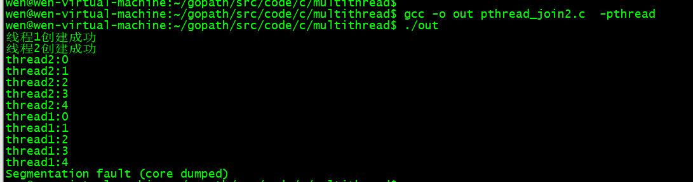
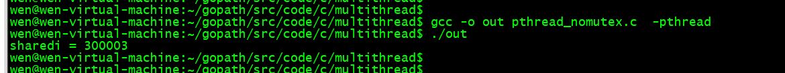
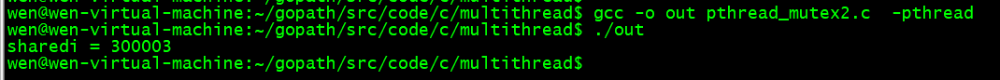
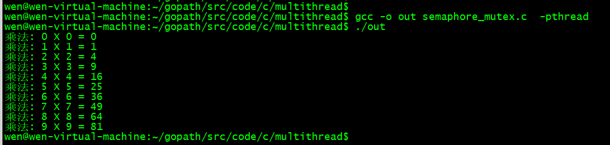

# C语言多线程编程

介绍：什么是线程，线程的优点是什么
线程在Unix系统下，通常被称为轻量级的进程，线程虽然不是进程，但却可以看作是Unix进程的表亲，同一进程中的多条线程将共享该进程中的全部系统资源，如虚拟地址空间，文件描述符和信号处理等等。但同一进程中的多个线程有各自的调用栈(call stack)，自己的寄存器环境（register context)，自己的线程本地存储(thread-local storage)。 一个进程可以有很多线程，每条线程并行执行不同的任务。

线程可以提高应用程序在多核环境下处理诸如文件I/O或者socket I/O等会产生堵塞的情况的表现性能。在Unix系统中，一个进程包含很多东西，包括可执行程序以及一大堆的诸如文件描述符地址空间等资源。在很多情况下，完成相关任务的不同代码间需要交换数据。如果采用多进程的方式，那么通信就需要在用户空间和内核空间进行频繁的切换，开销很大。但是如果使用多线程的方式，因为可以使用共享的全局变量，所以线程间的通信（数据交换）变得非常高效。

Hello World(线程创建、结束、等待）

## 1、线程函数
### 1.1 创建线程 pthread_create

线程创建函数包含四个变量，分别为： 
1. 一个线程变量名，被创建线程的标识 
2. 线程的属性指针，缺省为NULL即可
3. 被创建线程的程序代码 
4. 程序代码的参数 
 
 ```c++
 For example：
 - pthread_t thrd1; 
 - pthread_attr_t attr;
 - void thread_function(void argument); 
 - char *some_argument;

pthread_create(&thrd1, NULL, (void *)&thread_function, (void *) &some_argument);
```

### 1.2 结束线程 pthread_exit

线程结束调用实例：

`pthread_exit(void *retval); `//retval用于存放线程结束的退出状态

### 1.3 线程等待 pthread_join

pthread_create调用成功以后，新线程和老线程谁先执行，谁后执行用户是不知道的，这一块取决与操作系统对线程的调度，如果我们需要等待指定线程结束，需要使用pthread_join函数，这个函数实际上类似与多进程编程中的waitpid。 举个例子，以下假设 A 线程调用 pthread_join 试图去操作B线程，该函数将A线程阻塞，直到B线程退出，当B线程退出以后，A线程会收集B线程的返回码。 该函数包含两个参数：

pthread_t th //th是要等待结束的线程的标识
void **thread_return //指针thread_return指向的位置存放的是终止线程的返回状态。
调用实例：pthread_join(thrd1, NULL);

example1：

```c++
 
#include <stdio.h>
#include <stdlib.h>
#include <pthread.h>
 
void print_message_function (void *ptr);

int main()
{
    int tmp1,tmp2;
    void *retval = NULL;
    pthread_t thread1, thread2;
    char *message1 = "thread1";
    char *message2 = "thread2";

    int ret_thrd1, ret_thrd2;

    ret_thrd1 = pthread_create(&thread1, NULL, (void *)&print_message_function, (void *) message1);
    ret_thrd2 = pthread_create(&thread2, NULL, (void *)&print_message_function, (void *) message2);
    // 线程创建成功，返回0,失败返回失败号
    if (ret_thrd1 != 0) {
       printf("线程1创建失败\n");
    } else {
        printf("线程1创建成功\n");
   }

    if (ret_thrd2 != 0) {
        printf("线程2创建失败\n");
   } else {
       printf("线程2创建成功\n");
    }

    //同样，pthread_join的返回值成功为0
    tmp1 = pthread_join(thread1, &retval);
    printf("thread1 return value(retval) is %d\n", *(int *)retval);
    printf("thread1 return value(tmp) is %d\n", tmp1);
    if (tmp1 != 0) {
       printf("cannot join with thread1\n");
    }
    printf("thread1 end\n");

    tmp2 = pthread_join(thread1, &retval);
    printf("thread2 return value(retval) is %d\n", *(int *)retval);
    printf("thread2 return value(tmp) is %d\n", tmp2);
    if (tmp2 != 0) {
        printf("cannot join with thread2\n");
    }
    printf("thread2 end\n");
}
 
 void print_message_function( void *ptr ) {
    int i = 0;
    for (i; i<5; i++) {
        printf("%s:%d\n", (char *)ptr, i);
    }
}
```
 

编译
wen@wen-virtual-machine:~/gopath/src/code/c/multithread$ `gcc -o out pthread_join2.c  -pthread`
wen@wen-virtual-machine:~/gopath/src/code/c/multithread$ `./out 



一定要加上-lpthread，要不然会报错，因为源代码里引用了pthread.h里的东西，所以在gcc进行链接的时候，必须要找到这些库的二进制实现代码。

运行结果
运行结果 结果分析： 
1. 这段程序我运行了两次，可以看到，两次的运行结果是不一样的，从而说明，新线程和老线程谁先执行，谁后执行用户是不知道的，这一块取决与操作系统对线程的调度。
2. 另外，我们看到，在thread2的join结果出现了错误，打印出cannot join with thread2其实这个是个小错误，因为,我pthread_join传进去的th是thread1,在上面的结果中，thread1早已经结束了，所以我们再次等待thread1结束肯定会出现无法取到状态的错误的。 
3. pthread_join(thread1, &retval)确实等待了thread1的结束，我们看到，在print_message_function函数循环了5遍结束以后，才打印出thread1 end

这是一个非常简单的例子，hello world级别的，只是用来演示Linux下C多线程的使用，在实际应用中，由于多个线程往往会访问共享的资源（典型的是访问同一个全局变量），因此多个县城间存在着竞争的关系，这就需要对多个线程进行同步，对其访问的数据予以保护。

## 2、多线程的同步与互斥

方式一：锁
在主线程中初始化锁为解锁状态

```c
pthread_mutex_t mutex;
pthread_mutex_init(&mutex, NULL);
```

在编译时初始化锁为解锁状态
锁初始化 `pthread_mutex_t mutex = PTHREAD_MUTEX_INITIALIZER;`

访问对象时的加锁操作与解锁操作
加锁 `pthread_mutex_lock(&mutex)`
释放锁 `pthread_mutex_unlock(&mutex)`

### 2.1 不加锁，数据不同步

我们先来看一个不加锁，多个线程访问同一段数据的程序。

```c++
 #include <stdio.h>
#include <stdlib.h>
#include <pthread.h>

int sharedi = 0;
void increse_num(void);

int main(){
    int ret;
    pthread_t thrd1, thrd2, thrd3;
 
    ret = pthread_create(&thrd1, NULL, (void *)increse_num, NULL);
    ret = pthread_create(&thrd2, NULL, (void *)increse_num, NULL);
    ret = pthread_create(&thrd3, NULL, (void *)increse_num, NULL);
    pthread_join(thrd1, NULL);
    pthread_join(thrd2, NULL);
    pthread_join(thrd3, NULL);

    printf("sharedi = %d\n", sharedi);

    return 0; 
}

void increse_num(void) {
    long i,tmp;
    for(i=0; i<=10000; i++) {
        tmp = sharedi;
        tmp = tmp + 1;
        sharedi = tmp;
    }
}
```

编译

wen@wen-virtual-machine:~/gopath/src/code/c/multithread$ `gcc -o out pthread_nomutex.c  -pthread`
wen@wen-virtual-machine:~/gopath/src/code/c/multithread$ `./out` 


运行分析
不加锁

从上图可知，我们no_mutex每次的运行结果都不一致，而且，运行结果也不符合我们的预期，出现了错误的结果。 原因就是三个线程竞争访问全局变量sharedi，并且都没有进行相应的同步。

举个例子，当线程thrd1访问到sharedi的时候，sharedi的值是1000,然后线程thrd1将sharedi的值累加到了1001,可是线程thrd2取到sharedi的时候，sharedi的值是1000,这时候线程thrd2对sharedi的值进行加1操作，使其变成了1001,可是这个时候，sharedi的值已经被线程thrd1加到1001了，然而，thrd2并不知道，所以又将sharedi的值赋为了1001,从而导致了结果的错误。

这样，我们就需要一个线程互斥的机制，来保护sharedi这个变量，让同一时刻，只有一个线程能够访问到这个变量，从而使它的值能够保证正确的变化。

### 2.2 加锁，数据同步

通过加锁，保证sharedi变量在进行变更的时候，只有一个线程能够取到，并在在该线程对其进行操作的时候，其它线程无法对其进行访问。

```c++
  #include <stdio.h>
 #include <stdlib.h>
 #include <pthread.h>
 
int sharedi = 0;
void increse_num(void);

pthread_mutex_t mutex = PTHREAD_MUTEX_INITIALIZER;

int main(){
    int ret;
    pthread_t thrd1, thrd2, thrd3;

    ret = pthread_create(&thrd1, NULL, (void *)increse_num, NULL);
    ret = pthread_create(&thrd2, NULL, (void *)increse_num, NULL);
    ret = pthread_create(&thrd3, NULL, (void *)increse_num, NULL);

    pthread_join(thrd1, NULL);
    pthread_join(thrd2, NULL);
    pthread_join(thrd3, NULL);

    printf("sharedi = %d\n", sharedi);
    return 0;

}

void increse_num(void) {
    long i,tmp;
    for(i=0; i<=10000; i++) {
        /*加锁*/
       if (pthread_mutex_lock(&mutex) != 0) {
           perror("pthread_mutex_lock");
           exit(EXIT_FAILURE);
        }
        tmp = sharedi;
        tmp = tmp + 1;
        sharedi = tmp;
        /*解锁锁*/
        if (pthread_mutex_unlock(&mutex) != 0) {
            perror("pthread_mutex_unlock");
            exit(EXIT_FAILURE);
        }
    }
}
```
 

结果分析
加锁
wen@wen-virtual-machine:~/gopath/src/code/c/multithread$ `gcc -o out pthread_mutex2.c  -pthread`
wen@wen-virtual-machine:~/gopath/src/code/c/multithread$ `./out` 


这一次，我们的结果是正确的，锁有效得保护了我们的数据安全。然而：

锁保护的并不是我们的共享变量（或者说是共享内存），对于共享的内存而言，用户是无法直接对其保护的，因为那是物理内存，无法阻止其他程序的代码访问。事实上，锁之所以对关键区域进行了保护，在本例中，是因为所有线程都遵循了一个规则，那就是在进入关键区域钱加同一把锁，在退出关键区域钱释放同一把锁

我们从上述运行结果中可以看到，加锁是会带来额外的开销的，加锁的代码其运行速度，明显比不加锁的要慢一些，所以，在使用锁的时候，要合理，在不需要对关键区域进行保护的场景下，我们便不要画蛇添足，为其加锁了

* 方式二：信号量

锁有一个很明显的缺点，那就是它只有两种状态：锁定与不锁定。

**信号量本质上是一个非负数的整数计数器，它也被用来控制对公共资源的访问。** 当公共资源增加的时候，调用信号量增加函数`sem_post()`对其进行增加，当公共资源减少的时候，调用函数`sem_wait()`来减少信号量。其实，我们是可以把锁当作一个0-1信号量的。

它们是在/usr/include/semaphore.h中进行定义的，信号量的数据结构为sem_t, 本质上，它是一个long型整数

相关函数
在使用semaphore之前，我们需要先引入头文件`#include <semaphore.h>`

初始化信号量： `int sem_init(sem_t *sem, int pshared, unsigned int value);`

* 成功返回0，失败返回-1
* 参数
    * sem：指向信号量结构的一个指针
    * pshared： 不是0的时候，该信号量在进程间共享，否则只能为当前进程的所有线程们共享
    * value：信号量的初始值

信号量减1操作，当sem=0的时候该函数会堵塞 int sem_wait(sem_t *sem);

* 成功返回0，失败返回-1
* 参数
    * sem：指向信号量的一个指针

信号量加1操作 `int sem_post(sem_t *sem);`
参数与返回同上
销毁信号量 `int sem_destroy(sem_t *sem);`
参数与返回同上
代码示例


```c++
#include <stdio.h>
#include <unistd.h>
#include <pthread.h>
#include <semaphore.h>

#define MAXSIZE 10

int stack[MAXSIZE];
int size = 0;
sem_t sem; //semphore信号量

// 生产者
void provide_data(void) {
    int i;
    for (i=0; i< MAXSIZE; i++) {
       stack[i] = i;
       sem_post(&sem); //为信号量加1
    }
}

// 消费者
void handle_data(void) {
    int i;
    while((i = size++) < MAXSIZE) {
        sem_wait(&sem);//为信号量减1
        printf("乘法: %d X %d = %d\n", stack[i], stack[i], stack[i]*stack[i]);
        sleep(1);
    }
}

int main(void) {
    pthread_t provider, handler; 
    sem_init(&sem, 0, 0); //信号量初始化
    pthread_create(&provider, NULL, (void *)handle_data, NULL);
    pthread_create(&handler, NULL, (void *)provide_data, NULL);
    pthread_join(provider, NULL);
    pthread_join(handler, NULL);
    sem_destroy(&sem); //销毁信号量

    return 0;
}
```
 

运行结果：
信号量的使用
wen@wen-virtual-machine:~/gopath/src/code/c/multithread$ `gcc -o out semaphore_mutex.c  -pthread`
wen@wen-virtual-machine:~/gopath/src/code/c/multithread$ `./out` 



因为信号量机制的存在，所以代码在handle_data的时候，如果sem_wait(&sem)时，sem为0,那么代码会堵塞在sem_wait上面，从而避免了在stack中访问错误的index而使整个程序崩溃。

参考资料