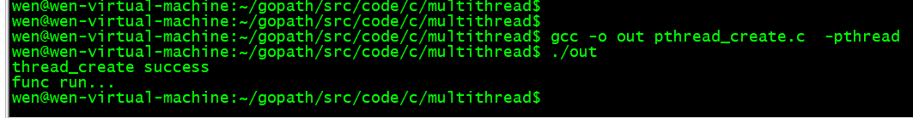
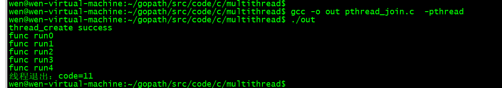
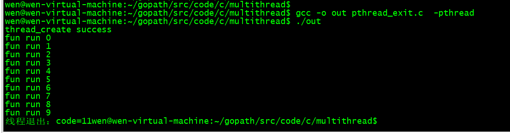
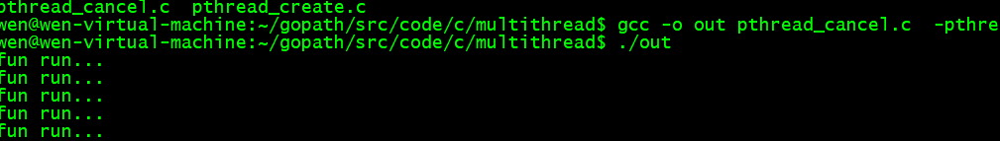
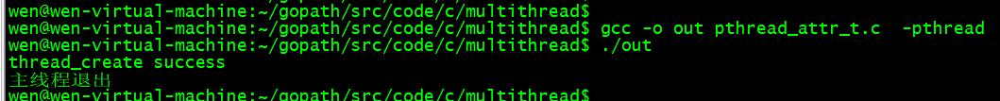
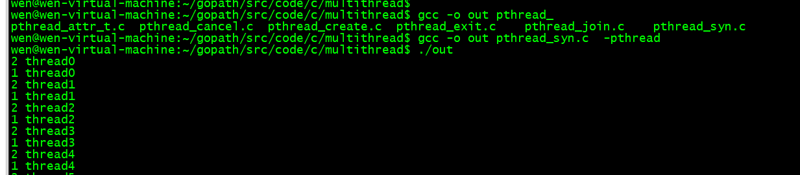
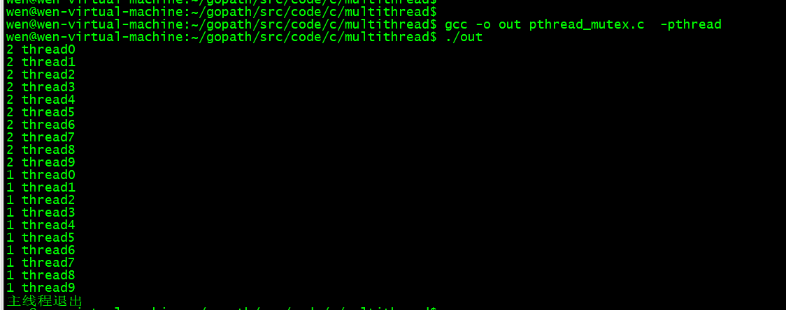

# linux下c语言的多线程编程

<!--GFM-TOC -->
* [1创建线程](#1创建线程)
* [2线程挂起](#2线程挂起)
* [3线程终止](#3线程终止)
* [4线程分离](#4线程分离)
* [5线程取消](#5线程取消)
* [6线程同步](#6线程同步)
<!-- GFM-TOC -->
 
* 正文

我们在写linux的服务的时候，经常会用到linux的多线程技术以提高程序性能

 
* 多线程的一些小知识：

1. 一个应用程序可以启动若干个线程。
2. 线程(Lightweight Process，LWP），是程序执行的最小单元。
3. 一般一个最简单的程序最少会有一个线程，就是程序本身，也就是主函数（单线程的进程可以简单的认为只有一个线程的进程）
4. 一个线程阻塞并不会影响到另外一个线程。
5. 多线程的进程可以尽可能的利用系统CPU资源。

 
## 1创建线程

```c++
int pthread_create(pthread_t *thread,const pthread_attr_t *attr, void *(*start_routine)(void*), void *arg);
```

在main函数里面我们调用上面的函数进行创建一个线程。

* 函数参数：
    * 第一个参数：pthread_t代表创建线程的唯一标识，是一个结构体，需要我们创建好后，将这个结构体的指针传递过去。
    * 第二个参数：pthread_attr_t,代表创建这个线程的一些配置，比如分配栈的大小等等。一般我们可以填NULL,代表默认的创建线程的配置
    * 第三个参数：代表一个函数的地址，创建线程时，会调用这个函数，函数的返回值是void*,函数的参数也是void*,一般格式就像void * func(void * arg){}
    * 第四个参数：代表调用第三个函数传递的参数
* 函数返回值：
    *   函数成功返回0，如果不等于0则代表函数调用失败，此时通过strerror(errno)可以打印出具体的错误。

　　注意：每个线程都拥有一份errno副本，不同的线程拥有不同的errno

先上一段在一个进程中创建一个线程的简单的代码，然后慢慢深入。

```c++
#include<pthread.h>
#include<stdio.h>
#include<stdlib.h>
#include<string.h>
#include<errno.h>
#include<unistd.h>

void * func(void * arg)
{
    printf("func run...\n");
    return NULL;
}
int main()
{

    pthread_t t1;
    int err = pthread_create(&t1,NULL,func,NULL);
    if(err!=0)
    {
        printf("thread_create Failed:%s\n",strerror(errno));

    }else{
        printf("thread_create success\n");
    }
    sleep(1);
    return EXIT_SUCCESS;
}
```
 
最后通过gcc编译

wen@wen-virtual-machine:~/gopath/src/code/c/multithread$ `gcc -o out pthread_create.c  -pthread`
wen@wen-virtual-machine:~/gopath/src/code/c/multithread$ `./out `

编译的时候需要加上-lpthread 用来链接libpthread.so动态库，不然会提示找不到function

函数调用返回结果



问题：为什么调用sleep函数

答：可能新创建的线程还没运行到打印的方法主线程就结束了，而主线程结束，所有线程都会结束了。

## 2线程挂起

有时候我们在一个线程中创建了另外一个线程，主线程要等到创建的线程返回了，获取该线程的返回值后主线程才退出。这个时候就需要用到线程挂起。

`int pthread_join(pthread_t th, void **thr_return);`

pthread_join函数用于挂起当前线程，直至th指定的线程终止为止。

```c++
#include<pthread.h>
#include<stdio.h>
#include<stdlib.h>
#include<string.h>
#include<errno.h>
#include<unistd.h>

void * func(void * arg)
{
    int i=0;
    for(;i<5;i++)
    {
        printf("func run%d\n",i);
        sleep(1);
    }
    int * p = (int *)malloc(sizeof(int));
    *p=11;

    return p;

}
int main()
{
    pthread_t t1;
    int err = pthread_create(&t1,NULL,func,NULL);
    if(err!=0)
    {
        printf("thread_create Failed:%s\n",strerror(errno));

    }else{
        printf("thread_create success\n");
    }
    void *p=NULL;
    pthread_join(t1,&p);
    printf("线程退出：code=%d\n",*(int*)p);
    return EXIT_SUCCESS;
}
```

函数执行结果
wen@wen-virtual-machine:~/gopath/src/code/c/multithread$ `gcc -o out pthread_join.c  -pthread`
wen@wen-virtual-machine:~/gopath/src/code/c/multithread$ `./out `



我们主函数一直在等待创建的线程执行完，并且得到了线程执行结束的返回值

## 3线程终止

进程终止时exit()函数，那么线程终止是什么呢？

`void pthread_exit(void *arg);`

线程终止的三种情况：

1. 线程只是从启动函数中返回，返回值是线程的退出码。
2. 线程可以被同一进程中的其他线程取消。
3. 线程调用pthread_exit。
 
```c++
#include<pthread.h>
#include<stdio.h>
#include<stdlib.h>
#include<string.h>
#include<errno.h>
#include<unistd.h>

void * func(void * arg)
{
    int i=0;
    while(1)
    {
        if(i==10)
        {
            int * p = (int *)malloc(sizeof(int));
            *p=11;
            pthread_exit(p);
        }
        printf("fun run %d\n",i++);
        sleep(1);
    }
    return NULL;
}
int main()
{
    pthread_t t1;
    int err = pthread_create(&t1,NULL,func,NULL);
    if(err!=0)
    {
        printf("thread_create Failed:%s\n",strerror(errno));

    }else{
        printf("thread_create success\n");
    }
    void *p=NULL;
    pthread_join(t1,&p);
    printf("线程退出：code=%d",*(int*)p);
    return EXIT_SUCCESS;
}
```


pthread_exit函数的参数就跟正常线程结束return的使用时一样的，都会被等待它结束的主线程获取到。

函数运行结果：
wen@wen-virtual-machine:~/gopath/src/code/c/multithread$ `gcc -o out pthread_exit.c  -pthread`
wen@wen-virtual-machine:~/gopath/src/code/c/multithread$ `./out`



## 4线程分离

`int pthread_detach(pthread_t th);`

pthread_detach函数使线程处于被分离状态。

如果不等待一个线程，同时对线程的返回值不感兴趣，可以设置这个线程为被分离状态，让系统在线程退出的时候自动回收它所占用的资源。

一个线程不能自己调用pthread_detach改变自己为被分离状态，只能由其他线程调用pthread_detach。


## 5线程取消

`int pthread_cancel(pthread_t th);`

pthread_cancel函数允许一个线程取消th指定的另一个线程。

函数成功，返回0，否则返回非0。

```c++
#include<pthread.h>
#include<stdio.h>
#include<stdlib.h>
#include<string.h>
#include<errno.h>
#include<unistd.h>

void * func1(void * arg)
{
    while(1)
    {
        printf("fun run...\n");
        sleep(1);
    }
    return NULL;
}
int main()
{
    pthread_t t1;
    if(pthread_create(&t1,NULL,func1,NULL) != 0)
    {
        printf("thread_create Failed:%s\n",strerror(errno));
        return -1;
    }
    sleep(5);
    pthread_cancel(t1);
    pthread_join(t1,NULL);
    return EXIT_SUCCESS;

}
```

函数执行结果：
wen@wen-virtual-machine:~/gopath/src/code/c/multithread$ `gcc -o out pthread_cancel.c  -pthread`
wen@wen-virtual-machine:~/gopath/src/code/c/multithread$ `./out `


 

上面我们说过创建一个线程函数pthread_create的第二个参数，用来决定创建线程的一些初始化状态，这里我们 举个例子，改线程一创建就是分离状态的线程（上面介绍了pthread_detach函数的概念，可以通过pthread_attr_t在创建线程的时候就指定线程属性为detach，而不用创建以后再去修改线程属性。）

先上一段代码：

```c++
#include<pthread.h>
#include<stdio.h>
#include<stdlib.h>
#include<string.h>
#include<errno.h>
#include<unistd.h>

void * func(void * arg)
{
    int i=0;
    for(;i<5;i++)
    {
        printf("func run%d\n",i);
        sleep(1);
    }
    int * p = (int *)malloc(sizeof(int));
    *p=11;
    return p;
}
int main()
{
    pthread_t t1;
    pthread_attr_t attr;//申明一个attr的结构体
    pthread_attr_init(&attr);//初始化结构体
    pthread_attr_setdetachstate(&attr, PTHREAD_CREATE_DETACHED);//设置线程为分离线程

    int err = pthread_create(&t1,&attr,func,NULL);
    if(err!=0)
    {
        printf("thread_create Failed:%s\n",strerror(errno));

    }else{
        printf("thread_create success\n");
    }
    pthread_attr_destroy(&attr);

    pthread_join(t1,NULL);
    printf("主线程退出\n");
    return EXIT_SUCCESS;

}
```

pthread_attr_t就是我们要传入的参数的结构体，一般申明的步骤有

1. 申明一个pthread_attr_t对象
2. 函数pthread_attr_init初始化attr结构。
3. 设置线程的一些属性，比如pthread_attr_setdetachstate函数就是设置该线程创建的时候为正常状态还是分离状态。
4. 函数pthread_attr_destroy释放attr内存空间

pthread_attr_setdetachstate把线程属性设置为下面两个合法值之一：

|值|说明|
|:--|:--|
|PTHREAD_CREATE_DETACHED|设置线程为分离状态|
|PTHREAD_CREATE_JOINABLE|设置线程为正常状态|

上面函数运行结果：

wen@wen-virtual-machine:~/gopath/src/code/c/multithread$ `gcc -o out pthread_attr_t.c  -pthread`
wen@wen-virtual-machine:~/gopath/src/code/c/multithread$ `./out `



因为线程是个分离状态的，所以pthread_join挂起会失效，主线程很快运行结束，程序也就结束了，创建的线程还没来得及运行

 
## 6线程同步

有时候我们多个线程处理订单扣减库存会遇到这样的问题，两个线程同时进入一段代码先查询库存，两个都查出来为还剩一件库存，第一个线程用掉这个库存后，将库存变为0，但是第二个线程刚才也查出来为1了，所以他还认为有库存，

这个时候操作就会引发我们想不到的意外，库存变为负数了！！所以这个时候就需要使用线程的同步！！

先上一段代码看看效果：

```c++
#include<pthread.h>
#include<stdio.h>
#include<stdlib.h>
#include<string.h>
#include<errno.h>
#include<unistd.h>

void * func(void * arg)
{
    int threadno =*(int*)arg;
    int i=0;
    for(;i<10;i++)
    {
        printf("%d thread%d \n",threadno,i);
        sleep(1);
    }
    return NULL;
}
int main()
{
    pthread_t t1,t2;
    int i1=1,i2=2;
    pthread_create(&t1,NULL,func,&i1);
    pthread_create(&t2,NULL,func,&i2);

    pthread_join(t1,NULL);
    pthread_join(t2,NULL);

    printf("主线程退出\n");
    return EXIT_SUCCESS;
}
```

函数运行结果：
wen@wen-virtual-machine:~/gopath/src/code/c/multithread$ `gcc -o out pthread_syn.c  -pthread`
wen@wen-virtual-machine:~/gopath/src/code/c/multithread$ `./out `


 

可以看到两个线程是没有规律的争相处理的，如果这段代码是扣减库存就完蛋啦！，所以我们要对这段代码进行加锁，同一时刻只能有一个线程进入操作！

先上代码：

```c++
#include<pthread.h>
#include<stdio.h>
#include<stdlib.h>
#include<string.h>
#include<errno.h>
#include<unistd.h>

pthread_mutex_t mutex = PTHREAD_MUTEX_INITIALIZER;

void * func(void * arg)
{
    pthread_mutex_lock(&mutex);//对mutex加锁，其他线程进入后将会挂起，知道这个锁被解锁
    int threadno =*(int*)arg;
    int i=0;
    for(;i<10;i++)
    {
        printf("%d thread%d \n",threadno,i);
        sleep(1);
    }
    pthread_mutex_unlock(&mutex);
    return NULL;
}
int main()
{
    pthread_t t1,t2;

    int i1=1,i2=2;
    pthread_create(&t1,NULL,func,&i1);
    pthread_create(&t2,NULL,func,&i2);

    pthread_join(t1,NULL);
    pthread_join(t2,NULL);

    printf("主线程退出\n");
    return EXIT_SUCCESS;
}
```
 
函数运行结果：

wen@wen-virtual-machine:~/gopath/src/code/c/multithread$ `gcc -o out pthread_mutex.c  -pthread`
wen@wen-virtual-machine:~/gopath/src/code/c/multithread$ `./out`


 

可以看到第二个线程先进入后一直运行结束，对mutex解锁后，第一个线程才能进方法里面运行！否则会挂起，一直等到锁被解锁！

PTHREAD_MUTEX_INITIALIZER是初始化一个快速锁的宏定义。
`pthread_mutex_t mutex = PTHREAD_MUTEX_INITIALIZER;`

 

加锁解锁函数：

```c++
int pthread_mutex_lock(pthread_mutex_t *mutex);

int pthread_mutex_unlock(pthread_mutex_t *mutex);
```