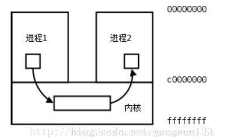
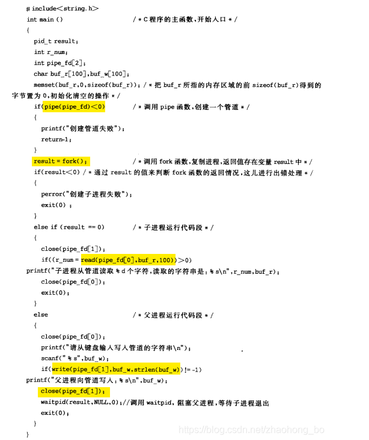
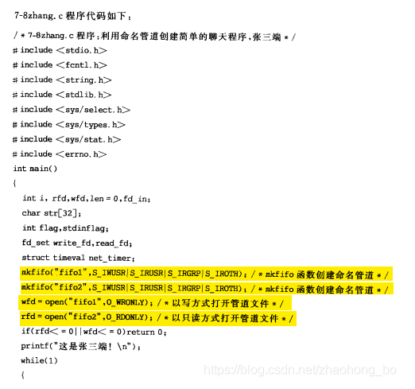
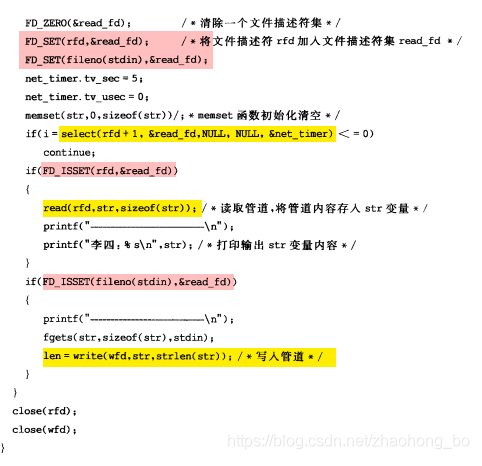
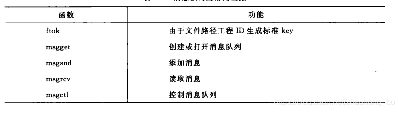
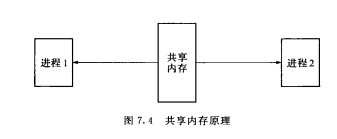
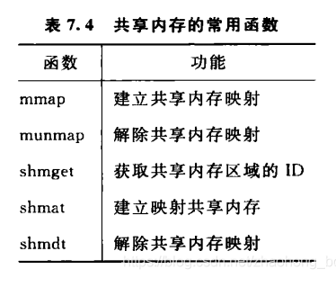

# 进程间通讯的7种方式

## 1、常见的通信方式

1. 管道pipe：管道是一种半双工的通信方式，数据只能单向流动，而且只能在具有亲缘关系的进程间使用。进程的亲缘关系通常是指父子进程关系。
2. 命名管道FIFO(file in file out)：有名管道也是半双工的通信方式，但是它允许无亲缘关系进程间的通信。例1，文件open/read/write/close。例2：ps -ef | grep **
3. 消息队列MessageQueue：消息队列是由消息的链表，存放在内核中并由消息队列标识符标识。消息队列克服了信号传递信息少、管道只能承载无格式字节流以及缓冲区大小受限等缺点。将消息传入队列进行通信。
4. 共享存储SharedMemory：共享内存就是映射一段能被其他进程所访问的内存，这段共享内存由一个进程创建，但多个进程都可以访问。**共享内存是最快的 IPC 方式**，它是针对其他进程间通信方式运行效率低而专门设计的。它往往与其他通信机制，如信号量，配合使用，来实现进程间的同步和通信。
5. 信号量Semaphore：信号量是一个计数器，可以用来控制多个进程对共享资源的访问。它常作为一种锁机制，防止某进程正在访问共享资源时，其他进程也访问该资源。因此，主要作为进程间以及同一进程内不同线程之间的同步手段。
6. 套接字Socket：套解口也是一种进程间通信机制，与其他通信机制不同的是，它可用于不同及其间的进程通信。
7. 信号 ( sinal ) ： 信号是一种比较复杂的通信方式，用于通知接收进程某个事件已经发生。

## 2、按通信类型区分

1. 共享存储器系统

1)基于共享数据结构的通信方式
（仅适用于传递相对少量的数据，通信效率低，属于低级通信）
2)基于共享存储区的通信方式

2. 管道通信系统

管道是指用于连接一个读进程和一个写进程以实现它们之间通信的一个共享文件（pipe文件）
管道机制需要提供一下几点的协调能力
1)互斥，即当一个进程正在对pipe执行读/写操作时，其它进程必须等待
2)同步，当一个进程将一定数量的数据写入，然后就去睡眠等待，直到读进程将数据取走，再去唤醒。读进程与之类似
3)确定对方是否存在

3. 消息传递系统

1)直接通信方式
发送进程利用OS所提供的发送原语直接把消息发给目标进程
2)间接通信方式
发送和接收进程都通过共享实体（邮箱）的方式进行消息的发送和接收

4. 客户机服务器系统

1)套接字 – 通信标识型的数据结构是进程通信和网络通信的基本构件
基于文件型的 （当通信进程都在同一台服务器中）其原理类似于管道
基于网络型的（非对称方式通信，发送者需要提供接收者命名。通信双方的进程运行在不同主机环境下被分配了一对套接字，一个属于发送进程，一个属于接收进程）
2)远程过程调用和远程方法调用

## 3、详解

### 3.1 管道

管道，通常指无名管道，是 UNIX 系统IPC最古老的形式。

1、特点：
它是半双工的（即数据只能在一个方向上流动），具有固定的读端和写端。
它只能用于具有亲缘关系的进程之间的通信（也是父子进程或者兄弟进程之间）。

它可以看成是一种特殊的文件，对于它的读写也可以使用普通的read、write 等函数。但是它不是普通的文件，并不属于其他任何文件系统，并且只存在于内存中。

管道分为pipe（无名管道）和fifo（命名管道）两种，除了建立、打开、删除的方式不同外，这两种管道几乎是一样的。他们都是通过内核缓冲区实现数据传输。

pipe用于相关进程之间的通信，例如父进程和子进程，它通过pipe()系统调用来创建并打开，当最后一个使用它的进程关闭对他的引用时，pipe将自动撤销。
FIFO即命名管道，在磁盘上有对应的节点，但没有数据块——换言之，只是拥有一个名字和相应的访问权限，通过mknode()系统调用或者mkfifo()函数来建立的。一旦建立，任何进程都可以通过文件名将其打开和进行读写，而不局限于父子进程，当然前提是进程对FIFO有适当的访问权。当不再被进程使用时，FIFO在内存中释放，但磁盘节点仍然存在。
管道的实质是一个内核缓冲区，进程以先进先出的方式从缓冲区存取数据：管道一端的进程顺序地将进程数据写入缓冲区，另一端的进程则顺序地读取数据，该缓冲区可以看做一个循环队列，读和写的位置都是自动增加的，一个数据只能被读一次，读出以后再缓冲区都不复存在了。当缓冲区读空或者写满时，有一定的规则控制相应的读进程或写进程是否进入等待队列，当空的缓冲区有新数据写入或慢的缓冲区有数据读出时，就唤醒等待队列中的进程继续读写。


在这里插入图片描述

### 3.2 无名管道

pipe的例子：父进程创建管道，并在管道中写入数据，而子进程从管道读出数据


在这里插入图片描述

### 3.3 命名管道

和无名管道的主要区别在于，命名管道有一个名字，命名管道的名字对应于一个磁盘索引节点，有了这个文件名，任何进程有相应的权限都可以对它进行访问。

而无名管道却不同，进程只能访问自己或祖先创建的管道，而不能访任意访问已经存在的管道——因为没有名字。

Linux中通过系统调用mknod()或makefifo()来创建一个命名管道。最简单的方式是通过直接使用shell

```c++
mkfifo myfifo
1
等价于

mknod myfifo p
1
```

以上命令在当前目录下创建了一个名为myfifo的命名管道。用ls -p命令查看文件的类型时，可以看到命名管道对应的文件名后有一条竖线"|"，表示该文件不是普通文件而是命名管道。

使用open()函数通过文件名可以打开已经创建的命名管道，而无名管道不能由open来打开。当一个命名管道不再被任何进程打开时，它没有消失，还可以再次被打开，就像打开一个磁盘文件一样。

可以用删除普通文件的方法将其删除，实际删除的事磁盘上对应的节点信息。

例子：用命名管道实现聊天程序，一个张三端，一个李四端。两个程序都建立两个命名管道，fifo1,fifo2,张三写fifo1，李四读fifo1；李四写fifo2，张三读fifo2。

用select把，管道描述符和stdin假如集合，用select进行阻塞，如果有i/o的时候唤醒进程。（粉红色部分为select部分，黄色部分为命名管道部分）



在这里插入图片描述

### 3.4 消息队列

消息队列，就是一个消息的链表，是一系列保存在内核中消息的列表。用户进程可以向消息队列添加消息，也可以向消息队列读取消息。

消息队列与管道通信相比，其优势是对每个消息指定特定的消息类型，接收的时候不需要按照队列次序，而是可以根据自定义条件接收特定类型的消息。

可以把消息看做一个记录，具有特定的格式以及特定的优先级。对消息队列有写权限的进程可以向消息队列中按照一定的规则添加新消息，对消息队列有读权限的进程可以从消息队列中读取消息。

消息队列的常用函数如下表：


在这里插入图片描述

进程间通过消息队列通信，主要是：创建或打开消息队列，添加消息，读取消息和控制消息队列。

### 3.5 共享内存

共享内存允许两个或多个进程共享一个给定的存储区，这一段存储区可以被两个或两个以上的进程映射至自身的地址空间中，一个进程写入共享内存的信息，可以被其他使用这个共享内存的进程，通过一个简单的内存读取错做读出，从而实现了进程间的通信。

采用共享内存进行通信的一个主要好处是效率高，因为进程可以直接读写内存，而不需要任何数据的拷贝，对于像管道和消息队里等通信方式，则需要再内核和用户空间进行四次的数据拷贝，而共享内存则只拷贝两次：一次从输入文件到共享内存区，另一次从共享内存到输出文件。


在这里插入图片描述

一般而言，进程之间在共享内存时，并不总是读写少量数据后就解除映射，有新的通信时在重新建立共享内存区域；而是保持共享区域，直到通信完毕为止，这样，数据内容一直保存在共享内存中，并没有写回文件。共享内存中的内容往往是在解除映射时才写回文件，因此，采用共享内存的通信方式效率非常高。


在这里插入图片描述

共享内存有两种实现方式：1、内存映射 2、共享内存机制

### 3.6 信号量

信号量（semaphore）与已经介绍过的 IPC 结构不同，它是一个计数器。信号量用于实现进程间的互斥与同步，而不是用于存储进程间通信数据。

1、特点
信号量用于进程间同步，若要在进程间传递数据需要结合共享内存。

信号量基于操作系统的 PV 操作，程序对信号量的操作都是原子操作。

每次对信号量的 PV 操作不仅限于对信号量值加 1 或减 1，而且可以加减任意正整数。

支持信号量组。

2、原型
最简单的信号量是只能取 0 和 1 的变量，这也是信号量最常见的一种形式，叫做二值信号量（Binary Semaphore）。而可以取多个正整数的信号量被称为通用信号量。

Linux 下的信号量函数都是在通用的信号量数组上进行操作，而不是在一个单一的二值信号量上进行操作。

```c++
#include <sys/sem.h>
// 创建或获取一个信号量组：若成功返回信号量集ID，失败返回-1
int semget(key_t key, int num_sems, int sem_flags);
// 对信号量组进行操作，改变信号量的值：成功返回0，失败返回-1
int semop(int semid, struct sembuf semoparray[], size_t numops);  
// 控制信号量的相关信息
int semctl(int semid, int sem_num, int cmd, ...);
```