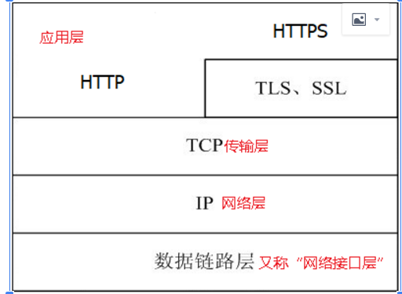
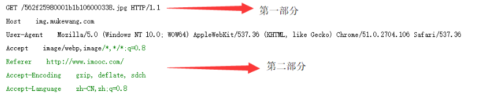
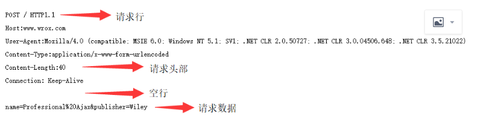
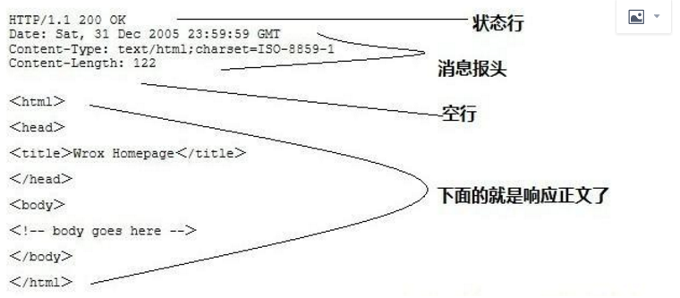
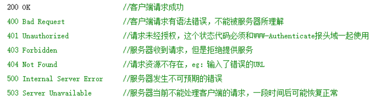
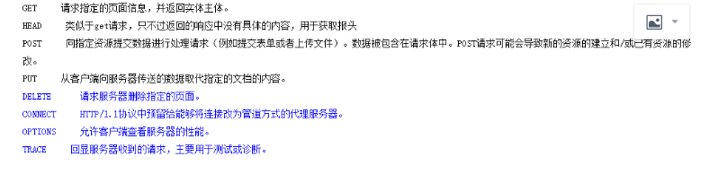

# HTTP协议详解

## 1、HTTP简介   

1.HTTP协议，即超文本传输协议(Hypertext transfer protocol)。是一种详细规定了浏览器和万维网(WWW = World Wide Web)服务器之间互相通信的规则，通过因特网传送万维网文档的数据传送协议。
2.HTTP协议作为TCP/IP模型中应用层的协议也不例外。HTTP协议通常承载于TCP协议之上，有时也承载于TLS或SSL协议层之上，这个时候，就成了我们常说的HTTPS。如下图：

 

3.HTTP是一个应用层协议，由请求和响应构成，是一个标准的客户端服务器模型。HTTP是一个无状态的协议。
4.HTTP默认的端口号为80，HTTPS的端口号为443。
5.浏览网页是HTTP的主要应用，但是这并不代表HTTP就只能应用于网页的浏览。HTTP是一种协议，只要通信的双方都遵守这个协议，HTTP就能有用武之地。比如咱们常用的QQ，迅雷这些软件，都会使用HTTP协议(还包括其他的协议)。

## 2、HTTP特点   

1、简单快速：客户向服务器请求服务时，只需传送请求方法和路径。由于HTTP协议简单，使得HTTP服务器的程序规模小，因而通信速度很快。
2、灵活：HTTP允许传输任意类型的数据对象。正在传输的类型由Content-Type加以标记。
3、HTTP 0.9和1.0使用非持续连接：限制每次连接只处理一个请求，服务器处理完客户的请求，并收到客户的应答后，即断开连接。HTTP 1.1使用持续连接：不必为每个web对象创建一个新的连接，一个连接可以传送多个对象，采用这种方式可以节省传输时间。
4、无状态：HTTP协议是无状态协议。无状态是指协议对于事务处理没有记忆能力。缺少状态意味着如果后续处理需要前面的信息，则它必须重传，这样可能导致每次连接传送的数据量增大。另一方面，在服务器不需要先前信息时它的应答就较快。
5、支持B/S及C/S模式。

## 3、HTTP工作流程  

一次HTTP操作称为一个事务，其工作过程可分为四步：
1.首先客户机与服务器需要建立连接TCP/IP(三次握手)。只要单击某个超级链接，HTTP的工作开始。
2.建立连接后，客户机发送一个请求给服务器，请求方式的格式为：统一资源标识符（URL）、协议版本号，后边是MIME信息包括请求修饰符、客户机信息和可能的内容。
3.服务器接到请求后，给予相应的响应信息，其格式为一个状态行，包括信息的协议版本号、一个成功或错误的代码，后边是MIME信息包括服务器信息、实体信息和可能的内容。
4.客户端接收服务器所返回的信息通过浏览器显示在用户的显示屏上，然后客户机与服务器断开连接。
如果在以上过程中的某一步出现错误，那么产生错误的信息将返回到客户端，有显示屏输出。对于用户来说，这些过程是由HTTP自己完成的，用户只要用鼠标点击，等待信息显示就可以了。
 
## 4、HTTP之请求消息Request 

客户端发送一个HTTP请求到服务器的请求消息包括以下格式：
请求行、请求头部、空行和请求数据四个部分组成。
(1)Get请求例子

 

第一部分：请求行，用来说明请求类型,要访问的资源以及所使用的HTTP版本.
GET说明请求类型为GET,[/562f25980001b1b106000338.jpg]为要访问的资源，该行的最后一部分说明使用的是HTTP1.1版本。
第二部分：请求头部，紧接着请求行（即第一行）之后的部分，用来说明服务器要使用的附加信息
从第二行起为请求头部，HOST将指出请求的目的地.User-Agent,服务器端和客户端脚本都能访问它,它是浏览器类型检测逻辑的重要基础.该信息由你的浏览器来定义,并且在每个请求中自动发送等等
第三部分：空行，请求头部后面的空行是必须的
即使第四部分的请求数据为空，也必须有空行。
第四部分：请求数据也叫主体，可以添加任意的其他数据。
这个例子的请求数据为空。

(2)POST请求例子
 

第一部分：请求行，第一行明了是post请求，以及http1.1版本。
第二部分：请求头部，第二行至第六行。
第三部分：空行，第七行的空行。
第四部分：请求数据，第八行。
 
## 5、HTTP之响应消息Response

一般情况下，服务器接收并处理客户端发过来的请求后会返回一个HTTP的响应消息。
HTTP响应也由四个部分组成，分别是：状态行、消息报头、空行和响应正文。
 
 

第一部分：状态行，由HTTP协议版本号， 状态码， 状态消息 三部分组成。
第一行为状态行，（HTTP/1.1）表明HTTP版本为1.1版本，状态码为200，状态消息为（ok）
第二部分：消息报头，用来说明客户端要使用的一些附加信息
第二行和第三行和第四行为消息报头，
Date:生成响应的日期和时间；Content-Type:指定了MIME类型的HTML(text/html),编码类型是ISO-8859-1
第三部分：空行，消息报头后面的空行是必须的
第四部分：响应正文，服务器返回给客户端的文本信息。
空行后面的html部分为响应正文。
 
## 6、HTTP之状态码  

状态代码有三位数字组成，第一个数字定义了响应的类别，共分五种类别:
1xx：指示信息--表示请求已接收，继续处理
2xx：成功--表示请求已被成功接收、理解、接受
3xx：重定向--要完成请求必须进行更进一步的操作
4xx：客户端错误--请求有语法错误或请求无法实现
5xx：服务器端错误--服务器未能实现合法的请求
常见状态码：

## 7、HTTP请求方法     

根据HTTP标准，HTTP请求可以使用多种请求方法。
HTTP1.0定义了三种请求方法： GET, POST 和 HEAD方法。
HTTP1.1新增了五种请求方法：OPTIONS, PUT, DELETE, TRACE 和 CONNECT 方法。

 

## 8、HTTP工作原理                    
        
HTTP协议定义Web客户端如何从Web服务器请求Web页面，以及服务器如何把Web页面传送给客户端。HTTP协议采用了请求/响应模型。客户端向服务器发送一个请求报文，请求报文包含请求的方法、URL、协议版本、请求头部和请求数据。服务器以一个状态行作为响应，响应的内容包括协议的版本、成功或者错误代码、服务器信息、响应头部和响应数据。
以下是 HTTP 请求/响应的步骤：
1、客户端连接到Web服务器
一个HTTP客户端，通常是浏览器，与Web服务器的HTTP端口（默认为80）建立一个TCP套接字连接。例如，http://www.oakcms.cn。
2、发送HTTP请求
通过TCP套接字，客户端向Web服务器发送一个文本的请求报文，一个请求报文由请求行、请求头部、空行和请求数据4部分组成。
3、服务器接受请求并返回HTTP响应
Web服务器解析请求，定位请求资源。服务器将资源复本写到TCP套接字，由客户端读取。一个响应由状态行、响应头部、空行和响应数据4部分组成。
4、释放连接TCP连接
若connection 模式为close，则服务器主动关闭TCP连接，客户端被动关闭连接，释放TCP连接;若connection 模式为keepalive，则该连接会保持一段时间，在该时间内可以继续接收请求;
5、客户端浏览器解析HTML内容
客户端浏览器首先解析状态行，查看表明请求是否成功的状态代码。然后解析每一个响应头，响应头告知以下为若干字节的HTML文档和文档的字符集。客户端浏览器读取响应数据HTML，根据HTML的语法对其进行格式化，并在浏览器窗口中显示。
 
 9.GET和POST的区别  
     
1、GET提交的数据会放在URL之后，以分割URL和传输数据，参数之间以&相连，如EditPosts.aspx?name=test1&id=123456. POST方法是把提交的数据放在HTTP包的Body中.
2、GET提交的数据大小有限制（因为浏览器对URL的长度有限制），而POST方法提交的数据没有限制.
3、GET方式需要使用Request.QueryString来取得变量的值，而POST方式通过Request.Form来获取变量的值。
4、GET方式提交数据，会带来安全问题，比如一个登录页面，通过GET方式提交数据时，用户名和密码将出现在URL上，如果页面可以被缓存或者其他人可以访问这台机器，就可以从历史记录获得该用户的账号和密码.
 
说明 写这篇文章的时候参考了网上的好几篇文章，才总结出来的，感谢。
 