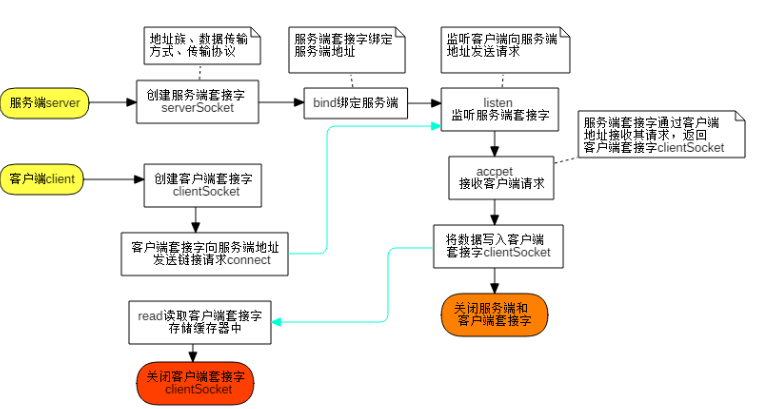

# socket编程

## 1、socket的简介

### 1.1 什么是socket 

在计算机通信领域，socket 被翻译为“套接字”，它是计算机之间进行通信的一种约定或一种方式。通过 socket 这种约定，一台计算机可以接收其他计算机的数据，也可以向其他计算机发送数据。
socket 的典型应用就是 Web 服务器和浏览器：浏览器获取用户输入的URL（Uniform Resource Locator，全球资源定位器），向服务器发起请求，服务器分析接收到的URL，将对应的网页内容返回给浏览器，浏览器再经过解析和渲染，就将文字、图片、视频等元素呈现给用户。 

### 1.2 数据传输方式 

计算机之间有很多数据传输方式，各有优缺点，常用的有两种：SOCK_STREAM 和 SOCK_DGRAM。
1)SOCK_STREAM （socket stream,流套接字）表示面向连接的数据传输方式（TCP）。数据可以准确无误地到达另一台计算机，如果损坏或丢失，可以重新发送，但效率相对较慢。常见的 http 协议就使用 SOCK_STREAM 传输数据，因为要确保数据的正确性，否则网页不能正常解析。
2)SOCK_DGRAM （socket datagram,数据报套接字）表示无连接的数据传输方式(UDP)。计算机只管传输数据，不作数据校验，如果数据在传输中损坏，或者没有到达另一台计算机，是没有办法补救的。也就是说，数据错了就错了，无法重传。因为 SOCK_DGRAM 所做的校验工作少，所以效率比 SOCK_STREAM 高。
QQ 视频聊天和语音聊天就使用 SOCK_DGRAM 传输数据，因为首先要保证通信的效率，尽量减小延迟，而数据的正确性是次要的，即使丢失很小的一部分数据，视频和音频也可以正常解析，最多出现噪点或杂音，不会对通信质量有实质的影响。


## 2、使用socket()函数创建套接字

在Linux下创建 socket 
在 Linux 下使用

`int socket(int af, int type, int protocol);`

1) af 为地址族（Address Family），也就是 IP 地址类型，常用的有 AF_INET 和 AF_INET6。AF 是“Address Family”的简写，INET是“Inetnet”的简写。AF_INET 表示 IPv4 地址，例如 127.0.0.1；AF_INET6 表示 IPv6 地址，例如 1030::C9B4:FF12:48AA:1A2B。
大家需要记住127.0.0.1，它是一个特殊IP地址，表示本机地址，后面的教程会经常用到。 
2) type 为数据传输方式，常用的有 SOCK_STREAM 和 SOCK_DGRAM 
3) protocol 表示传输协议，常用的有 IPPROTO_TCP 和 IPPTOTO_UDP，分别表示 TCP 传输协议和 UDP 传输协议。

### 2.1 linux下socket程序的演示c语言

 

和C语言教程一样，我们从一个简单的“Hello World!”程序切入 socket 编程。
演示了 Linux 下的代码，server.c 是服务器端代码，client.c 是客户端代码，要实现的功能是：客户端从服务器读取一个字符串并打印出来。 

- 服务器端代码 server.c：

```c
#include <stdio.h>
#include <string.h>
#include <stdlib.h>
/**********
unistd.h 是 C 和 C++ 程序设计语言中提供对 POSIX 操作系统 API 的访问功能的头文件的名称。该头文件由 POSIX.1 标准（单一UNIX规范的基础）提出，故所有遵循该标准的操作系统和编译器均应提供该头文件（如 Unix 的所有官方版本，包括 Mac OS X、Linux 等）。
**********/
#include <unistd.h>  
/* 描述端口port与地址address*/
#include <arpa/inet.h>
#include <sys/socket.h>
//协议类型TCP / UDP
#include <netinet/in.h>
int main(){
    //（1）创建服务器端的套接字
    int serv_sock = socket(AF_INET, SOCK_STREAM, IPPROTO_TCP);
    //int serv_sock = socket(AF_INET, SOCK_DGRAM, IPPROTO_UDP);
    //将服务器端的套接字地址：IP地址、本机地址和端口号
    struct sockaddr_in serv_addr; //服务端地址
    memset(&serv_addr, 0, sizeof(serv_addr));  //每个字节都用0填充
    serv_addr.sin_family = AF_INET;  //使用IPv4地址
    serv_addr.sin_addr.s_addr = inet_addr("127.0.0.1");  //具体的IP地址：本机地址
    serv_addr.sin_port = htons(1234);  //端口
   //（2）绑定服务端
    bind(serv_sock, (struct sockaddr*)&serv_addr, sizeof(serv_addr));
    //（3）通过服务器端地址来监听客户端发起请求
    listen(serv_sock, 20);
    //（4）服务器端接收客户端请求
    struct sockaddr_in clnt_addr;  //客户端地址
    socklen_t clnt_addr_size = sizeof(clnt_addr);   //客户端地址的长度
    int clnt_sock = accept(serv_sock, (struct sockaddr*)&clnt_addr, &clnt_addr_size);
    //（5）将写入的数据发送给客户端
    char str[] = "Hello World!";
    write(clnt_sock, str, sizeof(str));
    //（6）关闭客户端和服务器端的套接字
    close(clnt_sock);
    close(serv_sock);
    return 0;
}
```

- 客户端代码 client.c：

```c
#include <stdio.h>
#include <string.h>
#include <stdlib.h>
#include <unistd.h>
#include <arpa/inet.h>
#include <sys/socket.h>
int main(){
    //（1）创建客户端的套接字
    int sock = socket(AF_INET, SOCK_STREAM, 0);
    // 将服务器端的套接字地址：IP地址、本机地址和端口号
    struct sockaddr_in serv_addr;
    memset(&serv_addr, 0, sizeof(serv_addr));  //每个字节都用0填充
    serv_addr.sin_family = AF_INET;  //使用IPv4地址
    serv_addr.sin_addr.s_addr = inet_addr("127.0.0.1");  //服务端的IP地址
    serv_addr.sin_port = htons(1234);  //端口
    //（2）客户端根据客服端的地址向服务器端发送连接请求
    connect(sock, (struct sockaddr*)&serv_addr, sizeof(serv_addr));

    //（3）读取服务器传回的数据
    char buffer[40];
    read(sock, buffer, sizeof(buffer)-1);

    printf("Message form server: %s\n", buffer);

    //（4）关闭套接字
    close(sock);
    return 0;
}
```

(1) 在linux下，先打开终端1，编译 server.c 并运行：

```c
[admin@localhost ~]$ gcc server.c -o server
[admin@localhost ~]$ ./server
```

正常情况下，程序运行到 accept() 函数就会被阻塞，等待客户端发起请求。 
接下来编译 client.c 并运行：

```c
[admin@localhost ~]$ gcc client.c -o client
[admin@localhost ~]$ ./client
Message form server: Hello World!
```


或(2)在linux下，先编译 server.cpp 并运行：

```c
[admin@localhost ~]$ g++ server.cpp -o server
[admin@localhost ~]$ ./server
```

正常情况下，程序运行到 accept() 函数就会被阻塞，等待客户端发起请求。 
接下来编译 client.cpp 并运行：

```c
[admin@localhost ~]$ g++ client.cpp -o client
[admin@localhost ~]$ ./client
Message form server: Hello World!
```
