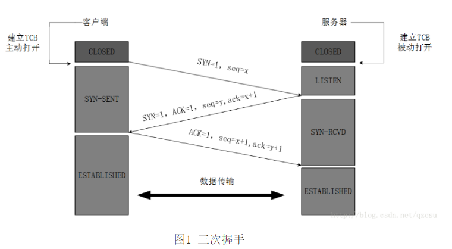
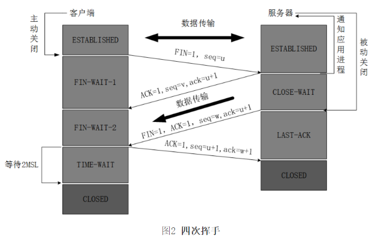
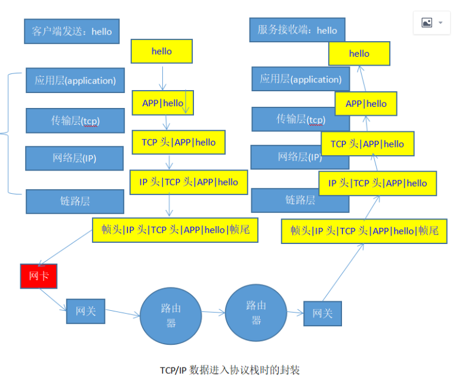

# TCP/IP

|TCP/IP 4层模型 |TCP/IP 5层模型 |OSI 7层模型|
|:--------------|:-------------|:----------|
|应用层| 应用层| 应用层/表示层/会话层|
|传输层 |传输层| 传输层|
|网络层| 网络层 |网络层|
|网络接口层（链路层）| 数据链路层/物理层| 数据链路层/物理层|

## 1、 TCP/IP协议 

Transmission Control Protocol/Internet Protocol的简写，中译名为传输控制协议/因特网互联协议，又名网络通讯协议，是Internet最基本的协议、Internet国际互联网络的基础，由网络层的IP协议和传输层的TCP协议组成。TCP/IP 定义了电子设备如何连入因特网，以及数据如何在它们之间传输的标准。协议采用了4层的层级结构，每一层都呼叫它的下一层所提供的网络来完成自己的需求。
通俗而言：
TCP负责发现传输的问题，一有问题就发出信号，要求重新传输，直到所有数据安全正确地传输到目的地。
而IP是给因特网的每一台电脑规定一个地址。

## 2、层次概述 

从协议分层模型方面来讲，TCP/IP由四个层次组成：网络接口层、网络层、传输层、应用层。 
TCP/IP协议并不完全符合OSI的七层参考模型。传统的开放式系统互连参考模型，是一种通信协议的7层抽象的参考模型，其中每一层执行某一特定任务。该模型的目的是使各种硬件在相同的层次上相互通信。这7层是：物理层、数据链路层、网络层、传输层、会话层、表示层和应用层。而TCP/IP通讯协议采用了4层的层级结构，每一层都呼叫它的下一层所提供的网络来完成自己的需求。 
 
TCP/IP结构对应OSI结构  
|TCP/IP |OSI（Open System InterInternect,开发系统互联）|
|:------|:-------------------------------------------|
|应用层 |应用层、表示层、会话层|
|主机到主机层（TCP）（又称传输层） |传输层：TCP、UDP|
|网络层（IP） |网络层：IP、ICMP、ARP、RARP|
|网络接口层(又称链路层）| 数据链路层、物理层|

### 2.1、 网络接口层

#### 2.1.1 物理层

物理层（或称物理层，Physical Layer）是计算机网络OSI模型中最低的一层。
物理层规定:为传输数据所需要的物理链路创建、维持、拆除，而提供具有机械的，电子的，功能的和规范的特性。简单的说，物理层确保原始的数据可在各种物理媒体上传输。局域网与广域网皆属第1、2层。
物理层是OSI的第一层，它虽然处于最底层，却是整个开放系统的基础。物理层为设备之间的数据通信提供传输媒体及互连设备，为数据传输提供可靠的环境。如果您想要用尽量少的词来记住这个第一层，那就是“信号和介质”。
物理层是定义物理介质的各种特性：
1、机械特性。2、电子特性。3、功能特性。4、规程特性。

#### 2.1.2数据链路层 

    数据链路层：（网络层--》数据链路层）负责接收IP数据报并通过网络发送之，即IP地址的数据通过网络发送出去。（物理层 --》网络层）者从网络上接收物理帧，抽出IP数据报，交给IP层。 
常见的接口层协议有：
Ethernet 802.3、Token Ring 802.5、X.25、Frame relay、HDLC、PPP ATM 等。

### 2.2 网络层 

网络层：负责相邻计算机之间的通信，即通过计算机的IP地址进行通信。其功能包括三方面：
一、处理来自传输层的分组发送请求，收到请求后，将分组装入IP数据报，填充报头，选择去往信宿机的路径，然后将数据报发往适当的网络接口。
二、处理输入数据报：首先检查其合法性，然后进行寻径--假如该数据报已到达信宿机，则去掉报头，将剩下部分交给适当的传输协议；假如该数据报尚未到达信宿，则转发该数据报。
三、处理路径、流控、拥塞等问题。
 
网络层包括：IP(Internet Protocol)协议、ICMP(Internet Control Message Protocol)控制报文协议、ARP(Address Resolution Protocol)地址转换协议、RARP(Reverse ARP)反向地址转换协议。
IP是网络层的核心，通过路由选择将下一跳IP封装后交给接口层。IP数据报是无连接服务。IP是网络内数据用来寻址，每一台计算机都有地址，A为源端口地址，B为目的端口地址，A通过B的目的端口地址把数据发送到B。
ICMP是网络层的补充，可以回送报文。作用：用来检测网络是否通畅。ICMP是TCP/IP协议族的一个子协议，用于在IP主机、路由器之间传递控制消息。控制消息是指网络通不通、主机是否可达、路由是否可用等网络本身的消息。这些控制消息虽然并不传输用户数据，但是对于用户数据的传递起着重要的作用。
Ping命令就是发送ICMP的echo包，通过回送的echo relay进行网络测试。
IGMP协议（Internet Group Management Protocol，因特网组管理协议），是因特网协议家族中的一个组播协议。该协议运行在主机和组播路由器之间。IGMP协议共有三个版本，即IGMPv1、v2 和v3。
ARP是正向地址解析协议，通过已知的IP，寻找对应主机的MAC地址。
RARP是反向地址解析协议，通过MAC地址确定IP地址。比如无盘工作站和DHCP服务。

### 2.3 传输层

 提供应用程序间的通信。其功能包括：
一、格式化信息流；
二、提供可靠传输。为实现后者，传输层协议规定接收端必须发回确认，并且假如分组丢失，必须重新发送。 
       
传输层协议主要是：
传输控制协议TCP(Transmission Control Protocol)：是一个基于连接的协议。
用户数据报协议UDP(User Datagram protocol)：面向无连接服务的管理方式的协议。

### 2.4 应用层 

    向用户提供一组常用的应用程序，比如电子邮件、文件传输访问、远程登录等。远程登录TELNET使用TELNET协议提供在网络其它主机上注册的接口。TELNET会话提供了基于字符的虚拟终端。文件传输访问FTP使用FTP协议来提供网络内机器间的文件拷贝功能。  
应用层一般是面向用户的服务。如FTP、TELNET、DNS、SMTP、POP3。 
FTP(File Transmision Protocol)是文件传输协议，一般上传下载用FTP服务，数据端口是20H，控制端口是21H。 
Telnet服务是用户远程登录服务，使用23H端口，使用明码传送，保密性差、简单方便。 
DNS(Domain Name Service)是域名解析服务，提供域名到IP地址之间的转换。
SMTP(Simple Mail Transfer Protocol)是简单邮件传输协议，用来控制信件的发送、中转。
POP3(Post Office Protocol 3)是邮局协议第3版本，用于接收邮件。

### 2.5 总结 

OSI中的层 功能 TCP/IP协议族
应用层 文件传输，电子邮件，文件服务，虚拟终端 TFTP，HTTP，SNMP，FTP，SMTP，DNS，RIP，Telnet
表示层 数据格式化，代码转换，数据加密 没有协议
会话层 解除或建立与别的接点的联系 没有协议
传输层 提供端对端的接口 TCP，UDP
网络层 为数据包选择路由 IP，ICMP，OSPF，BGP，IGMP，ARP，RARP
数据链路层 传输有地址的帧以及错误检测功能 SLIP，CSLIP，PPP，MTU
物理层 以二进制数据形式在物理媒体上传输数据 ISO2110，IEEE802，IEEE802.2
 网络层中的协议主要有IP，ICMP，IGMP等，由于它包含了IP协议模块，所以它是所有基于TCP/IP协议网络的核心。在网络层中，IP模块完成大部分功能。ICMP和IGMP以及其他支持IP的协议帮助IP完成特定的任务，如传输差错控制信息以及主机/路由器之间的控制电文等。网络层掌管着网络中主机间的信息传输。 
    传输层上的主要协议是TCP和UDP。正如网络层控制着主机之间的数据传递，传输层控制着那些将要进入网络层的数据。两个协议就是它管理这些数据的两种方式：
TCP是一个基于连接的协议；
UDP则是面向无连接服务的管理方式的协议。 
 
TCP/IP模型的主要缺点有：
首先，该模型没有清楚地区分哪些是规范、哪些是实现；其次，TCP/IP模型的主机—网络层定义了网络层与数据链路层的接口，并不是常规意义上的一层，和接口层的区别是非常重要的，TCP/IP模型没有将它们区分开来。
 
## 3、 数据格式 

数据帧：帧头+IP数据包+帧尾 (帧头包括源和目标主机MAC地址及类型,帧尾是校验字)
IP数据包：IP头部+TCP数据信息(IP头包括源和目标主机IP地址、类型、生存期等)
TCP数据信息：TCP头部+实际数据 (TCP头包括源和目标主机端口号、顺序号、确认号、校验字等)

## 4、运作机制

### 4.1 IP 

IP层：接收由更低层（网络接口层例如以太网设备驱动程序）发来的数据包，并把该数据包发送到更高层---TCP或UDP层；相反，IP层也把从TCP或UDP层接收来的数据包传送到更低层。
IP数据包是不可靠的，因为IP并没有做任何事情来确认数据包是按顺序发送的或者没有被破坏。IP数据包中含有发送它的主机的地址（源地址）和接收它的主机的地址（目的地址）。  
高层的TCP和UDP服务在接收数据包时，通常假设包中的源地址是有效的。也可以这样说，IP地址形成了许多服务的认证基础，这些服务相信数据包是从一个有效的主机发送来的。IP确认包含一个选项，叫作IP source routing，可以用来指定一条源地址和目的地址之间的直接路径。对于一些TCP和UDP的服务来说，使用了该选项的IP包好像是从路径上的最后一个系统传递过来的，而不是来自于它的真实地点。这个选项是为了测试而存在的，说明了它可以被用来欺骗系统来进行平常是被禁止的连接。那么，许多依靠IP源地址做确认的服务将产生问题并且会被非法入侵。 

### 4.2 TCP 

1) 序号：Seq（Sequence Number）序号占32位，用来标识从计算机A发送到计算机B的数据包的序号，计算机发送数据时对此进行标记。

2) 确认号：Ack（Acknowledge Number）确认号占32位，客户端和服务器端都可以发送，Ack = Seq + 1。

3) 标志位：每个标志位占用1Bit，共有6个，分别为 URG、ACK、PSH、RST、SYN、FIN，具体含义如下：
（1）URG：紧急指针（urgent pointer）有效。
（2）ACK：确认序号有效。
（3）PSH：接收方应该尽快将这个报文交给应用层。
（4）RST：重置连接。
（5）SYN：建立一个新连接。
（6）FIN：断开一个连接。

    TCP是面向连接的通信协议，通过三次握手建立连接，通讯时完成时要拆除连接，由于TCP是面向连接的所以只能用于点对点的通讯。 
三次握手：
TCP:Transmission Control Protocol,传输控制协议 ; TCB: Transmission Control Block,传输控制块;
SYN: Synchronize，同步序列编号;  seq : sequence,序列；SENT: sent ,发送；ACK ：acknowledge，确认；
1）TCB创建与打开：TCP服务器进程先创建传输控制块TCB，时刻准备接受客户进程的连接请求，此时服务器就进入了LISTEN（监听）状态；
2）第一次握手：TCP客户进程也是先创建传输控制块TCB，然后向服务器发出连接请求报文，这是报文首部中的同部位SYN(同步)=1，同时选择一个初始序列号 seq=x ，此时，TCP客户端进程进入了 SYN-SENT（同步已发送状态）状态。TCP规定，SYN报文段（SYN=1的报文段）不能携带数据，但需要消耗掉一个序号。
3）第二次握手：TCP服务器收到请求报文后，如果同意连接，则发出确认报文。确认报文中应该 ACK=1，SYN=1，确认号是ack=x+1，同时也要为自己初始化一个序列号 seq=y，此时，TCP服务器进程进入了SYN-RCVD（同步收到）状态。这个报文也不能携带数据，但是同样要消耗一个序号。
4）第三次握手：TCP客户进程收到确认后，还要向服务器给出确认。确认报文的ACK=1，ack=y+1，自己的序列号seq=x+1，此时，TCP连接建立，客户端进入ESTABLISHED（已建立连接）状态。TCP规定，ACK报文段可以携带数据，但是如果不携带数据则不消耗序号。
5）通信：当服务器收到客户端的确认后也进入ESTABLISHED状态，此后双方就可以开始通信了。



四次挥手：
1）第一次挥手：客户端进程发出连接释放报文，并且停止发送数据。释放数据报文首部，FIN=1，其序列号为seq=u（等于前面已经传送过来的数据的最后一个字节的序号加1），此时，客户端进入FIN-WAIT-1（终止等待1）状态。 TCP规定，FIN报文段即使不携带数据，也要消耗一个序号。
2）第二次挥手：服务器收到连接释放报文，发出确认报文，ACK=1，ack=u+1，并且带上自己的序列号seq=v，此时，服务端就进入了CLOSE-WAIT（关闭等待）状态。TCP服务器通知高层的应用进程，客户端向服务器的方向就释放了，这时候处于半关闭状态，即客户端已经没有数据要发送了，但是服务器若发送数据，客户端依然要接受。这个状态还要持续一段时间，也就是整个CLOSE-WAIT状态持续的时间。
3）客服端确认：客户端收到服务器的确认请求后，此时，客户端就进入FIN-WAIT-2（终止等待2）状态，等待服务器发送连接释放报文（在这之前还需要接受服务器发送的最后的数据）。
4）第三次挥手：服务器将最后的数据发送完毕后，就向客户端发送连接释放报文，FIN=1，ack=u+1，由于在半关闭状态，服务器很可能又发送了一些数据，假定此时的序列号为seq=w，此时，服务器就进入了LAST-ACK（最后确认）状态，等待客户端的确认。
4）第四次挥手：客户端收到服务器的连接释放报文后，必须发出确认，ACK=1，ack=w+1，而自己的序列号是seq=u+1，此时，客户端就进入了TIME-WAIT（时间等待）状态。注意此时TCP连接还没有释放，必须经过2∗MSL（最长报文段寿命）的时间后，当客户端撤销相应的TCB后，才进入CLOSED状态。
5）服务器确认：服务器只要收到了客户端发出的确认，立即进入CLOSED状态。同样，撤销TCB后，就结束了这次的TCP连接。可以看到，服务器结束TCP连接的时间要比客户端早一些。

        

TCP提供的是一种可靠的数据流服务，采用“带重传的肯定确认”技术来实现传输的可靠性。TCP还采用一种称为“滑动窗口” 的方式进行流量控制，所谓窗口实际表示接收能力，用以限制发送方的发送速度。 
如果IP数据包中有已经封好的TCP数据包，那么IP将把它们向‘上’传送到TCP层。TCP将包排序并进行错误检查，同时实现虚电路间的连接。TCP数据包中包括序号和确认，所以未按照顺序收到的包可以被排序，而损坏的包可以被重传。  
TCP将它的信息送到更高层的应用程序，例如Telnet的服务程序和客户程序。应用程序轮流将信息送回TCP层，TCP层便将它们向下传送到IP层，设备驱动程序和物理介质，最后到接收方。  
面向连接的服务（例如Telnet、FTP、rlogin、X Windows和SMTP）需要高度的可靠性，所以它们使用了TCP。DNS在某些情况下使用TCP（发送和接收域名数据库），但使用UDP传送有关单个主机的信息。 



### 4.3 UDP 

UDP是面向无连接的通讯协议，UDP数据包括目的端口号和源端口号信息，由于通讯不需要连接，所以可以实现广播发送。  
UDP通讯时不需要接收方确认，属于不可靠的传输，可能会出丢包现象，实际应用中要求在程序员编程验证。  
UDP与TCP位于同一层，但它不管数据包的顺序、错误或重发。因此，UDP不被应用于那些 使用虚电路的面向连接的服务，UDP主要用于那些面向查询---应答的服务，例如NFS。相对于FTP或Telnet，这些服务需要交换的信息量较小。使用UDP的服务包括NTP（网络时间协议）和DNS（DNS也使用TCP）。 
欺骗UDP包比欺骗TCP包更容易，因为UDP没有建立初始化连接（也可以称为握手）（因为在两个系统间没有虚电路），也就是说，与UDP相关的服务面临着更大的危险。 

### 4.4 ICMP 

ICMP与IP位于同一层，它被用来传送IP的的控制信息。它主要是用来提供有关通向目的地址的路径信息。ICMP的‘Redirect’信息通知主机通向其他系统的更准确的路径，而‘Unreachable’信息则指出路径有问题。另外，如果路径不可用了，ICMP可以使TCP连接‘体面地’终止。PING是最常用的基于ICMP的服务。

## 5、通讯端口

TCP和UDP服务通常有一个客户/服务器的关系，例如，一个Telnet服务进程开始在系统上处于空闲状态，等待着连接。用户使用Telnet客户程序与服务进程建立一个连接。客户程序向服务进程写入信息，服务进程读出信息并发出响应，客户程序读出响应并向用户报告。因而，这个连接是双工的，可以用来进行读写。 
两个系统间的多重Telnet连接是如何相互确认并协调一致呢？TCP或UDP连接唯一地使用每个信息中的如下四项进行确认：
源IP地址 发送包的IP地址。
目的IP地址 接收包的IP地址。
源端口 源系统上的连接的端口。
目的端口 目的系统上的连接的端口。 
端口是一个软件结构，被客户程序或服务进程用来发送和接收信息。一个端口对应一个16比特的数。服务进程通常使用一个固定的端口，例如，SMTP使用25、Xwindows使用6000。这些端口号是‘广为人知’的，因为在建立与特定的主机或服务的连接时，需要这些地址和目的地址进行通讯。
 
## 6、IP地址

在Internet上连接的所有计算机，从大型机到微型计算机都是以独立的身份出现，我们称它为主机。为了实现各主机间的通信，每台主机都必须有一个唯一的网络地址。就好像每一个住宅都有唯一的门牌一样，才不至于在传输资料时出现混乱。
 
Internet的网络地址是指连入Internet网络的计算机的地址编号。所以，在Internet网络中，网络地址唯一地标识一台计算机。 
 
我们都已经知道，Internet是由几千万台计算机互相连接而成的。而我们要确认网络上的每一台计算机，靠的就是能唯一标识该计算机的网络地址，这个地址就叫做IP（Internet Protocol的简写）地址，即用Internet协议语言表示的地址。 
 
目前，在Internet里，IP地址是一个32位的二进制地址，为了便于记忆，将它们分为4组，每组8位，由小数点分开，用四个字节来表示，而且，用点分开的每个字节的数值范围是0~255，如202.116.0.1，这种书写方法叫做点数表示法。  

### 6.1 地址分类 

IP地址可确认网络中的任何一个网络和计算机，而要识别其它网络或其中的计算机，则是根据这些IP地址的分类来确定的。一般将IP地址按节点计算机所在网络规模的大小分为A，B，C三类，默认的网络屏蔽是根据IP地址中的第一个字段确定的。 

1) A类地址 
A类地址的表示范围为：1.0.0.1--126.255.255.255，默认网络屏蔽为：255.0.0.0；A类地址分配给规模特别大的网络使用。A类网络用第一组数字表示网络本身的地址，后面三组数字作为连接于网络上的主机的地址。分配给具有大量主机（直接个人用户）而局域网络个数较少的大型网络。例如IBM公司的网络。 
127.0.0.0到127.255.255.255是保留地址，用做循环测试用的。
0.0.0.0到0.255.255.255也是保留地址，用做表示所有的IP地址。 
一个A类IP地址由1字节（每个字节是8位）的网络地址和3个字节主机地址组成，网络地址的最高位必须是“0”，即第一段数字范围为1～127。每个A类地址理论上可连接16777214<256*256*256-2>台主机（-2是因为主机中要用去一个网络号和一个广播号），Internet有126个可用的A类地址。A类地址适用于有大量主机的大型网络。 
 
2) B类地址 
B类地址的表示范围为：128.0.0.1--191.255.255.255，默认网络屏蔽为：255.255.0.0；B类地址分配给一般的中型网络。B类网络用第一、二组数字表示网络的地址，后面两组数字代表网络上的主机地址。
169.254.0.0到169.254.255.255是保留地址。如果你的IP地址是自动获取IP地址，而你在网络上又没有找到可用的DHCP服务器，这时你将会从169.254.0.0到169.254.255.255中临时获得一个IP地址。
一个B类IP地址:由2个字节的网络地址和2个字节的主机地址组成，网络地址的最高位必须是“10”，即第一段数字范围为128～191。每个B类地址可连接65534(2^16-2, 因为主机号的各位不能同时为0,1)台主机，Internet有16383(2^14-1)个B类地址(因为B类网络地址128.0.0.0是不指派的，而可以指派的最小地址为128.1.0.0[COME06]）。

3）C类地址 
C类地址的表示范围为：192.0.0.1--223.255.255.255，默认网络屏蔽为：255.255.255.0；C类地址分配给小型网络，如一般的局域网，它可连接的主机数量是最少的，采用把所属的用户分为若干的网段进行管理。C类网络用前三组数字表示网络的地址，最后一组数字作为网络上的主机地址。
一个C类地址是由3个字节的网络地址和1个字节的主机地址组成，网络地址的最高位必须是“110”，即第一段数字范围为192～223。每个C类地址可连接254台主机，Internet有2097152个C类地址段（32*256*256），有532676608个地址（32*256*256*254）。
RFC 1918留出了3块IP地址空间（1个A类地址段，16个B类地址段，256个C类地址段）作为私有的内部使用的地址。在这个范围内的IP地址不能被路由到Internet骨干网上；Internet路由器将丢弃该私有地址。
IP地址类别 RFC 1918内部地址范围：
A类 10．0.0.0到10.255.255.255
B类 172.16.0.0到172.31.255.255
C类 192.168.0.0到192.168.255.255 
使用私有地址将网络连至Internet，需要将私有地址转换为公有地址。这个转换过程称为网络地址转换（Network Address Translation，NAT），通常使用路由器来执行NAT转换。
实际上，还存在着D类地址和E类地址。但这两类地址用途比较特殊，在这里只是简单介绍一下：
D类地址不分网络地址和主机地址，它的第1个字节的前四位固定为1110。D类地址范围：224.0.0.1到239.255.255.254 。D类地址用于多点播送。D类地址称为广播地址，供特殊协议向选定的节点发送信息时用。
E类地址保留给将来使用。
连接到Internet上的每台计算机，不论其IP地址属于哪类都与网络中的其它计算机处于平等地位，因为只有IP地址才是区别计算机的唯一标识。所以，以上IP地址的分类只适用于网络分类。
在Internet中，一台计算机可以有一个或多个IP地址，就像一个人可以有多个通信地址一样，但两台或多台计算机却不能共享一个IP地址。如果有两台计算机的IP地址相同，则会引起异常现象，无论哪台计算机都将无法正常工作。
顺便提一下几类特殊的IP地址：
1.广播地址目的端为给定网络上的所有主机，一般主机段为全1
2.单播地址目的端为指定网络上的单个主机地址
3.组播地址目的端为同一组内的所有主机地址
4.环回地址127.0.0.1 在环回测试和广播测试时会使用
 
- 网关地址 

若要使两个完全不同的网络（异构网）连接在一起，一般使用网关，在Internet中两个网络也要通过一台称为网关的计算机实现互联。这台计算机能根据用户通信目标计算机的IP地址，决定是否将用户发出的信息送出本地网络，同时，它还将外界发送给属于本地网络计算机的信息接收过来，它是一个网络与另一个网络相联的通道。为了使TCP/IP协议能够寻址，该通道被赋予一个IP地址，这个IP地址称为网关地址。

 注意事项 
    内部地址和外部地址在局域网的IP地址分配中，并没有区别，都可以使用。
在局域网的IP地址分配中，子网屏蔽的“1”部分只要和对应的IP地址分类规定的前几个二进制数一致即可。

- 子网掩码 

设定任何网络上的任何设备不管是主机、个人电脑、路由器等皆需要设定IP地址，而跟随着IP地址的是所谓的子网掩码（NetMask,Subnet Mask),这个子网掩码主要的目的是由IP地址中也能获得网络编码，也就是说IP地址和子网掩码合作而得到网络编码,如下所示： 

```
IP地址
192.10.10.6 11000000.00001010.00001010.00000110
子网掩码
255.255.255.0 11111111.11111111.11111111.00000000
AND
-----------------------------------------------------
Network Number
192.10.10.0 11000000.00001010.00001010.00000000
 
子网掩码有所谓的默认值，如下所示：
类 IP地址范围 子网掩码
A 1.0.0.0--126.255.255.255 255.0.0.0
B 128.0.0.0-191.255.255.255 255.255.0.0
C 192.0.0.0-223.255.255.255 255.255.255.0
 在预设的子网掩码（Net Mask）都只有255的值,在谈到子网掩码（Subnet Mask）时这个值便不一定是255了。在完整一组C类地址中如203.67.10.0--203.67.10.255 子网掩码255.255.255.0,203.67.10.0称之网络编码（Network Number，将IP 地址和子网掩码作和),而203.67.10.255是广播的IP地址，所以这两者皆不能使用,实际只能使用203.67.10.1--203.67.10.254等254个IP地址，这是以255.255.255.0作子网掩码的结果,而所谓Subnet Msk尚可将整组C类地址分成数组网络编码，这要在子网掩码上作手脚,若是要将整组C类地址分成2个网络编码那子网掩码设定为255.255.255.128,若是要将整组C类分成8组网络编码则子网掩码要为255.255.255.224,这是怎么来的，由以上知道网络编码是由IP地址和子网掩码作AND而来的,而且将子网掩码以二进制表示法知道是1的会保留，而为0的去掉 
192.10.10.193 11000000.00001010.00001010.11000001
255.255.255.0 11111111.11111111.11111111.00000000
-----------------------------------------------------
192.10.10.0 11000000.00001010.00001010.00000000
以上是以255.255.255.0为子网掩码的结果,网络编码是192.10.10.0,若是使用255.255.255.224作子网掩码结果便有所不同
192.10.10.193 11000000.00001010.00001010.11000001
255.255.255.224 11111111.11111111.11111111.11100000
-----------------------------------------------------
192.10.10.192 11000000.00001010.00001010.11000000
此时网络编码变成了192.10.10.192,这便是子网。那要如何决定所使用的子网掩码，255.255.255.224以二进制表示法为11111111.11111111.11111111.11100000,变化是在最后一组，11100000便是224,以三个位（Bit）可表示2的3次方便是8个网络编码

子网掩码二进制表示法可分几个网络
255.255.255.0 11111111.11111111.11111111.00000000 1
255.255.255.128 11111111.11111111.11111111.10000000 2
255.255.255.192 11111111.11111111.11111111.11000000 4
255.255.255.224 11111111.11111111.11111111.11100000 8
255.255.255.240 11111111.11111111.11111111.11110000 16
255.255.255.248 11111111.11111111.11111111.11111000 32
255.255.255.252 11111111.11111111.11111111.11111100 64
以下使用255.255.255.224将C类地址203.67.10.0分成8组网络编码，各个网络编码及其广播IP地址及可使用之IP地址序号网络编码广播可使用之IP地址
203.67.10.0--203.67.10.31 203.67.10.1--203.67.10.30
203.67.10.32--203.67.10.63 203.67.10.33--203.67.10.62
203.67.10.64--203.67.10.95 203.67.10.65--203.67.10.94
203.67.10.96--203.67.10.127 203.67.10.97--203.67.10.126
203.67.10.128--203.67.10.159 203.67.10.129--203.67.10.158
203.67.10.160--203.67.10.191 203.67.10.161--203.67.10.190
203.67.10.192--203.67.10.223 203.67.10.193--203.67.10.222
203.67.10.224--203.67.10.255 203.67.10.225--203.67.10.254
可验证所使用的IP地址是否如上表所示
203.67.10.115--11001011.01000011.00001010.01110011
255.255.255.224--11111111.11111111.11111111.11100000
-----------------------------------------------------
203.67.10.96--11001011.01000011.00001010.01100000
 
203.67.10.55--11001011.01000011.00001010.00110111
255.255.255.224--11111111.11111111.11111111.11100000
----------------------------------------------------
203.67.10.32--11001011.01000011.00001010.00100000
```

- 概念区分 

1.协议阐述、IP申请的术语
网络地址：在申请IP地址或是阐述TCP/IP协议的IP地址分类时，用到这个术语。它表示IP地址的代码序列中不可更加需要改变的部分。 
主机地址：在申请IP地址或是阐述TCP/IP协议的IP地址分类时，用到这个术语。它表示IP地址的代码序列中能够更具需要改变的部分。 
子网屏蔽：在阐述TCP/IP协议的IP地址分类时，用到这个术语。在申请IP地址时，由它表示所申请到的IP地址的网络地址和主机地址。

2.子网划分、内网搭建的术语 
网络编码（网络号）：经过子网划分后，子网掩码序列中“1”对应的IP地址部分。一个网络编码，对应一个网域（或网段）。包括申请到的网络地址的全部和主机地址的部分。
主机编码（主机号）：经过子网划分后，子网掩码序列中“0”对应的IP地址部分。一个主机编码，对应一个网域（或网段）的一台计算机。包括申请到主机地址的部分。
子网掩码：用于子网划分，它将能够改变的主机地址分为主机编码和网络编码的一部分。同时，它将网络地址全部确定为网络编码。

- 协议测试 

全面的测试应包括局域网和互联网两个方面，因此应从局域网和互联网两个方面测试，以下是在实际工作中利用命令行测试TCP/IP配置步骤：
1.单击“开始”/“运行”，输入CMD按回车，打开命令提示符窗口。
2.首先检查IP地址、子网掩码、默认网关、DNS服务器地址是否正确，输入命令ipconfig /all,按回车。此时显示了你的网络配置，观查是否正确。
3.输入ping 127.0.0.1，观查网卡是否能转发数据，如果出现“Request timed out”，表明配置差错或网络有问题。
4.Ping一个互联网地址，看是否有数据包传回，以验证与互联网的连接性。
5.Ping 一个局域网地址，观查与它的连通性。
6.用nslookup测试DNS解析是否正确，输入如nslookup ，查看是否能解析。

如果你的计算机通过了全部测试，则说明网络正常，否则网络可能有不同程度的问题。在此不展开详述。不过，要注意，在使用 ping命令时，有些公司会在其主机设置丢弃ICMP数据包，造成你的ping命令无法正常返回数据包，不防换个网站试试。

1.IPv4
IPv4，是互联网协议（Internet Protocol，IP）的第四版，也是第一个被广泛使用，构成现今互联网技术的基石的协议。1981年Jon Postel 在RFC791中定义了IP，Ipv4可以运行在各种各样的底层网络上，比如端对端的串行数据链路(PPP协议和SLIP协议) ，卫星链路等等。局域网中最常用的是以太网。

2.IPv6 
IPv6是Internet Protocol Version 6的缩写，其中Internet Protocol译为“互联网协议”。IPv6是IETF（互联网工程任务组，Internet Engineering Task Force）设计的用于替代现行版本IP协议（IPv4）的下一代IP协议。
 
- 与IPV4相比，IPV6具有以下几个优势：

一、Pv6具有更大的地址空间。IPv4中规定IP地址长度为32，即有2^32-1（符号^表示升幂，下同）个地址；而IPv6中IP地址的长度为128，即有2^128-1个地址。
二、IPv6使用更小的路由表。IPv6的地址分配一开始就遵循聚类（Aggregation）的原则，这使得路由器能在路由表中用一条记录（Entry）表示一片子网，大大减小了路由器中路由表的长度，提高了路由器转发数据包的速度。
三、IPv6增加了增强的组播（Multicast）支持以及对流的支持（Flow Control），这使得网络上的多媒体应用有了长足发展的机会，为服务质量（QoS，Quality of Service）控制提供了良好的网络平台。
四、IPv6加入了对自动配置（Auto Configuration）的支持。这是对DHCP协议的改进和扩展，使得网络（尤其是局域网）的管理更加方便和快捷。
五、IPv6具有更高的安全性。在使用IPv6网络中用户可以对网络层的数据进行加密并对IP报文进行校验，极大的增强了网络的安全性。