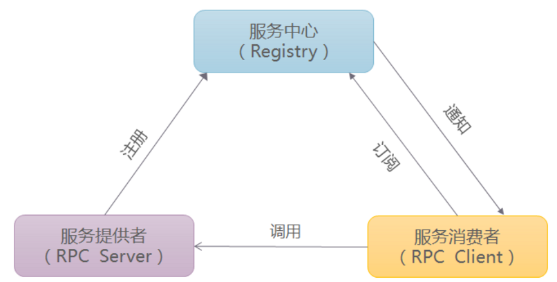
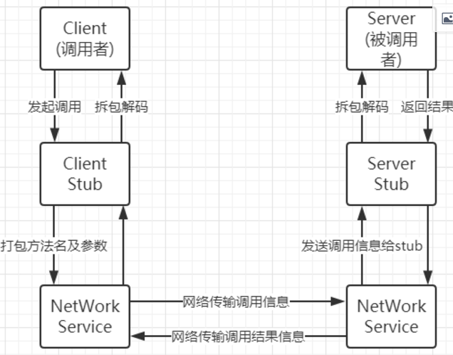
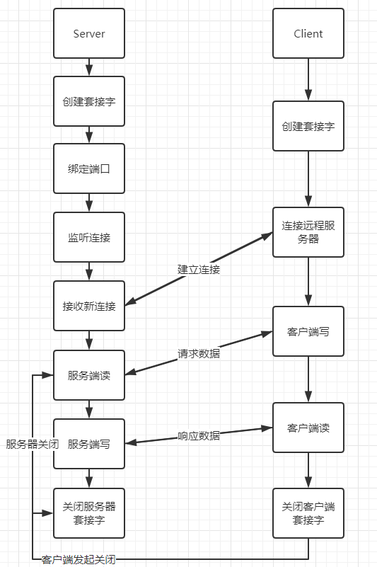

# RPC架构简介与原理

## 1、RPC架构的作用

RPC 的主要目标是让构建分布式计算（应用）更容易、透明，在提供强大的远程调用能力时不损失本地调用的语义简洁性。为实现该目标，RPC 框架需提供一种透明调用机制让使用者不必显式的区分本地调用和远程调用。RPC框架负责屏蔽底层的传输方式（TCP或者UDP）、序列化方式（XML/JSON/二进制）和通信细节。开发人员在使用的时候只需要了解谁在什么位置提供了什么样的远程服务接口即可，并不需要关心底层通信细节和调用过程。

1. 从通信协议的层面，大致可以分为：
（1）基于HTTP协议的（例如基于文本的SOAP（XML）、REST（JSON）、基于二进制Hessian（Binary））；
（2）基于TCP协议的（通常会借助Mina、Netty等高性能网络框架）。

2. 只有二进制数据才能在网络中传输，序列化和反序列化的定义是：
（1）将对象转换成二进制流的过程叫做序列化；
（2）将二进制流转换成对象的过程叫做反序列化。
3. RPC架构分为三部分：



(1)、服务提供者（RPC Server），运行在服务器端，提供服务接口定义与服务实现类。
(2)、服务中心（Registry），运行在服务器端，负责将本地服务发布成远程服务，管理远程服务，提供给服务消费者使用。
(3)、服务消费者（RPC Client），运行在客户端，通过远程代理对象调用远程服务。
服务提供者启动后主动向服务（注册）中心注册机器ip、端口以及提供的服务列表； 服务消费者启动时向服务（注册）中心获取服务提供方地址列表，可实现软负载均衡和Failover。

## 2、RPC原理及其调用过程

远程过程调用，简称为RPC，是一个计算机通信协议，它允许运行于一台计算机的程序调用另一台计算机的子程序，而无需额外地为这个交互作用编程。
RPC与传统的HTTP对比
优点：

1. 传输效率高(二进制传输)
2. 发起调用的一方无需知道RPC的具体实现，如同调用本地函数般调用

缺点：

1. 通用性不如HTTP好(HTTP是标准协议)
总结：RPC适合内部服务间的通信调用；HTTP适合面向用户与服务间的通信调用

RPC调用过程如下：



第1步. 调用者（客户端Client）以本地调用的方式发起调用；
第2步. Client stub（客户端存根）收到调用后，负责将被调用的方法名、参数等打包编码成特定格式的能进行网络传输的消息体；
第3步. Client stub将消息体通过网络发送给服务端；
第4步. Server stub（服务端存根）收到通过网络接收到消息后按照相应格式进行拆包解码，获取方法名和参数；
第5步.Server stub根据方法名和参数进行本地调用；
第6步.被调用者（Server）本地调用执行后将结果返回给server stub；
第7步. Server stub将返回值打包编码成消息，并通过网络发送给客户端；
第8步. Client stub收到消息后，进行拆包解码，返回给Client；
第9步. Client得到本次RPC调用的最终结果。

## 3、RPC调用流程的实现

对于RPC调用流程的实现，抛开调用方与被调用方，其核心主要是：消息协议和传输控制的实现

(1). RPC消息协议：客户端调用的参数和服务端的返回值这些在网络上传输的数据以何种方式打包编码和拆包解码
 RPC的消息协议在设计时主要要考虑，消息转换及传输的效率，为解决消息转换及传输的效率，可以以二进制的方式传输消息，使用原始的二进制传输可以省去中间转换的环节并减少传输的数据量。
在Python中可以使用struct模块对二进制进行编码和解码：
struct.pact将其它类型转换为二进制，通常用于消息长度的转换：

```c++
import struct

# 将整数2转换成适用网络传输的无符号的4个字节整数

>>> struct.pack('!I', 2)
'\x00\x00\x00\x02'
 struct.unpack将二进制类型转换为其它类型:
byte_data = '\x00\x00\x00\x02'

# 将2对应的二进制 转换为十进制整数 返回结果是个元组
>>> struct.unpack('!I',byte_data)
(2,)
```

 (2). RPC传输控制
 对于消息数据的传输，主要有HTTP传输和TCP传输，鉴于TCP传输的可靠性，RPC的传输一般使用TCP作为传输协议
在TCP传输中客户端与服务端通过socket进行通信，通信流程：


 
RPC使用TCP进行传输控制的实现

```c++
 1 import socket
 2 
 3 class Channel(object):
 4     """
 5     与客户端建立网络连接
 6     """
 7 
 8     def __init__(self, host, port):
 9         self.host = host  # 服务器地址
10         self.port = port  # 服务器端口
11 
12     def get_connection(self):
13         """
14         获取一个tcp连接
15         """
16         sock = socket.socket(socket.AF_INET, socket.SOCK_STREAM)
17         sock.connect((self.host, self.port))
18         return sock
19 
20 
21 class Server(object):
22     def __init__(self, host, port, handlers):
23         self.sock = socket.socket(socket.AF_INET, socket.SOCK_STREAM)
24         self.sock.setsockopt(socket.SOL_SOCKET, socket.SO_REUSEADDR, 1)
25         self.host = host
26         self.port = port
27         self.sock.bind((host, port))
28         self.handlers = handlers
29 
30     def serve(self):
31         """
32         开启服务器运行，提供RPC服务
33         """
34         # 开启服务监听，等待客户端连接
35         self.sock.listen(128)
36         print("开始监听")
37         while True:
38             # 接收客户端的连接请求
39             conn, addr = self.sock.accept()
40             print("建立连接{}".format(str(addr)))
41
42             # 创建ServerStub对象，完成客户端具体的RPC调用
43             stub = ServerStub(conn, self.handlers)
44             try:
45                 while True:
46                     stub.process()
47             except EOFError:
48                 # 表示客户端关闭了连接
49                 print("客户端关闭连接")
50             # 关闭服务端连接
51             conn.close()
```

通过Socket使得RPC客户端与服务器进行通信

```c++
 1 TCP服务端
 2 sock = socket.socket()  # 创建一个套接字
 3 sock.bind()  # 绑定端口
 4 sock.listen()  # 监听连接
 5 sock.accept()  # 接受新连接
 6 sock.close()  # 关闭服务器套接字
 7 
 8 
 9 TCP客户端
10 sock = socket.socket()  # 创建一个套接字
11 sock.connect()  # 连接远程服务器
12 sock.recv() # 读
13 sock.send()  # 写
14 sock.sendall()  # 完全写
15 sock.close()  # 关闭
```

RPC服务的实现：为了能让RPC服务器同时处理多个客户端的请求，提升性能，可以采用多线程、多进程方式实现，下面分别介绍这两种方式实现的RPC服务
多线程RPC服务：

```c++
 1 class ThreadServer(object):
 2     """
 3    多线程RPC服务器
 4     """
 5
 6     def __init__(self, host, port, handlers):
 7         self.sock = socket.socket(socket.AF_INET, socket.SOCK_STREAM)
 8         self.sock.setsockopt(socket.SOL_SOCKET, socket.SO_REUSEADDR, 1)
 9         self.host = host
10         self.port = port
11         self.sock.bind((host, port))
12         self.handlers = handlers
13
14     def serve(self):
15         """
16         开始服务
17         """
18         self.sock.listen(128)
19         print("开始监听")
20         while True:
21             conn, addr = self.sock.accept()
22             print("建立链接{}".format(str(addr)))
23             t = threading.Thread(target=self.handle, args=(conn,))
24             t.start()
25
26     def handle(self, client):
27         stub = ServerStub(client, self.handlers)
28         try:
29             while True:
30                 stub.process()
31         except EOFError:
32             print("客户端关闭连接")
33
34         client.close()
```

多进程RPC服务：

```c++
 1 class MultiProcessServer(object):
 2     """
 3    多进程服务器
 4     """
 5
 6     def __init__(self, host, port, handlers):
 7         self.sock = socket.socket(socket.AF_INET, socket.SOCK_STREAM)
 8         self.sock.setsockopt(socket.SOL_SOCKET, socket.SO_REUSEADDR, 1)
 9         self.host = host
10         self.port = port
11         self.sock.bind((host, port))
12         self.handlers = handlers
13
14     def serve(self):
15         """
16         开始服务
17         """
18         self.sock.listen(128)
19         print("开始监听")
20         while True:
21             conn, addr = self.sock.accept()
22             print("建立链接{}".format(str(addr)))
23             t = Process(target=self.handle, args=(conn,))
24             t.start()
25
26     def handle(self, client):
27         stub = ServerStub(client, self.handlers)
28         try:
29             while True:
30                 stub.process()
31         except EOFError:
32             print("客户端关闭连接")
33
34         client.close()
```
