# Git常用命令、方法大全、案例

https://blog.csdn.net/web_csdn_share/article/details/79243308

- 背景

很多人都知道，Linus在1991年创建了开源的Linux，从此，Linux系统不断发展，已经成为最大的服务器系统软件了。

Linus虽然创建了Linux，但Linux的壮大是靠全世界热心的志愿者参与的，这么多人在世界各地为Linux编写代码，那Linux的代码是如何管理的呢？

事实是，在2002年以前，世界各地的志愿者把源代码文件通过diff的方式发给Linus，然后由Linus本人通过手工方式合并代码！

你也许会想，为什么Linus不把Linux代码放到版本控制系统里呢？不是有CVS、SVN这些免费的版本控制系统吗？因为Linus坚定地反对CVS和SVN，这些集中式的版本控制系统不但速度慢，而且必须联网才能使用。有一些商用的版本控制系统，虽然比CVS、SVN好用，但那是付费的，和Linux的开源精神不符。

不过，到了2002年，Linux系统已经发展了十年了，代码库之大让Linus很难继续通过手工方式管理了，社区的弟兄们也对这种方式表达了强烈不满，于是Linus选择了一个商业的版本控制系统BitKeeper，BitKeeper的东家BitMover公司出于人道主义精神，授权Linux社区免费使用这个版本控制系统。

安定团结的大好局面在2005年就被打破了，原因是Linux社区牛人聚集，不免沾染了一些梁山好汉的江湖习气。开发Samba的Andrew试图破解BitKeeper的协议（这么干的其实也不只他一个），被BitMover公司发现了（监控工作做得不错！），于是BitMover公司怒了，要收回Linux社区的免费使用权。

Linus可以向BitMover公司道个歉，保证以后严格管教弟兄们，嗯，这是不可能的。实际情况是这样的：

Linus花了两周时间自己用C写了一个分布式版本控制系统，这就是Git！一个月之内，Linux系统的源码已经由Git管理了！牛是怎么定义的呢？大家可以体会一下。

Git迅速成为最流行的分布式版本控制系统，尤其是2008年，GitHub网站上线了，它为开源项目免费提供Git存储，无数开源项目开始迁移至GitHub，包括jQuery，PHP，Ruby等等。

历史就是这么偶然，如果不是当年BitMover公司威胁Linux社区，可能现在我们就没有免费而超级好用的Git了。

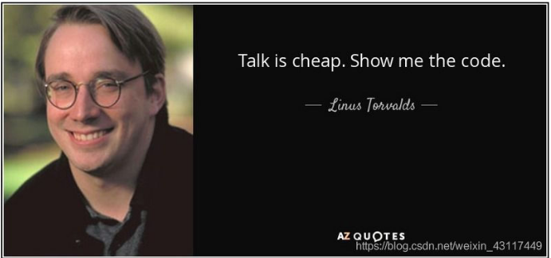

下面是我整理的常用 Git 命令清单。几个专用名词的译名如下。

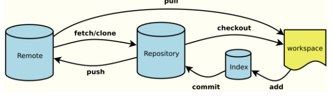

- Workspace：工作区
- Index / Stage：暂存区
- Repository：仓库区（或本地仓库）
- Remote：远程仓库
本地分支关联远程：git branch --set-upstream-to=origin/beta beta
 
## 1、新建代码库

### 1.1、在当前目录新建一个Git代码库

`$ git init`

### 1.2、新建一个目录，将其初始化为Git代码库

`$ git init [project-name]`

### 1.3、下载一个项目和它的整个代码历史

`$ git clone [url]`

## 2、配置
 
Git的设置文件为.gitconfig，它可以在用户主目录下（全局配置），也可以在项目目录下（项目配置）。

### 2.1、显示当前的Git配置

`$ git config --list`

### 2.2、编辑Git配置文件

`$ git config -e [--global]`

### 2.3、设置提交代码时的用户信息

`$ git config [--global] user.name "[name]"`
`$ git config [--global] user.email "[email address]"`

## 3、增加/删除文件

### 3.1、添加指定文件到暂存区

`$ git add [file1] [file2] ...`

### 3.2、添加指定目录到暂存区，包括子目录

`$ git add [dir]`

### 3.3、添加当前目录的所有文件到暂存区

`$ git add .`

### 3.4、添加每个变化前，都会要求确认

对于同一个文件的多处变化，可以实现分次提交
`$ git add -p`

### 3.5、删除工作区文件，并且将这次删除放入暂存区

`$ git rm [file1] [file2] ...`

### 3.6、停止追踪指定文件，但该文件会保留在工作区

`$ git rm --cached [file]`

### 3.7、改名文件，并且将这个改名放入暂存区

`$ git mv [file-original] [file-renamed]`

## 4、代码提交

### 4.1、提交暂存区到仓库区

`$ git commit -m [message]`

### 4.2、提交暂存区的指定文件到仓库区

`$ git commit [file1] [file2] ... -m [message]`

### 4.3、提交工作区自上次commit之后的变化，直接到仓库区

`$ git commit -a`

### 4.4、提交时显示所有diff信息

`$ git commit -v`

### 4.5、使用一次新的commit，替代上一次提交

如果代码没有任何新变化，则用来改写上一次commit的提交信息

`$ git commit --amend -m [message]`

### 4.6、重做上一次commit，并包括指定文件的新变化

`$ git commit --amend [file1] [file2] ...`

## 5、分支

### 5.1、列出所有本地分支

`$ git branch`
 
### 5.2、列出所有远程分支

`$ git branch -r`

### 5.3、列出所有本地分支和远程分支

`$ git branch -a`

### 5.4、新建一个分支，但依然停留在当前分支

`$ git branch [branch-name]`

### 5.5、新建一个分支，并切换到该分支

`$ git checkout -b [branch]`

### 5.6、新建一个分支，指向指定commit

`$ git branch [branch] [commit]`

### 5.7、新建一个分支，与指定的远程分支建立追踪关系

`$ git branch --track [branch] [remote-branch]`

### 5.8、切换到指定分支，并更新工作区

`$ git checkout [branch-name]`

### 5.9、切换到上一个分支

`$ git checkout -`

### 5.10、建立追踪关系，在现有分支与指定的远程分支之间

`git branch --set-upstream-to=origin/remote_branch  your_branch`

其中，origin/remote_branch是你本地分支对应的远程分支；your_branch是你当前的本地分支。

最近使用git pull的时候多次碰见下面的情况：

```git
There is no tracking information for the current branch.
Please specify which branch you want to merge with.
See git-pull(1) for details.

git pull <remote> <branch>

If you wish to set tracking information for this branch you can do so with:

git branch --set-upstream-to=origin/<branch> release
```

其实，输出的提示信息说的还是比较明白的。

使用git在本地新建一个分支后，需要做远程分支关联。如果没有关联，git会在下面的操作中提示你显示的添加关联。

关联目的是在执行git pull, git push操作时就不需要指定对应的远程分支，你只要没有显示指定，git pull的时候，就会提示你。

### 5.11、合并指定分支到当前分支

`$ git merge [branch]`

例如
`$git fetch origin master(远程):master(本地)` 
`$git merge origin/master(远程):master(本地)`

### 5.12、选择一个commit，合并进当前分支

`$ git cherry-pick [commit]`

### 5.13、删除分支

`$ git branch -d [branch-name]`

### 5.14、删除远程分支

`$ git push origin --delete [branch-name]`
`$ git branch -dr [remote/branch]`

## 6、标签

### 6.1、列出所有tag

`$ git tag`

### 6.2、新建一个tag在当前commit

`$ git tag [tag]`

### 6.3、新建一个tag在指定commit

`$ git tag [tag] [commit]`

### 6.4、删除本地tag

`$ git tag -d [tag]`

### 6.5、删除远程tag

`$ git push origin :refs/tags/[tagName]`

### 6.6、查看tag信息

`$ git show [tag]`

### 6.7、提交指定tag

`$ git push [remote] [tag]`

### 6.8、提交所有tag

`$ git push [remote] --tags`

### 6.9、新建一个分支，指向某个tag

`$ git checkout -b [branch] [tag]`

## 7、查看信息

### 7.1、显示有变更的文件

git status命令用于显示工作目录和暂存区的状态。使用此命令能看到那些修改被暂存到了, 哪些没有, 哪些文件没有被Git tracked到。git status不显示已经commit到项目历史中去的信息。看项目历史的信息要使用git log.//原

`$ git status`

### 7.2、显示当前分支的版本历史

`$ git log`

### 7.3、显示commit历史，以及每次commit发生变更的文件

`$ git log --stat`

### 7.4、搜索提交历史，根据关键词

`$ git log -S [keyword]`

### 7.5、显示某个commit之后的所有变动，每个commit占据一行

`$ git log [tag] HEAD --pretty=format:%s`

### 7.6、显示某个commit之后的所有变动，其"提交说明"必须符合搜索条件

`$ git log [tag] HEAD --grep feature`

### 7.7、 显示某个文件的版本历史，包括文件改名

`$ git log --follow [file]`
`$ git whatchanged [file]`

### 7.8、显示指定文件相关的每一次diff

`$ git log -p [file]`

### 7.9、显示过去5次提交

`$ git log -5 --pretty --oneline`

### 7.10、显示所有提交过的用户，按提交次数排序

`$ git shortlog -sn`

### 7.11、显示指定文件是什么人在什么时间修改过

`$ git blame [file]`

### 7.12、显示工作区和暂存区的差异

工作区修改的数据没有提交暂存区

`$ git diff`

### 7.13、显示暂存区和上一个commit的差异

工作区修改的数据已经提交暂存区

`$ git diff --cached [file]`

### 7.14、显示工作区与当前分支最新commit之间的差异

`$ git diff HEAD`

### 7.15、显示两次提交之间的差异

`$ git diff [first-branch]...[second-branch]`

### 7.16、显示今天你写了多少行代码

`$ git diff --shortstat "@{0 day ago}"`

### 7.17、显示某次提交的元数据和内容变化

`$ git show [commit]`

### 7.18、显示某次提交发生变化的文件

`$ git show --name-only [commit]`

### 7.19、显示某次提交时，某个文件的内容

`$ git show [commit]:[filename]`

### 7.20、显示当前分支的最近几次提交

`$ git reflog`

## 8、远程同步

### 8.1、下载远程仓库的所有变动

`$ git fetch [remote]`

例如， `$ git fetch origin master`

### 8.2、显示所有远程仓库

`$ git remote -v`

### 8.3、显示某个远程仓库的信息

`$ git remote show [remote]`

### 8.4、增加一个新的远程仓库，并命名

`$ git remote add [shortname] [url]`

例如 `git remote add origin https://github.com/zhizhuxialiwen/repo1_https.git`

### 8.5、取回远程仓库的变化，并与本地分支合并

`$ git pull [remote] [branch]`

例如： `git pull origin master`

```git
方法一：
wen@DESKTOP-V2MS2VF MINGW64 /e/study/git_repository/repo1 (master|REBASE 4/5)
$ git pull origin master
From https://github.com/zhizhuxialiwen/repo1_https
 * branch            master     -> FETCH_HEAD
Already up to date.
方法二：
wen@DESKTOP-V2MS2VF MINGW64 /e/study/git_repository/repo1 (master|REBASE 4/5)
$ git fetch origin master(远程仓库) wen(本地仓库)
From https://github.com/zhizhuxialiwen/repo1_https
 * branch            master     -> FETCH_HEAD
$ git merge origin/master(远程仓库):wen(本地仓库)
```

### 8.6、上传本地指定分支到远程仓库

`$ git push [remote] [branch]`
例如：`git push -u origin master`
-u表示第一次将本地仓库推送到远程仓库，下次默认连接远程仓库

### 8.7、强行推送当前分支到远程仓库，即使有冲突

`$ git push [remote] [branch] --force`
例如：`git push origin master(远程仓库)--force`

### 8.8、推送所有分支到远程仓库

`$ git push [remote] --all`

## 9、撤销

### 9.1、恢复暂存区的指定文件到工作区

即恢复工作区所修改的文件内容
`$ git checkout [file]`
例如`$ git checkout readme.txt`

### 9.2、恢复某个commit的指定文件到暂存区和工作区

`$ git checkout [commit] [file]`

例如`$ git checkout HEAD readme.txt`  //HEAD表示最新版本，HEAD当前分支最新节点

### 9.3、恢复暂存区的所有文件到工作区

`$ git checkout .`

### 9.4、重置暂存区的指定文件，与上一次commit保持一致，但工作区不变

`$ git reset [file]`
例如：`$ git reset readme.txt`

### 9.5、重置暂存区与工作区，与上一次commit保持一致

`$ git reset --hard`
例如：`$ git reset --hard  readme.txt`

### 9.6、重置当前分支的指针为指定commit，同时重置暂存区，但工作区不变

`$ git reset [commit]`

例如：`$ git reset HEAD readme.txt`

### 9.7、重置当前分支的HEAD为指定commit，同时重置暂存区和工作区，与指定commit一致

即修改暂存区和工作区的内容与制定commit的内容一致
`$ git reset --hard [commit]`
例如：`$ git reset --Hard HEAD readme.txt`

### 9.8、重置当前HEAD为指定commit，但保持暂存区和工作区不变

`$ git reset --keep [commit]`

### 9.9、新建一个commit，用来撤销指定commit

后者的所有变化都将被前者抵消，并且应用到当前分支
`$ git revert [commit]`


### 9.10、暂时将未提交的变化移除，稍后再移入

`$ git stash`
`$ git stash pop`

- 常用git stash命令：

1. `git stash save "save message"` : 执行存储时，添加备注，方便查找，只有git stash 也要可以的，但查找时不方便识别。
2. `git stash list`  ：查看stash了哪些存储
3. `git stash show` ：显示做了哪些改动文件，默认show第一个存储,如果要显示其他存贮，后面加stash@{$num}，比如第二个 `git stash show stash@{1}`
4. `git stash show -p` : 显示第一个存储的改动文件内容，如果想显示其他存存储，命令：`git stash show  stash@{$num}  -p` ，比如第二个：`git stash show  stash@{1}  -p`
5. `git stash apply` :应用某个存储,但不会把存储从存储列表中删除，默认使用第一个存储,即stash@{0}，如果要使用其他个，`git stash apply stash@{$num}` ， 比如第二个：`git stash apply stash@{1}` 
6. `git stash pop` ：命令恢复之前缓存的工作目录，将缓存堆栈中的对应stash删除，并将对应修改应用到当前的工作目录下,默认为第一个stash,即stash@{0}，如果要应用并删除其他stash，命令：`git stash pop stash@{$num}` ，比如应用并删除第二个：`git stash pop stash@{1}`
7. `git stash drop stash@{$num}` ：丢弃stash@{$num}存储，从列表中删除这个存储
8. `git stash clear` ：删除所有缓存的stash

## 10、其他

### 10.1、生成一个可供发布的压缩包

`$ git archive`

1. 基本用法：

`git archive --format tar.gz --output "./output.tar.gz" master`

说明：

将master分支打包为output.tar.gz
–format指明打包格式，若不指明此项，则根据–output中的文件名推断文件格式。所以你也可以将上述命令简化为:
`git archive --output "./output.tar.gz" master`

可以使用-l参数获得支持的文件格式列表。

```git
[@sjs_73_171 gittest]$ git archive -l
tar
tgz
tar.gz
zip
```

–output指明输出包名

2. 打包不同的分支或commit

如果想打包不同分支，只要使用不同分支名即可。比如我有一个分支名为“testbr”，可以用如下命令将其打包。

`git archive --format tar.gz --output "./output.tar.gz" testbr`

如果要打包某个commit，只要先使用git log找到相应的commit id, 再使用该commit id打包即可。比如：

`git archive --format tar.gz --output "./output.tar.gz" 5ca16ac0d603603`

3. 打包某个目录

如果想打包master下的mydir mydir2目录，可以用下面命令

`git archive --format tar.gz --output "./output.tar.gz" master mydir mydir2`

4. 注意

打包建议在代码库的根目录下进行，不然会碰到各种问题。比如，如果在master分支的mydir目录下执行

`git archive --output "./output.tar.gz" master`

就只会将mydir目录下的内容打包。

## 11、Git分支管理策略
 
### 11.1、主分支Master

首先，代码库应该有一个、且仅有一个主分支。所有提供给用户使用的正式版本，都在这个主分支上发布。

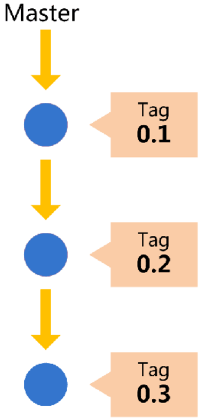

Git主分支的名字，默认叫做Master。它是自动建立的，版本库初始化以后，默认就是在主分支在进行开发。

### 11.2、开发分支Develop

主分支只用来分布重大版本，日常开发应该在另一条分支上完成。我们把开发用的分支，叫做Develop。

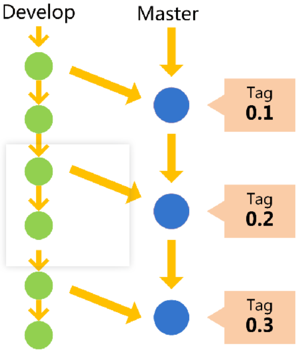

这个分支可以用来生成代码的最新隔夜版本（nightly）。如果想正式对外发布，就在Master分支上，对Develop分支进行"合并"（merge）。
Git创建Develop分支的命令：

　　`git checkout -b develop master`

将Develop分支发布到Master分支的命令：
　　# 切换到Master分支
　　`git checkout master`
　　# 对Develop分支进行合并
　　`git merge --no-ff develop`
这里稍微解释一下，上一条命令的--no-ff参数是什么意思。默认情况下，Git执行"快进式合并"（fast-farward merge），会直接将Master分支指向Develop分支。

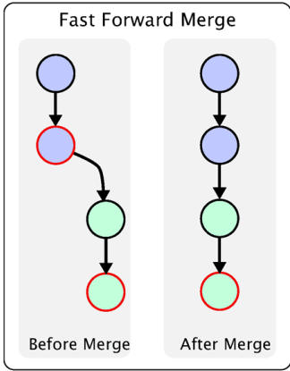

使用--no-ff参数后，会执行正常合并，在Master分支上生成一个新节点。为了保证版本演进的清晰，我们希望采用这种做法。关于合并的更多解释，请参考Benjamin Sandofsky的《Understanding the Git Workflow》。

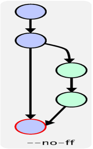

### 11.3、临时性分支

前面讲到版本库的两条主要分支：Master和Develop。前者用于正式发布，后者用于日常开发。其实，常设分支只需要这两条就够了，不需要其他了。
但是，除了常设分支以外，还有一些临时性分支，用于应对一些特定目的的版本开发。临时性分支主要有三种：

1. 功能（feature）分支
2. 预发布（release）分支
3. 修补bug（fixbug）分支
这三种分支都属于临时性需要，使用完以后，应该删除，使得代码库的常设分支始终只有Master和Develop。

### 11.4、功能分支feature-*

接下来，一个个来看这三种"临时性分支"。
第一种是功能分支，它是为了开发某种特定功能，从Develop分支上面分出来的。开发完成后，要再并入Develop。

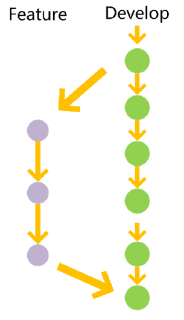

功能分支的名字，可以采用feature-*的形式命名。
创建一个功能分支feature-x ：
　　`git checkout -b feature-x develop`
开发完成后，将功能分支合并到develop分支：
　　`git checkout develop`
　　`git merge --no-ff feature-x`
删除feature分支：
　　`git branch -d feature-x`

### 11.5、预发布分支release-*

第二种是预发布分支，它是指发布正式版本之前（即合并到Master分支之前），我们可能需要有一个预发布的版本进行测试。
预发布分支是从Develop分支上面分出来的，预发布结束以后，必须合并进Develop和Master分支。它的命名，可以采用release-*的形式。
创建一个预发布分支：
　　`git checkout -b release-1.2 develop`
确认没有问题后，合并到master分支：
　　`git checkout master`
　　`git merge --no-ff release-1.2`

对合并生成的新节点，做一个标签
　　  `git tag -a 1.2`
再合并到develop分支：
　　`git checkout develop`
　　`git merge --no-ff release-1.2`
最后，删除预发布分支：
　　`git branch -d release-1.2`

### 11.6、修补bug分支fixbug-*

最后一种是修补bug分支。软件正式发布以后，难免会出现bug。这时就需要创建一个分支，进行bug修补。
修补bug分支是从Master分支上面分出来的。修补结束以后，再合并进Master和Develop分支。它的命名，可以采用fixbug-*的形式。

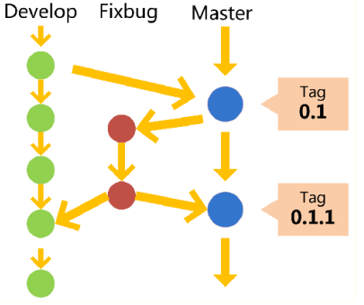

创建一个修补bug分支：
　　`git checkout -b fixbug-0.1 master`
修补结束后，合并到master分支：
　　`git checkout master`
　　`git merge --no-ff fixbug-0.1`
　　`git tag -a 0.1.1`
再合并到develop分支：
　　`git checkout develop`
　　`git merge --no-ff fixbug-0.1`
最后，删除"修补bug分支"：
　　`git branch -d fixbug-0.1`
 
## 12、版本回退-撤销文件修改

{针对文件修改恢复}

## 12.1、工作区修改一个文件后，又想回到修改前(git add前)

1. 当然可以直接手动再在工作区中将文件修改回去
2. 修改后，通过命令git status查看
`$ git status`

```git
# On branch master
# Changes not staged for commit:
# (use "git add <file>..." to update what will be committed)
# (use "git checkout -- <file>..." to discard changes in working directory)
# modified: readme.txt
no changes added to commit (use "git add" and/or "git commit -a")
```

这时Git会告诉你，git checkout -- file可以丢弃工作区的修改：
`$ git checkout -- readme.txt`

Note:

1. `git checkout -- file`命令中的--很重要，**没有--，就变成了“切换到另一个分支”的命令**，我们在后面的分支管理中会再次遇到git checkout命令。

2. 命令`git checkout -- readme.txt`意思就是，把readme.txt文件在工作区的修改全部撤销，这里有两种情况：
一种是readme.txt自修改后还没有被放到暂存区，现在，撤销修改就回到和版本库一模一样的状态；一种是readme.txt已经添加到暂存区后，又作了修改，现在，撤销修改就回到添加到暂存区后的状态。总之，就是让这个文件回到最近一次git commit或git add时的状态。

3. 工作区、暂存区的概念不清楚的可见于Git版本控制教程 - Git本地仓库

## 12.2、如果在工作区中修改了文件，还git add到暂存区（但是在commit之前）

用git status查看一下，修改只是添加到了暂存区，还没有提交：
$ git status
```git
# On branch master
# Changes to be committed:
# (use "git reset HEAD <file>..." to unstage)
# modified: readme.txt
```

Git同样告诉我们，用命令`git reset HEAD file`可以把暂存区的修改撤销掉（unstage），重新放回工作区：

```git
$ git reset HEAD readme.txt
Unstaged changes after reset:
M readme.txt
```

git reset命令既可以回退版本，也可以把暂存区的修改回退到工作区。当我们用HEAD时，表示最新的版本。
再用git status查看一下，现在暂存区是干净的，工作区有修改。
然后丢弃工作区的修改

```git
$ git checkout -- readme.txt
$ git status
# On branch master
nothing to commit (working directory clean)
```

## 12.3、不但修改了文件还从暂存区提交commit到了版本库 - 版本回退

版本回退可以回退到上一个版本。不过，这是有条件的，就是你还没有把自己的本地版本库推送到远程。Git是分布式版本控制系统。
在工作中对某个文件（如readme.txt）进行多次修改交commit。
可以通过版本控制系统命令告诉我们提交的历史记录，在Git中，我们用git log命令查看：

```git
$ git log
commit 3628164fb26d48395383f8f31179f24e0882e1e0
Author: Michael Liao <askxuefeng@gmail.com>
Date: Tue Aug 20 15:11:49 2013 +0800
append GPL
commit ea34578d5496d7dd233c827ed32a8cd576c5ee85
Author: Michael Liao <askxuefeng@gmail.com>
Date: Tue Aug 20 14:53:12 2013 +0800
add distributed
commit cb926e7ea50ad11b8f9e909c05226233bf755030
Author: Michael Liao <askxuefeng@gmail.com>
Date: Mon Aug 19 17:51:55 2013 +0800
wrote a readme file
```

Note:

1. git log命令显示从最近到最远的提交日志，我们可以看到3次提交，最近的一次是append GPL，上一次是add distributed，最早的一次是wrote a readme file。

2. 如果嫌输出信息太多，看得眼花缭乱的，可以试试加上--pretty=oneline参数：

```git
$ git log --pretty=oneline
3628164fb26d48395383f8f31179f24e0882e1e0 append GPL
ea34578d5496d7dd233c827ed32a8cd576c5ee85 add distributed
cb926e7ea50ad11b8f9e909c05226233bf755030 wrote a readme file
```

3. 你看到的一大串类似3628164...882e1e0的是commit id（版本号），和SVN不一样，Git的commit id不是1，2，3……递增的数字，而是一个SHA1计算出来的一个非常大的数字，用十六进制表示，而且你看到的commit id和我的肯定不一样，以你自己的为准。为什么commit id需要用这么一大串数字表示呢？因为Git是分布式的版本控制系统，后面我们还要研究多人在同一个版本库里工作，如果大家都用1，2，3……作为版本号，那肯定就冲突了。

4. 每提交一个新版本，实际上Git就会把它们自动串成一条时间线。如果使用可视化工具（如GitX、github的客户端、pycharm）查看Git历史，就可以更清楚地看到提交历史的时间线。

#### 12.3.1、现在我们想要把readme.txt回退到上一个版本

如“add distributed”的那个版本，怎么做呢？首先，Git必须知道当前版本是哪个版本，在Git中，用HEAD表示当前版本，也就是最新的提交3628164...882e1e0（注意我的提交ID和你的肯定不一样），上一个版本就是HEAD^，上上一个版本就是HEAD^^，当然往上100个版本写100个^比较容易数不过来，所以写成HEAD~100。
现在，我们要把当前版本“append GPL”回退到上一个版本“add distributed”，就可以使用git reset命令：
`$ git reset --hard HEAD^`
HEAD is now at ea34578 add distributed
这时readme.txt的内容就成了版本add distributed
我们用git log再看看现在版本库的状态：

```git
$ git log
commit ea34578d5496d7dd233c827ed32a8cd576c5ee85
Author: Michael Liao <askxuefeng@gmail.com>
Date: Tue Aug 20 14:53:12 2013 +0800
add distributed
commit cb926e7ea50ad11b8f9e909c05226233bf755030
Author: Michael Liao <askxuefeng@gmail.com>
Date: Mon Aug 19 17:51:55 2013 +0800
wrote a readme file
```

最新的那个版本append GPL已经看不到了！

#### 12.3.2、恢复文件后，要是我们又想回到修改后的文件呢？（命令行窗口还没有被关掉）

{这个是git reset --hard后，又反悔了，想回到修改后的状态}
只要上面的命令行窗口还没有被关掉，你就可以顺着往上找啊找啊，找到那个append GPL的commit id是3628164...，于是就可以指定回到未来的某个版本：
`$ git reset --hard 3628164`
HEAD is now at 3628164 append GPL
版本号没必要写全，前几位就可以了，Git会自动去找。
Git的版本回退速度非常快，因为Git在内部有个指向当前版本的HEAD指针，当你回退版本的时候，Git仅仅是把HEAD从指向append GPL：

改为指向add distributed：

然后顺便把工作区的文件更新了。所以你让HEAD指向哪个版本号，你就把当前版本定位在哪。

#### 12.3.3、恢复文件后，要是我们又想回到修改后的文件呢？（命令行窗口早就关掉了）

{这个是git reset --hard后，又反悔了，想回到修改后的状态}
想恢复到新版本怎么办？找不到新版本的commit id怎么办？当你用`$ git reset --hard HEAD^`回退到add distributed版本时，再想恢复到append GPL，就必须找到append GPL的commit id。
Git提供了一个命令git reflog用来记录你的每一次命令：[Git高级教程:git log与git reflog]

```git
$ git reflog
ea34578 HEAD@{0}: reset: moving to HEAD^
3628164 HEAD@{1}: commit: append GPL
ea34578 HEAD@{2}: commit: add distributed
cb926e7 HEAD@{3}: commit (initial): wrote a readme file
```

第二行显示append GPL的commit id是3628164，现在，你又可以乘坐时光机回到未来了。

## 13、本地仓库修改后推送到远程仓库

1. 下载源码

`git clone https://github.com/zhizhuxialiwen/InterviewSummary.git` //下载源码

若没有源码，则初始化.git
`git init [项目名]`

2. 工作区

`git status`
`git diff HEAD`
`git add .`

3. 暂存区

`git diff --cached HEAD`
`git status`
`git commit -m "msg"`
`git log`

4. 本地仓库

```git
//更新本地仓库
git pull origin master(远程仓库) (默认当前仓库)
或
git fetch origin master(远程仓库) (默认当前仓库)
git merge origin/master(远程仓库) (默认当前仓库)
```

`git push origin wen(本地仓库):wen_remote`
`git log`

## 14、git的突出解决--git rebase之abort、continue、skip

（1）应用实例描述

假设在github或者gitoschina上建立了一个项目，默认分支为master分支，远程master分支上c.sh文件内容：

```sh
this is a new content!
hello world
```
 
开发者A、B分别将项目拷贝到自己本地进行开发
某一天，开发者B提交c.sh，并且提交成功，

```sh
this is a new content!
hello world
hello dev B
```
 
之后，开发者A在本地代码并没有和远程master分支的代码同步的情况下，对本地的c.sh进行了修改，修改后c.sh内容如下：

```sh
this is a new content!
hello world
this is develop A
```

修改后，开发者A准备将代码提交到远程master分支上。

（2）引入问题

 假设开发者A提交过程如下：

```git
$ git add c.sh
$ git commit -m "develop A"
```

如果直接使用$ git push，则会报错：

```git
error: failed to push some refs to 'git@git.oschina.net:XXXX/gitlearning.git'

hint: Updates were rejected because the remote contains work that you do not have locally. This is usually caused by another repository pushing to the same ref. You may want to first integrate the remote changes (e.g., 'git pull ...') before pushing again. See the 'Note about fast-forwards' in 'git push --help' for details.
```

上述过程的节点走向如下图所示：

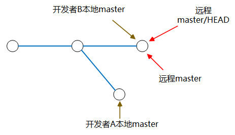

实际开发过程中考虑其它开发者可能会对c.sh进行修改，因此一般在开发过程中建议使用

`$ git pull --rebase`

与远程代码同步，同步过程会检查冲突，

此时，开发者根据 <<<<<<< HEAD，=======，>>>>>>> 便可知冲突的位置。

注意：不是出现冲突才使用git pull --rebase，它是一种解决冲突的手段，另外还有merge的方式

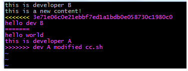
 
（3） 知识点引入

- `$ git pull --rebase`

git pull的默认行为是git fetch + git merge

git pull --rebase则是git fetch + git rebase.

- `$ git fetch`

从远程获取最新版本到本地，不会自动合并分支

- `$ git rebase`

git rebase，顾名思义，就是重新定义（re）起点（base）的作用，即重新定义分支的版本库状态。本地更新分支节点过程如下图所示。（关于rebase节点知识点可以参考http://blog.csdn.net/hudashi/article/details/7664631/）

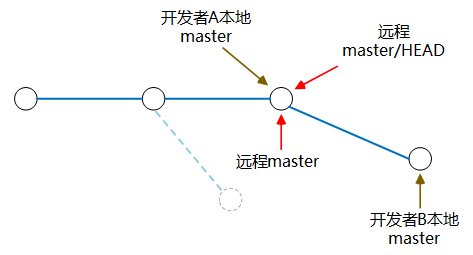

- `$ git pull --rebase`

 git pull --rebase执行过程中会将本地当前分支里的每个提交(commit)取消掉，然后把将本地当前分支更新为最新的"origin"分支，该过程本地分支节点更新图如下所示：

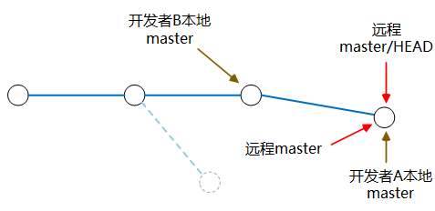

（4）回到主题

执行完git pull --rebase之后如果有合并冲突，使用以下三种方式处理这些冲突：

- `git rebase --abort` 会放弃合并，回到rebase操作之前的状态，之前的提交的不会丢弃；
- `git rebase --skip` 则会将引起冲突的commits丢弃掉（慎用！！）；
- `git rebase --continue` 合并冲突，结合"git add 文件"命令一起用与修复冲突，提示开发者，一步一步地有没有解决冲突。（fix conflicts and then run "git rebase --continue"）

 
对上述冲突的处理

1、使用 `$git rebase --abort`

执行之后，本地内容会回到提交之间的状态，也就是回到以前提交但没有pull是的状态，简单来说就是撤销rebase。

2、使用`$git rebase --skip`

`git rebase --skip` 引起冲突的commits会被丢弃，对于本文应用的例子来说开发者A对c.sh文件的commit无效，开发者A自己修改的部分全部无效，**因此，在使用skip时请慎重。**

执行：`$ vim c.sh`

查看本地c.sh文件提交内容，展示如下图所示，执行语句之后开发者A的修改无效。

```sh
this is a new content!
hello world
hello dev B
```

3、使用 `$git rebase --continue`

执行完`$git pull --rebase` 之后，本地如果产生冲突，手动解决冲突之后，用`"git add"`命令去更新这些内容的索引(index)，然后只要执行:
`$ git rebase --continue` 就可以线性的连接本地分支与远程分支，无误之后就回退出，回到主分支上。
注意：一般情况下，修改后检查没问题，使用rebase continue来合并冲突。