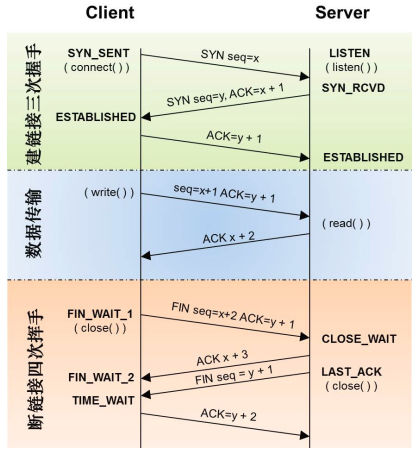
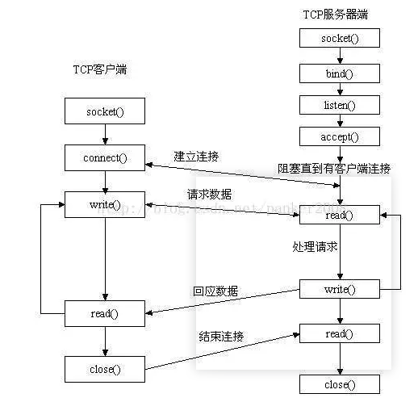

# 常见c++问题

## 1、c++

### 1.1、c++中四种cast转换

参考回答：
C++中四种类型转换是：static_cast, dynamic_cast, const_cast, reinterpret_cast

1. const_cast

用于将const变量转为非const

2. static_cast

用于各种隐式转换，比如非const转const，void*转指针等, static_cast能用于多态向上转化，如果向下转能成功但是不安全，结果未知；

3. dynamic_cast

用于动态类型转换。只能用于含有虚函数的类，用于类层次间的向上和向下转化。只能转指针或引用。向下转化时，如果是非法的对于指针返回NULL，对于引用抛异常。要深入了解内部转换的原理。

向上转换：指的是子类向基类的转换
向下转换：指的是基类向子类的转换

它通过判断在执行到该语句的时候变量的运行时类型和要转换的类型是否相同来判断是否能够进行向下转换。

4. reinterpret_cast

几乎什么都可以转，比如将int转指针，可能会出问题，尽量少用；

5. 为什么不使用C的强制转换？

C的强制转换表面上看起来功能强大什么都能转，但是转化不够明确，不能进行错误检查，容易出错。

### 1.2、C/C++ 中指针和引用的区别？

 定义：
1、引用：

C++是C语言的继承，它可进行过程化程序设计，又可以进行以抽象数据类型为特点的基于对象的程序设计，还可以进行以继承和多态为特点的面向对象的程序设计。引用就是C++对C语言的重要扩充。引用就是某一变量的一个别名，对引用的操作与对变量直接操作完全一样。引用的声明方法：**类型标识符 &引用名=目标变量名；**引用引入了对象的一个同义词。定义引用的表示方法与定义指针相似，只是用&代替了*。

2、指针：

指针利用地址，它的值直接指向存在电脑存储器中另一个地方的值。由于通过地址能找到所需的变量单元，可以说，地址指向该变量单元。因此，将地址形象化的称为“指针”。意思是通过它能找到以它为地址的内存单元。

参考回答：
1.指针有自己的一块空间，而引用只是一个别名；
2.使用sizeof看一个指针的大小是4，而引用则是被引用对象的大小；
3.指针可以被初始化为NULL，而引用必须被初始化且必须是一个已有对象 的引用；
4.作为参数传递时，指针需要被解引用才可以对对象进行操作，而直接对引用的修改都会改变引用所指向的对象；
5.可以有const指针，但是没有const引用；
6.指针在使用中可以指向其它对象，但是引用只能是一个对象的引用，不能 被改变；
7.指针可以有多级指针（**p），而引用至于一级；
8.指针和引用使用++运算符的意义不一样；

```c++
int a=0;
int b=&a;
int *p=&a;
b++;相当于a++;b只是a的一个别名，和a一样使用。
p++;后p指向a后面的内存
```

9.如果返回动态内存分配的对象或者内存，必须使用指针，引用可能引起内存泄露。

### 1.3、c++中的smart pointer四个智能指针： shared_ptr,unique_ptr,weak_ptr,auto_ptr

参考回答：
C++里面的四个智能指针: auto_ptr, shared_ptr, weak_ptr, unique_ptr 其中后三个是c++11支持，并且第一个已经被11弃用。
为什么要使用智能指针：

智能指针的作用是管理一个指针，因为存在以下这种情况：申请的空间在函数结束时忘记释放，造成内存泄漏。使用智能指针可以很大程度上的避免这个问题，因为智能指针就是一个类，当超出了类的作用域是，类会自动调用析构函数，析构函数会自动释放资源。所以智能指针的作用原理就是在函数结束时自动释放内存空间，不需要手动释放内存空间。

1. auto_ptr（c++98的方案，cpp11已经抛弃）

采用所有权模式。

```c++
auto_ptr< string> p1 (new string ("I reigned lonely as a cloud.”));
auto_ptr<string> p2;
p2 = p1; //auto_ptr不会报错.
```

此时不会报错，p2剥夺了p1的所有权，但是当程序运行时访问p1将会报错。所以auto_ptr的缺点是：存在潜在的内存崩溃问题！

2. unique_ptr（替换auto_ptr）

unique_ptr实现独占式拥有或严格拥有概念，保证同一时间内只有一个智能指针可以指向该对象。它对于避免资源泄露(例如“以new创建对象后因为发生异常而忘记调用delete”)特别有用。

采用所有权模式，还是上面那个例子

```c++
unique_ptr<string> p3 (new string ("auto"));   //#4
unique_ptr<string> p4；                       //#5
p4 = p3;//此时会报错！！
```

编译器认为p4=p3非法，避免了p3不再指向有效数据的问题。因此，unique_ptr比auto_ptr更安全。

另外unique_ptr还有更聪明的地方：当程序试图将一个 unique_ptr 赋值给另一个时，如果源 unique_ptr 是个临时右值，编译器允许这么做；如果源 unique_ptr 将存在一段时间，编译器将禁止这么做，比如：

```c++
unique_ptr<string> pu1(new string ("hello world"));
unique_ptr<string> pu2;
pu2 = pu1;                                      // #1 not allowed
unique_ptr<string> pu3;
pu3 = unique_ptr<string>(new string ("You"));   // #2 allowed
```

其中#1留下悬挂的unique_ptr(pu1)，这可能导致危害。而#2不会留下悬挂的unique_ptr，因为它调用 unique_ptr 的构造函数，该构造函数创建的临时对象在其所有权让给 pu3 后就会被销毁。这种随情况而已的行为表明，unique_ptr 优于允许两种赋值的auto_ptr 。

注：如果确实想执行类似与#1的操作，要安全的重用这种指针，可给它赋新值。C++有一个标准库函数std::move()，让你能够将一个unique_ptr赋给另一个。例如：

```c++
unique_ptr<string> ps1, ps2;
ps1 = demo("hello");
ps2 = move(ps1);
ps1 = demo("alexia");
cout << *ps2 << *ps1 << endl;
```

3. shared_ptr

shared_ptr实现共享式拥有概念。多个智能指针可以指向相同对象，该对象和其相关资源会在“最后一个引用被销毁”时候释放。从名字share就可以看出了资源可以被多个指针共享，它使用计数机制来表明资源被几个指针共享。可以通过成员函数use_count()来查看资源的所有者个数。除了可以通过new来构造，还可以通过传入auto_ptr, unique_ptr,weak_ptr来构造。当我们调用release()时，当前指针会释放资源所有权，计数减一。当计数等于0时，资源会被释放。

shared_ptr 是为了解决 auto_ptr 在对象所有权上的局限性(auto_ptr 是独占的), 在使用引用计数的机制上提供了可以共享所有权的智能指针。

- 成员函数：
    > use_count 返回引用计数的个数
unique 返回是否是独占所有权( use_count 为 1)
swap 交换两个 shared_ptr 对象(即交换所拥有的对象)
reset 放弃内部对象的所有权或拥有对象的变更, 会引起原有对象的引用计数的减少
get 返回内部对象(指针), 由于已经重载了()方法, 因此和直接使用对象是一样的.如 shared_ptr<int> sp(new int(1)); sp 与 sp.get()是等价的

4. weak_ptr

weak_ptr 是一种不控制对象生命周期的智能指针, 它指向一个 shared_ptr 管理的对象. 进行该对象的内存管理的是那个强引用的 shared_ptr. weak_ptr只是提供了对管理对象的一个访问手段。weak_ptr 设计的目的是为配合 shared_ptr 而引入的一种智能指针来协助 shared_ptr 工作, 它只可以从一个 shared_ptr 或另一个 weak_ptr 对象构造, 它的构造和析构不会引起引用记数的增加或减少。weak_ptr是用来解决shared_ptr相互引用时的死锁问题,如果说两个shared_ptr相互引用,那么这两个指针的引用计数永远不可能下降为0,资源永远不会释放。它是对对象的一种弱引用，不会增加对象的引用计数，和shared_ptr之间可以相互转化，shared_ptr可以直接赋值给它，它可以通过调用lock函数来获得shared_ptr。


```
class B;
class A
{
public:
    shared_ptr<B> pb_;
    ~A()
    {
        cout<<"A delete\n";
    }
};
class B
{
public:
    shared_ptr<A> pa_;
    ~B()
    {
        cout<<"B delete\n";
    }
};
void fun()
{
    shared_ptr<B> pb(new B());
    shared_ptr<A> pa(new A());
    pb->pa_ = pa;
    pa->pb_ = pb;
    cout<<pb.use_count()<<endl;
    cout<<pa.use_count()<<endl;
}
int main()
{
    fun();
    return 0;
}
```

可以看到fun函数中pa ，pb之间互相引用，两个资源的引用计数为2，当要跳出函数时，智能指针pa，pb析构时两个资源引用计数会减一，但是两者引用计数还是为1，导致跳出函数时资源没有被释放（A B的析构函数没有被调用），如果把其中一个改为weak_ptr就可以了，我们把类A里面的shared_ptr pb_; 改为weak_ptr pb_; 运行结果如下，这样的话，资源B的引用开始就只有1，当pb析构时，B的计数变为0，B得到释放，B释放的同时也会使A的计数减一，同时pa析构时使A的计数减一，那么A的计数为0，A得到释放。

注意的是我们不能通过weak_ptr直接访问对象的方法，比如B对象中有一个方法print(),我们不能这样访问，pa->pb_->print(); 英文pb_是一个weak_ptr，应该先把它转化为shared_ptr,如：shared_ptr p = pa->pb_.lock(); p->print();

### 1.4、数组和指针的区别

参考回答：
指针和数组的主要区别如下：
|指针|数组|
|:---|:---|
|保存数据的地址|保存数据|
|间接访问数据，首先获得指针的内容，然后将其作为地址，从该地址中提取数据|直接访问数据|
|通常用于动态的数据结构|通常用于固定数目且数据类型相同的元素|
|通过Malloc分配内存，free释放内存|隐式的分配和删除|
|通常指向匿名数据，操作匿名函数|自身即为数据名|

### 1.5、C++中析构函数的作用

参考回答：
析构函数与构造函数对应，当对象结束其生命周期，如对象所在的函数已调用完毕时，系统会自动执行析构函数。
析构函数名也应与类名相同，只是在函数名前面加一个位取反符`~`，例如`~stud( )`，以区别于构造函数。它不能带任何参数，也没有返回值（包括void类型）。只能有一个析构函数，不能重载。

如果用户没有编写析构函数，编译系统会自动生成一个缺省的析构函数（即使自定义了析构函数，编译器也总是会为我们合成一个析构函数，并且如果自定义了析构函数，编译器在执行时会先调用自定义的析构函数再调用合成的析构函数），它也不进行任何操作。所以许多简单的类中没有用显式的析构函数。

如果一个类中有指针，且在使用的过程中动态的申请了内存，那么最好显示构造析构函数在销毁类之前，释放掉申请的内存空间，避免内存泄漏。

类析构顺序：1）派生类本身的析构函数；2）对象成员析构函数；3）基类析构函数。

**构造函数与析构函数执行顺序：基类构造函数-》对象成员构造函数-》派生类本身的构造函数-》派生类析构函数-》对象成员析构函数-》基类析构函数。**

### 1.6、new/delete与malloc/free的区别是什么

参考回答：
相同：new/delete 和 malloc/free 的共同的是：都是从堆上申请空间，并且需要用户手动释放。

区别一：本质
　　new/delete 在C++中是运算符不是函数，需要编译器支持。malloc/free是库函数，需要头文件支持，在C语言中使用。

区别二：开辟内存大小
　　用 new 操作符申请内存分配时无须指定内存块的大小，编译器会根据提供的类型信息自行计算。而malloc则需要先计算出所需内存的尺寸。
　　new 可以直接分配快内存，用[ ]操作；malloc 在分配快内存时，需要先把快内存的大小计算出来，然后分配；

区别三：返回类型
　　new操作符内存分配成功时，返回的是提供的对象类型的指针，类型严格与对象匹配，无须进行类型转换，故new是符合类型安全性的操作符。
　　而malloc内存分配成功则是返回void * ，需要通过强制类型转换将void*指针转换成我们需要的类型。

区别四：分配失败
　　new内存分配失败时，会抛出bac_alloc异常。malloc分配内存失败时返回NULL。

区别五：自定义类型
 new会先调用operator new函数，申请足够的内存（通常底层使用malloc实现）。然后调用类型的构造函数，初始化成员变量，最后返回自定义类型指针。delete先调用析构函数，然后调用operator delete函数释放内存（通常底层使用free实现）。

malloc/free是库函数，只能动态的申请和释放内存，无法强制要求其做自定义类型对象构造和析构工作。

区别六：重载
　　C++允许重载new/delete操作符，特别的，布局new的就不需要为对象分配内存，而是指定了一个地址作为内存起始区域，new在这段内存上为对象调用构造函数完成初始化工作，并返回此地址。而malloc不允许重载。

区别七：内存区域
　　new操作符从自由存储区上为对象动态分配内存空间，而malloc函数从堆上动态分配内存。自由存储区是C++基于new操作符的一个抽象概念，凡是通过new操作符进行内存申请，该内存即为自由存储区。而堆是操作系统中的术语，是操作系统所维护的一块特殊内存，用于程序的内存动态分配，C语言使用malloc从堆上分配内存，使用free释放已分配的对应内存。自由存储区不等于堆，如上所述，布局new就可以不位于堆中。

### 1.7、多态

多态分为静态和动态多态。静态多态：在一个作用域内，重载函数，即函数名相同，但是参数类型、参数个数不同，返回值没有说明，非const与const也不同。动态多态：基类与派生类的重写函数，函数名、参数类型、参数个数都相同，当基类指向派生类，调用的是派生类的虚函数；若不是虚函数，调用的是基类函数；原因：虚函数有一个虚函数表，虚函数表存储地址，派生类的虚函数重写虚函数地址，覆盖基类的虚函数地址，因此基类指向派生类的虚函数是通过指针指向派生类的虚函数地址。

#### 1.7.1、RTTI

参考回答：

- RTTI概念

RTTI(Run Time Type Identification)即通过运行时类型识别，程序能够使用基类的指针或引用来检查着这些指针或引用所指的对象的实际派生类型。

- typeid和dynamic_cast操作符

RTTI提供了两个非常有用的操作符：typeid和dynamic_cast。
typeid操作符，返回指针和引用所指的实际类型；
dynamic_cast操作符，将基类类型的指针或引用安全地转换为其派生类类型的指针或引用。

我们知道C++的多态性（运行时）是由虚函数实现的，对于多态性的对象，无法在程序编译阶段确定对象的类型。当类中含有虚函数时，其基类的指针就可以指向任何派生类的对象，这时就有可能不知道基类指针到底指向的是哪个对象的情况，类型的确定要在运行时利用运行时类型标识做出。为了获得一个对象的类型可以使用typeid函数，该函数反回一个对type_info类对象的引用，要使用typeid必须使用头文件<typeinfo>，因为typeid是一个返回类型为type_info的引用的函数所以这里有必要先介绍一下type_info类。

#### 1.7.2、虚函数表具体是怎样实现运行时多态的?

参考回答：
虚表vftable，编译器为每个拥有虚函数的类都建有一张虚函数表，里面存有虚函数的入口指针（地址）。在类对象的内存布局中，先是一个vfptr虚表指针，指向虚表首地址，而后通过偏移量的形式来访问虚表中的地址。

子类若重写父类虚函数，虚函数表中，父类虚函数的地址会被替换成子类的虚函数地址，对于存在虚函数的类的对象，在VS中，对象的对象模型的头部存放指向虚函数表的指针，即父类对象虚函数表指针指向子类虚函数表地址，通过该机制实现多态。

### 1.8、C++11有哪些新特性？

参考回答：
C++11 最常用的新特性如下：

1. auto关键字：编译器可以根据初始值自动推导出类型。但是不能用于函数传参以及数组类型的推导
2. nullptr(空指针)关键字：nullptr是一种特殊类型的字面值，它可以被转换成任意其它的指针类型；而NULL一般被宏定义为0，在遇到重载时可能会出现问题。
3. 智能指针：C++11新增了std::shared_ptr、std::weak_ptr等类型的智能指针，用于解决内存管理的死锁问题。
4. 初始化列表：使用初始化列表来对类进行初始化，例如`FooClass a1(123);`
5. 右值引用：基于右值引用可以实现移动语义和完美转发，消除两个对象交互时不必要的对象拷贝，节省运算存储资源，提高效率
6. atomic原子操作用于多线程资源互斥操作,C++11提供了个原子的类和方法atomic，保证了多线程对变量原子性操作，相比加锁机制mutex.lock()，mutex.unlock()，性能有几倍的提升。
7. 新增STL容器:
1）shrink_to_fit函数来释放内存；
2）array静态数组，目的就是为了替换C中的数组
3）forward_list是单向链表，其效率很高，是所以容器中没有提供size()方法的容器。
4）unordered_map/set是无序容器，其底层是由哈希表实现，所以时间复杂度均为O(1)，而且其是无序的。
5）元组tuple
  tuple类似于pair的模板。每个pair的成员类型可以不相同，但是pair只有两个成员，而一个tuple可以有任意数量的成员。每个确定的tuple类型的成员数目是固定的，但一个tuple类型的成员数目可以与另一个tuple类型不同。下面是tuple支持的操作：

定义和初始化tuple
  当我们顶一个tuple时，需要指出每个成员的类型：

```c++
tuple<int, double, size_t> threeD;  // 三个成员都被初始化为0
tuple<string, vector<double>, list<int>> someVal("constants", { 3.15,22 }, { 0,1 });
```

### 1.9、内存泄漏工具

|序号|工具	|描述|
|:--|:-----|:---|
|1|valgrind	|一个强大开源的程序检测工具|
|2|mtrace(memory trace，内存跟踪)|	GNU扩展, 用来跟踪malloc, mtrace为内存分配函数（malloc, realloc, memalign, free）安装hook函数|
|3|dmalloc(detect malloc，检查内存)|	用于检查C/C++内存泄露(leak)的工具，即检查是否存在直到程序运行结束还没有释放的内存,以一个运行库的方式发布|
|4|memwatch(memory watch，内存观察)|	和dmalloc一样，它能检测未释放的内存、同一段内存被释放多次、位址存取错误及不当使用未分配之内存区域
mpatrol	一个跨平台的 C++ 内存泄漏检测器

### 1.10、c++中拷贝构造函数的参数类型必须是引用

如果拷贝构造函数中的参数不是一个引用，即形如CClass(const CClass c_class)，那么就相当于采用了传值的方式(pass-by-value)，而传值的方式会调用该类的拷贝构造函数，从而**造成无穷递归地调用拷贝构造函数。** 因此拷贝构造函数的参数必须是一个引用。

### 1.11、 值、指针、引用传递区别

1. 值传递

形参是实参的拷贝，改变形参的值并不会影响外部实参的值。从被调用函数的角度来说，值传递是单向的（实参->形参），参数的值只能传入，

不能传出。当函数内部需要修改参数，并且不希望这个改变影响调用者时，采用值传递。

2. 指针传递

形参为指向实参地址的指针，当对形参的指向操作时，就相当于对实参本身进行的操作

3. 引用传递

形参相当于是实参的“别名”，对形参的操作其实就是对实参的操作，在引用传递过程中，被调函数的形式参数虽然也作为局部变量在栈
中开辟了内存空间，但是这时存放的是由主调函数放进来的实参变量的地址。被调函数对形参的任何操作都被处理成间接寻址，即通过
栈中存放的地址访问主调函数中的实参变量。正因为如此，被调函数对形参做的任何操作都影响了主调函数中的实参变量。

## 2、STL

### 2.1、map和set有什么区别，分别又是怎么实现的？

参考回答：
map/multimap和set/multiset都是C++的关联容器，其底层实现都是红黑树（RB-Tree）,而unordermap底层实现是hash表。由于 map 和set所开放的各种操作接口，RB-tree 也都提供了，所以几乎所有的 map 和set的操作行为，都只是转调 RB-tree 的操作行为。

map和set区别在于：

（1）map中的元素是key-value（关键字—值）对：关键字起到索引的作用，值则表示与索引相关联的数据；Set与之相对就是关键字的简单集合，set中每个元素只包含一个关键字。

（2）set的迭代器是const的，不允许修改元素的值；map允许修改value，但不允许修改key。其原因是因为map和set是根据关键字排序来保证其有序性的，如果允许修改key的话，那么首先需要删除该键，然后调节平衡，再插入修改后的键值，调节平衡，如此一来，严重破坏了map和set的结构，导致iterator失效，不知道应该指向改变前的位置，还是指向改变后的位置。所以STL中将set的迭代器设置成const，不允许修改迭代器的值；而map的迭代器则不允许修改key值，允许修改value值。

（3）map支持下标操作，set不支持下标操作。map可以用key做下标，map的下标运算符[ ]将关键码作为下标去执行查找，如果关键码不存在，则插入一个具有该关键码和mapped_type类型默认值的元素至map中，因此下标运算符[ ]在map应用中需要慎用，const_map不能用，只希望确定某一个关键值是否存在而不希望插入元素时也不应该使用，mapped_type类型没有默认值也不应该使用。如果find能解决需要，尽可能用find。

### 2.2、vector和list的区别，应用，越详细越好

参考回答：
1、概念
1.1、Vector
连续存储的容器，动态数组，在堆上分配空间
底层实现：数组
**两倍容量增长**：vector 增加（插入）新元素时，如果未超过当时的容量，则还有剩余空间，那么直接添加到最后（插入指定位置），然后调整迭代器。

如果没有剩余空间了，则会重新配置原有元素个数的两倍空间，然后将原空间元素通过复制的方式初始化新空间，再向新空间增加元素，最后析构并释放原空间，之前的迭代器会失效。

性能：
访问：O(1)
插入：在最后插入（空间够）：很快
在最后插入（空间不够）：需要内存申请和释放，以及对之前数据进行拷贝。
在中间插入（空间够）：内存拷贝
在中间插入（空间不够）：需要内存申请和释放，以及对之前数据进行拷贝。
删除：在最后删除：很快
在中间删除：内存拷贝

适用场景：经常随机访问，且不经常对非尾节点进行插入删除。

1.2、List
动态链表，在堆上分配空间，每插入一个元数都会分配空间，每删除一个元素都会释放空间。
底层：双向链表
性能：
访问：随机访问性能很差，只能快速访问头尾节点。
插入：很快，一般是常数开销
删除：很快，一般是常数开销

适用场景：经常插入删除大量数据

2、区别：
1）vector底层实现是数组；list是双向链表。
2）vector支持随机访问，list不支持。
3）vector是顺序内存，list不是。
4）vector在中间节点进行插入删除会导致内存拷贝，list不会。
5）vector一次性分配好内存，不够时才进行2倍扩容；list每次插入新节点都会进行内存申请。
6）vector随机访问性能好，插入删除性能差；list随机访问性能差，插入删除性能好。

3、应用
vector拥有一段连续的内存空间，因此支持随机访问，如果需要高效的随即访问，而不在乎插入和删除的效率，使用vector。

list拥有一段不连续的内存空间，如果需要高效的插入和删除，而不关心随机访问，则应使用list。

### 2.3、C++中各个容器的使用场景

|序号|特性|Vector|deque|list|set|mutltiset|map|multimap|
|:---|:---|:-----|:----|:---|:--|:--------|:--|--------|
|1   |典型内存结构|单端数组|双端数组|双向链表|红黑树(二叉树)|红黑树(二叉树)|红黑树(二叉树)|红黑树(二叉树)|
|2   |可随机存取|是|是|否|否|否|对key而言，是|否|
|3   |元素搜索速度|慢|慢|慢|快|快|对key而言快|对key而言快|
|4   |快速安插与移除|尾部|头尾部|任何位置|||||

1. Vector的使用场景：比如软件历史操作记录的存储，我们经常要查看历史记录，比如上一次的记录，上上次的记录，但却不会去删除记录，因为记录是事实的描述。
2. deque的使用场景：比如排队购票系统，对排队者的存储可以采用deque，支持头端的快速移除，尾端的快速添加。如果采用vector，则头端移除时，会移动大量的数据，速度慢。

vector与deque的比较：
一：vector.at()比deque.at()效率高，比如vector.at(0)是固定的，deque的开始位置却是不固定的。
二：如果有大量释放操作的话，vector花的时间更少，这跟二者的内部实现有关。
三：deque支持头部的快速插入与快速移除，这是deque的优点。
3. list的使用场景：比如公交车乘客的存储，随时可能有乘客下车，支持频繁的不确实位置元素的移除插入。
4. set的使用场景：比如对手机游戏的个人得分记录的存储，存储要求从高分到低分的顺序排列。 
5. map的使用场景：比如按ID号存储十万个用户，想要快速要通过ID查找对应的用户。二叉树的查找效率，这时就体现出来了。如果是vector容器，最坏的情况下可能要遍历完整个容器才能找到该用户。

### 2.4、C++的内存管理是怎样的？五大区？

参考回答：
在C++中，虚拟内存分为代码段、数据段、BSS段、堆区、文件映射区以及栈区六部分。
1、代码段:通常是指用来存放程序执行代码的一块内存区域。包括只读存储区和文本区，其中只读存储区存储字符串常量，文本区存储程序的机器代码。
2、数据段：存储程序中已初始化的全局变量和静态变量。
3、bss 段（Block Started by Symbol，静态内存分配）：存储未初始化的全局变量和静态变量（局部+全局），以及所有被初始化为0的全局变量和静态变量。
4、堆区：调用new/malloc函数时在堆区动态分配内存，同时需要调用delete/free来手动释放申请的内存。
5、映射区:存储动态链接库以及调用mmap函数进行的文件映射
6、栈：使用栈空间存储函数的返回地址、参数、局部变量、返回值

- 五大区：

1、栈区（stack）— 由编译器自动分配释放 ，存放函数的参数值，局部变量的值等。其操作方式类似于数据结构中的栈。 
2、堆区（heap） — 一般由程序员分配释放， 若程序员不释放，程序结束时可能由OS回收 。注意它与数据结构中的堆是两回事，分配方式倒是类似于链表，呵呵。 
3、全局区（静态区）（static）—，全局变量和静态变量的存储是放在一块的，初始化的全局变量和静态变量在一块区域， 未初始化的全局变量和未初始化的静态变量在相邻的另一块区域。 - 程序结束后有系统释放 
4、文字常量区 —常量字符串就是放在这里的。 程序结束后由系统释放 
5、程序代码区—存放函数体的二进制代码。

### 2.5、select、poll、epoll区别

1、支持一个进程所能打开的最大连接数
 

32位系统：32*32 = 1024
64位系统：64*32 = 2048

2、FD(file description,文件描述或句柄)剧增后带来的IO效率问题
 


3、消息传递方式
 


综上，在选择select，poll，epoll时要根据具体的使用场合以及这三种方式的自身特点：

1、表面上看epoll的性能最好，但是在连接数少并且连接都十分活跃的情况下，select和poll的性能可能比epoll好，毕竟epoll的通知机制需要很多函数回调。

2、select低效是因为每次它都需要轮询。但低效也是相对的，视情况而定，也可通过良好的设计改善。

## 3、网络通信

### 3.1、TCP建立连接和断开连接的过程

- 三次握手：

1. Client将标志位SYN置为1，随机产生一个值seq=J，并将该数据包发送给Server，Client进入SYN_SENT状态，等待Server确认。

2. Server收到数据包后由标志位SYN=1知道Client请求建立连接，Server将标志位SYN和ACK都置为1，ack=J+1，随机产生一个值seq=K，并将该数据包发送给Client以确认连接请求，Server进入SYN_RCVD状态。

3. Client收到确认后，检查ack是否为J+1，ACK是否为1，如果正确则将标志位ACK置为1，ack=K+1，并将该数据包发送给Server，Server检查ack是否为K+1，ACK是否为1，如果正确则连接建立成功，Client和Server进入ESTABLISHED状态，完成三次握手，随后Client与Server之间可以开始传输数据了。



- 四次挥手：

由于TCP连接时全双工的，因此，每个方向都必须要单独进行关闭，这一原则是当一方完成数据发送任务后，发送一个FIN来终止这一方向的连接，收到一个FIN只是意味着这一方向上没有数据流动了，即不会再收到数据了，但是在这个TCP连接上仍然能够发送数据，直到这一方向也发送了FIN。首先进行关闭的一方将执行主动关闭，而另一方则执行被动关闭。

1. 数据传输结束后，客户端的应用进程发出连接释放报文段，并停止发送数据，客户端进入FIN_WAIT_1状态，此时客户端依然可以接收服务器发送来的数据。

2. 服务器接收到FIN后，发送一个ACK给客户端，确认序号为收到的序号+1，服务器进入CLOSE_WAIT状态。客户端收到后进入FIN_WAIT_2状态。

3.当服务器没有数据要发送时，服务器发送一个FIN报文，此时服务器进入LAST_ACK状态，等待客户端的确认

4. 客户端收到服务器的FIN报文后，给服务器发送一个ACK报文，确认序列号为收到的序号+1。此时客户端进入TIME_WAIT状态，等待2MSL（MSL：报文段最大生存时间），然后关闭连接。

### 3.2socket

#### 3.2.1、 具体网络层的操作该怎么做？（其实也是问网络编程的基本步骤）

参考回答：
服务端：socket-bind-listen-accept
客户端：socket-connect



[socket的参考](https://blog.csdn.net/pashanhu6402/article/details/96428887)

#### 3.2.2、socket编程中服务器端和客户端主要用到哪些函数

参考回答：

- 基于TCP的socket：

1. 服务器端程序：

1、创建一个socket，用函数socket()
2、绑定IP地址、端口等信息到socket上，用函数bind()
3、设置允许的最大连接数，用函数listen()
4、接收客户端上来的连接，用函数accept()
5、收发数据，用函数send()和recv()，或者read()和write()
6、关闭网络连接

2. 客户端程序：

1、创建一个socket，用函数socket()
2、设置要连接的对方的IP地址和端口等属性
3、连接服务器，用函数connect()
4、收发数据，用函数send()和recv()，或read()和write()
5、关闭网络连接

- 基于UDP的socket：

1. 服务器端流程

1、建立套接字文件描述符，使用函数socket()，生成套接字文件描述符。
2、设置服务器地址和侦听端口，初始化要绑定的网络地址结构。
3、绑定侦听端口，使用bind()函数，将套接字文件描述符和一个地址类型变量进行绑定。
4、接收客户端的数据，使用recvfrom()函数接收客户端的网络数据。
5、向客户端发送数据，使用sendto()函数向服务器主机发送数据。
6、关闭套接字，使用close()函数释放资源。UDP协议的客户端流程

2. 客户端流程

1、建立套接字文件描述符，socket()。
2、设置服务器地址和端口，struct sockaddr。
3、向服务器发送数据，sendto()。
4、接收服务器的数据，recvfrom()。
5、关闭套接字，close()。

## 4、数据库

mysql和redis数据库的索引底层采用B+树。

### 4.1、Mysql数据库

#### 4.1.1、mysql数据库事务 

数据库事务:数据库中一组原子性的SQL操作，彼此状态一致。具有ACID特性。

数据库事务(Database Transaction) 是**指作为单个逻辑工作单元执行的一系列操作，要么完全地执行，要么完全地不执行。** 事务处理可以确保除非事务性单元内的所有操作都成功完成，否则不会永久更新面向数据的资源。通过将一组相关操作组合为一个要么全部成功要么全部失败的单元，可以简化错误恢复并使应用程序更加可靠。一个逻辑工作单元要成为事务，必须满足所谓的ACID（原子性、一致性、隔离性和持久性）属性。事务是数据库运行中的逻辑工作单位，由DBMS中的事务管理子系统负责事务的处理。

#### 4.1.2、mysql事务 ACID 特性

事务 ACID 特性：原子性（Atomicity）、一致性（Consistency）、隔离性（Isolation）、持久性（Duration），简称ACID。

1）原子性（Atomicity）

原子性是指事务包含的所有操作要么全部成功，要么全部失败回滚，[删删删]因此事务的操作如果成功就必须要完全应用到数据库，如果操作失败则不能对数据库有任何影响。

2）一致性（Consistency）

一致性是指事务必须使数据库从一个一致性状态变换到另一个一致性状态，也就是说一个事务执行之前和执行之后都必须处于一致性状态。

拿转账来说，假设用户A和用户B两者的钱加起来一共是5000，那么不管A和B之间如何转账，转几次账，事务结束后两个用户的钱相加起来应该还得是5000，这就是事务的一致性。

3）隔离性（Isolation）

隔离性是当多个用户并发访问数据库时，比如操作同一张表时，数据库为每一个用户开启的事务，不能被其他事务的操作所干扰，多个并发事务之间要相互隔离。

即要达到这么一种效果：对于任意两个并发的事务T1和T2，在事务T1看来，T2要么在T1开始之前就已经结束，要么在T1结束之后才开始，这样每个事务都感觉不到有其他事务在并发地执行。

多个事务并发访问时，事务之间是隔离的，一个事务不应该影响其它事务运行效果。这指的是在并发环境中，当不同的事务同时操纵相同的数据时，每个事务都有各自的完整数据空间。由并发事务所做的修改必须与任何其他并发事务所做的修改隔离。

- 不同的隔离级别：

1. Read Uncommitted（读取未提交[添加中文释义]内容）：最低的隔离级别，什么都不需要做，一个事务可以读到另一个事务未提交的结果。所有的并发事务问题都会发生。

2. Read Committed（读取提交内容）：只有在事务提交后，其更新结果才会被其他事务看见。可以解决脏读问题。

3. Repeated Read（可重复读）：在一个事务中，对于同一份数据的读取结果总是相同的，无论是否有其他事务对这份数据进行操作，以及这个事务是否提交。可以解决脏读、不可重复读。

4. Serialization（可串行化）：事务串行化执行，隔离级别最高，牺牲了系统的并发性。可以解决并发事务的所有问题。


总结：
1、读取未提交导致脏读（非同时读取），解决方法是读取且提交；
2、读取且提交导致不可重复读（同时读取，一行数据），解决方案是重复读取；
3、插入一行数据导致整个表的数据不一致，称为幻读，解决方案是可串行化。

4）持久性（Durability）

持久性是指一个事务一旦被提交了，那么对数据库中的数据的改变就是永久性的，即便是在数据库系统遇到故障的情况下也不会丢失提交事务的操作。

例如我们在使用JDBC操作数据库时，在提交事务方法后，提示用户事务操作完成，当我们程序执行完成直到看到提示后，就可以认定事务以及正确提交，即使这时候数据库出现了问题，也必须要将我们的事务完全执行完成，否则就会造成我们看到提示事务处理完毕，但是数据库因为故障而没有执行事务的重大错误。

#### 4.1.3、inner join和left join

left join(左链接) 返回包括左表中的所有记录和右表中联结字段相等的记录 right join(右联接) 返回包括右表中的所有记录和左表中联结字段相等的记录
inner join(等值连接) 只返回两个表中联结字段相等的行

#### 4.1.4、索引及其作用和实现方法

概念：对数据库表列进行增加恰当索引，可以快速的找到匹配的记录行数，相比于默认的全表扫描，可以大大加快查找的速度。
作用：加快查找速度；
实现方法：一般分为B+树索引和哈希索引。

1、B+树索引

在B-tree上改进得到，其非叶子节点均为key值，叶子节点是key-data键值对。叶子节点前后相连且有序。

2、哈希索引

通过对key进行hash(crc/MD5/sha1/sha256...)而将记录存储在不同的bucket种，可以做到常数时间的查找，但要注意哈希冲突的避免（链表法、线性探测、二次探测、公共溢出区的方法）。其中MD5 128位，和sha1/256码都较长不太适合作为hash函数。默认无序。

#### 4.1.5、MySQL存储引擎简介

1. InnoDB,最为通用/推荐的一种引擎，支持事务、行级锁、甚至间隙锁（避免幻读）、支持热备份，MVCC，在并发上占优势，系统资源占用多。
2. MyISAM,默认的存储引擎，不支持事务和行级锁，只支持表锁，某些场景性能很好：占用存储上优，查询速度上完胜（大概是InnoDB的3倍）系统资源占用少。
3. InnoDB支持事务, MyISAM不支持；
4. InnoDB支持行级锁、表锁；MyISAM只支持表锁；
5. InnoDB支持MVCC(MMutil-Version Concurrency Control，多版本并发控制。)，MyISAM不支持；
6. InnoDB不支持全文索引，MyISAM支持；
7. InnoDB支持外键，MyISAM不支持外键；
8. InnoDB和MyISAM都支持B+树索引，InnoDB还支持自适应哈希索引
8. MyISAM实现了前缀压缩技术，占用存储空间更小（但会影响查找），InnoDB是原始数据存储，占用存储更大。

#### 4.1.6、脏读、不可重复读、幻读

丢失更新：**两个事务同时更新一行数据**，最后一个事务的更新会覆盖掉第一个事务的更新，从而导致第一个事务更新的数据丢失，这是由于没有加锁造成的；
 
1. 脏读 

脏读就是指当一个事务正在访问数据，并且对数据进行了修改，而这种修改还没有提交到数据库中，这时，另外一个事务也访问这个数据，然后使用了这个数据。

隔离性的读未提交引起的脏读
1、张三的原工资为1000, 财务人(李四)员将张三的工资改为了8000，但未提交事务。
2、张三读取自己的工资 ,发现自己的工资变为了8000，欢天喜地！
3、而财务(李四)发现操作有误，回滚了事务,张三的工资又变为了1000
    
像这样,张三记取的工资数8000是一个脏数据。

2. 不可重复读 

是指**在一个事务内，多次读同一数据。 在这个事务还没有结束时，另外一个事务也访问该同一数据。**那么，在第一个事务中的两次读数据之间，由于第二个事务的修改，那么第一个事务两次读到的的数据可能是不一样的。这样在一个事务内两次读到的数据是不一样的，因此称为是不可重复读。

同一个事物，2个人同时读取一个事务，一个读取且提交，另一个人读取错误。

1.在事务1中，张三读取了自己的工资为1000,操作并没有完成；
2.在事务2中，这时财务人员修改了张三的工资为2000,并提交了事务.
3.在事务1中，张三再次读取自己的工资时，工资变为了2000

 解决办法：如果只有在修改事务完全提交之后才可以读取数据，则可以避免该问题。

3. 幻读 : 是**指当事务不是独立执行时发生的一种现象**，例如第一个事务对一个表中的数据进行了修改，这种修改涉及到**表中的全部数据行**。同时，第二个事务也修改这个表中的数据，这种修改是向表中插入一行新数据。那么，以后就会发生操作第一个事务的用户发现表中还有没有修改的数据行，就好象发生了幻觉一样。

插入一个数据影响整个标的数据。

目前工资为1000的员工有10人。
1.事务1,读取所有工资为1000的员工。
2.这时事务2向employee表插入了一条员工记录，工资也为1000
3.事务1再次读取所有工资为1000的员工 共读取到了11条记录，
 
 解决办法：如果在操作事务完成数据处理之前，任何其他事务都不可以添加新数据，则可避免该问题

 
1、脏读重点是修改错误：由于修改错误造成读取错误。
2、不可重复读的重点是修改 :同样的条件, 你读取过的数据,再次读取出来发现值不一样了。
3、幻读的重点在于新增或者删除：同样的条件, 第1次和第2次读出来的记录数不一样。


#### 4.1.7、mysql的四种隔离状态

参考回答：
Mysql主要包含四种隔离状态：
|事务隔离级别|脏读|不可重复读|幻读|
|:----------|:---|:--------|:---|
|读未提交（read-uncommitted）|是|是|是|
|读已提交（read-committed）|否|是|是|
|可重复读（repeatable-read）|否|否|是|
|串行化（serializable）|否|否|否|

读已提交（read-committed）解决脏读，脏读是由读未提交；
可重复读（repeatable-read）解决脏读和不可重复读，不可重复读是读已提交；
串行化（serializable）解决脏读、不可重复度、幻读，幻读是插入一行数据影响表的数据不一致。

## 5、算法与数据

### 5.1、树

#### 5.1.1、红黑树和AVL树的定义，特点，以及二者区别

参考回答：

1、平衡二叉树（AVL树,）

平衡二叉树又称为AVL树，是一种特殊的二叉排序树。其左右子树都是平衡二叉树，且左右子树高度之差的绝对值不超过1。一句话表述为：以树中所有结点为根的树的左右子树高度之差的绝对值不超过1。将二叉树上结点的左子树深度减去右子树深度的值称为平衡因子BF，那么平衡二叉树上的所有结点的平衡因子只可能是-1、0和1。只要二叉树上有一个结点的平衡因子的绝对值大于1，则该二叉树就是不平衡的。


2、红黑树：

红黑树的时间复杂度是O(lgn)，hash表的时间复杂度是O(1)

红黑树是一种二叉查找树，但在每个节点增加一个存储位表示节点的颜色，可以是红或黑（非红即黑）。通过对任何一条从根到叶子的路径上各个节点着色的方式的限制，红黑树确保没有一条路径会比其它路径长出两倍，因此，红黑树是一种弱平衡二叉树，相对于要求严格的AVL树来说，它的旋转次数少，所以对于搜索，插入，删除操作较多的情况下，通常使用红黑树。

- 性质：

1. 每个节点非红即；
2. 根节点是黑的;
3. 每个叶节点（叶节点即树尾端NULL指针或NULL节点）都是黑的;
4. 如果一个节点是红色的，则它的子节点必须是黑色的。
5. 对于任意节点而言，其到叶子点树NULL指针的每条路径都包含相同数目的黑节点。


3、区别：

AVL 树是高度平衡的，频繁的插入和删除，会引起频繁的rebalance，导致效率下降；红黑树不是高度平衡的，算是一种折中，插入最多两次旋转，删除最多三次旋转。

4、应用

红黑树(或AVL树)应用于STL的map、multimap、set、multiset

#### 5.1.2、map底层为什么用红黑树实现

参考回答：
1、红黑树：
红黑树是一种二叉查找树，但在每个节点增加一个存储位表示节点的颜色，可以是红或黑（非红即黑）。通过对任何一条从根到叶子的路径上各个节点着色的方式的限制，红黑树确保没有一条路径会比其它路径长出两倍，因此，红黑树是一种弱平衡二叉树，相对于要求严格的AVL树来说，它的旋转次数少，所以对于搜索，插入，删除操作较多的情况下，通常使用红黑树。

- 性质：

1. 每个节点非红即黑
2. 根节点是黑的;
3. 每个叶节点（叶节点即树尾端NULL指针或NULL节点）都是黑的;
4. 如果一个节点是红色的，则它的子节点必须是黑色的。
5. 对于任意节点而言，其到叶子点树NULL指针的每条路径都包含相同数目的黑节点;

#### 5.1.3、map和unordered_map的底层实现

参考回答：
map底层是基于红黑树实现的，因此map内部元素排列是有序的。而unordered_map底层则是基于哈希表实现的，因此其元素的排列顺序是杂乱无序的。
