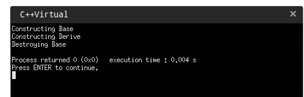
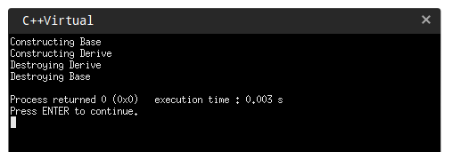
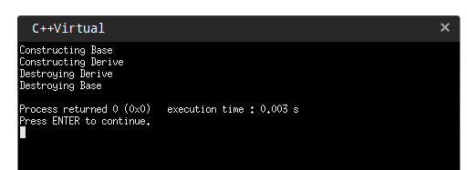
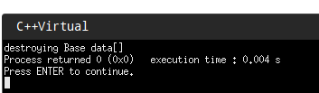

# C++中, 为什么需要定义析构函数为虚函数

yue_jijun 2018-09-01 21:19:28  6602  收藏 15
分类专栏： C++
先构造一个类，如下所示：


```c++
#include   
#include   
using namespace std;  
  
class Base  
{  
    public:  
        Base(){ cout<<"Constructing Base\n";}  
     // this is a destructor:  
        ~Base(){ cout<<"Destroying Base\n";}  
};  
  
class Derive: public Base  
{  
    public:  
        Derive(){ cout<<"Constructing Derive\n"}    
        ~Derive(){ cout<<"Destroying Derive\n";}  
 };  
  
int main()  
{  
    Derive s;    
    return 0;  
} 
```

上面代码在运行的时候，生成Derive的对象的时候调用的构造函数，会首先调用基类的构造函数，所以当函数执行完毕，撤销s 的时候，也会调用Derive的析构函数之后调用Base 的析构函数，也就是说，不管析构函数是不是虚函数，派生类对象在撤销的时候，肯定会一次调用基类的析构函数。那我们为什么要将析构函数定义为虚函数呢？

 

原因是因为多态的存在。

我们大家都知道，在C++ 中，当一个对象销毁时，析构函数是用来对类对象和对象成员进行释放内存和做一些其他的cleanup操作。析构函数靠～符号来区分，～ 出现在 析构函数名字的前面，  当我们去定义一个 虚析构函数时，你只需要简单的的在～符号前面 加一个  virtual标志就可以了。

为什么需要将析构函数声明为 虚函数，我们最好用几个例子来验证一下，我们首先以一个 不使用虚析构函数的例子开始，然后我们使用一个使用析构函数的例子。一旦看到了其中的区别，你就会明白 为什么需要将析构函数声明为虚函数。让我们开始看一下代码。

Example  without a Virtual Destructor:

```c++
using namespace std;  
  
class Base  
{  
    public:  
        Base(){ cout<<"Constructing Base\n";}   
     // this is a destructor:   
        ~Base(){ cout<<"Destroying Base\n";}  
};  
  
class Derive: public Base  
{  
        public:  
        Derive(){ cout<<"Constructing Derive\n";}   
        ~Derive(){ cout<<"Destroying Derive\n";}  
 };  
  
int main()  
{  
        Base *basePtr = new Derive();   
        delete basePtr;  
        return 0;  
} 
``` 
  
运行 输出 是下面这样的：




根据上面的输出，我们可以看到当我们新建一个指向Deriver类型对象指针的时候，构造函数按照正适当的顺序依次调用，但是这里有一个主要问题

当我们删除指向Deriver 的基类指针时， Deriver类中的析构函数没有调用。这里调用的是Base的析构函数（静态联编）这里设计

* 那何为动态联编和静态联编？下面讲解一下：

联编是一个计算机程序彼此相关连的过程。按照联编所进行的阶段不同，可分为两种不同的联编方法：静态联编和动态联编。

将源代码中的函数调用解释为执行特定的函数代码被称为函数名联编(binding).

在编译过程中进行联编被称为静态联编(static binding),又称早期联编(early binding).它对函数的选择是根据基于对象的 指针或者引用来确定的。（即指针或者引用 指向哪个对象就调用哪个对象的相应的函数）
编译器必须生成能够在程序运行时选择正确的虚方法的代码,这被称为动态联编(dynamic binding), 又称为晚期联编(late binding)。


1. 为什么有两种类型的联编以及为什么默认为静态联编?

如果动态联编让您能够重新定义类方法,而静态联编在这方面很差,为何摒弃静态联编呢?原因有两个-----效率

首先来看效率.为使程序能够在运行阶段进行决策,必须采取一些方法来跟踪实际运行中基类指针或引用指向的对象类型,这增加了额外的开销.例如,如果类不会用作基类,则不需要动态联编.同样,如果派生类不重新定义基类的任何方法,也不需要使用动态联编.在这些情况下,使用静态联编更合理,效率也更高.由于静态联编的效率更高,因此被设置为C++的默认选择.Strousstrup说,C++的指导原则之一是, 不要为不使用的我付出代价(内存或者处理时间).仅当程序设计确实 需要虚函数时,才使用它们.
接下来看概念模型.在设计类时,可能包含一些不在派生类重新定义的成员函数.不将访函数设置为虚函数有两方面好处:首先效率高;其次,指出不要重新定义该函数.这表明,仅将那些预期将被重新定义的方法声明为虚拟的.

2. 虚函数的工作原理

通常,编译器处理虚函数的方法是:给每一个对象添加一个隐藏成员.隐藏成员中保存了一个指向函数地址数组的指针.这种数组称为虚函数表(virtual function table, vtbl).虚函数表中存储了为类对象进行声明的虚函数的地址.例如,基类对象包含一个指针,访指针指向基类中所有虚函数地址表.派生类对象将包含一个指向独立地址表的指针.如果派生类提供了虚岁函数的新定义,访虚函数表将保存新函数的地址;如果派生类没有重新定义虚函数.该vtbl将保存函数原始版本的地址.如果派生类定义了新的虚函数,则该函数的地址也将被添加到vtbl中.注意,无论类中包含的虚函数是1还是10 个,都只需要在对象中添加1个地址成员,只是表的大小不同而已.


调用虚函数时,程序将查看存储在对象中的vtbl地址,然后转向相应的函数地址表.如果使用类声明中定义的第一个虚函数,则程序将使用数组中的第一个函数地址,并执行具有该地址的函数.如果使用类声明中的第三个虚函数,程序将使用地址为数组中第三个元素的函数.


简而言之,使用虚函数时, 在内存和执行速度方面有一定成本,包括:
每个对象都将增大,增大量为存储地址的空间.
对每个类,编译器都创建一个虚岁函数地址表.
每个函数调用都有需要执行一步额外的操作,即到表中查找地址.
虽然非虚函数的效率比虚函数稍高,但不具备动态联编功能.

那我们了解了动态联编和静态联编，如何解决这个问题呢，使用虚函数来 转到动态联编。

我们用基类指针去指向一个派生类对象，然后释放该指针，在没有将基类析构函数声明为虚函数的时候，只调用的基类的析构函数，而没有去调用派生类的析构函数。（因为这里是使用的基类指针）

如果我们修改一下代码，使用派生类指针，并且释放派生类指针的话结果:



这里会首先调用派生类析构函数，然后 在调用基类的析构函数。

解决： 将基类析构函数生命为虚析构函数，

Example with a Virtual Destructor:

我们需要做的就是修改Base 类中的析构函数，在～前面加上virtual ,关键字为红色。

 
```c++
class Base  
{  
    public:  
        Base(){ cout<<"Constructing Base";}  
  
    // this is a virtual destructor:  
    virtual ~Base(){ cout<<"Destroying Base";}  
};  
```
改变之后，运行输出为：



我们在基类中将析构函数标明为虚函数，就表示在使用析构函数时，是采用动态联编的。那么delete basePtr的时候不再是采用静态联编直接在编译的时候确定basePtr指向的析构函数，而是在运行的时候根据指向的类型来调用析构函数。（如有错误，请指出。谢谢～）

现在你知道我们为什么需要 虚析构函数和 他们是怎么工作的了把？

如果你在 派生类中 分配了 内存空间的话，没有将基类的析构函数声明为虚析构函数，很容易发生内存泄漏事件。

例子：
```c++  
using namespace std;  
  
class Base  
{  
    public:  
        Base(){ data = new char[10];}    
     // this is a destructor:  
        ~Base(){ cout << "destroying Base data[]";delete []data;}  
    private:  
        char *data;  
};  
  
class Derive: public Base  
{  
    public:  
        Derive(){ D_data = new char[10];}   
        ~Derive(){ cout << "destroying Derive data[]";delete []D_data;}  
    private:  
        char *D_data;  
 };  
  
int main()  
{  
        Base *basePtr = new Derive();  
  
        delete basePtr;  
        return 0;  
}  
``` 

首先我们在基类，和派生类中都个分配了 10个 字节的空间，这些空间应该由程序员来释放，如果没有释放掉的话，就会造成内存泄漏。

来看一下运行结果：




我们可以看到只删除了基类的分配的空间，这个时候派生类的对象的空间没有删除，内存泄漏。

另外一个例子：

```c++
class CBase  
{  
public:  
    CBase(){data = new char[64];}  
    ~CBase(){delete [] data;}  
private:  
    char *data;  
};  
class CFunction  
{  
public:  
    CFunction(){};  
    ~CFunction(){};  
};  
class CFunctionEx : public CFunction  
{  
public:  
    CFunctionEx(){};  
    ~CFunctionEx(){};  
private:  
    CBase m_cbase;  
};  
void main()  
{  
    CFunction *pCFun = new CFunctionEx;  
    delete pCFun;  
}  
```

这里CfunctionEx和Cfunction中本身并没有分配内存，应该不会有内存泄漏。和上例一样当删除pCFun时，它只调用了Cfunction的析构函数而没调用CfunctionEx的析构函数，但CfunctionEx本身并没分配内存。所以发生内存泄露的地方是m_cbase,因为它是CBase的实例且是CfunctionEx成员变量，当CfunctionEx的析构函数没有被调用时，当然m_cbase的析构函数也没有被调用，所以CBase中分配的内存被泄漏。
解决以上问题的方法很简单，就是使基类Cfunction的析构函数为虚函数就可以了。

这样就得出一个结论，当你的基类的析构函数不为虚的话，其子类中所有的成员变量的类中分配的内存也将可能泄漏。

这里说的可能是因为，如果程序中没有以上示例类似写法(指用基类指针指向子类实例，虚函数是C++的精华，很少有人不用的，由其是在大中型软件项目中)，就不会出现本文所说的内存泄漏。看来在基类中使析构函数为虚函数是如此的重要。所以强烈建议在基类中把析构函数声明为虚函数，但是只有你写的类并不做为基类时例外。

 

 

 

 

将基类的析构函数设为virtual型，则所有的基类的派生类对象的析构函数都会自动设置为virtual型，这保证了任何情况下，不会出现由于析构函数没有被调用而导致的内存泄漏。 这是MFC将基类的析构函数设置为虚函数的真正原因。

 

 

 

 

为什么 构造函数不能为虚函数。原文地址：http://blog.sina.com.cn/s/blog_620882f401016ri2.html

         1.从存储空间角度

             虚函数对应一个vtale,这个表的地址是存储在对象的内存空间的。如果将构造函数设置为虚函数，就需要到vtable中调用，可是对象还没有实例化，没有内存空间分配，如何调用。（悖论）

         2.从使用角度

 

        虚函数主要用于在信息不全的情况下，能使重载的函数得到对应的调用。构造函数本身就是要初始化实例，那使用虚函数也没有实际意义呀。所以构造函数没有必要是虚函数。虚函数的作用在于通过父类的指针或者引用来调用它的时候能够变成调用子类的那个成员函数。而构造函数是在创建对象时自动调用的，不可能通过父类的指针或者引用去调用，因此也就规定构造函数不能是虚函数。

          构造函数不需要是虚函数，也不允许是虚函数，因为创建一个对象时我们总是要明确指定对象的类型，尽管我们可能通过实验室的基类的指针或引用去访问它。但析构却不一定，我们往往通过基类的指针来销毁对象。这时候如果析构函数不是虚函数，就不能正确识别对象类型从而不能正确调用析构函数。

        3、从实现上看，vbtl在构造函数调用后才建立，因而构造函数不可能成为虚函数  

  从实际含义上看，在调用构造函数时还不能确定对象的真实类型（因为子类会调父类的构造函数）；而且构造函数的作用是提供初始化，在对象生命期只执行一次，不是对象的动态行为，也没有太大的必要成为虚函数

        4、当一个构造函数被调用时，它做的首要的事情之一是初始化它的V P T R。因此，它只能知道它是“当前”类的，而完全忽视这个对象后面是否还有继承者。 当编译器为这个构造函数产生代码时，它是为这个类的构造函数产生代码- -既不是为基类，也不是为它的派生类（因为类不知道谁继承它）。

         所以它使用的V P T R必须是对于这个类的V TA B L E。而且，只要它是最后的构造函数调用，那么在这个对象的生命期内， V P T R将 保持被初始化为指向这个V TA B L E, 但如果接着还有一个更晚派生的构造函数被调用，这个构造函数又将设置V P T R指向它的 V TA B L E，等.直到最后的构造函数结束。V P T R的状态是由被最后调用的构造函数确定的。这就是为什么构造函数调用是从基类到更加派生 类顺序的另一个理由。

        但是，当这一系列构造函数调用正发生时，每个构造函数都已经设置V P T R指向它自己的 V TA B L E。如果函数调用使用虚机制，它将只产生通过它自己的V TA B L E的调用，而不是最后的V TA B L E（所有构造函数被 调用后才会有最后的V TA B L E）。